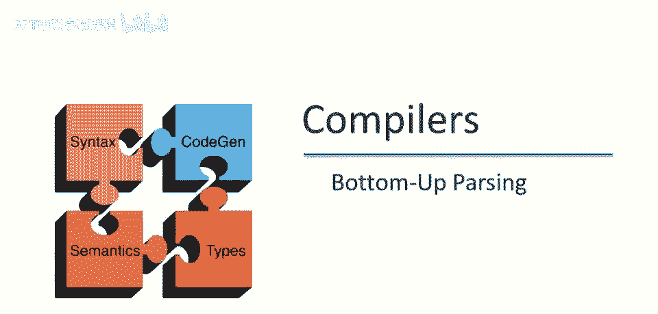
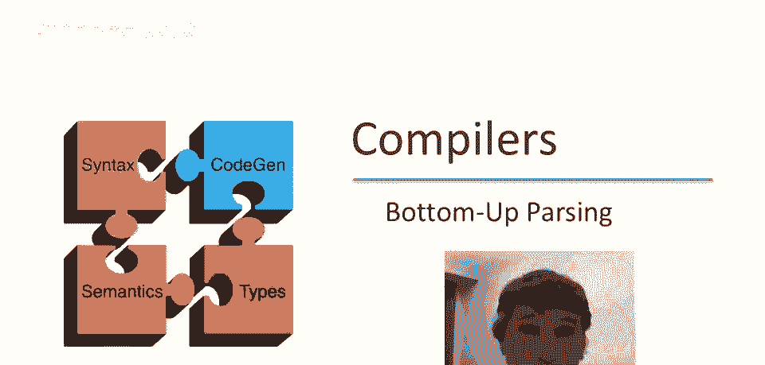
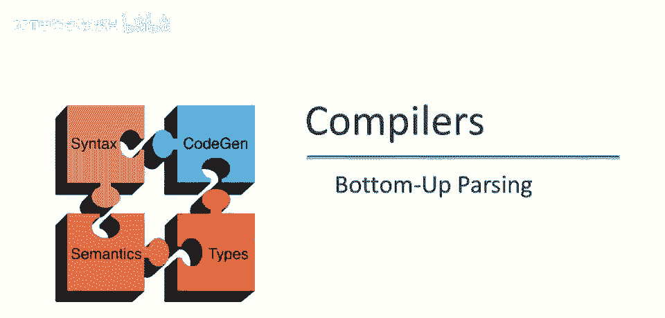
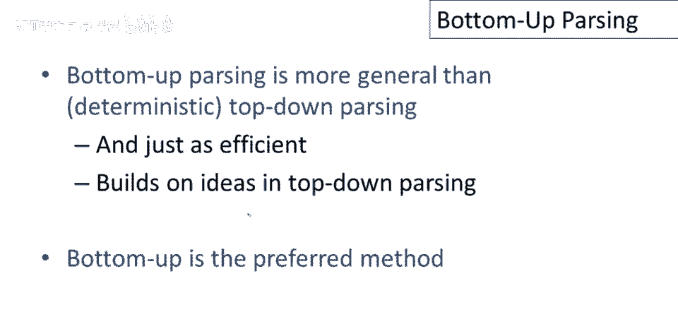
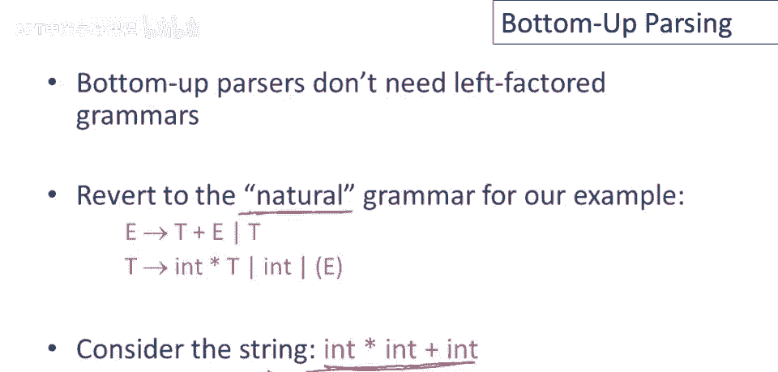
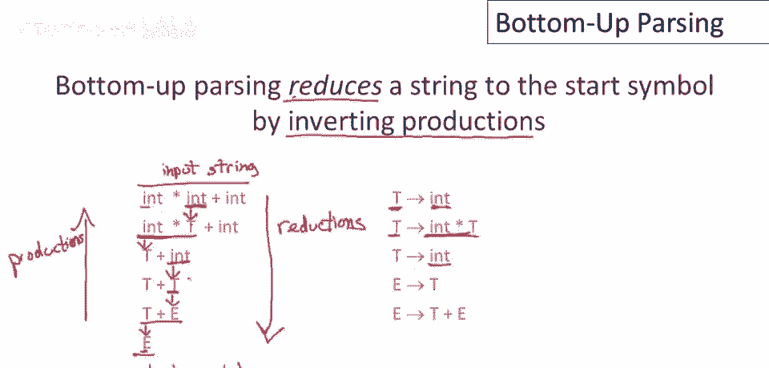
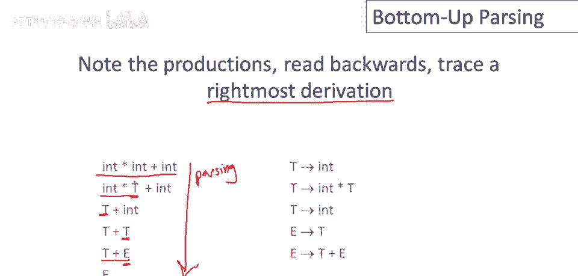
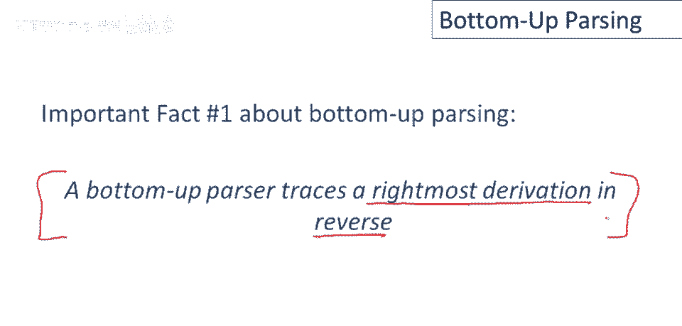
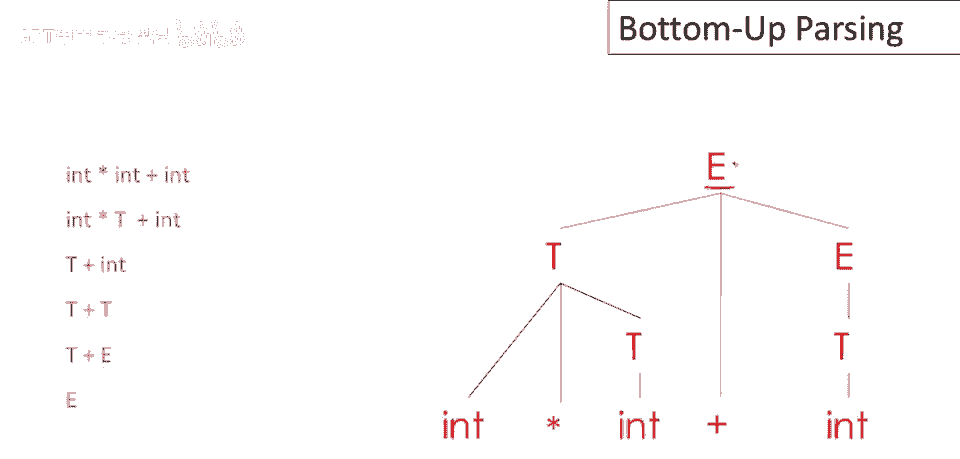

# 【编译原理 CS143 】斯坦福—中英字幕 - P31：p31 07-05-_Bottom-Up_Parsin - 加加zero - BV1Mb42177J7

这是一系列关于自底向上解析的视频中的第一个。

解析。

首先要知道的是，自底向上解析比确定型解析更通用，自顶向下解析，回忆一下我们讨论过的递归下降，这是一个完全通用的解析算法，但需要回溯，现在我们专注于确定型技术，上次我们讨论了L1或预测性解析。

现在我们要换挡，讨论自底向上解析，结果是，即使自底向上解析更通用，它同样高效，它使用了我们在自顶向下解析中学到的所有想法，实际上，自底向上解析是大多数解析器生成工具首选的解析方法。

自底向上解析器的一个优点是它们不需要左因子化文法，我们可以回到我们示例的自然文法，自然在这里是带引号的，因为我们仍然需要编码加号和乘号的优先级，自底向上解析器不会处理歧义文法，让我们举个例。

考虑一个自底向上解析器如何处理以下典型输入字符串。

首先要知道的是，自底向上解析通过逆向产生式，将字符串还原为开始符号，通过运行逆向产生式，所以这里有一个例子，左侧是字符串的状态序列，右侧是使用的产生式，需要注意的是，让我们只看第一步。

我们开始时是整个字符串，我们开始时是终端符号的字符串，我们挑选了一些终端符号，在这种情况下，只是这一个特定的英寸，我们运行了一个逆向产生式，我们用产生式的左侧替换了这里的int，我们开始时。

我们匹配了产生式的右侧int，并用左侧替换了它，所以int在这里逆向变成了t，然后在下一步中，我们取了int times t，这个我们正在处理的字符串的子串，并用该产生式的左侧替换了它。

int times t被替换成t，等等，在每一步中，我们都在匹配字符串的一部分，我在每一步中划下被替换的部分，我们运行，这匹配了某些产生式的右侧，然后我们用左侧替换了那个子串，最后。

整个字符串被替换成e，我们最终到达了开始符号，所以我们从一个输入字符串开始，所以这是一个输入字符串，这是我们的输入字符串，我们的标记输入字符串，我们以起始符号结束，如果你按这个方向阅读移动。

如果你从底部开始向上阅读，嗯，这些都是产生式，实际上，这整个东西是一个推导，这只是从底部到顶部的正常推导，但在这个方向，当我们倒着运行时，从字符串开始到起始符号，我们称这些为规约。

我还没有确切告诉你我们如何决定进行哪些规约。

你可能会想，我是如何知道要执行这个特定序列的规约的，这是自底向上解析的另一个有趣属性，所以如果你按这些产生式的反向阅读，它们追踪一个最右推导，所以从这里开始与e。

所以我们要记住解析器实际上正在这个方向上运行，所以这是解析的方向，但现在我们要看解析器反向采取的步骤，我们将看到它实际上是一个最右推导，所以这里e去到了t加e，e是唯一的非终结符，但然后e这里是扩展的。

它是最右边的非终结符，然后t被扩展，它也是最右边的非终结符以得到int，现在t是最右边的非终结符被扩展以得到in times t，然后这是唯一的和最右边的非终结符。

所以我们最终得到了整个输入字符串和times int加int，这引出了关于自底向上解析的第一个重要事实。

即自底向上解析器反向追踪一个最右推导，所以如果你在自底向上解析上遇到麻烦，回到这个基本事实总是有帮助的，自底向上解析器追踪一个最右推导，但它以相反的方式通过使用规约而不是产生式来做。

所以这里是再次显示的规约系列，这是由那些规约构建的解析树，嗯，我认为这是一个非常有帮助的图片，如果我们动画它，以看到序列的步骤和自底向上解析器真正在做的事情，所以从这里我们开始输入字符串。

我们在这里显示相同的输入字符串，现在我们将只走过自底向上解析器采取的一系列步骤，一系列的规约，展示如何构建完整解析树，基本思想是每一步执行归约，记得做归约时，用某些产生式的左部替换右部子节点。

就像我们做自顶向下解析时，我们会使右部，成为左部的子节点，这里也一样，这是输入中的子节点，然后使其成为父节点，现在可以看到接下来会发生什么，自顶向下解析器从开始符号开始。

通过扩展前缘的非终结符逐步构建树，当前，在部分构建的解析树的当前叶节点，自底向上解析器将从最终解析树的所有叶节点开始，整个输入，并在其上构建小树，它将粘贴在一起。

所有迄今为止组合在一起的子树以构建完整树，再走几步看看如何发生，所以在下一步，嗯，我们从int times t到t，因此int times，和以另一个t为根的子树成为这个非终结符t的子节点。

你可以看到我们已将这三个子树，粘贴在一起成为一个更大的树，随着解析的进行，原始输入的越来越大一部分将被粘贴成越来越大的树，下一个归约，嗯，输入末端的int，和嗯，归约为t，然后归约为e，然后在最后。

剩余的三个子树都将粘贴成一个完整的解析树，以开始符号为根，通过组合小解析树构建解析树，它自下而上而不是从开始符号扩展，自顶向下，它从树的叶节点向上构建到根。

