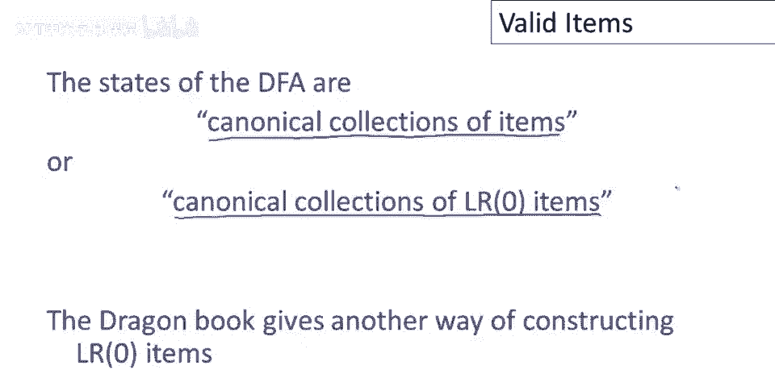
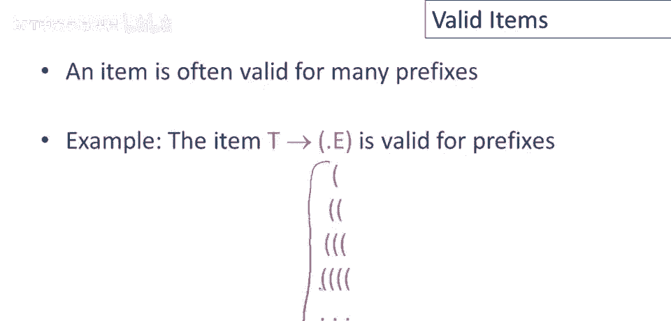

# 【编译原理 CS143 】斯坦福—中英字幕 - P36：p36 08-04-_Valid_Items - 加加zero - BV1Mb42177J7

本视频中，我们将使用示例自动机，识别有效前缀，引入一个新概念。

有效项的概念。

为了唤醒你的记忆，这是上次我们停下的地方，这是完整的非确定自动机，用于识别示例语法的有效前缀，并使用标准子集构造阶段，我们可以构建一个等效于非确定自动机的确定自动机，确定自动机。

这是识别完全相同语言的确定自动机，这个自动机，这个确定自动机识别示例语法的有效前缀，但现在注意，每个状态都是一个项集，所以这些状态中有非确定自动机的状态集。

并回忆这意味着非确定自动机可能处于这些状态中的任何一个，特别是这个状态是起始状态，呃，因为它有项s' 箭头 dot e，呃，这个确定自动机的状态被称为各种，规范项集或规范lr零项集，如果你看《龙书》。

它给出了构建lr零项的另一种方法，而不是我给出的，我的方法有些简化，但我也认为更容易理解，如果你是第一次看到，现在我们需要另一个定义。

呃，我们将说，给定项对于有效前缀alpha beta，呃，是有效的，如果以下为真，从起始符号开始，这是我们的额外起始符号，然后一步x可以到beta gamma，这表示在解析alpha和beta之后。

在看到alpha和beta在栈上之后，有效项是可能栈顶的项集，我们可能可以，该项可能是非确定自动机的终止状态。

更简单地解释同一个想法是，对于给定的有效前缀alpha，对于该前缀有效的项，正是DFA在读取该前缀后处于最终状态的项，这些是描述在看到栈alpha之后的状态的项。

一个项通常对许多，许多前缀有效，E闭合对所有开括号序列有效。

只需查看自动机即可确认，并确认若看到开括号且这是起始状态，若看到开括号结束，我们进行此转换，最终到达此状态，然后每个开括号，我们看到只需在此状态中循环，因此若输入序列为5个开括号，则会有1、2，3。

4、5，所有循环在此状态，注意此项在此状态中，它是该状态项之一，仅表示此项对任何前缀或抱歉，任何开括号序列有效。

