# 【编译原理 CS143 】斯坦福—中英字幕 - P37：p37 08-05-_SLR_Parsing - 加加zero - BV1Mb42177J7

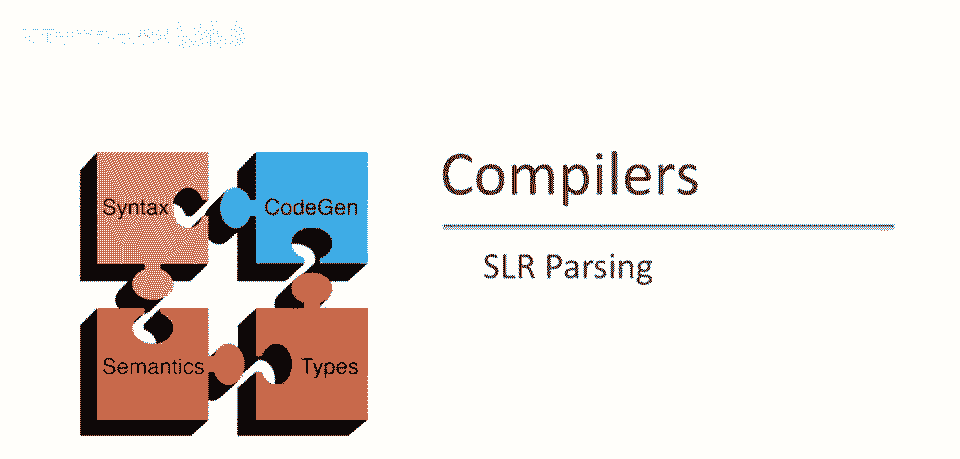

本视频中，我们将真正实现自底向上解析算法，特别是我们将讨论SLR或简单LR解析，它将建立在有效项的概念上，以及我们在最近视频中讨论的可行前缀。

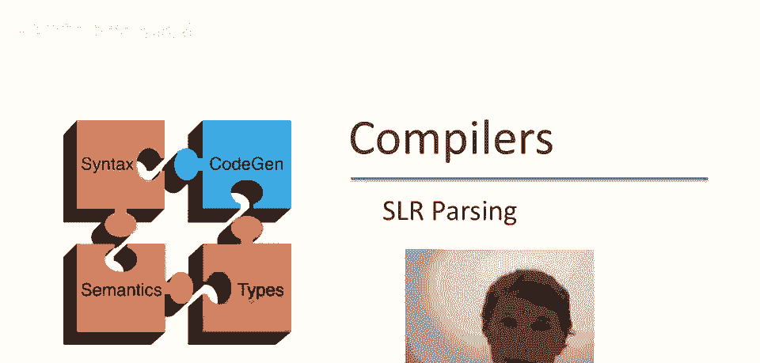

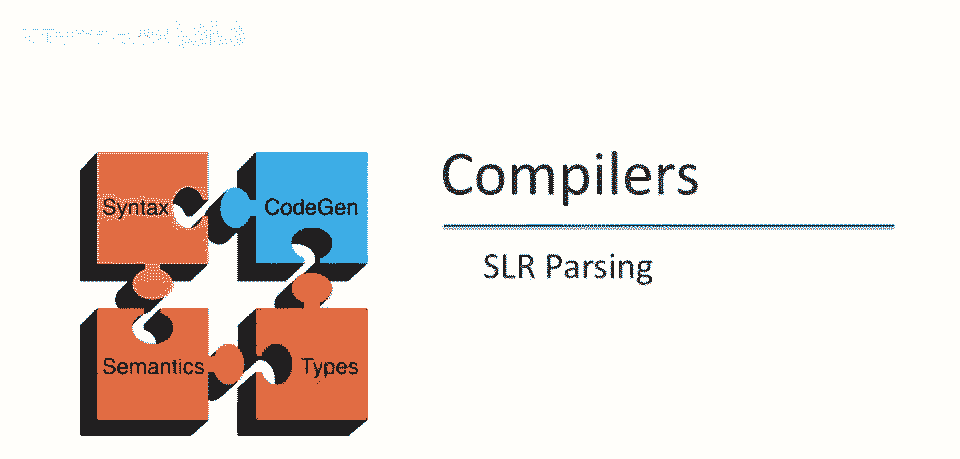

首先我们将定义一个非常弱的自底向上解析算法，称为LR零解析，基本思想是假设栈包含内容alpha，下一个输入是标记t，DFA，这是识别输入alpha的可行前缀的DFA，即当它读取栈内容时。

它将终止于某个状态s，并且只有两种情况，该解析算法需要处理，如果s是DFA的最终状态，包含项x->beta。那么，这是什么意思，这意味着，我们在栈顶看到了x->beta的完整右侧，并且进一步说。

所有内容都在栈下，仍然表示x->beta。是一个有效的项目，抱歉，是一个有效的项目，这意味着可以由x->beta减少，因此，如果我们看到一个完整的生产。在DFA的最终状态下的右侧。

那么我们只需通过该生产减少，另一种可能的动作是移位，如果我们最终处于一个状态i，x->beta。t，然后其他一些内容是有效的项目，这意味着在这一点上添加一个t到栈将是合适的，如果t是我们的输入，那么。

我们应该做一个移位，移动，嗯，LR零解析何时会遇到麻烦？可能有两个问题，它可能无法在两个可能的减少动作之间做出决定。

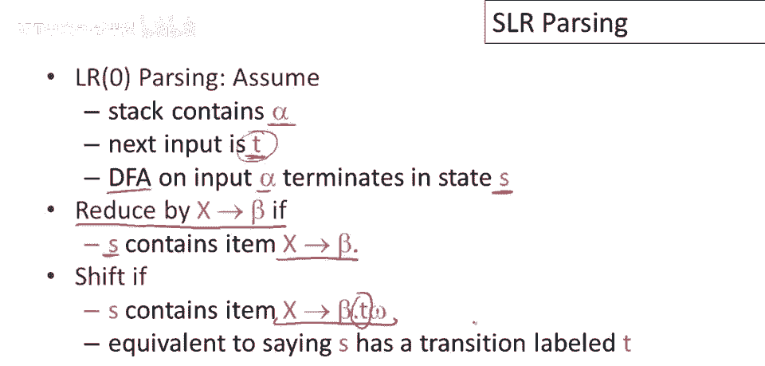

因此，如果DFA的任何状态有两个可能的减少，意味着它看到了两个完整的生产，并且可以由任何一个减少，那么就没有足够的信息来决定执行哪个减少，并且部分将不是确定性的，这称为减少减少冲突，所以再次。

这发生在特定状态有两个单独的项指示两个单独的减少时，另一种可能性是DFA在读取栈内容后的最终状态，可能有一个项表示减少，另一个项表示移位，这称为移位减少冲突，因此，在这种情况下，只有在状态中才有冲突。

另一个可能性是DFA在读取栈内容后的最终状态，可能有一个项表示减少，另一个项表示移位，这称为移位减少冲突，因此，在这种情况下，只有在状态中才有冲突，输入的下一个是？但在那种情况下。

我们不知道是否要堆栈t。

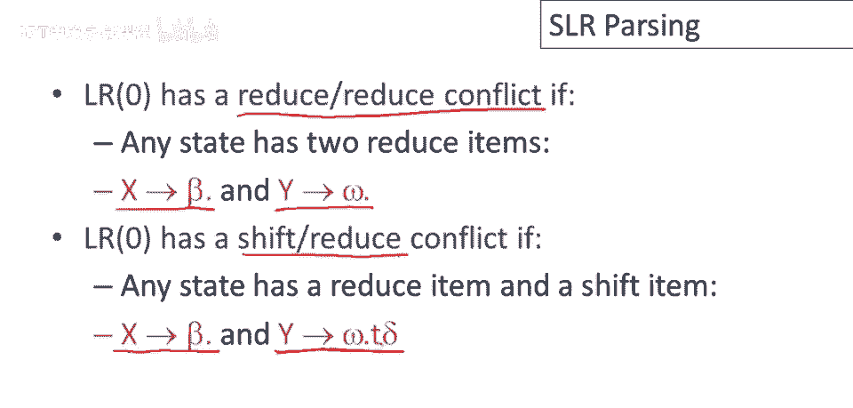

还是通过x去β减少，让我们看看dfa，识别可行前缀，我们最近几期视频一直在使用，实际上，这个特殊的dfa确实有一些冲突，让我们看看这个状态，我们可以通过egos到t减少，如果我们处于这个状态。

或者如果下一个输入是加号，我们可以做一次移位，所以在这种特殊情况下，如果下一个输入是加号，我们可以移位并使用这个项，或者我们可以减少并使用那个项，这个特殊的状态有一个移位，减少冲突。

这不是这个语法中唯一的冲突，呃，在这个语法中，不过，呃，在这个状态这里，我们有一个非常相似的问题，这里，如果下一个输入是乘号，或者我们可以通过t去int减少，所以这个状态也有一个移位，减少冲突。

改进lr零解析并不难，我们将在本视频中展示一种这样的改进，称为slr或简单lr解析，这将通过，通过添加一些启发式来改进我们何时移位何时减少，这样冲突的状态就会更少。

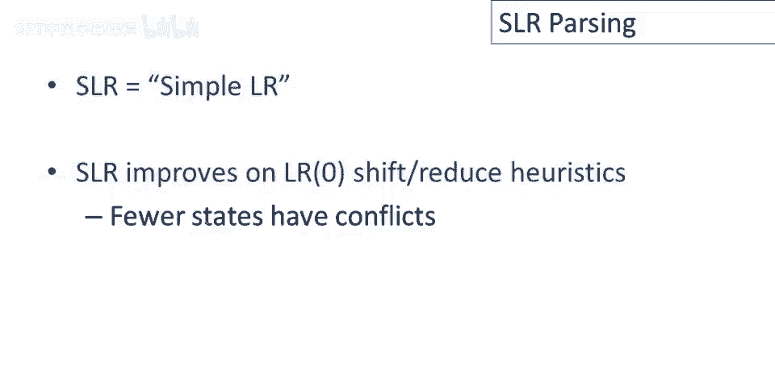

将lr零解析修改为slr解析的改动实际上非常小，我们只是在减少情况下添加了一个新的条件，所以之前如果我们看到了x去β点在dfa的最终状态，回忆一下那意味着什么，这意味着β在栈顶，它是可行的。

所以减少是可行的，现在，我们有一点更多的信息，所以注意这个自动机并没有利用，输入中接下来会发生什么，这个决定完全基于，栈的内容，但减少可能无意义，基于下一个输入符号，我们如何充分利用它，若你想。

会发生什么，我们有栈内容，以β结束，现在我们要移动，用x替换它，若下一个输入符号是t，记住这里有个竖线，后跟t，这意味着什么，这意味着x在推导中须在t前，换句话说，T将遵循x，若T不能遵循x。

若T不能是跟在非终结符x后的终结符，那么进行此规约无意义，因此我们仅进行规约，若T在x的跟随集中，我们仅添加该限制，这是解析算法唯一的改变。

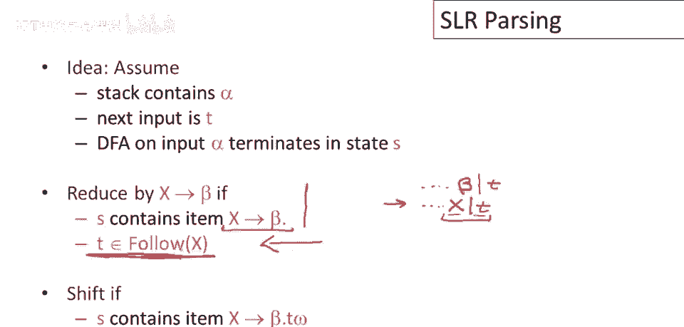

因此在这些规则下若有冲突，要么移位，归约或连续归约，则语法不是SLR文法，注意这些规则相当于检测句柄的启发式，我们考虑两个信息，栈的内容，这是DFA为我们做的，它告诉我们栈顶可能有哪些项。

以及输入中接下来是什么，我们可以用它来细化归约决策，对于没有冲突的文法，意味着每个状态，在这些规则下，每个可能的状态都有独特动作，那么这种启发式方法是精确的，你知道，对于那些语法。

我们只是定义那些语法为SLR语法。

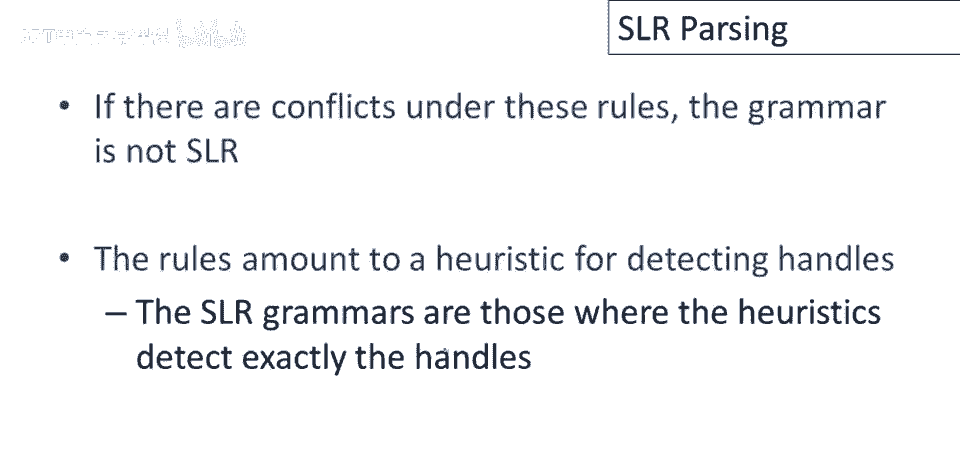

让我们考虑运行示例中发生的变化，确定性的自动机，用于识别语法可行前缀，我们已经看了几段视频了，回忆一下我们曾有移位，在两个状态下，按lr零规则减少冲突，先看状态，上层状态，这里将移位，输入中有加号。

该项指示我们做什么，它告诉我们有加号，正确动作是移位，现在问题是何时减少，但我们只会在。减少，如果输入是e，e后是什么，我们很久前就算过了，但提醒你，这里的e是文法的原始开始符号。

所以$符号最终会出现在e后，follow v的另一种可能是闭合n，因为在文法的这个点上，闭合n紧跟在e后，只有这两种可能，这意味着在这个特定状态下我们将归约，如果输入结束，或者下一个。

输入中的下一个标记是闭合的n，将移位，如果输入中的下一个标记是加号，在其他任何情况下，我们将报告解析错误，因此不再有任何移位，减少此状态下的冲突，对于任何可能的输入，总是有一个唯一的移动，对于其他状态。

情况也类似地得到了改善，所以这里我们将移位，如果输入中有乘号，我们将减少输入，如果符合t，t的跟随是什么，我们回忆一下，嗯，我们很久以前又计算过，我碰巧知道，嗯，那是什么，所以我会直接告诉你。

它包括了t跟随的所有内容，E，美元符号和闭合符，但随后是加号，因为语法中此处使用+，t后的只有这些，仅在无输入时缩减，或下一个输入是闭合或加号，也没有移位，不再移位缩减，解决此状态冲突，因此。

此语法是SLR语法，许多语法不是SLR，强调SLR是LR零的改进，但它仍然不是一个非常通用的语法类，所有歧义语法，例如，不是SLR，但我们可以在SLR情况下稍作改进。

我们可以通过使用优先级声明来改进SR解析，以告诉它如何解决冲突。

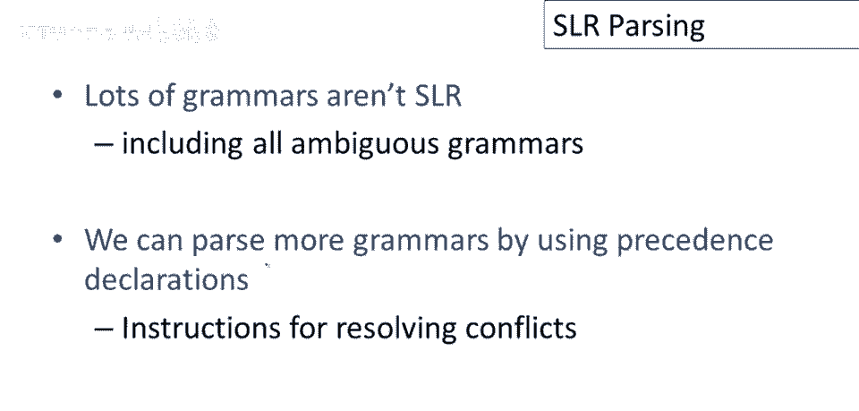

让我们回到最自然，也是最模糊的整数加法和乘法语法，我们之前看过这个语法，如果你为这个语法构建dfa，如果你遍历构建这个语法的可行前缀的dfa，你会发现有一个状态包含以下两个项，一项说如果我们看到e乘e。

我们已经在栈上看到了e乘e，现在我们可以通过e去e乘e来简化，另一项会说如果输入中有加号，我们应该移位，注意这正好是乘法比加法优先级更高的疑问，当你处于这种情况时，你应该简化，从而将两个e组合在一起。

首先组合乘法操作，还是应该移位加号，在这种情况下你将处理第一个，因为它在栈的顶部，所以在这种情况下，乘法比加法优先级高的声明解决了简化的冲突，所以我们不会移位，最终不会有移位，简化冲突。

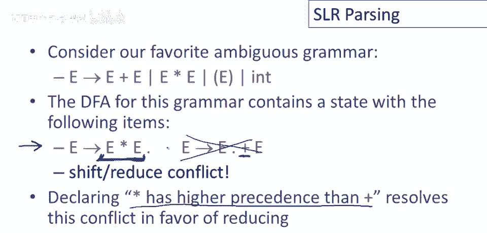

注意优先声明这个术语实际上相当误导，这些声明并不定义优先级，它们并没有直接做到这一点，它们真正定义的是冲突解决，它们说做这项移动而不是那项，碰巧在这种特殊情况下，因为我们处理的是一个自然语法。

一个简单的加法和乘法语法，冲突解决恰好产生了我们想要的强制优先级的效果，但在更复杂的语法中，各个语法部件之间有更多的交互，这些声明可能不会像你期望的那样强制执行优先级，幸运的是你可以打印出自动机。

工具通常提供一种方式让你检查解析自动机，然后你可以确切地看到冲突是如何解决的，以及这些是否是你预期的解决方案，我建议当你构建解析器时，特别是如果它是一个相当复杂的解析器，你应该检查解析自动机。

以确保它按你期望的方式工作。

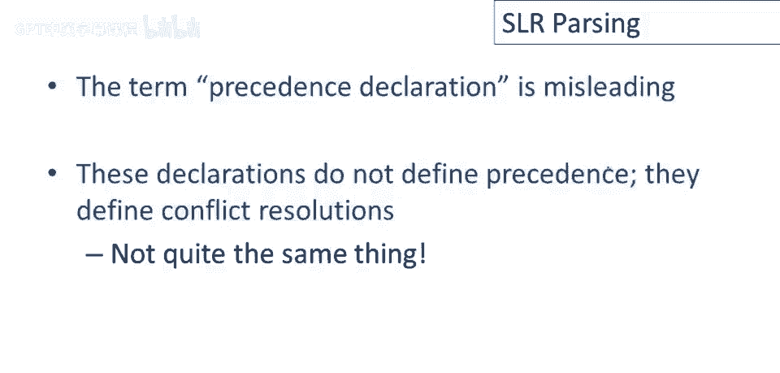

所以现在我们可以给出slr解析的算法，m是我们的自动机，识别可行前缀的解析自动机，初始配置将是垂直线，全部靠左，所以栈是空的，这是我们的全部输入，我们在末尾附加美元符号表示输入的结束。

现在我们将重复直到配置仅包含开始符号在栈上，一美元输入，意味着所有输入消失，将整个输入缩减为起始符号，因此中间配置将写作αω，其中α是栈的内容，ω是剩余的输入，我们要做的是运行，M运行机器在当前栈α上。

如果m拒绝α，如果m说α不是一个可行的前缀，我们将报告解析错误，我们现在就停止，如果m接受alpha且在状态，如果结束于含i项的状态，然后看下一个输入，称为a，我们将做什么，如果有项在I中。

说看到终端a没问题，好的，这就是我们的移位操作，然后我们会减少，如果有减项在有效项集中，下一个输入可遵循左侧非终结符，这些就是我们之前讨论的规则，然后报告解析错误，如果这些都不适用，好的。

这个算法有趣之处在于，如果你仔细阅读，并思考一段时间，你会意识到这一步其实不需要，我们不需要在这里检查，因为m是否接受栈并不重要，因为在这里报告解析错误的步骤，如果这些步骤都不适用。

这已经意味着我们永远不会形成无效栈，即所有栈都将始终有效，解析错误将在这一行被捕获，并且，符号不可能构成前缀，实际上，此错误检查不需要，M始终接受栈。

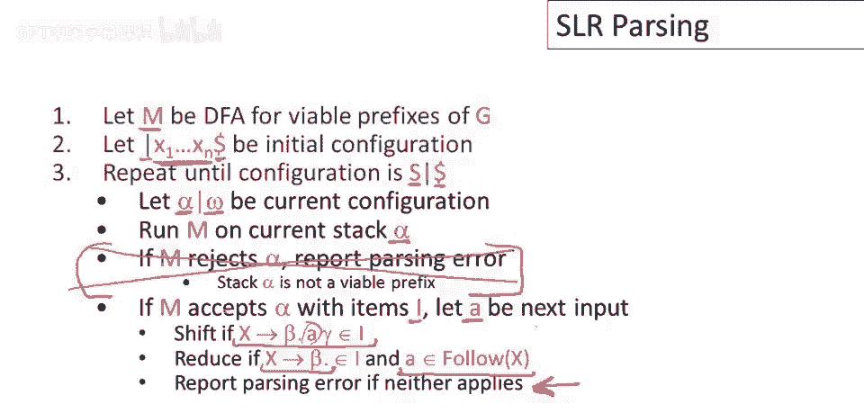

现在，最后一步如有冲突，意味着在某些状态下，对于某些输入符号，不清楚是移位还是归约，则语法不是SLR k，k又是前瞻量，实践中，我们只使用一个标记的前瞻，因此，通常只查看输入流中的下一个标记。

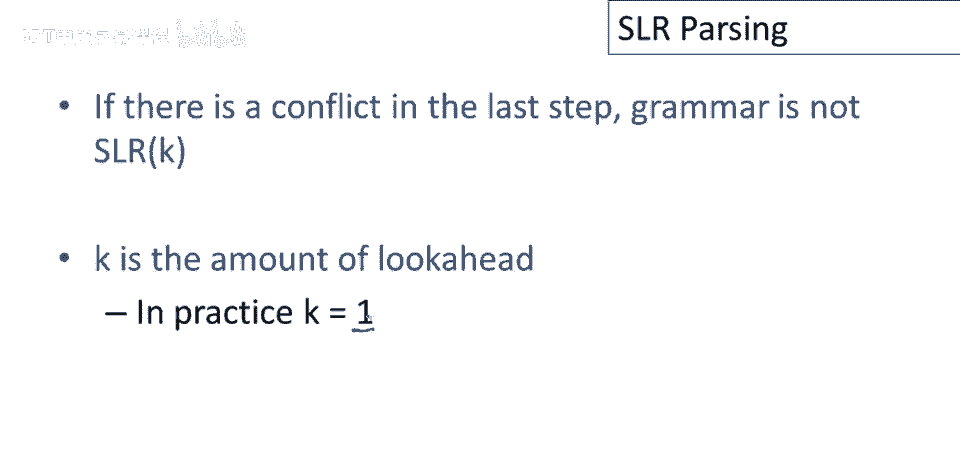