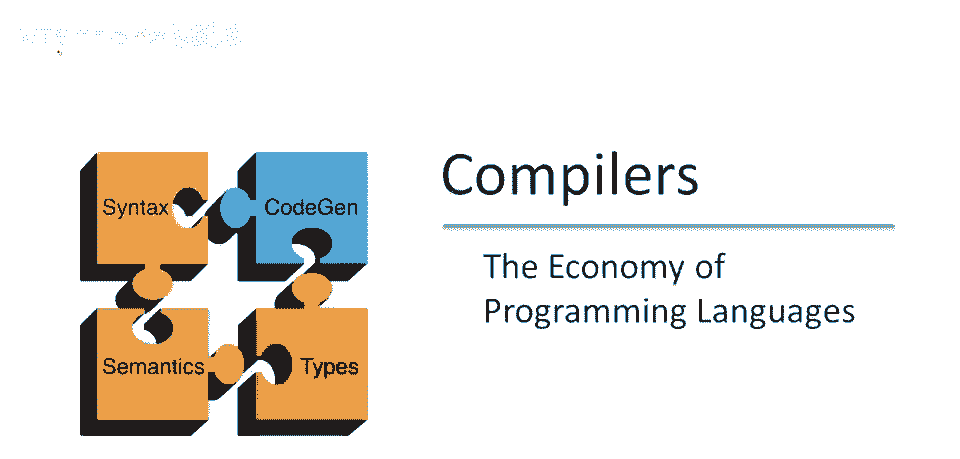
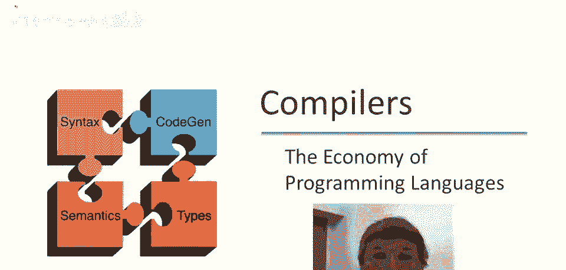
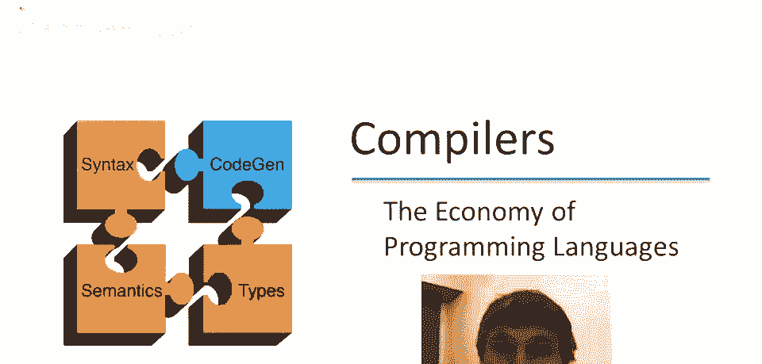
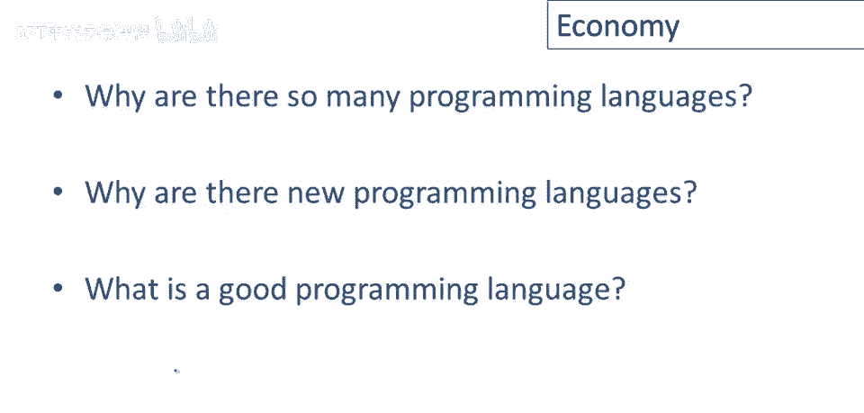
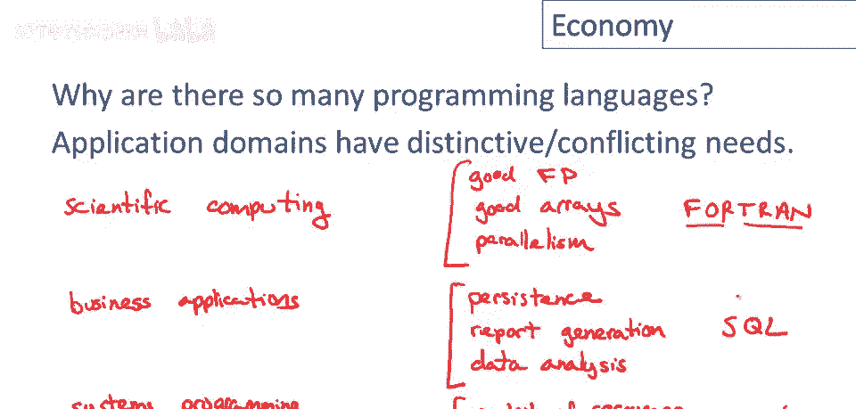
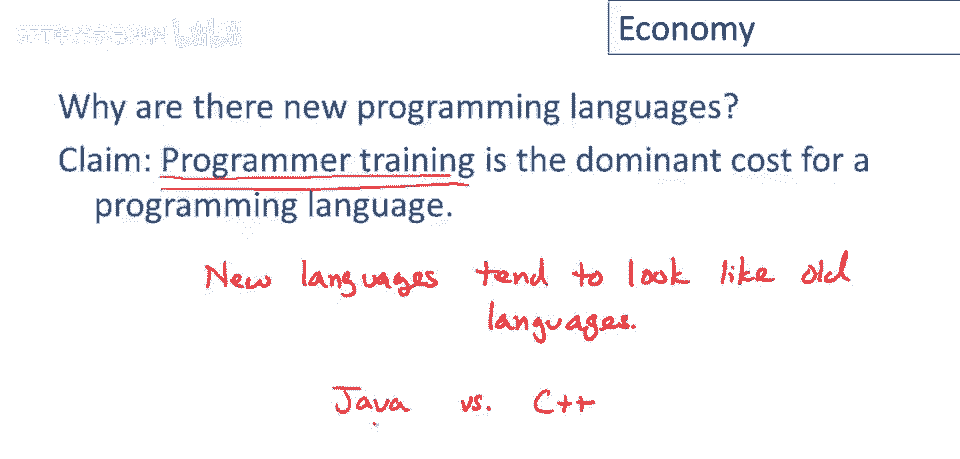
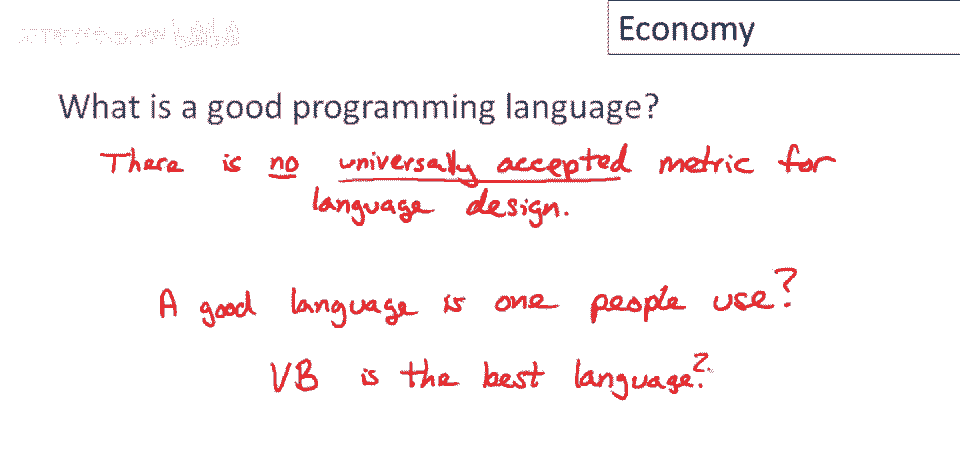
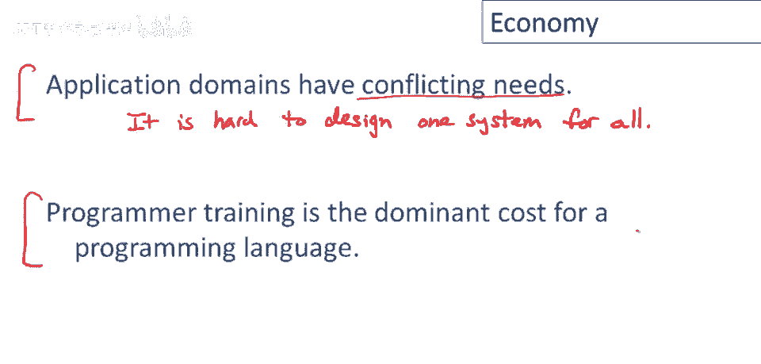

# 【编译原理 CS143 】斯坦福—中英字幕 - P3：p03 01-03-_The_Economy_of_Pr - 加加zero - BV1Mb42177J7

你好，在这视频中，我们将讨论我称为编程语言经济的话题。

这个视频的想法是，在我们深入了解语言实现之前，呃或设计，我想谈谈语言在现实世界中的运作方式，以及为什么某些语言被使用，而其他语言不被使用，如果你环顾四周，实际上会出现一些明显的问题。

任何思考编程语言超过几分钟的人都会想到，一个问题是有这么多这些东西的原因是什么，我们有数百，如果不是数千种日常使用的编程语言，为什么所有这些都需要存在，为什么一种编程语言，例如，就足够了相关问题。

但略有不同是为什么会有新的编程语言，考虑到我们已经有了这么多编程语言，呃，为什么需要创建新的，最后，我们如何知道当我们看到一个好的编程语言时，什么使一个好的编程语言，什么使一个坏的编程语言。

我只想用这视频谈谈这三个问题，正如我们将看到的，我认为这些问题的答案很大程度上独立于语言设计和实现的细节，但本身非常有趣。

所以让我们从为什么有这么多编程语言的问题开始，至少对这个问题的部分答案并不难找到，如果你思考几分钟，你会意识到编程的应用领域有非常独特和冲突的需求，即很难设计一种语言。

实际上能在所有情况下为所有程序员做所有事情，让我们举一些例子，你可能不太会想到的一个领域，嗯是科学计算，这些都是为工程应用主要进行的重大计算，但也包括大型科学和长期运行的实验，模拟实验。

那么这些计算的需求是什么，通常你需要很好的浮点支持，缩写为fp，你需要很好的数组和支持数组操作，好的，因为在大多数科学应用中，最常见的数据类型是大型浮点数组，你也需要并行性，好的，好的，嗯。

今天要达到足够性能，你真的需要利用这些并行性，在这些应用中，并非每种语言都很好地支持所有这些，这实际上不是你需要的东西的完整列表，但这是一些需要区分的东西。

但一种传统上在这些方面做得非常好的语言是FORTRAN，FORTRAN在科学界仍然被广泛使用，它最初是为科学应用而设计的，若记得，名即公式翻译，随时间演变，已不太像原始语言，但始终保留科学计算核心。

仍为该领域领先语言，现完全不同领域：商务应用，那需要什么？这里需要如，嗯，别想丢失数据，企业为获取数据费尽心思，他们需要保存数据的方法，你知道，他们希望这极其可靠，你需要良好的报告功能，好的。

因为通常你想对数据做点什么，因此，你需要良好的报告生成设施，还有，嗯，你想利用数据，数据实际存在于许多现代企业，最宝贵的资产之一，因此你需要良好的设施来询问你的数据，我们称之为数据分析，再次。

这不是你需要的东西的详尽列表，但它是，嗯，代表性的，我会说，最常用的语言之一，这类应用是SQL，数据库查询语言，关系数据库及其编程语言，应该说，但最著名的是SQL，在这个领域占据主导，另一个，嗯，领域。

再做一次系统编程，因此，我的意思是，如嵌入式系统，控制设备的东东，操作系统，诸如此类，这些有什么特点，我们需要，需要对资源有极低层控制，系统编程的要点是管理好资源，因此我们真正需要对资源有细粒度控制。

并且常常有时间方面，所以你可能有实时限制，需要能考虑时间，因为这些是设备，它们需要在一定时间内反应，比如网络设备，需要对网络做出响应，很多很多，很多很多关于时间重要的例子，这只是两个方面，我有点。

我的意思是，这里空间不够了，所以就此打住，但再次这些代表了系统编程中需要的东西，今天可能最广泛使用的系统，编程语言或C语言家族，以及一定程度上的C++家族，和，你可以看到这些，不同领域的要求完全不同。

在一个领域重要的东西，或在一个领域最重要的东西与另一个领域不同，很容易，我认为可以想象，至少很难将所有这些整合到一个系统中，能做好所有这些事情。

这引出了我们的第二个问题，为什么会有新的编程语言，好的，现在有这么多语言存在，我们为什么还需要设计一个新的，我将从与问题无关的观察开始回答这个问题，所以让我花点时间解释一下。

我声称程序员培训是编程语言的主要成本，我认为这真的很重要，所以只是强调一下这里重要的部分，就强调一下重要的部分，是程序员培训，教授程序员语言的成本，所以如果你考虑一种编程语言，为了使这种语言被使用。

必须发生几件事，必须有人设计它，但这并不真的很贵，那只是一或很少几个人，通常有人需要构建编译器，但这也并不真正花费很多，对于一个大型的编译器项目，可能十到二十人，我可以构建相当不错的编译器。

真正的成本在于所有用户和教育他们，所以如果你有成千上万的用户使用一种语言，教授他们所有语言所需的时间和金钱是主要成本，我并不是说，仅仅是购买教科书和上课等实际美元支出，也是程序员决定。

学习这种语言是否值得，你知道许多程序员自学，但那是他们时间的使用，以及他们时间的成本是真正的经济成本，所以如果你考虑教授，一百万程序员的人口，一门语言，这实际上是一项相当重要的经济投资，从这个观察。

我们可以很容易地做出几个预测，再次，这些只是这些只是预测，现在遵循这个声明，如果你相信这是真的，所以让我擦掉并修复它，所以首先，呃，预测是广泛使用的语言，将缓慢变化，为什么应该是真的呢？

如果我改变一种被许多人使用的语言，我必须教育那个社区中的每个人关于这个变化，因此，即使是相对较小的语言扩展，语法的小变化，小的新功能，甚至只是编译器接口的简单变化，如果你有很多用户。

教他们所有关于这个需要很长时间并且非常昂贵，所以随着这些语言变得广泛使用，它们的变化率，它们的变化率将减慢，并且这预测随着时间的推移，随着编程世界的增长，随着世界上越来越多的程序员。

我们预计最流行的语言，将拥有更大和更大的用户群，所以拥有更大和更大程序员基础的将变得越来越僵化，进化越来越慢，实际上实践中看到的非常一致，现在另一端，这一观察几乎做出了相反预测，容易开始。

容易开始新语言，事实上，启动新语言成本很低，为什么？因为从零用户开始，所以开始几乎零训练成本，即使只有几个用户，教他们的成本，语言变化并不大，并不很高，新语言能更快进化，能更快适应变化情况。

实验新语言几乎不花钱，这两者间有张力，好，嗯，当，程序员何时选择，你知道，广泛使用但可能变化不快的现有语言，和全新语言，他们会选择如果生产力，如果他们的生产力，现在超过培训成本，如果他们认为。

花一点时间和金钱学新语言，短期内将更高效，他们就会转换，好，你知道，所以，何时可能发生，专业，你知道，嗯，综合所有这些，嗯，你知道，语言最可能被采用，填补空白，好再次。

这是从程序员培训为主要成本的事实得出的预测，我指什么？我指编程语言存在目的，人们使用它们，嗯来完成工作，因为我们仍处于信息革命中，不断有新的应用领域出现，因此出现了新的编程类型，每隔几年甚至更频繁。

所以只是，你知道，从近期历史来看，你知道移动应用现在相对较新，并且正在建立许多新技术来支持移动计算，几年前，互联网本身是一个新的编程平台，像Java这样的许多新编程语言正是在那时开始的。

新的编程领域开放，因为技术变化，所以人们想用软件做的事情也变了，这为语言创造了新的机会，旧语言变化缓慢，所以它们很难，适应，你知道，适应这些新领域，它们并不真正适合它们，因为我们之前讨论过的。

在之前的幻灯片和问题中，因为很难有一种语言包含您想要的所有功能，所以有，嗯，所以新的语言并不一定适合这些应用领域，它们适应新情况的速度很慢，这往往促使新的语言出现，所以当有一个新的机会和一些应用领域。

如果有足够的程序员支持语言，通常会出现一种新语言，我只想指出另一个可以做出的预测，嗯，从这个单一观察中，嗯，那就是程序员培训，再次强调这是编程语言的主要成本，那就是新语言，往往看起来像旧语言。

也就是说新语言很少，如果曾经是完全新的，它们与某些，一些前辈语言有家族相似性，有时是许多前辈语言，为什么会这样呢，部分原因是很难想到真正的新事物，但我也认为这有一个经济利益，即它减少了培训成本。

让新语言像旧语言，利用人们对旧语言的了解，让人更容易学新语言，让人更快地学，最经典的例子是Java和C++，Java被设计得像C++，我认为，有意识地让现有C++程序员，开始学Java。

最后，我们可以问什么是好语言，不幸的是情况不太清楚，我只想说没有普遍接受的指标，强调没有普遍接受的指标，这意味着人们不同意好语言的标准，有很多指标，人们提出了很多衡量语言的方法，但大多数人我不认为。

这些是很好的衡量标准，当然没有共识，看看程序员的世界，他们不能同意最好的语言是什么，要说服你们，看看，任何新闻组帖子，人们进行半宗教争论，为什么一组语言或特定语言比另一种语言更好，即使在研究社区。

在科学界，在语言设计者中，我认为没有普遍接受的共识，为了说明试图制定这样的指标的困难，让我讨论一下人们认真提出的，一个指标，一个好的语言是人们使用的，我在这个问题上打问号，我不相信这个说法。

经过片刻反思，我可以说服你这不是一个好指标，从正面来看，这个论点是，这是一个非常明确的指标，它测量语言的人气，所以有多少人实际上在使用它，可能更广泛使用的语言有更好的原因，某种程度上。

也许它们是更好的语言，在反面，这个论点的论据是，这是一个非常明确的指标，它测量语言的人气，所以有多少人实际上在使用它，可能更广泛使用的语言有更好的原因，某种程度上，也许它们是更好的语言，但这意味着。

如果你相信并遵循其逻辑结论，嗯，Visual Basic是最好的语言，优于所有其他编程语言，我对Visual Basic并无偏见，它是一个，它是一个精心设计的系统。

但我不认为设计师是Visual Basic，会声称它实际上是世界上最好的编程语言，正如我们在刚刚的讨论中看到的，除了技术卓越之外，还有许多其他因素，影响一个编程语言是否广泛使用，事实上。

技术卓越可能甚至不是语言可能被使用的，最重要的原因，它更多地与是否解决了一个，利基或应用领域有关，其中没有更好的工具，一旦它建立并拥有大量用户，当然，历史惯性有助于其生存。

这就是为什么我们仍然有Fortran和COBOL等，你知道，来自很久以前的语言，我们今天可以，如果我们现在重新开始，设计得更好，因此，结束关于编程语言经济的这段视频。

我认为要记住的两件最重要的事情是，应用领域有冲突的需求，因此，嗯，这很难，设计一个系统，嗯，包含你想要的一切，所以你不能拥有所有，你想要的功能在一个单一的系统中，一个连贯的设计，至少很难做到这一点，嗯。

所以向现有系统添加新功能需要很长时间，第二点是程序员培训是编程语言的主要成本，这两件事，这两个观察，这些真正解释了为什么我们得到新的编程语言，因为旧语言很难改变，当我们有新的机会时。

往往更容易、更直接地设计一个新的语言，而不是试图移动整个程序员社区和现有系统，来适应这些新的应用，而不是试图移动整个程序员社区和现有系统，来适应这些新的应用，而不是试图移动整个程序员社区和现有系统。

