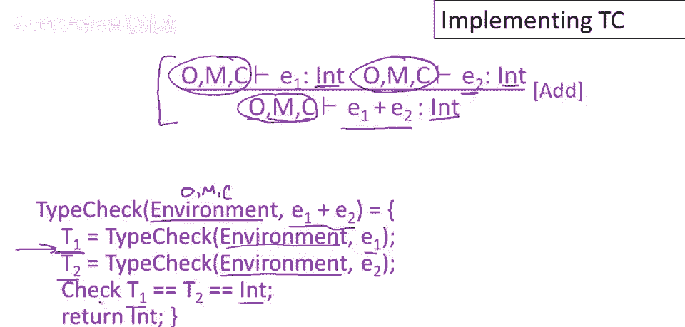

# 【编译原理 CS143 】斯坦福—中英字幕 - P41：p41 09_09-09-_Implementing_ - 加加zero - BV1Mb42177J7

本视频将讨论，如何对类型进行检查，并将其转化为实现。

类型检查的高层概述，是它可以单次遍历，抽象语法树实现，实际上分为两个阶段，顶部向下阶段传递类型环境，底部向上阶段传递类型，从树的根部开始，递归传递初始类型环境，通过抽象语法树的各个节点，直到到达叶子。

从叶子开始，使用环境计算子表达式的类型。

回到树的根部，让我们从类型系统，中一个简单的规则开始，加法规则，简单回顾一下，类型检查e1+e2，首先类型检查e1，然后类型检查e2，两个子表达式必须是int类型，如果满足，则整体表达式。

两个子表达式的和也是int类型，类型检查在环境中进行，整个表达式和子表达式环境相同，提醒一下，始终存在对象环境，用于作用域内的对象名，类的方法环境，以及当前的类，如何实现。

将有一个递归函数type_check，它接受两个参数，类型环境，这是一个记录，不具体说明如何声明，但意思是，主要包含三个部分，O、M和C，还接受一个表达式，这里只处理e1+e2的情况，代码应该怎样。

可以直接根据规则翻译成代码，这是类型系统符号的好处，它非常清楚地告诉你如何从描述中编写实现，首先需要做什么，我们需要类型检查子表达式e一，从规则中可以看出，e一类型检查的环境。

与e一加e二的环境完全相同，我们只是将原始环境参数传递给e一加v二，将其作为参数传递给递归调用以类型检查以类型，检查子表达式e一，该类型检查将运行，它将返回某些类型t一，此时我们不知道t一是整数。

我们接下来将不得不检查，因此我们只记得e一的类型，此外，我们类型检查e二，好的，这也发生在相同的环境下，我们可以在规则中看到，嗯，我们还将获得一些类型，嗯，对于e二的类型t二，然后确认t一和t二，嗯。

都是整数类型，我们现在可以做，嗯，t一是int的检查，马上，在我们类型检查e一之后，在这里做这件事是很好的，我只是为了节省幻灯片上的空间，我把对t一和t二的检查，都放在了一行，如果这个检查成功。

如果它不成功，这里应该有一些代码来打印错误消息，但如果t一和t二实际上是整数，那么整个表达式的类型也是整数，这就是这个调用返回的。

由最外层的类型检查函数调用，现在让我们看一下稍微更复杂的类型检查规则，及其实现，这是let初始化的规则，我们正在声明一个变量x，类型为t，它将在表达式e一中可见，但在执行e一之前。

我们将初始化x为e零的值，然后在我们评估了整个let表达式之后，我们期望得到一些类型t一，所有这些都必须成功，一些事情必须得到满足，这些是规则的前提，首先，e零必须具有某些类型t零，它是t的子类型。

这是初始化正确的保证，这就是为什么这一切都必须奏效，x实际可持有e零类型，整个表达式为t一类型，则e一需为t一类型，但类型检查在扩展了x声明的环境中进行，因此我们也知道，对于e一，x为t类型。

现在让我们编写此的类型检查情况，因此函数类型检查再次，它将接受一个环境作为参数，现在我们在做let初始化的案例，所以只是读取，规则和我们必须检查的条件，我们可以看到，我们首先必须做的。

或我们必须做的是检查e零是否有某种类型t零，我们只需递归调用类型检查，这将在整个表达式的相同环境中进行，因此我们将环境传递给递归调用，我们现在正在类型检查e零，并记录其类型t零，第二个前提像这样实现。

现在，我们正在类型检查e一，并期望它具有某种类型t一，但现在环境不同，因此我们取原始环境，表达式的整体环境，并向该环境中添加x为t类型的声明，因此我们正在用额外的变量声明扩展环境，好的。

因此我们进行该类型检查调用，我们得到一个类型t一，现在我们必须检查t零是否是t的子类型，所以那是一个，那是一个实现子类型关系的函数的调用，如果通过，如果检查通过，那么我们就完成了，我们可以返回类型t一。

幻灯片上有一个小错误，那里应该有一个分号。

