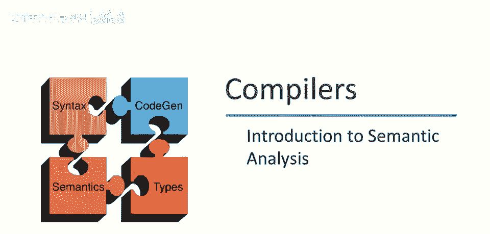
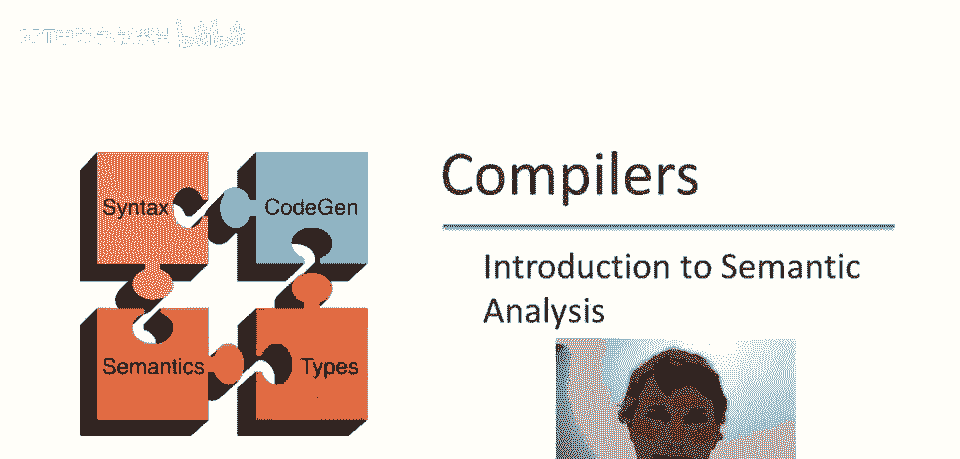
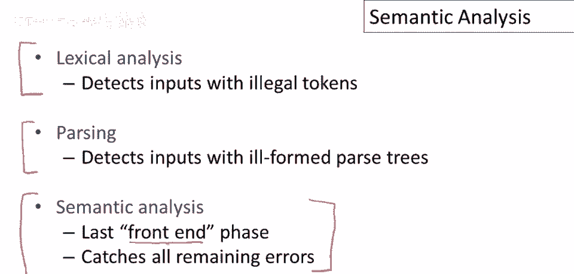
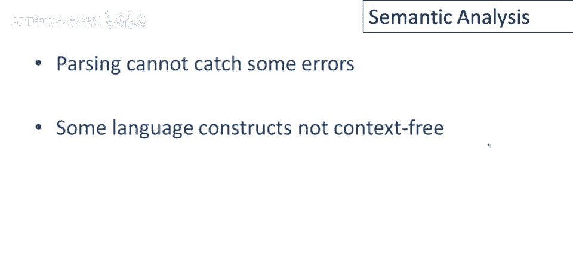
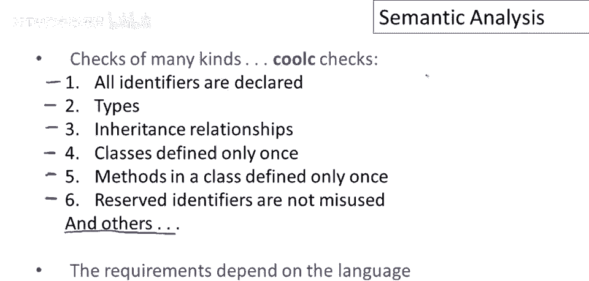

# 【编译原理 CS143 】斯坦福—中英字幕 - P42：p42 09-01-_Introduction_to_ - 加加zero - BV1Mb42177J7

欢迎回到本视频，我们将做简短介绍，语义分析概述。

回顾编译器讨论，讨论了词法分析，从语言定义执行角度看，词法分析主要工作是检测输入，输入字符串，非语言单词或原始符号，下一步是解析，我们也结束了那话题，从判断程序是否正确，或是否有效程序的角度。

解析的任务是检测语言中，所有不正确的句子，或没有解析树的句子，最后我们要讨论的，现在将占据我们相当长一段时间的是语义分析，这是所谓的，前端阶段中的最后一个，逐步拒绝更多输入字符串的过滤器，最终只剩下。

所有三个阶段运行后，只有有效程序可编译，语义分析是最后一道防线，它是管道中的最后一个，它的工作是捕获程序中所有潜在的剩余错误。

现在你可能会问自己，我们为什么甚至需要一个单独的语义分析阶段，答案非常简单，编程语言有一些特性，有些错误解析无法捕获，解析，我们将使用，上下文无关文法不够表达，描述语言定义中我们感兴趣的一切，因此。

这些语言结构并不友好，情况非常相似，当我们从词法分析切换到解析时，就像不是，所有事情都能用有限自动机完成，我们想要更强大的东西，如上下文无关文法，以描述编程语言的其他特征，上下文无关文法本身也不够。

还有一些额外的特征，不能用上下文无关结构轻易表达。

那么语义分析在酷C的情况下实际做了什么？它进行了多种检查，这很典型，这是酷C执行的6类检查列表，让我们快速浏览一下它们，首先，检查所有标识符已声明，还要确保标识符的限制被遵守，酷编译器需类型检查。

这是语义分析器的核心功能，酷啊，来自面向对象特性的限制，检查类间继承关系是否合理，不希望类被重定义，每个类仅允许一个类定义，类似地，方法应在类内仅定义一次，酷有若干保留标识符，需小心勿误用，这很典型。

许多语言都有保留标识符，需遵循特殊规则，实际上此列表不完整，还有许多其他限制，将在后续视频中讨论，主要信息是语义分析器需执行，多种不同检查，这些检查随语言而异。

酷C执行的检查是静态类型检查面向对象语言的典型，但其他语言家族将有不同检查。

