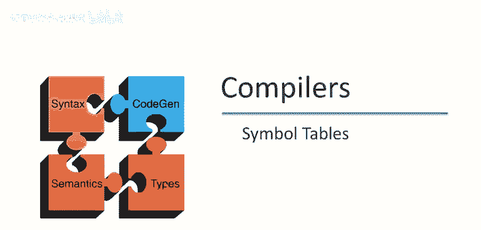
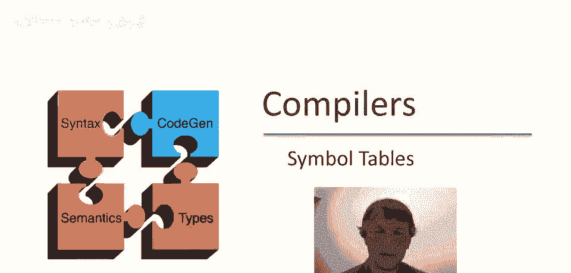
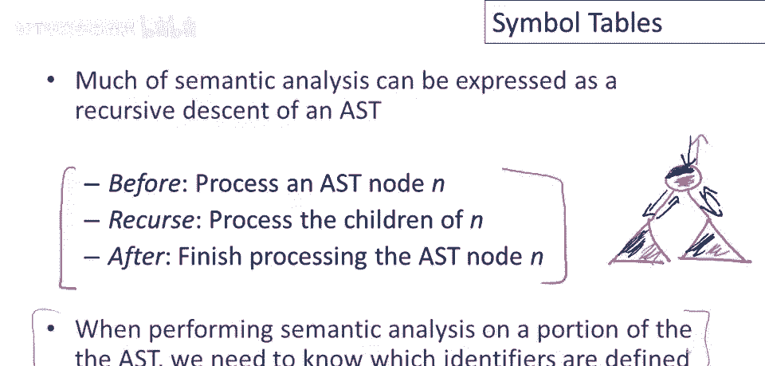
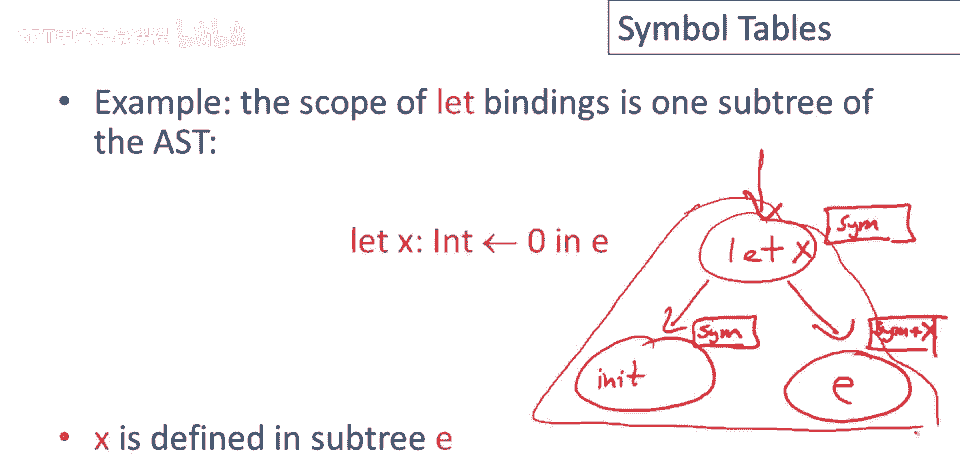
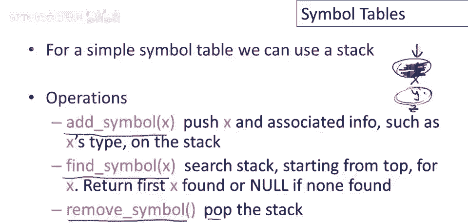
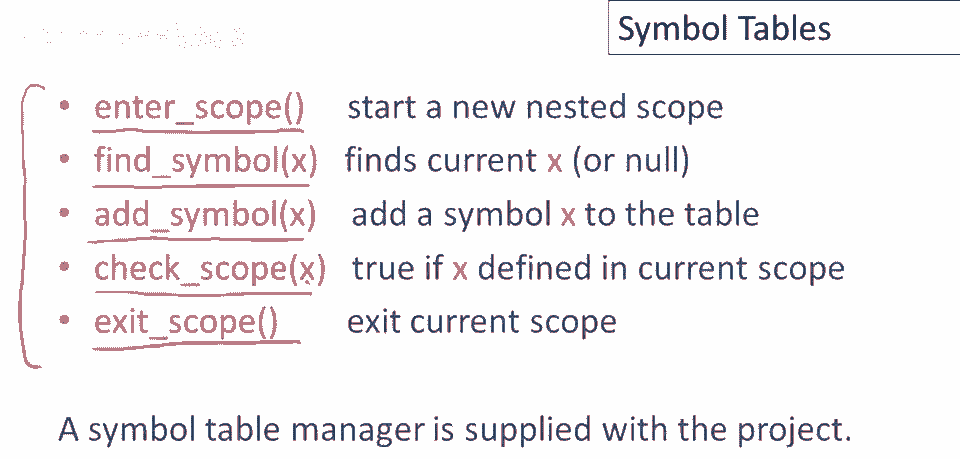

# 【编译原理 CS143 】斯坦福—中英字幕 - P44：p44 09-03-_Symbol_Tables - 加加zero - BV1Mb42177J7

本视频中，将讨论简单表和许多编译器中的重要数据结构。

在讨论简单表之前，我想谈谈一个通用算法，我们将在整个课程中不断看到其实例，因此，许多语义分析，实际上，许多代码生成都可以表示为抽象语法树的递归下降，基本思想是，在每个步骤我们执行以下三个操作，步骤如下。

我们总是在处理树中的一个节点，所以，如果我画一棵抽象语法树的图，我们可能有一个节点和一些子树挂在它上面，我们可能会对节点进行一些处理，在，做其他任何事情之前，我们到达节点，比如说。

我们从父母那里进来听父母的，我们对节点进行一些处理，我只是通过把它涂成蓝色来表示，表示我们在这里做了某事，然后我们处理子节点，好的，处理完子节点后，回到节点后，嗯，再做其他事，可能对节点进行后处理。

然后返回，同时处理其他节点，我们下车处理孩子，我们以相同预定的方式处理所有节点，因此，他们以相同的方式对待，每个节点之前都做了一些事情，所有孩子处理完后，再做些事情，这种算法的例子很多。

这称为树的自顶向下遍历，有些情况下，我们只会在处理孩子之前处理每个节点，有些情况下，我们只会在处理所有孩子之后处理每个节点，有些地方我们这样做，回到视频主题，在语义分析抽象语法树部分，需要知道，嗯。

哪些标识符已定义，哪些标识符在作用域内。

递归下降策略示例，跟踪作用域内的变量集，我们有抽象语法树中的let节点，在一个子树中有初始化，另一子树中有e，let的主体，这是一个特定变量的let，在父节点内写入该变量，因此，当我们开始处理此节点时。

假设我们从上面来，我们正在这样做，我们递归处理抽象语法树，因此，我们从某个父节点到达这一点，将有一组当前在作用域中的符号，这是一个位于侧面的数据结构，实际上，那将是我们的符号表，这里会发生什么，嗯。

首先，我们不得不做的是，我们不得不处理初始化器，我们需要知道是否，这与我们在此执行的任何函数有关，例如类型检查或其他我们可能首先处理的内容，我们将符号表传递进去，好的，然后，我们将处理let的主体。

但当我们这样做时，我们将传递在作用域中的符号集，但x现在也在作用域中，因此在处理e之前，我们将x添加到符号集中，然后，当我们从子表达式e返回时，它将删除，因此，我们将符号表恢复到先前的状态，因此。

在我们离开抽象语法树的此子树后。

我们只有与进入它之前相同的符号定义，在递归下降三步算法的术语中，我们在第一张幻灯片上看到的，我们在这里做什么？在处理e之前，我们将x的定义添加到我们当前的定义列表中。

覆盖lead表达式之外可能可见的任何x的定义，然后，我们将递归，我们将处理let主体中的所有抽象语法树节点，在e内部，在我们完成处理e之后，符号表只是一种实现这些功能的数据结构。

它跟踪抽象语法树中每个标识符的当前绑定。

对于非常简单的符号表，我们只需使用栈，它将具有以下三个操作，我们可以将符号添加到符号表中，这将仅将符号推入符号表，将变量推入栈中，以及我们想要的其他信息，例如类型，我们将有一个查找符号操作。

它将查找符号的当前定义，只需搜索栈即可完成，从顶部开始查找变量名首次出现，这将自动处理所有定义的隐藏，例如，如果我们有一个栈，比如有x，Y和z在上面，然后我们进入一个引入新y的范围，我们将y推至顶部。

现在如果我们搜索栈，我们会先找到这个y，有效地隐藏了旧的y定义，然后当我们离开一个范围时，我们可以简单地通过弹出栈来删除符号，我们只需弹出当前变量即可，这将消除最近的定义，并留下栈，将定义集恢复到。

进入节点之前的状态，所以在这个例子中，如果我们离开了定义外层y的范围，并且它从栈中弹出，那么现在它已经消失了，当我们搜索y时，我们会找到外层定义，在内部范围之外定义的那个。

所以这个简单的符号表对let很好用，因为符号一次添加一个，并且声明是完全嵌套的，事实上，声明完全嵌套的事实，是我们能够使用栈的真正原因，看看这个小例子，假设我们有三个嵌套的let。

在这里我没有显示左子树中的初始化器，它们不重要，对于我想说明的，所以如果你考虑一下，当我们从根部这里向下走到内部绑定时，我们正在将东西推入栈中，我们将按顺序将东西推入栈中x y和z，然后当我们离开时。

当我们处理完这个子树时，当我们走回去离开时，我们将遇到这些let范围，完全按相反顺序弹出它们，栈的顺序正是我们希望删除它们的顺序，这就是为什么栈工作得很好，所以这个结构对let很好，呃。

对于其他一些构造，呃，但并不像它可以的那样好，例如，考虑以下代码片段，非法代码片段，我应该添加，假设我们声明一个方法，它有2个名为x的参数，这是非法的，为了检测它不合法，为什么不合法，不合法。

因为它们都在同一范围内定义，因此，函数或方法具有一次引入同一范围内多个名称的性质，使用栈并不容易，我们一次只添加一个东西，或一次只添加一个名称，难以模拟范围内的同时定义。

这个问题很容易解决，但需要一个稍微复杂一点的简单表格，现在有5个方法而不是3个的修订接口，最大的变化是我们现在有显式的进入和退出范围函数，因此，这些函数开始一个新的嵌套范围并退出当前范围，可以这样认为。

我们的新结构是一个范围堆栈，堆栈上的东西是一个完整的范围，然后在范围内，是定义在同一级别内的所有变量，所以就像以前一样，我们有一个查找符号的操作，它将返回当前定义或null。

如果在当前可用的任何范围内都没有定义，我们将有一个添加符号的操作，它将添加一个新的符号到表中，它添加到当前范围，因此，我们范围堆栈顶部的任何范围，然后还有一个新的操作checkscope将返回true。

如果x已经在当前范围内定义，所以明确地说，这个操作返回true，如果x恰好在最顶层的范围内定义，它不会返回true，除非x在堆栈顶部范围的顶部定义。

这允许您检查双重定义，例如，在我之前幻灯片上的代码中，如果有两个x的声明，我们如何检查这个？我们将x添加到当前范围的符号表中，然后我们会问，x是否已经在该范围内定义（对于第二个）。

这个接口将返回true，我们会知道要引发错误，说x已被多次定义，最后，我只想说这是简单表格接口，或非常接近这个的简单表格接口，是随酷项目提供的，已经提供了一个该接口的实现，如果您不想自己编写。

所以让我们通过谈论类名来结束这个视频，类名，与let绑定和函数参数中引入的变量不同，特别是类名可以在定义前使用，如我们前几集讨论的，这意味着我们不能在一次遍历中检查类名，我们不能只遍历一次程序。

检查使用的每个类是否定义，因为我们不知道是否看到了所有类的定义，直到我们到达程序的末尾，所以有一个解决方案，我们需要对程序进行两次遍历，在第一遍中，我们收集所有遇到的类定义，我们查找所有定义类的位置。

记录所有那些名称，在第二遍中，我们查看类的主体，确保它们仅使用已定义的类，这里的教训是，实际上并不难实现，我认为这应该很清楚或应该很清楚如何工作，但这里的信息是，语义分析将需要多次遍历，可能不止两次。

事实上，编译器结构不应畏惧，增加大量简单步骤，若能简化生活，最好将问题拆分为，如三四个简单步骤，而非一个极，其复杂步骤，所有代码纠缠，你会发现调试编译器更容易，若愿意多次遍历输入。

