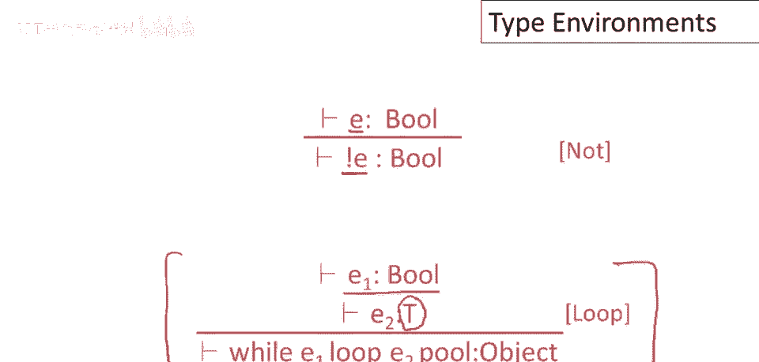
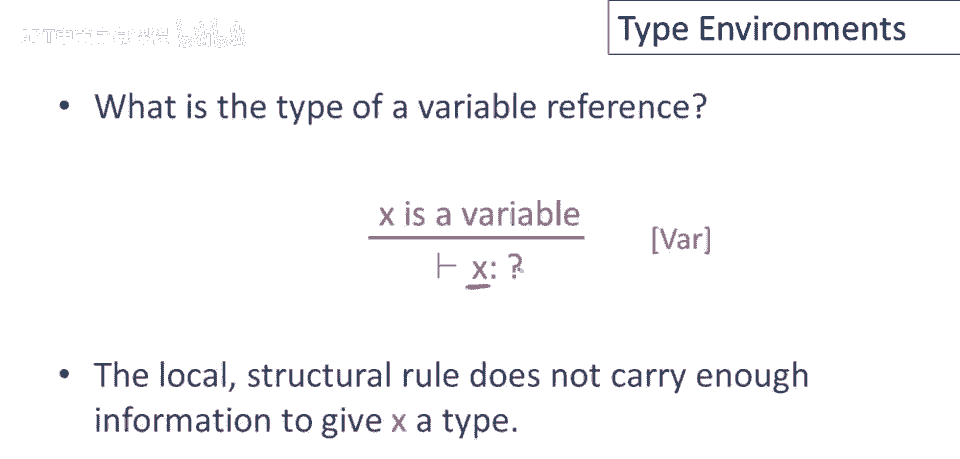
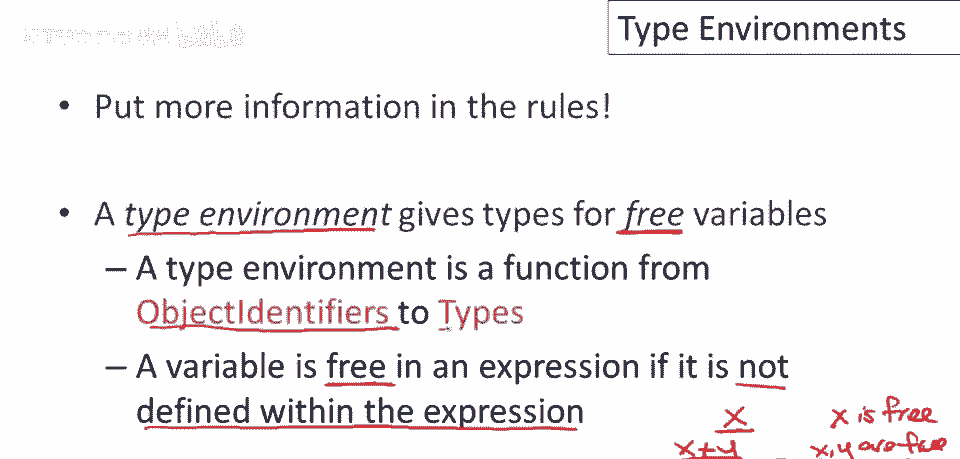
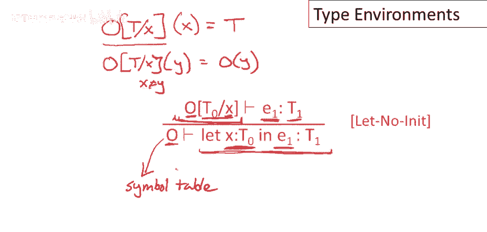

# 【编译原理 CS143 】斯坦福—中英字幕 - P47：p47 09-06-_Type_Environment - 加加zero - BV1Mb42177J7

本视频中，我们将继续开发酷类型检查，讨论类型环境。

让我们先做更多类型规则，这是常量false的规则，可证明常量false的类型为bool，并不意外，如果有字符串字面量s，可证明其类型为string。

也不意外，表达式new t产生类型为t的对象，类型规则很简单，new t的类型为t，暂时忽略self类型，如早期视频所述，稍后视频将处理self类型。

单独讨论，这里有一些更多规则，若表达式e的类型为bool，则布尔补e非e的类型也为bool，最后可能是目前最复杂的规则，while循环的规则，回忆e1是循环的谓词，决定是否继续执行循环，e2是循环体。

e1要求类型为bool，需证明e1的类型为bool，循环体e2的类型可以是任意，可以是类型t，必须有类型，遵循某些规则，但类型不重要，整个表达式的类型为object，不返回有趣值，不产生有趣值。

为了阻止依赖，整个类型为object，这是一个设计决定，现在，我们可以设计语言，例如，while循环的类型为t，你将得到循环最后执行的值的类型，问题是如果e1，循环的谓词首次进入循环时为false。

则从未评估e2，无值产生，在这种情况下，你将得到一个void值，这是设计问题，如果e1，循环的谓词首次进入循环时为false，则从未评估e2，无值产生，若有人尝试解引用，将导致运行时错误。

为阻止程序员在循环中，说谎产生有意义值。

可将其类型设为对象，到目前为止，为每个已查看的结构，定义合理类型规则，已很简单，但现在我们遇到问题，假设有一个仅包含，单个变量名的表达式，这是一个完全有效的表达式，问题是该变量的类型，称为x，如你所见。

仅查看x本身，没有足够信息给x类型，局部结构规则不包含，关于x类型的信息，推理规则具有属性，所有信息都需要是局部的，执行规则所需的一切，必须在规则本身中存在，没有外部数据结构。

没有传递的东西，都在一边，所有信息都必须编码在规则中，到目前为止我们还不清楚，变量类型应如何说明，解决方案是向规则中添加更多信息，这正是我们要做的，类型环境为自由变量提供类型，什么是自由变量。

如果在表达式中，一个变量未在该表达式中定义，则该变量为自由变量，例如，在表达式x中，x是x加y中的自由变量，这个表达式使用x和y，但该表达式中没有x或y的定义，因此x和y是该表达式的自由变量。

如果我有一个let y。所以在x加y中声明了一个变量y，那么，这个表达式中什么是自由的，这个表达式使用x和y，但y的使用由该表达式内部的y定义控制，所以我们说这里y是绑定的，若告知x类型。

可类型检查x+y，若告知x和y类型，可类型检查此表达式，此导引表达式，若告知x自由变量类型，y类型由let声明给出，仍需告知x类型，自由变量为需提供信息的变量，类型环境编码此信息。

类型环境为对象标识符到类型的函数，从变量名到类型。

设o为类型环境，这些从对象标识符到类型的函数之一，类型，现在将扩展，证明逻辑语句类型如下，此将被解读为，在变量类型由o给出的假设下，O为假设，置于转义符左侧，关于e中自由变量的假设，在假设。

自由变量类型由，O给出下，可证明，表达式e具有类型t，此符号很好地区分假设，这是确定类型所需输入，从证明的内容，若告知自由变量类型由，O给出，则可告知e类型。

类型环境需添加到所有现有规则中，例如，整数字面量，若对变量类型有假设，实际上不会改变，不会，实际上不会改变整数字面量的类型，任何整数字面量仍具有类型int，在这种情况下，对于这种特定表达式。

我们不会使用关于变量类型的假设，对于加法表达式情况稍有不同，若有表达式e1+e2，和关于变量类型的一些假设o，则想证明e1具有类型int，将使用，由o给出的变量类型，e1可能包含自由变量。

将需要在o中查找以确定这些变量的类型，类似地对于e2，将在相同假设下类型检查e2，如果e，在o和e假设下输入，在o well假设下输入2，那么我可以推断e，1加e 2在相同假设o下输入。

也能编写新规则，自由变量问题现成易解，若想知道x类型，这里缺o，若想知道x类型，在对象环境中查找，在变量类型由o给出的假设下，x类型是什么，嗯，在。查找，哦，x假设类型，然后可证明x有该类型，T。

现在看一个有趣变量规则，从环境角度看，这是let表达式，回顾let作用，无初始化let表达式，x是新变量，类型t0，变量在e1中可见，如何类型检查e1，在某种环境中类型检查e1，这是新记号，定义含义。

总是函数，映射变量名到类型，o t x是函数，o在x点修改的函数，返回t，整个函数，下划线部分是一个函数，应用于x返回t，这组假设，x类型t，其他变量，若应用于其他变量y，x不同于y，则。

得到y在o的类型，好，规则说在相同环境，o，除了x类型为t0，改变x类型为t0，因为e1中绑定新标识符类型，其他类型不变，用这些假设尝试证明e1有类型，将得到e1类型，然后整个let表达式的类型。

注意类型环境的一些特点，这表示在类型检查e one之前，我们需要修改假设集，并修改类型环境以包含关于x的新假设，然后类型检查e one，当然，当我们离开类型检查e one时，我们将删除关于x的假设。

那个新假设，因为let之外，我们只有原始的假设集o，所以，我希望那个术语和那个描述能让你想起我们之前讨论过的东西，因为这种类型环境实际上是由简单的表格实现的，所以，在我们的规则中，类型环境携带了将在。

或通常存储在编译器的符号表中的信息。

总结一下这段视频，类型环境为当前范围的免费标识符提供类型，这非常重要，因为如果没有关于免费标识符类型的信息，谈论类型检查和表达式，实际上没有意义，类型环境只是正式化，给一些假设起名字。

关于那些免费标识符的类型，注意类型环境从抽象语法树的根部向下传递到叶子，即，当我们通过定义时，类型环境用新的定义扩展，例如，和let表达式，因此，当您从抽象语法树的根部向下传递时。

类型环境将随着您向抽象语法树的叶子移动而增长，然后类型从抽象语法树的叶子向上计算到根，所以我们从叶子开始，获取所有类型，叶表达式，大多数都非常简单，像整数和字符串常量这样的东西具有明显的类型。

我们只需在类型环境中查找变量的类型。

