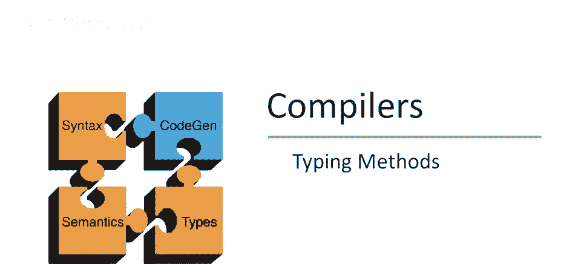
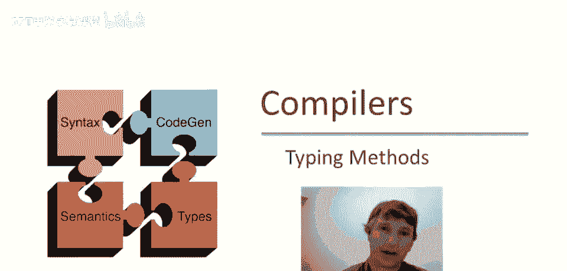
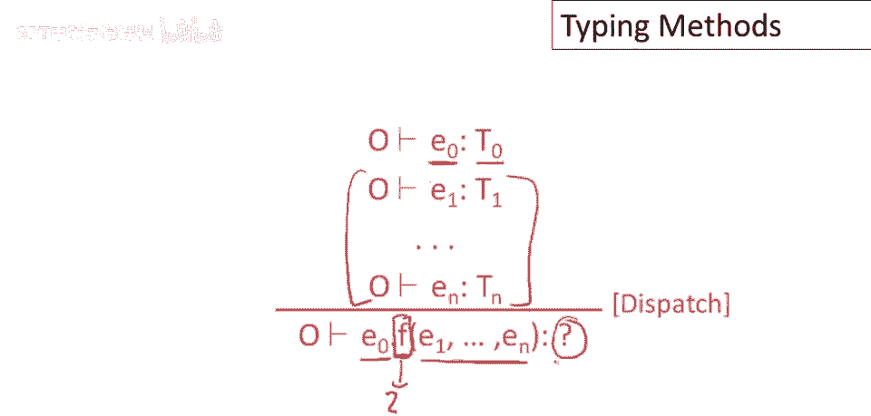
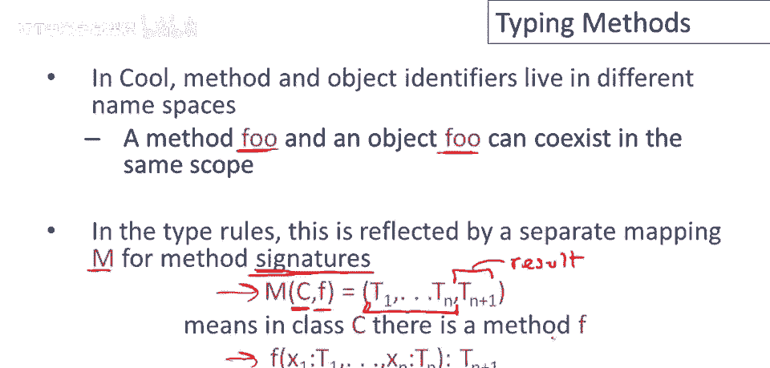
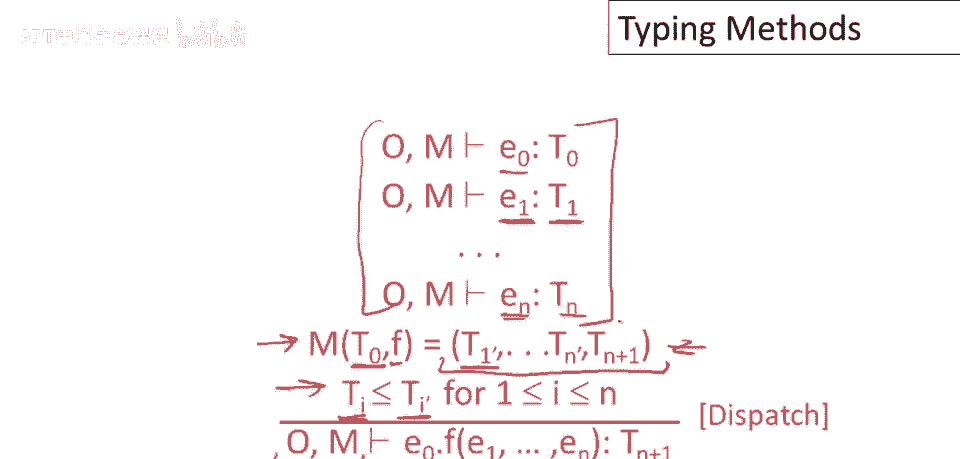
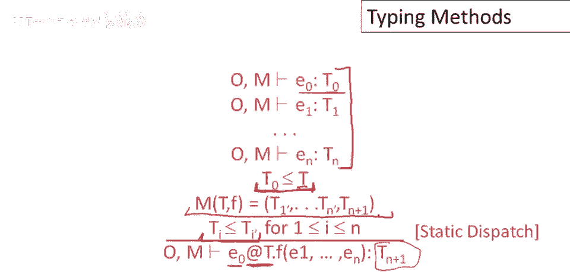
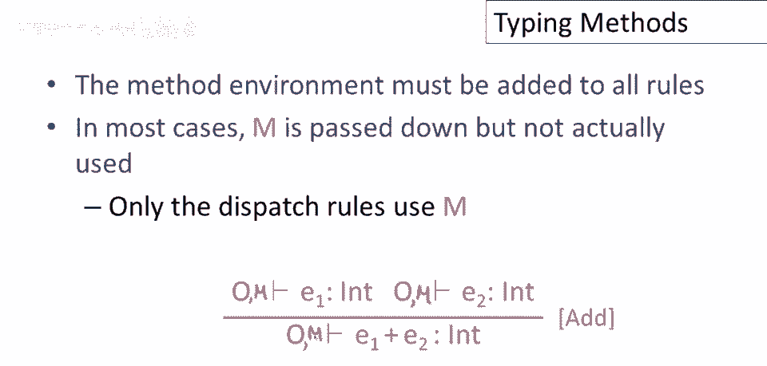
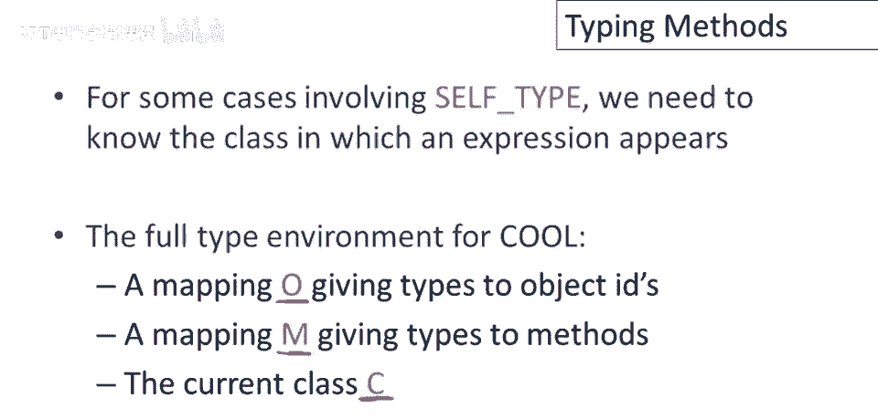
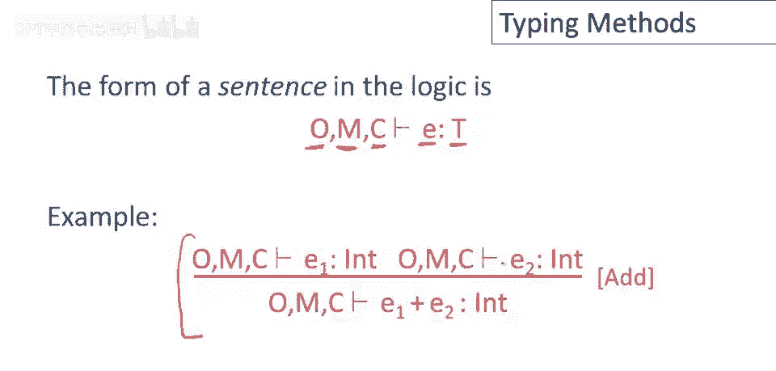
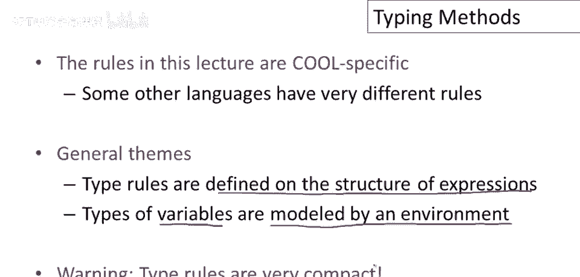

# 【编译原理 CS143 】斯坦福—中英字幕 - P49：p49 09-08-_Typing_Methods - 加加zero - BV1Mb42177J7

在这视频中，我们将继续讨论类型检查，以及类型检查方法和调用规则。

所以我们要类型检查一个方法调用，假设我们有一个表达式e的派发，我们正在调用名为f的方法，并有一些参数e1到e_n，显然我们要类型检查e_0，它将有一个类型，T_0，同样我们要类型检查所有参数。

它们将有一些类型，然后问题是，此方法调用返回类型？调用此方法后得到何种值？如您可能所见，我们处于与之前非常相似的情况，当我们尝试类型检查变量引用时，我们有一个名为f的名称，但对其功能一无所知。

我们不知道f的行为，除非我们了解s的行为，否则我们无法确定它将返回何种类型的值。

在cool中增加了一个小问题，方法与对象标识符是否分属不同命名空间，在同一作用域内可以有一个名为foo的方法，以及一个名为foo的对象，我们不会将两者混淆，它们在语言中足够不同且使用方式也不同。

因此我们总能分辨，当我们谈论对象foo时，当我们谈论方法foo时，但这意味着，实际上，在Cool中有两个不同的环境，一个用于对象，一个用于方法，因此在类型规则中，这将通过一个单独的映射反映。

一个单独的方法环境，将记录每个方法的签名，这是一个你可能在其他上下文中听到的标准名称，但一个函数的签名只是它的输入和输出类型，因此，这个表m将取一个类的名称，它将取该类中一个方法的名称。

它只是将告诉我们该方法的参数类型是什么，因此，列表中除了最后一个类型之外，都是该方法的参数类型之一，然后，最后一个类型是结果类型，这就是返回值的类型，因此我们编写方法签名的方法就是作为一个元组。

或类型列表，第一个到倒数第二个一起是参数的类型，按顺序，然后最后一个是一个结果的类型，因此在方法环境中像这样的一项，仅仅意味着f有一个看起来像这样签名的，它接受具有相应类型的参数并返回。

某种类型tn加一的返回。

因此，将方法环境添加到我们的规则后，我们现在可以编写一个用于分派的规则，首先注意我们有这两个映射，一个是对象标识符，一个是左转栏上的方法名，我们必须将方法环境传播到所有类型，对于子表达式。

以及方法调用的情况，我们只类型，我们正在调度的表达式的类型e零，以及所有参数和类型t一到tn，然后在类t零中查找f的类型，我们正在向哪个类调度？那将是e零的类，所以我们去哪里查找，M在我们的环境中。

最好有一个名为f的方法在类t零中找到，它必须具有正确的参数数量，然后我们正在传递的实际参数e一到e n，它们的类型必须是声明的形式参数的子类型，所以这里f的签名说，例如，f的第一个参数类型为t一撇。

因此我们将要求e一的类型为某种类型t一，使得t一是t一撇的子类型，类似地，对于方法调用的所有其他参数，如果所有这些检查都通过，如果f有这样的签名，并且实际参数和形式参数的子类型要求匹配。

那么我们将说整个表达式，此调度返回类型tn加一。

方法的返回类型，静态调度的类型规则与常规调度的类型规则非常相似，所以回忆一下语法上，唯一的区别是程序员写了类的名称，他们希望在运行方法，所以不是运行方法f，如e零的类定义，无论那个类是什么。

我们将运行f在e零的类的某个祖先类中，类中，那如何在类型规则中表达，好吧，我们再次类型e零和所有参数，现在我们需要的是我们为e零发现的任何类型，它必须是t的子类型。

所以t必须是e零类型层次结构中的祖先类型，此外，类t最好有一个名为f的方法，具有正确的参数数量，具有正确的类型，以便所有类型约束都能解决，实际参数类型是相应形式参数类型的子类型。

然后如果所有这些都是真的，我们将能够得出结论，整个调度表达式具有类型tn，加一。

方法的返回类型是什么，方法环境必须添加到系统中的所有类型规则中，嗯，这很容易做到，因为只有调度规则真正关心方法是什么，其余的规则只是将方法环境传递给其他规则，那我的意思是什么，嗯，这是我们的加法规则。

只有对象环境，现在我们要做的是添加一个方法环境，子表达式将使用与整个表达式完全相同的方法环境进行类型检查，其余的规则只是从根向叶传递方法环境，而不改变它。

就像这个规则一样，对于涉及self类型的某些情况，实际上我们需要环境中的更多东西，因此，cool类型检查的实际完整环境由三部分组成，首先，有一个映射o，它将类型分配给对象ID，有一个映射m。

它将类型分配给方法，最后，我们只需要知道当前类的名称，因此，我们正在类型检查的表达式所在的类。

因此，cool类型检查逻辑中的句子完整形式如下，并读作如下，在假设对象标识符具有由o给出的类型的情况下，方法具有由m给出的签名，并且表达式s位于类c中，那么我们可以证明表达式e具有类型t，这是一个例子。

加法示例，再次写出带有完整环境的加法规则。

我给你的类型检查规则很酷，具体，其他语言有不同的规则，但类型检查有一些普遍的主题，首先，类型规则定义在表达式的结构上，因此它们通常以这种归纳方式完成，其中表达式的类型。

表达式的类型取决于其子表达式的类型，以及变量的类型，和，更一般地说，表达式中的任何自由名称，如方法名，它们将由环境建模，因此我们将有一些映射围绕，它告诉我们对于表达式中的任何类型的自由名称。

类型规则应该对，这些名称的类型做出什么假设，你可能已经注意到的一件事，但值得明确的是，类型规则非常紧凑，符号并不复杂，这些角色中有很多信息，需要花时间仔细阅读。

