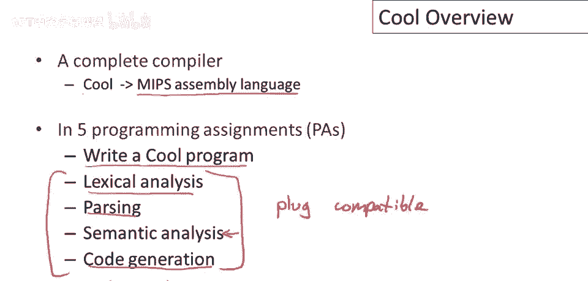
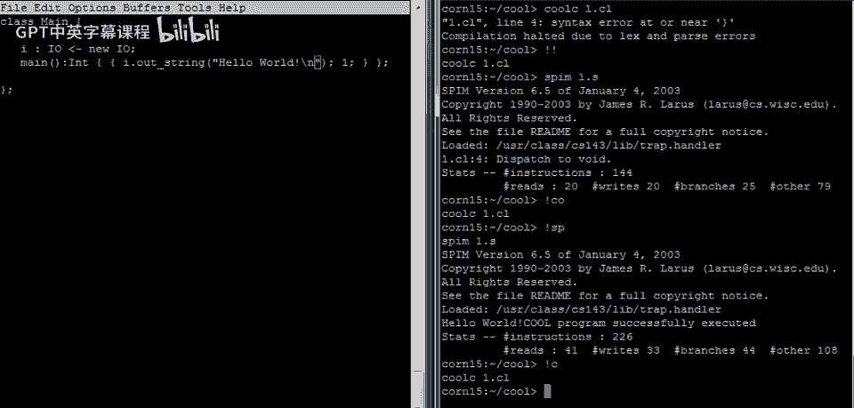
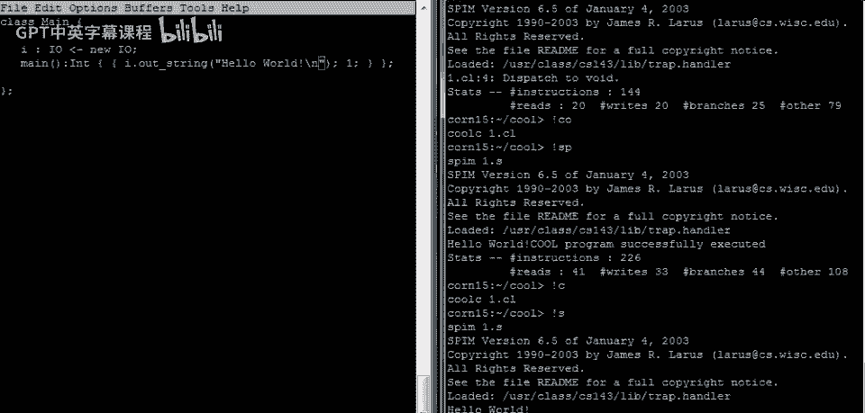
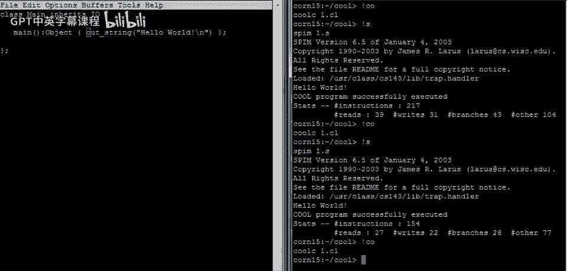

# 【编译原理 CS143 】斯坦福—中英字幕 - P4：p04 02-01-_Cool_Overview - 加加zero - BV1Mb42177J7

你好，在接下来的视频中，我将概述一种酷语言，您将编写编译器的编程语言，Cool是面向对象的课堂语言，缩写当然是，酷，Cool的独特设计要求是，编译器必须在相对较短的时间内编写，时间。

学生写编译器仅一学期，因此，它必须快速实现，主要用于教学编译器，世界上的酷编译器远超酷程序，所以有很多，编写了许多编译器，成千上万的编译器，可能有数万酷编译器，但只有几十或几百个酷程序。

可能是唯一存在的语言，编译器数量超程序，但揭示主要设计要求，在酷中更重要，编译器易写，程序易写，语言有些怪癖，为实施简化，不损教学价值，日常使用不便，作为工作程序员，语言里有什么，嗯，呃。

我们尝试设计它，以给你现代抽象概念的味道，静态类型，通过继承重用，自动内存管理，实际上还有一些我们稍后会讨论的，但很多东西被省略了，我们无法将所有内容，放入语言并快速实现，嗯，讲座中会涵盖一些内容。

但不幸的是，甚至有些有趣的语言想法，我们无法在本课中涉及，因此课程项目是构建一个完整的编译器，特别是你将编译cool到mips汇编语言，为80年代设计的机器，有可在任何硬件上运行的MIPS模拟器。

这使得整个项目非常便携，运行你的编译器，生成MIPS汇编语言，然后同一语言可在任何机器上模拟，项目访问分为5个作业，首先编写一个酷程序，该程序本身将是一个解释器，以获得编写简单解释器的经验。

编译器本身将包括我们讨论的4个阶段，词法分析，语法分析，语义分析，和代码生成，所有这些阶段都是可插拔的，意味着我们有单独的实现，每个阶段的单独参考实现，例如，当您正在处理语义分析时，您可以将词法分析。

解析和代码生成组件从参考编译器中取出，并将您的语义分析插入该框架并测试参考组件，因此这样，如果您对一个组件有困难，或不确定您的某个组件工作得很好，您不会在处理另一个组件时遇到问题，因为您能够独立测试它。

最后没有必需的优化作业，但我们有一些建议的优化，许多人已经编写了优化，对于酷，这是一个可选的，作业，嗯，如果您对程序优化感兴趣。

让我们编写最简单的酷程序，首先要知道的是酷源文件，扩展名为。cl的cool，您可以使用任何编辑器编写程序，我恰好使用emacs，嗯，您可以使用其他编辑器，如果您喜欢。

每个酷程序都必须有一个名为main的类，让我们谈谈这一点，类声明以关键字class开始，后跟类名，因此在这种情况下main后跟一对花括号，花括号内是所有属于该类的内容，每个类声明必须以分号结束。

程序由类声明列表组成，每个类声明以分号结束，这就是类的结构，现在我们需要这个类做点事情，所以我们将在这个类中有一个方法，我们称其为main，事实上，主类的main方法必须始终存在，这是启动程序的方法。

此外，此方法必须不接受参数，因此，main方法的参数列表始终为空，并且让我们说main方法的主体始终位于一对花括号中，因此，main方法始终位于花括号中，类由这样的声明列表组成。

并且再次声明必须全部由分号分隔，所以和或终止，抱歉，由分号，在这种情况下，类中只有一个方法，但它仍然必须有其分号，现在我们可以说我们希望方法实际做什么，这是方法代码所在的地方。

让我们拥有最简单的可能方法，那个仅仅评估为数字1的方法，好的，Cool是一种表达式语言，这意味着，代码可以去的任何地方，你可以放置任意表达式，任何表达式都可以在那里，方法没有明确的返回语句。

它只是方法体的值，所以在这种情况下，我们只放入数字1，这将是运行此方法时的方法值，所以让我们保存它，现在我们可以尝试，呃，编译这个简单的程序，那么如何编译，编译器称为coc，用于Cool编译器。

你只需给Cool编译器一个列表，Cool源文件，所以在这种情况下只有一个文件，一个dot cl回车，哦，我们得到了一个语法错误，所以我们必须回来修复它，错误说在第三行的开花括号附近，有一个错误。

我知道错误是什么，因为我是有能力的Cool程序员，至少是有点能力的Cool程序员，至少有点能力的Cool程序员，方法必须声明返回类型，因此需要在此处添加类型，声明的语法是在参数列表中，方法名称后加冒号。

然后类型名称，由于此程序返回数字1，嗯，主方法也应返回整数，保存，回到编译窗口，再次编译成功，现在看目录，看到一新文件one。s，是程序one的汇编代码，现在可尝试运行代码，和，呃。

MIPS模拟器叫spin，仅需汇编文件模拟，所以给，one。s回车，它会运行并打印很多东西，但如你所见，它说程序成功执行了一半，那很好，然后有一些统计数据，如执行的指令数，加载和存储的次数，分支数。

如果我们担心性能，这些数据会很有趣，如果我们正在优化编译的代码，但我们现在不做这个，我们只是在运行程序，我们可以看到程序是否运行正常，程序运行成功结束，但并未实际输出任何内容，因为我们并未要求它输出。

若要输出，需返回修改程序，当前程序仅返回其值，但该值未做任何处理，未打印，或其他类似操作，若要在酷程序中打印内容，你必须明确这样做，所以有一个内置在原始类io的特殊类，我们可以声明一个。

称为此类属性的东西将是io属性，它将被称为i，i将是一个我们可以使用的对象，以执行I/O，嗯，我们可能添加一个调用out string，I。out string是我们调用方法的方式，好的。

字符串是io类的方法，我们用i调用该方法，然后我们可以传递一个字符串，我们想打印在屏幕上，例如，我们可以说你好，世界，好的，现在我们要决定，嗯，数字1怎么办，让我再展示一个cool的特性，让我们留下1。

并让它成为语句块的一部分，语句块由分号分隔的表达式序列组成，你可以有任意数量的表达式，语句块或表达式块的语义是，按顺序评估表达式，块的值是最后一个表达式的值，语句或表达式块必须包含在，自己的花括号中。

好的，现在是一个有效的cool程序，让我为你读一下，程序的主体是一个表达式块，第一个执行对i对象的out string调用，将为我们打印你好世界，然后第二个评估为1，这是整个方法的值，实际上。

我应该说它是块的值，好的，然后因为块是uh，方法的体，块的值成为整个方法的值，因此，此方法调用将返回1，所以让我们保存这个，回到这里，让我们再次编译，所以，看起来我未能保存它，让我们编译这个。

我们看到有一个语法错误，所以它说，在第4行，我们有一个语法错误，靠近关闭的花括号，问题是，语句块或表达式块由，一系列或序列的表达式终止于分号，我们忘了终止序列中的最后一个表达式，嗯，用它的分号。

所以我们要添加那个，现在我们应该能够编译这个，瞧，看哪，编译正确，然后可以运行，现在看到，哦，又出错了，我们有，呃，程序运行时抱怨我们有一个无效的分派，所以第4行，我们的分派指向一个不存在的对象。

可以看到对i的分派调用，它不存在，因为实际上我们忘了为i分配对象，所以这里声明i为io类型，但这并不实际创建任何对象，就像用户创建变量名，我呃，但i实际上没有值，所以如果我们要i有实际值。

我们必须初始化它为某些东西，所以我们可以初始化它为一个新的io对象，这里是你在cool中分配新对象的方式，new，总是需要一个类型参数，所以在这种情况下，我们正在创建一个新的io对象。

并将其分配给这个对象，i，注意这里i是i是i，在java中被称为字段名，我们在cool中称之为属性，所以这些都是数据，类的数据元素，所以类可以有名称，即属性，或持有值的字段，以及可以执行计算的方法。

所以让我们保存这个并切换回来，现在我们将再次编译，所以仍然编译，现在可以运行，现在运行，看哪，如您所见，在底部，从顶部第三行，打印出，Hello world，这看起来有点难看。

因为成功的执行消息与我们的Hello world消息在同一行，所以让我们修复它，让我们回到这里，在我们的字符串中我们可以添加一个新行，好的在字符串末尾，反斜杠n是你在字符串中写新行字符的方式。

保存它回到这里，让我们编译，如果你不知道，Unix Bang重复前一个表达式，以相同前缀开始的前一个命令，你在Bang后输入，所以我想运行以c开始的最后一个命令，即编译。

然后我想运行以s开始的最后一个命令。

即运行spin，现在我们可以看到啊，它都很漂亮，Hello world在一行上。

所以让我们继续，呃，让我们清除所有这一切，所以让我只给你展示同一个程序的几个变种，我在这里要做的就是重新编写它，以几种不同的方式，所以只是为了说明一些cool的特性，让你更熟悉语法。

同时也只是展示做同样事情的替代方法，所以你知道这个，呃，这里的表达式块有点笨拙，来实现Hello world程序，所以让我们去掉那个，呃，让我们去掉，呃，那个块，让我们去掉这里的，好的。

让我们只让语句体是一个表达式，现在我们要面对的问题是类型不匹配，但只是为了说明这一点，让我给你看，所以让我们做cool c of one dot cl，你会看到它抱怨推断出的返回类型。

I o of the method main不匹配声明的返回类型int，所以回到这里，回到程序，嗯，那个呃，编译器发现这个表达式i dot outstring，产生一个类型为io的对象。

所以它返回i对象作为评估这个表达式的结果，这与类型int不匹配，所以自然地编译器说嘿，类型有些问题，那很容易修复，我们可以只需更改main方法的返回类型，说它返回某种类型io。

所以让我们回到这里看看现在是否有效，所以我们编译程序，然后运行输出旋转，是的，一切仍按预期工作，我们不必过于具体类型，因为我们实际上没有使用方法体的结果，我的意思是程序一旦退出，它打印字符串。

我们可以在这里允许更多灵活性，我们可以简单地声明main的返回类型为object，所以object是类层次结构的根，其他所有类都是object的子类，所以让我们回到这里，让我们先保存这个。

然后我们可以回到编译窗口，我们可以编译它并运行它，它仍然工作，嗯，如果我们想，我们还可以做，我们可以观察到，我们声明的这个属性这个字段，在这里实际上是不必要的，我们分配，你知道，我们有一个特殊的名字。

当主对象构造时运行程序，一个新的io对象分配给i，然后那个在main方法中使用，我们实际上可以在main方法本身中做所有这些，只需在这里分配一个新的io对象，然后在那对象上调用out string好吧。

所以这应该也能工作，让我们检查一下，所以它编译了，瞧，看，它运行了好吧，所以回到这里，让我们再说明一两个我们可以做的事情，所以我们可以说类main继承自io。

所以我们必须在某个地方有io功能才能调用out string方法，我们一直在通过创建类型为io的单独对象来做这件事，但现在我们可以说好吧，主对象本身就是具有所有io能力的东西，通过继承io。

如果你以前见过任何面向对象的语言，这将是一个熟悉的概念，所以main这里得到了io的所有属性和方法，除了它自己将拥有的任何属性和方法，现在，我们不必为了调用out string而分配一个新的io对象。

我们可以直接在self上调用它，self是当前对象的名字，当main方法在其他语言中运行时，self被称为这个好吧，所以我们保存了它，现在让我们编译，编译成功，编译成功，运行正常，最后一个例子。

这里实际不必命名self，有特性允许调用方法，无需明确对象即可派发，默认是self，派发未命名对象，则派发给自己，这应该也行，确实如此。

结束第一个例子，接下来几视频，看更多酷编程例子。

