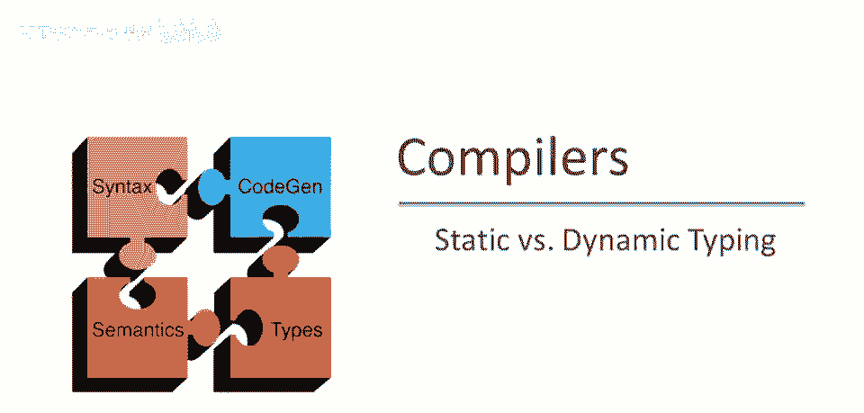
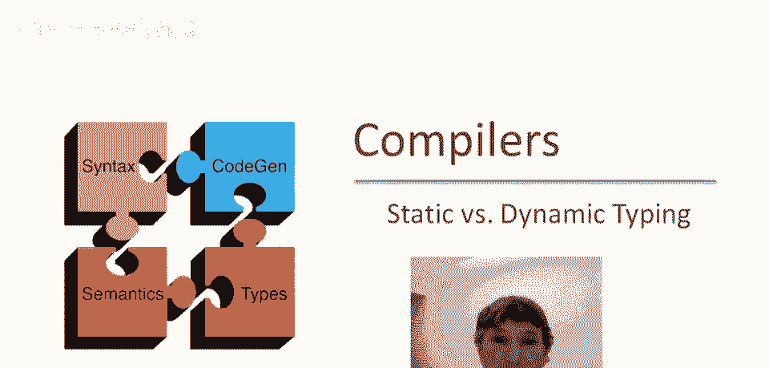
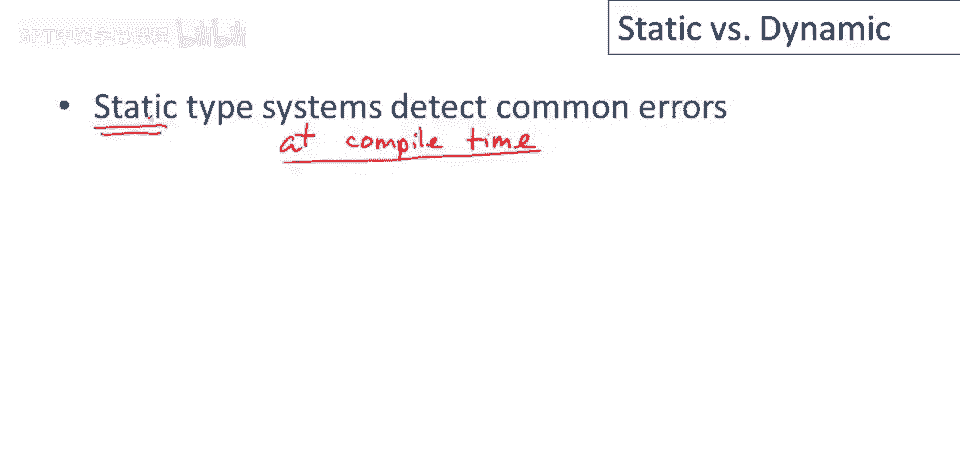
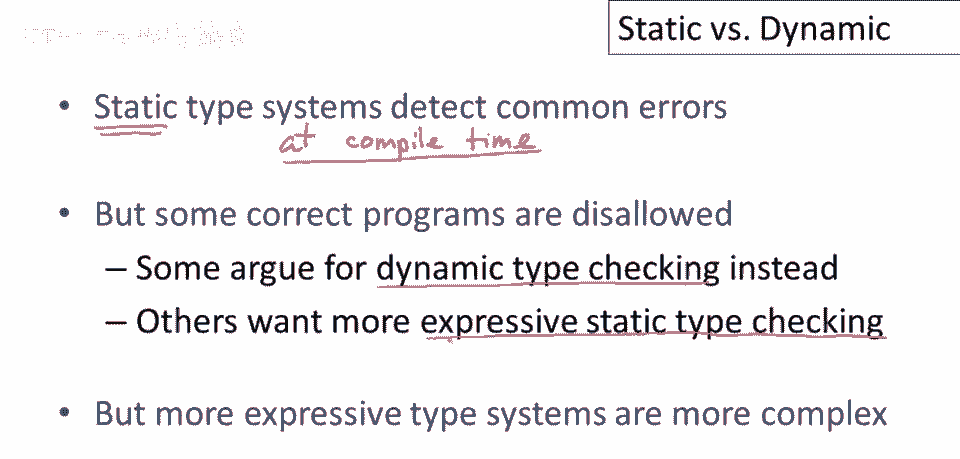
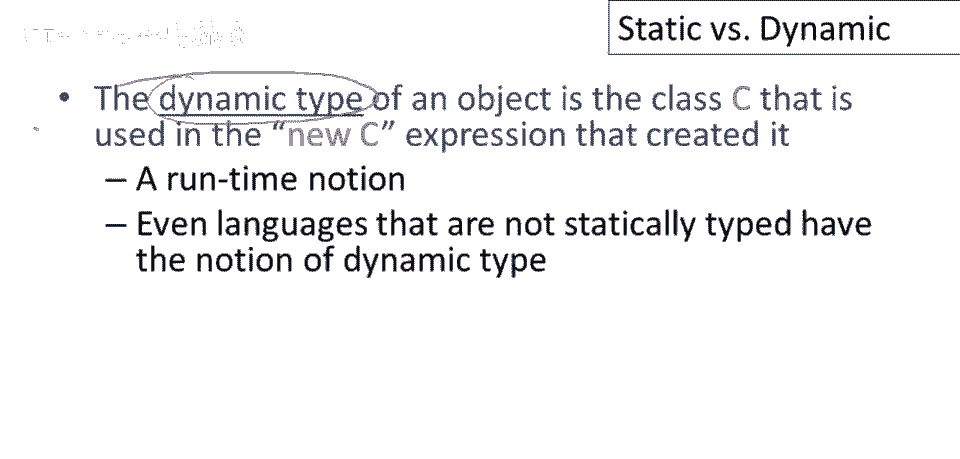
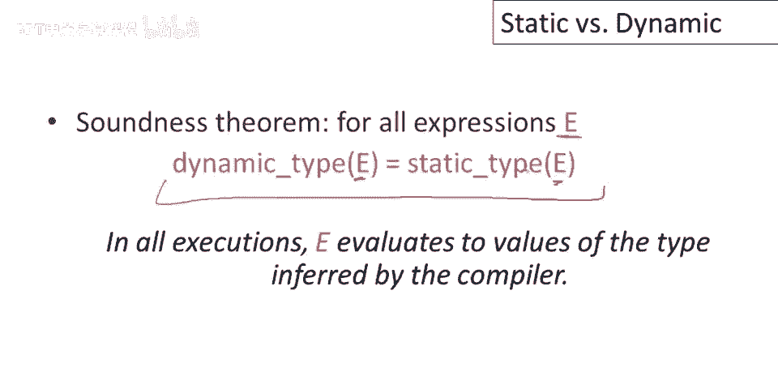
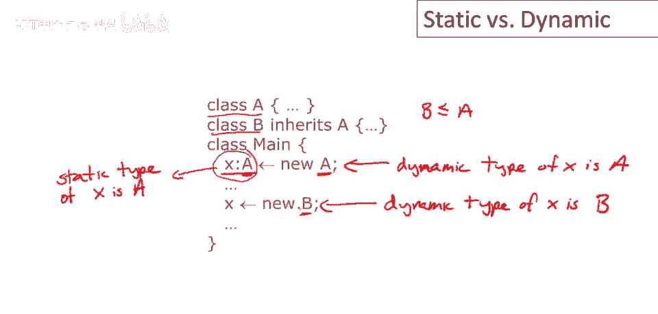
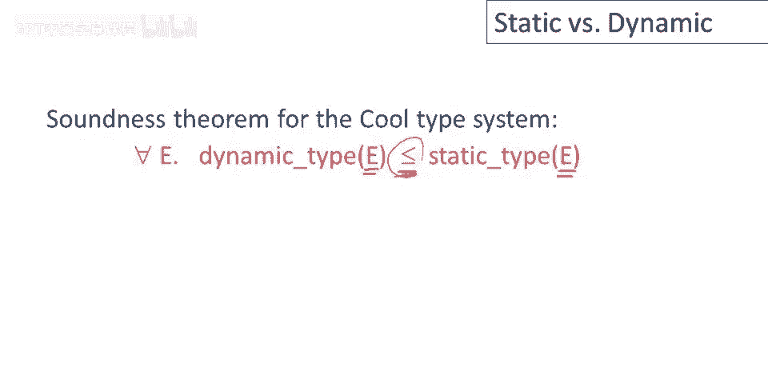
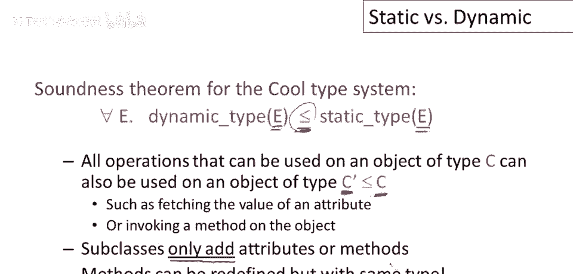

# 【编译原理 CS143 】斯坦福—中英字幕 - P50：p50 10-01-_Static_vs._Dynam - 加加zero - BV1Mb42177J7

本视频中，将讨论静态类型与动态类型。

一种考虑类型系统目的美学方法是防止常见编程错误，它们在编译时做到这一点，因此它们在程序编译时做到这一点，特别是它们在不了解程序任何输入的情况下做到这一点，因此唯一可用的就是程序文本。

这就是为什么我们称它们为静态的，因为它们不涉及任何动态行为。

程序的实际执行行为，现在，任何正确类型系统，任何真正做对事的静态类型系统，将不得不禁止一些正确程序，它不能在编译时完全精确地推理，关于程序运行时可能发生的一切，这意味着一些正确程序，我指的是。

一些实际上会正确运行的程序，如果执行它们将被类型检查器禁止，有人主张动态类型检查，这是程序运行时进行的类型检查，因此，在运行时，我们检查实际操作是否合适，对于程序执行时出现的数据，其他人说，问题在于。

类型系统不够表达力，我们应该开发更复杂的静态类型检查系统，随着时间的推移，两个阵营都有了很大发展，我们看到了许多新的动态类型检查语言出现，现代脚本语言，如语言和领域特定语言，其他人。

我一直在研究更复杂的类型系统，实际上静态检查方面已经取得了很大进展，更表达丰富的静态类型检查系统的缺点是，它们确实倾向于变得更复杂，不过，并非所有人开发的功能都已进入主流语言。

现在讨论中一个重要观点是存在两种不同的类型概念，有动态类型，那是类型，我们谈论的对象或值在运行时实际具有的类型。

然后是静态类型，编译时概念，类型检查器知道关于对象的信息，静态类型和动态类型之间必须存在某种关系，如果静态类型检查器要正确，这种关系可以通过某种定理正式化，证明如下，我们想了解的是对于每个表达式e。

对于你能在编程语言中编写的每个程序表达式e，静态类型，编译器说表达式的类型，等于表达式的动态类型，另一种说法是，如果你实际运行程序，那么得到的结果与静态类型检查器预期的结果一致。

静态类型检查器实际上能够正确预测，运行时将出现的值，实际上，在编程语言的早期，这些正是我们对语言中简单类型系统的定理。

那时，现在对于像Cool这样的语言，情况有点复杂，让我们看看一个典型Cool程序的执行，这里有两个类，类A和继承自A的类B，所以B是A的子类型，我们这样写，这里声明了x的类型为A，这是x的静态类型。

x的静态类型是A，这是编译器对x的值所知道的信息，然后当我们执行这行代码时，我们可以看到我们给x分配了一个新的A对象，它是新的并不重要，重要的是，它是一个A对象，所以在这个点上x的动态类型也是A。

这行代码实际上执行时，A，被声明为具有静态类型A，实际上包含一个A类对象，但在这行代码稍后，动态类型实际上不同，这里的x的动态类型将是B，好的，当这行代码执行时x持有B对象，尽管它被声明为具有不同类型。

这是一个非常重要的区别要记住，所以有一个静态类型，编译器知道的一种类型，它是恒定的x的类型是A，它总是类型A，x的所有使用，在整个x的作用域内，都由编译器用类A类型，但在运行时，因为我们有赋值。

我们可以给x分配不同的对象，x实际上可以具有不同类型和不同的运行时类型，这是一个类型为A的对象，这是一个被分配给x的类或类型B的对象，当程序执行时。

这意味着，Cool类型系统的正确性定理，比简单类型系统的定理更复杂，在子类型存在的情况下，尽管，我们想要的是属性，对于一个给定的表达式，E将是一个正确的预测器，所有可能的动态类型，他可能会拥有。

通过使用子类型关系，所以无论动态类型e可能是什么。

运行时可以采取的所有类型，还须能用于任何c'对象，c的子类，定义了属性方法，c'中所有属性和方法都要有，因此子类只能添加属性方法，所以子类将有的属性方法与c、c'相同，在这种情况下，这些都是。

除了c已有的，c'还有，子类不会移除属性或方法，只会扩展或添加继承类的属性和方法，注意，你可以在酷炫且大多数面向对象语言中重定义方法，但你不能改变类型，即使你可以重定义与该方法相关的代码。

它仍需根据你声明的原始类型进行类型检查，因此，方法在首次定义的类中具有的任何类型，它将在所有子类中具有相同的类型，相同的参数，以及方法参数的相同类型，和方法结果的相同类型在所有子类中。

这是许多面向对象语言的一个相当标准的设点。

