# 【编译原理 CS143 】斯坦福—中英字幕 - P51：p51 10-02-_Self_Type - 加加zero - BV1Mb42177J7

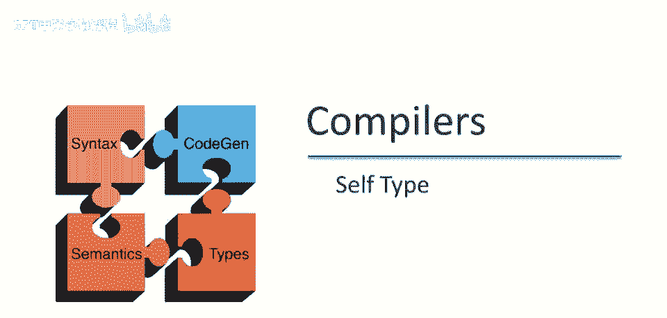

在上个视频中，我们讨论了静态和动态类型之间的区别，以及静态类型中越来越具表现力的类型系统的趋势，在这节课中，我们将讨论自类型，这将让你感受到那些更具表现力的类型系统的样子。

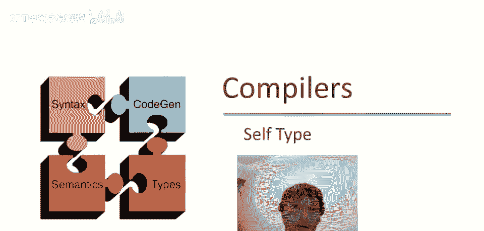

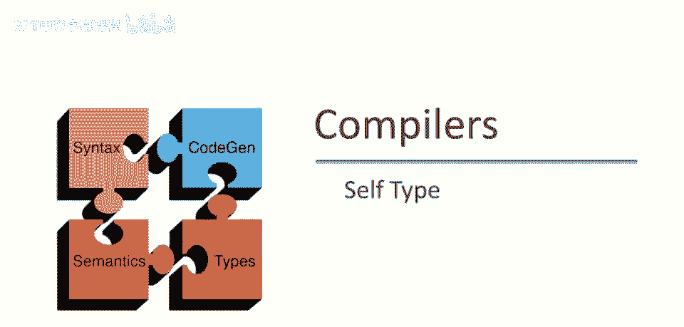

首先，让我们通过查看一个简单的类定义来激励自类型解决的问题，所以这里我们有一个计数类，它有一个字段，I，它是一个整数，初始化为零，它有一个increment方法，本质上，计数类只是增加了一个计数器。

所以当你分配一个新的计数对象时，计数器为零，然后每次你调用ink，计数器值增加一，请注意，这可以被视为一个提供计数功能的基类，所以每当我想为特定目的使用计数器时，我可以定义一个新的子类，继承自计数。

该子类将自动继承ink方法，从而允许我拥有计数器而不必重新实现代码，在这种情况下，代码量非常，非常小，但通常，你可以想象有一个实现了一些复杂或需要大量代码的类，能够重用它在子类中是有用的。

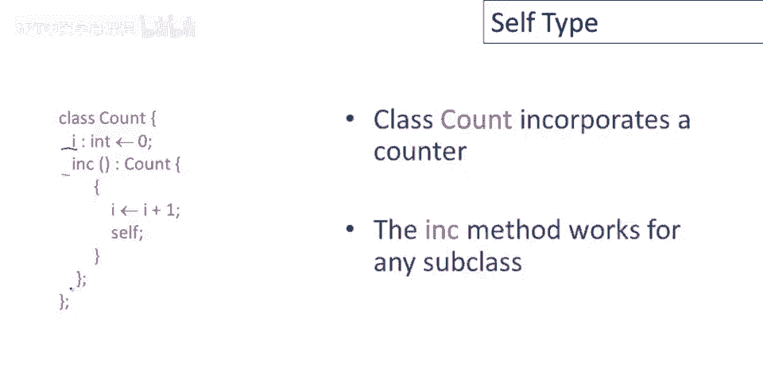

现在考虑一个我们可能想要定义的计数子类，叫做库存，假设我们正在实现一个仓库会计程序，并且我们想跟踪不同种类的库存物品的数量，所以我们定义一个新的类，库存继承自计数。

现在我们将有一个新的字段在这里使这个对象，这个类不同于它的父类，将只有一个名称，对应库存中的物品名称，现在在这里我们可以实际使用这个，我们可以声明，分配一个新的库存对象，我们创建一个新的对象。

我们增加它来表示我们有库存中的一件东西，然后将其分配给我们声明的库存类型的某个变量，然后稍后我们可以像使用a对象一样使用它，但现在的问题是，这段代码实际上不会类型检查，这段代码中有类型错误。

为什么是这样呢？让我们思考一分钟，所以ink的签名是什么？所以记得ink被声明为返回计数类型的东西，当ink方法被库存类继承时，这个签名不会改变，它仍然返回计数类型的东西，这里有一个新的股票对象。

我们调用增量方法，但整个东西类型是计数，然后尝试将其分配给股票，但那不起作用，因为计数不是股票的子类型，股票类型的变量不能持有计数类型的值，因此类型系统将在赋值语句处报告错误。

你可以看到这实际上是一个严重问题，因为它使增量方法的继承变得相当无用，我可以定义新的股票子类，但我永远无法在它们上使用增量方法，至少在不得到父类型返回值的情况下，所以它不是。

增量方法的继承不如人们所希望的那么有用。

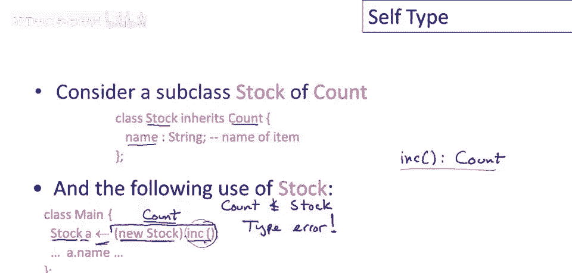

所以只是回顾一下，新的股票，增量后的新股票，动态类型为股票，实际上将返回一个股票对象，好的，所以不要在这里混淆，这是动态类型，我在谈论，当我们分配新的股票对象时，然后我们调用增量方法。

记住增量方法返回self，所以增量方法实现如下，我将省略类型，但它是i得到i加1，然后它返回了self对象，所以它肯定返回传递给这里的任何对象，所以它返回动态类型为股票的东西，所以这个程序实际上会运行。

如果你没有类型检查，你可以实际运行这个，它将会正常工作，这将产生一个动态股票对象，并将它存储到股票变量中，但它类型不正确，因为类型检查器失去了跟踪这是一个股票对象的事实。

它只知道增量被声明为返回类型计数，这当然正确，因为每个股票对象也是一个计数对象，但在这段代码的上下文中它并不实用，因此类型检查器丢失了信息，这使得尝试从一开始就将增量方法放入账户类中并不愉快。

为了解决这个问题。

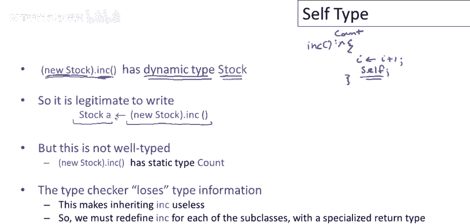

我们将研究扩展类型系统，我们将研究扩展类型系统，见解是增量方法返回self，在这种情况下，增量方法实际返回self对象，因此返回值将具有与self相同的类型，无论self是什么，可能是计数。

也可能是计数的任何子类型，因此，self对象只需动态地持有某个值，它是self参数声明的类型的子类型，因此它可以是任何子类型。

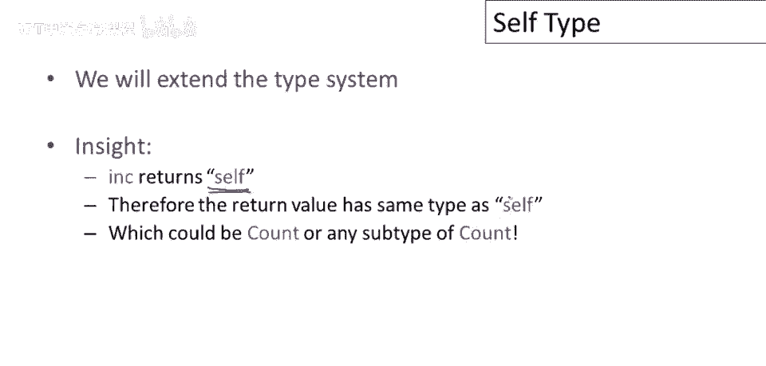

在这种count类的情形下，为此，实际上需要引入一个新关键字：self类型，它将用于作为此类函数返回值的类型返回，我们需要修改类型规则。

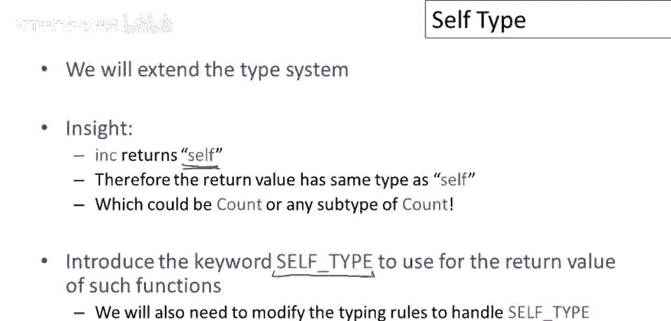

以处理这种新型类型，self类型的想法是它将允许类型改变，当继承ink时，或允许我们推理实际返回类型如何动态变化，当继承增量方法时，因此我们更改了ink的声明如下，现在声明返回类型为自身类型。

意味着增量方法的返回值具有，原始self参数的类型，当我们这样做时，现在我们可以看到这是可能的，我们没有，我们还没有说如何做到这一点，但你应该能够看到直观上是有意义的，我们可以证明以下形式的事实，因此。

当self参数具有类型计数，记住我们派发的是，但称为墨迹的是self参数，所以当我们派发到计数对象，我们得到类型为count的东西，当我们派发到股票对象时，当我们调用股票对象的increment，嗯。

self的类型是什么，类型是股票，我们得到类型为股票的东西，现在，我们之前的这个程序加上这个改变，类型正确，将被酷的类型系统接受。

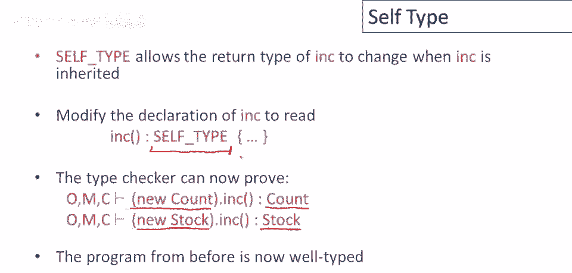

现在，记住self类型不是一个动态类型非常重要，它非常像是一个静态类型，是静态类型系统的一部分，同样重要的是要认识到self类型不是一个类名，所以，与酷的所有其他静态类型不同，它不是类的名字。

它是自己特殊的东西，我们将在未来的视频中更多地谈论它到底是什么，如我们所见，使类型检查器接受更多正确程序。

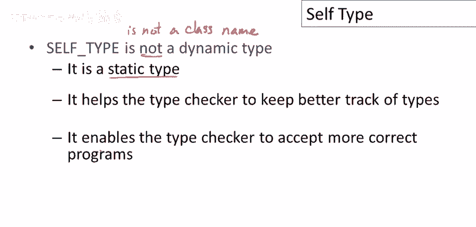

实质上，self类型增强了类型系统的表达能力。

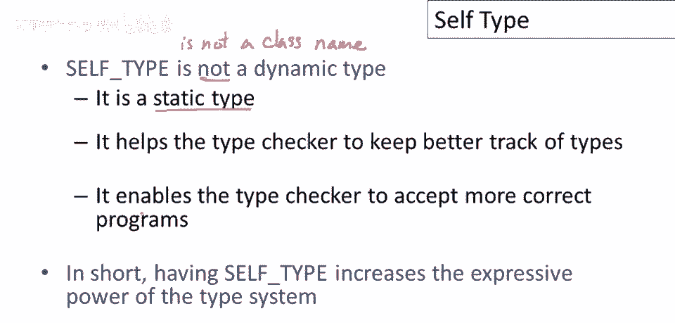