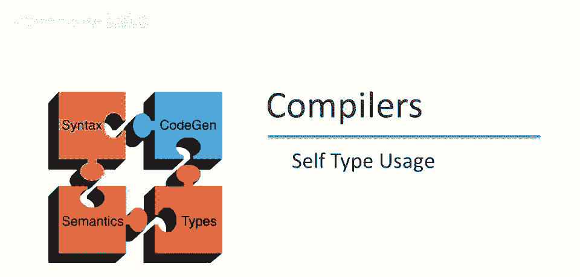
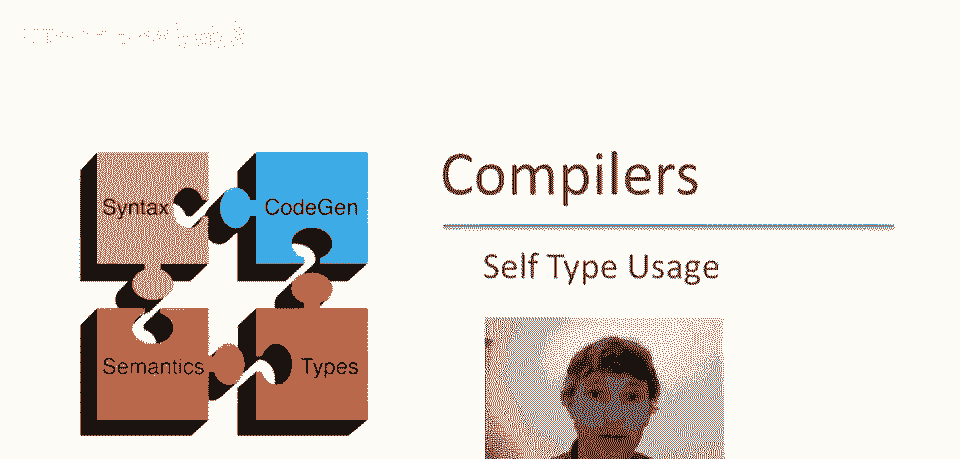
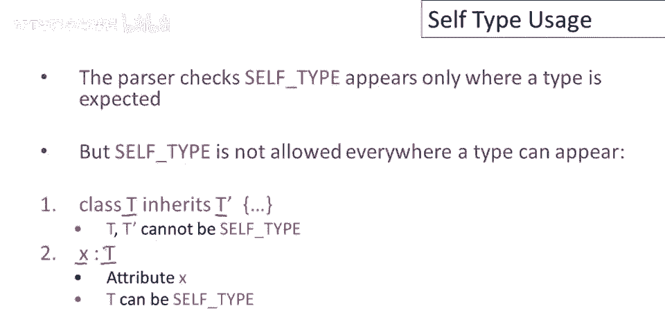
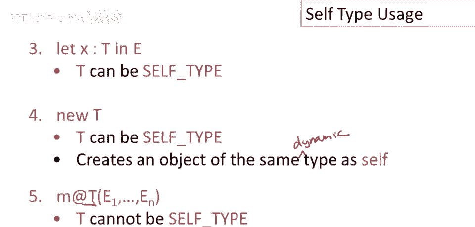

# 【编译原理 CS143 】斯坦福—中英字幕 - P53：p53 10-04-_Self_Type_Usage - 加加zero - BV1Mb42177J7

本视频介绍了自类型操作，接下来将讨论自类型在酷炫中的应用。

解析器检查自类型仅在允许类型的地方出现，但实际上这有点过于宽松，有些地方可以出现其他类型，但自类型不行，因此，本视频的目的就是讲解自类型的各种使用规则，让我们从一条非常简单的规则开始。

自类型不是一个类名，因此不能出现在类定义中，既不能是类的名称，也不能是继承的类，在属性声明中，属性的类型，t为自类型是可以的，因此，声明为自类型的属性是可以的。

类类型的属性，同样，自类型的局部let绑定变量是可以的，分配新的自类型对象是可以的，并且，实际上，它会分配一个具有与self对象相同动态类型的对象，因此，self对象的类型是什么。

运行时不一定与包含类的类型相同，新的t操作将创建该动态类型的新对象，美学调度中命名的类型不能是自类型，因为它必须是一个实际的类名。

最后让我们考虑方法定义，这是一个非常简单的方法定义，有一个形式参数x，类型为t，方法返回一些类型为t prime的东西，现在发现只有t prime，只有返回类型可以是自类型，没有参数类型可以是自类型。

让我们以两种不同的方式看看为什么，为什么这必须是这种情况，我们都会做，因为这实际上很重要，让我们考虑对这个方法的调度，假设我们有一些表达式e，并调用方法m，我们有一些参数e prime。

假设参数e prime的类型为t zero，如果你还记得方法调用的规则，t zero必须是要传递的类型的子类型，我们将传递这个，因此，无论x被声明为什么类型，这里必须是实际参数类型的超类型。

这意味着t zero必须是，现在假设参数可以是自类型，那么t zero必须要是自类型的子类型，这是类c中的某个方法，记住我们说过这是始终为假，你不能在右边有self类型，左边有常规类型。

因为这会导致问题，这会，我们永远无法证明，一般来说，一个类型实际上是self类型的子类型，因为self类型可以遍历类c的所有子类型，所以这是一种看法，我们不能允许方法参数为self类型。

但仅仅考虑执行代码或一些示例代码也很有帮助，看看会发生什么，所以这是一个例子，让我带你走过，如果我们允许参数具有self类型会发生什么，有两个类定义，类a有一个比较方法comp。

它接受一个self类型的参数，并返回一个布尔值，这里的想法是，比较操作可能比较这个参数与参数，并返回真或假，然后有一个第二个类b，b是a的子类型，继承自a，它有一个新的字段b，一个小b这里。

类型为int，现在类b中的比较函数被覆盖，它与类a中的比较函数或comp函数具有相同的签名，但方法体这里访问了字段b，现在让我们看看，使用这两个类的代码会发生什么，所以这里x将被声明为类型a。

但我们将分配给它一些类型为b的东西，这里注意静态类型将是a，动态类型将是b，这实际上是问题的关键，现在我们在x上调用cup方法，并传递给它一个新的a对象，那么会发生什么，类型检查是好的，因为x属于类a。

x的类型是a，这个参数的类型也是a，如果self类型，如果有一个参数类型为，Self类型是有用的，它必须工作，对于这个例子，其中两个静态类型，调用的参数和形式参数的，显然必须允许。

如果我们允许self类型作为参数的类型，现在让我们想想当它实际执行时会发生什么，将调用方法，b类的comp方法，好的，因为x是动态类型b，然后它将接收参数，并将访问其b字段。

但参数是动态类型a且无b字段，实际上这将导致运行时崩溃，所以再回顾一次，确保这里清楚，过剩类型a，但动态类型b，参数静态类型a，动态类型a，当此方法被调用时，动态类型a的参数，没有操作。

类b的所有字段和方法。

