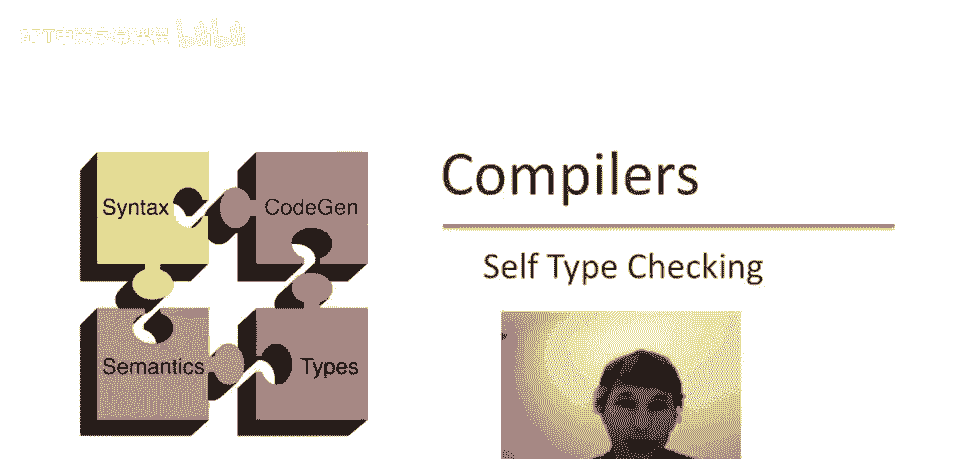
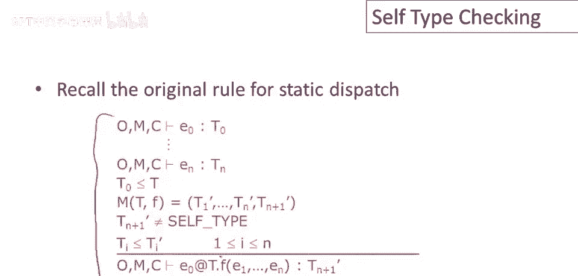

# 【编译原理 CS143 】斯坦福—中英字幕 - P54：p54 10-05-_Self_Type_Checki - 加加zero - BV1Mb42177J7

本视频中，将用所学自类型，将自类型融入cool类型检查规则。

首先回顾cool类型检查规则实际证明，类型逻辑中的句子像这样，它们证明某些表达式具有某些类型，在对象标识符具有由o给出的类型假设下，方法具有由m给出的签名和包含类，e所在的当前类。

我们在其中进行类型检查是类c，此额外部分的原因，我们之前没讨论过，为何需要这个c，因为self类型含义取决于包含类，回忆下我们引入self类型子c表示，特定self类型s出现，环境中的c正是那个下标。

跟踪我们在哪个类，所以看到self类型出现。

我们知道谈论哪种self类型，现在准备好给出使用self类型的类型规则，大体上，这很简单，因为规则保持不变，它们看起来一样，但实际上略有不同，因为它们使用了之前定义的新子类型和最小上界操作，例如。

这是赋值规则，这与几周前讨论的赋值规则看起来相同，但注意这种子类型使用，这是包含自类型的子类型扩展定义，现在这条规则也适用于self类型和普通类名。

存在一些规则需要在self类型出现时更改，特别是分发规则需要更新，这是动态分派的旧规则，这条规则这部分实际上没有改变，保持不变，但我想指出，这条规则中的基本限制，是方法返回类型不能是self类型。

实际上这是self类型为我们带来好处的所在，拥有自类型目的在于，实现更丰富的表达能力。

现在需考虑情况，已有自类型和所做工作，若方法返回自类型，如何类型检查，规则如下，通常检查分发表达式，即e0和所有参数，它们在相同环境中类型检查，现在和之前一样查找类t0，表达式e的类型，零，方法f。

获取其签名，然后必须检查参数是否一致，每个实际参数，E1到E n，其类型与方法签名中的相应形式参数兼容，如果这些都成功，那么可以说，此分发将具有类型，哦，看零，那么那来自哪里呢，返回类型是自身类型。

因此，此整个分发的结果将是，e零的类型，e零是自参数，无论我们为e零得到了什么类型，这都是整个表达式的有效静态类型，整个表达式的结果类型，我们仅用e零类型作为整体类型。

嗯，静态作为整体动态分发，回忆函数的正式参数不能有self类型，但实际参数可以有self类型，扩展子类型关系将处理该情况，非常好，一个有趣细节是分发表达式本身可以有self类型，我指什么？让我们想想。

呃，零和呃，分发到方法定义，如果e零是self类型，如果我们能证明e零是self类型，问题是需要在m环境中查找，在方法环境中，在某个类中，方法f的定义或签名，我们必须获取该类型签名。

以便我们可以进行其余的类型检查，若e零为自身类型，通常用e零类型查找，这里用哪种类型？若整个操作在类c中，若我们有，若在类c中类型检查，我就把行放那，这样安全，这是self类型子c，和往常一样。

替换子类c的自类型为c是安全的，因此我们只需使用类c，当前正在类型检查的类以查找方法名f。

对于静态分发，我们也要做类似的变化，这是静态分发的原始规则，这部分规则不会改变，嗯，这处理方法返回类型不是自类型的情形。

但如果方法返回类型是自类型，那么规则看起来有点不同，所以，嗯，我们再次类型检查，检查要分派的表达式，以及整个表达式环境中所有参数，但我们必须检查要分派的类，类型t0是类，在静态分发中命名的类的子类型。

嗯，我们需要查找方法，它必须在静态分发的类中存在，因此我们必须在类t中查找，方法f并获取其签名，然后我们必须检查实际参数是否符合形式参数的类型，参数类型匹配，类型，形式参数声明的类型。

然后关于这个规则有点奇怪的地方，结果是t0再次，为什么这是正确的。

它可以是t，它可以是我们静态分派的类型，这不是因为自类型是self参数的类型，即使我们正在类t中分派到一个方法，self参数仍然具有类型t0，我们称t0是t的子类型。

因此我们使用静态分发来达到一个方法定义，可能被子类中覆盖的方法隐藏，但这不会改变self参数的类型，self参数仍然具有类型t0，即使我们正在运行t0的超类中的方法，有两个关于自类型的新规则。

一个涉及self对象，因此self对象具有类型self types of c，注意这是我们需要知道包含类的地方，因此我们知道我们指的是哪种自类型，类似地，对于分配某种类型的自类型也有规则。

因此表达式new self type也产生具有类型self type sub c的东西，总结一下这段视频，这里有一些关于在自类型存在的情况下实现类型检查的评论，结束，首先。

扩展子类型和最小上界操作能做很多工作，如果你以我们做的方式扩展子类型和最小上界，那么很多规则就不必改变，大部分情况下，你不需要为自类型做任何特殊处理，自类型只能在语言中很少的几个地方使用。

由你来检查它没有在其他任何地方使用，这些限制必须仔细遵守。

最后，大部分情况下，自类型的使用总是指当前类的任何子类型，类型检查中有一例外，在分发中，有一个方法查找，我们在某个类中查找，看方法f，该方法可能有一个返回类型，自类型，这里的类c可能与当前类无关。

我们在这里分发到另一个类，无论当前类是什么，这个特定的自类型指的是该类中的自类型，进行查找的类，不是我们检查类型的任何类，幸运的是，我们永远不需要将该self类型与当前类中的任何self类型进行比较。

因此，不同类型的self类型之间没有交叉，再说一次，这是类型检查规则中唯一查看self类型的地方，这不是当前类中的一个。

总结我们关于self类型的讨论，Self类型仍然是一个研究想法，它为类型系统增加了更多的表达能力，我认为这很容易看到，主流语言中无自类型，自类型本身，我认为不重要，除非你要实现的工程，相反。

包含自类型的原因是展示类型检查可以很微妙，不仅仅是int加int等于int，实际上有相当复杂的东西和相当复杂的推理，实践中类型检查内部在进行，当然类型系统的复杂性和表达能力之间需要平衡，更复杂。

类型系统更难学，使用起来也更困难，但能编写更多程序。

