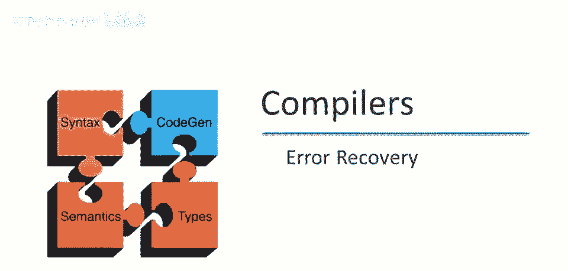
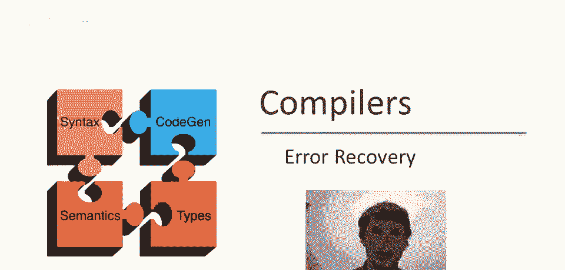
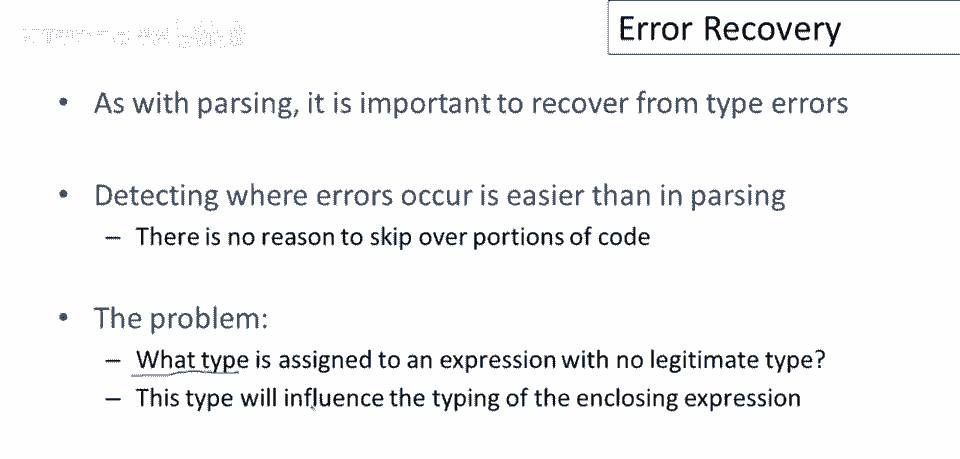
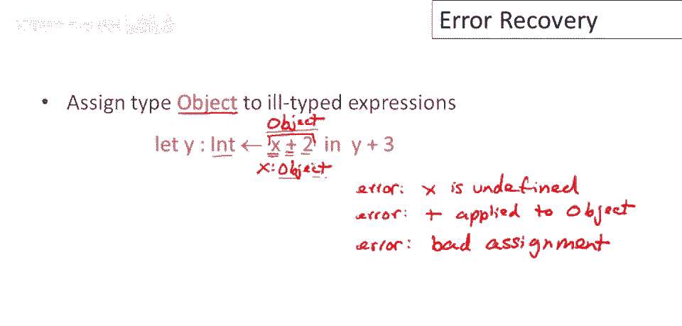
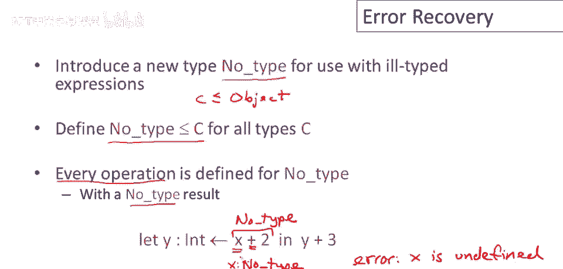
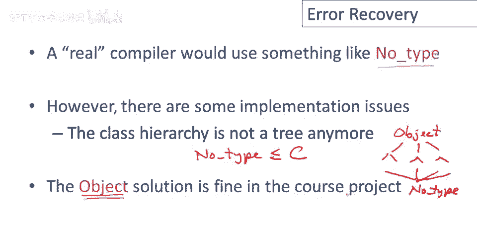

# 【编译原理 CS143 】斯坦福—中英字幕 - P55：p55 10-06-_Error_Recovery - 加加zero - BV1Mb42177J7

本视频中，我们将结束关于类型检查的系列，讨论如何从类型错误中恢复。

与所有前端阶段如伸缩和解析一样，从类型检查中恢复错误很重要，但与解析不同，从类型检查器中恢复错误要容易得多，因为我们已经有了抽象语法树，因此无需跳过代码的部分，就像我们在解析之前所做的那样。

在知道程序的结构存在问题之前，尽管，应该给无合法类型的表达式分配什么类型，类型检查器通过结构归纳工作，它不能只是卡住，因此，如果我们发现某个子表达式，没有我们可以有意义地赋予它的类型。

我们仍然必须对它做些什么，以便我们可以类型检查，围绕它的所有表达式，一种可能性是简单地分配类型对象作为任何错误类型表达式的类型。

这里的直觉是，即使我们无法确定表达式的类型应该是什么，可以肯定的是，它是某种子类型对象，因此，将任何表达式分配类型对象肯定是安全的，因此，让我们考虑这种策略在简单代码片段中的应用。

所以这里我们有一段小代码，我们假设这里x未定义，实际上代码中有一个错误，那就是x没有绑定，所以x没有任何类型，那么当我们类型检查这个时会发生什么，我们将递归地向下遍历抽象语法树，最终我们会到达叶子。

并尝试类型检查x，然后我们会发现x没有任何地方有类型，这将导致一个错误消息，说x未定义，然后为了继续类型检查以恢复，我们将不得不分配exotype，因此，我们将假设x的类型为对象。

因为那是我们的恢复策略，然后我们将继续类型检查，当我们向上遍历抽象语法树时，接下来我们将尝试类型检查这个加法操作，我们将看到我们正在将类型为对象的东西添加到整数，当然，加法不适用于类型为对象的东西。

因此我们将得到一个错误，类似于加法应用于对象，然后我们现在必须决定，既然我们不能类型检查这个，加法，那么x加二的类型是什么，因此，整个子表达式，当然，我们的恢复策略是，好吧，那也有类型对象， 。

现在抽象语法树中的下一个部分是这里的初始化赋值，我们将y赋值为这个表达式的结果，但我们无法类型检查这个表达式，所以它具有对象类型，现在，类型检查器看到，我们将类型为对象的东西赋值给类型为int的东西。

我们得到了第三个错误，说我们有一种错误的赋值，所以这里的问题是这种简单的恢复策略奏效，如果我们恢复，我们继续类型检查，但一个错误可能引发更多，这是一个可行的解决方案，它，它实现了恢复目标。

但通常会导致连锁错误，一旦有一个类型错误，该类型错误将导致更多，因为对象类型的东西能做不多，代码可能假设更特定类型，这些错误将向上传播至抽象语法树。

不仅导致多个错误，另一种可能是引入新类型，专为错误类型表达式设计的节点类型，无类型并不特殊，不是程序员可用的类型，仅编译器可用，用于错误恢复和类型检查，无类型的特殊性质是，将是其他类型的子类型，所以。

如果你记得对象是相反的，对象是所有类型的超类型，这有坏处，因为对象上定义的方法很少，所以，如果你将类型对象插入到期望其他类型的地方，很可能类型检查不会通过，我们可以通过引入无类型来解决这个问题。

无类型将有特殊属性，即每个操作，每个操作都定义于无类型，此外，我们将说它产生无类型作为结果，所以，语言中任何接受类型参数的操作，无类型，将产生类型结果，无类型，因此节点类型将传播。

现在让我们看看相同的代码片段，让我们分析一下如果我们不使用类型会发生什么，因此我们再次遍历抽象语法树，我们到达这个叶子，X 我们看到X未定义，我们产生一个错误，说x未定义，然后需给x赋类型，因此我们说。

x的类型为，无类型，现在考虑加法操作，现在加法接受类型为，无类型和整数，这样不错，不会报错，被认为是类型正确，结果也为无类型，类型，现在进行赋值，呃，无类型与任何类型不兼容，无类型不是任何类型的子类型。

此赋值也类型正确，该阶段也不会报错，所以你可以看到，节点类型向上传播到抽象语法树，就像对象类型之前一样，但由于无类型是一种特殊类型，仅用于错误恢复，我们可以将其与其他常规类型区分开来。

我们知道不应该在产生第一个错误消息后打印出错误消息。

真正的编译器，生产编译器将使用类似无类型的东西进行错误恢复，但无类型存在实现问题，特别是，无类型是所有其他类的子类型这一事实，意味着类层次结构不再是树，如果你考虑一下，你有一个对象在顶部。

然后有一个树形结构向外分支，但无类型是所有类型的子类型，所以无类型成为底部元素，现在是一个有向无环图，而不是树，这使得实现稍微困难一些，而不是只能使用树算法，现在你必须有，要么为无类型设置特殊情况。

要么做更一般的事情，这只是额外的麻烦，我个人认为不值得为课程项目做，我建议你使用对象解决方案。

