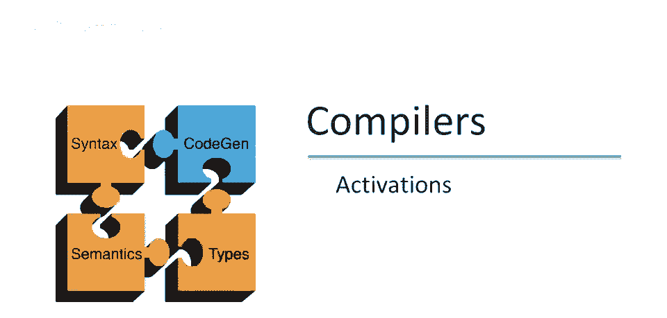
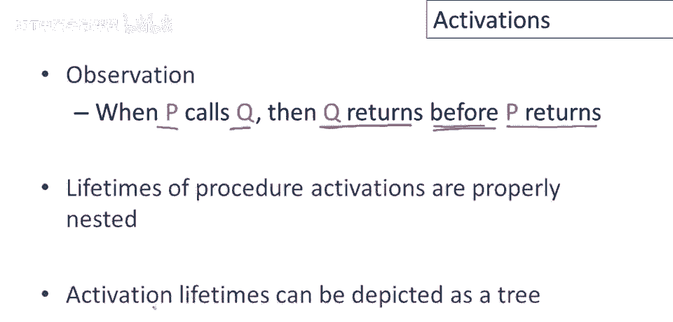
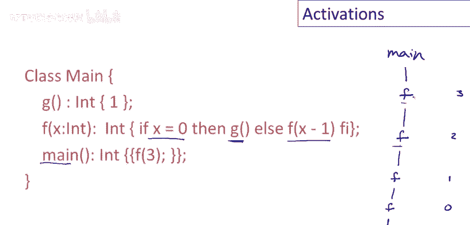
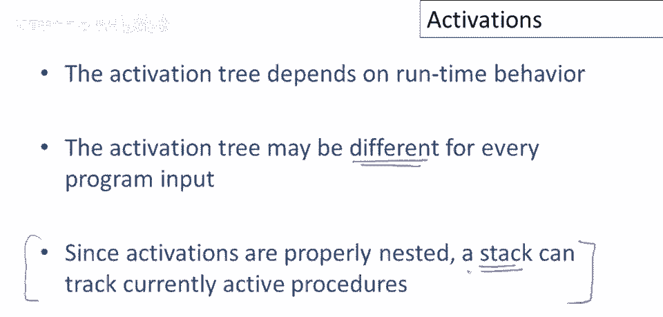

# 【编译原理 CS143 】斯坦福—中英字幕 - P57：p57 11-02-_Activations - 加加zero - BV1Mb42177J7

本视频中，我们将从过程激活的概念开始讨论运行时结构。

在讨论激活之前，明确我们有两个总体目标在代码生成中，一个是正确生成代码，实际上忠实实现程序员的程序，第二个是高效，该代码应充分利用资源，特别是我们经常关心它运行快速，很容易孤立地解决这些问题。

如果我们只关心正确性，生成代码并不难，它非常简单，但也很慢且正确实现程序，如果我们只关心速度，并且我们不关心得到正确答案，问题甚至更容易，我可以生成极快的程序，对任何你关心的问题产生错误答案，因此。

代码生成的所有复杂性都来自于试图同时解决这两个问题，随着时间的推移，已经发展出一个相当复杂的框架，说明如何生成代码和运行时结构，以实现这两个目标，好的，谈论它的第一步是谈论激活。

我们将对生成代码的编程语言类型做出两个假设，第一个假设是执行是顺序的，给定我们执行了一个语句，下一个将被执行的语句，很容易预测，实际上，它只是我们刚刚执行的语句的函数。

因此控制将从程序中的一个点移动到另一个点，遵循某种明确的顺序，第二个假设是当过程被调用时，控制将始终返回调用点后的点，也就是说，如果我执行一个过程，F一旦f完成，执行控制将始终返回调用f的点的下一句。

当然，肯定有违反这些假设的编程语言和编程语言特性，违反假设一的最重要的编程语言类别是那些具有并发性的，因此，在并发程序中，仅仅因为我执行了一个语句，没有，没有简单的方法可以预测下一个将被执行的语句。

因为它可能在完全不同的线程中，呃，对于假设二，呃，高级控制结构，如异常和call cc，如果你碰巧知道什么是call cc，如果违反假设一，一类重要的编程语言是那些具有并发性的，你不做不重要。

影响控制流的结构相当剧烈，也可能违反假设，特别是，如果你熟悉Java和C中的catch和throw异常风格，C++，当我们抛出异常时，异常可能在被捕捉前逃逸多个过程，因此，当你调用一个过程时。

无法保证该过程抛出异常后控制会立即返回过程后的点，本课余下部分将用这些假设，未来视频中会简略讨论如何适应这些高级特性，我们将涵盖的内容是所有实现的基础，即使有并发和异常的语言。

也基于我们将讨论的想法，首先定义，当我们调用过程p时，将称其为过程p的激活，过程p激活的寿命，将是执行过程p所涉及的所有步骤，包括p调用的所有步骤，所以将是所有x，从p被调用至返回的所有语句。

包括所有uh。

p自身调用的函数或过程，我们可以定义变量的类似生命周期，所以变量x的生命周期，将是x被定义的执行部分，这意味着从x首次创建，至被销毁或分配的所有执行步骤，注意，生命周期是动态的，这适用于正在执行的程序。

我们讨论的是变量首次存在的时刻，直到，它消失并超出范围的时刻，另一方面，是一个静态概念，范围指的是程序文本中变量可见的部分，好的，这与变量的生命周期是完全不同的概念，再次，保持这两次很重要。

运行时和编译时发生什么，或与程序静态属性相关，在脑海中区分。

与我们几页前给的假设，我们可以做一个简单观察，即当过程p调用过程q时，然后q将在p返回之前返回，这意味着过程的生命周期将正确嵌套，此外，这意味着我们可以。

用简单例子说明激活，这是一个很酷的程序，和往常一样，它将通过执行，主类中的main方法开始运行，对于这个程序，第一个激活，和激活树的根是main方法，main将调用方法g，g的生存期，g存在的指令集。

将在main的执行期间适当包含，因此，我们可以通过使g成为main的子节点，来表明这一事实，表明main调用g，并且g的生存期，完全包含在main的生存期内，g返回后，main将调用f，因此。

f也将是main的子节点，然后f本身将再次调用g，所以它将有一个节点，我有一个g的另一个激活，因此，g也将是f的子节点，这棵树实际上是完整的树，对于这个特定例子说明了若干件事，首先，如我们已经说过的。

它显示了生存期的包含，例如，g的生存期，包含在main内，但它也显示了一些其他有趣的生存期关系，例如，这个g的激活，和那个f的激活的生存期，是完全不交的，因为它们是在树中的兄弟，它们的生存期完全不重叠。

另一个要注意的是，激活树中可以有相同方法的多次出现，所以每次方法被调用，那都是一个单独的激活，所以在这个特定的激活树中，有两个g的激活，这是一个稍微更复杂的例子，嗯，涉及一个递归函数，让我们从这里开始。

在第一次调用处，所以对main的调用，所有main做的就是调用f，带有参数三，所以有一个f的激活，从main，我就在这里做个笔记，关于论点的一边，因为我们需要跟踪那个，所以f被调用三次，显然那不是零。

然后f将被再次调用，参数为二，这将导致f再次被调用，参数为一，最后f将被调用，参数为零，嗯，这将导致对g的调用，这是这个特定程序的激活树，嗯，再次注意，程序的同一运行中可以有多个过程激活。

这仅仅表明同一个过程可以被多次调用，还请注意，递归过程将导致激活的嵌套，相同的函数内部自身，所以你知道f调用自身，因此第二个对f的调用寿命，正确包含在第一个对f的调用寿命内，总结一下我们关于激活的讨论。

嗯，显然，我认为激活树取决于程序的运行行为，所以它取决于运行时值，确切地说，哪些过程被调用，以及激活树最终会变成什么，现在，这没有在我们的例子中说明，但应该明显的是，对于不同的输入，激活树可以不同。

所以我给你看的程序没有输入，所以每次你运行那些程序，你会得到相同的激活树，但一般来说，如果一个程序接受输入，它将以不同的方式执行，并以不同的顺序调用不同的过程，最后，嗯，这里也许是第一个重要的实现观点。

由于激活是正确嵌套的，我们可以使用栈来实现或跟踪当前活动的激活，所以让我们看看如何使用栈来跟踪激活。

嗯，我们将使用我们之前看过的其中一个例子，我要做的是，我将在这里显示激活树，在左边，我将显示当前执行激活的栈在右边，栈不会跟踪整个激活树，它只会跟踪当前运行的激活，所以在程序的每一步。

栈应包含所有当前活动或运行的激活，所以我们已经看到了如何构建树，我们从执行main开始，所以那将是树的根，由于栈应该包含所有当前运行的激活，栈将必须包含main，所以它将以uh开始。

过程main现在调用g，所以g成为main的子节点，在这里，我们将g推入栈中，然后g返回，这意味着g不再运行，所以g将从栈中弹出，然后main过程调用f，所以f将被推入栈中，你可以看到，在g完成之后。

我们可以弹出它，然后我们可以推入f，我们保持不变，即我们有一个当前运行的激活的栈，然后f将调用g，我忘了完成我的树这里，所以main调用f，然后f调用g，好的，所以现在栈在这个点是，Uh。

main f和g，一旦g完成运行，它将从栈中弹出，因为它不再执行，然后f将完成，f也将从栈中弹出，最后main将完成，main也将从栈中弹出，这就是想法，所以这就是我们可以使用栈的方式，本质上。

当一个过程被调用时，将为该过程在栈上推入一个激活，当一个过程返回时，我们将从栈中弹出该激活，由于激活的生命周期正确嵌套，这将奏效，因此，在我们讨论激活的结论中，让我们回到运行时组织，你可能还记得。

我们为程序分配了一块内存，该块的第一部分由程序本身的代码占据，现在，在分配给程序的其余内存中，我们不得不存储程序需要执行的数据，其中一个重要的结构是激活栈，所以通常这将在代码区域之后开始。

栈将向程序内存空间的另一端增长，当过程被调用时，栈将增长，当过程返回时，栈将收缩，正如我们将看到的，数据区还有其他内容。

