# 【编译原理 CS143 】斯坦福—中英字幕 - P58：p58 11-03-_Activation_Recor - 加加zero - BV1Mb42177J7

上期视频中，我们讨论了激活，但从未说过需要保留什么信息，这是本视频的主题。

激活记录是管理过程激活所需的所有信息，这通常也称为帧，与激活记录完全相同，这只是同一事物的两个名称，现在，关于过程激活的一个有趣事实是它们包含的信息比你预期的要多，特别是，当过程f调用过程g时。

g的激活记录实际上不仅包含关于g的信息，而且经常也包含调用函数f的信息，通常，过程的激活记录将包含关于该过程的信息，以及关于调用它的过程的信息。

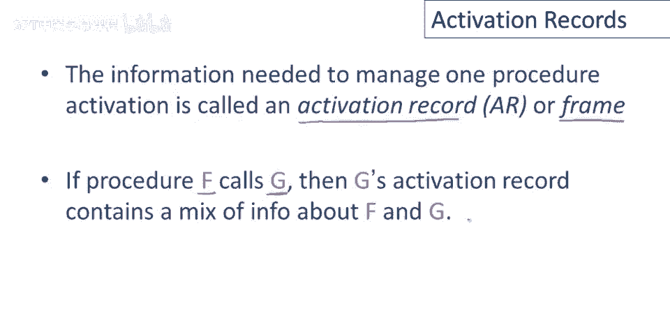

到目前为止，我们还没有说过为什么要保留关于激活的信息，原因是每个过程都有一个与之相关的状态，激活，需要正确执行该过程，我们必须在某处跟踪它，这就是激活记录的作用，它将用于存储正确执行过程所需的信息。

所以让我们更详细地看一下，考虑过程f调用过程g的情况，概念上，当f调用g时，f被暂停，f将在g运行时停止执行，所以g将使用处理器和机器的所有资源，但当g完成时，我们希望再次执行f，f将恢复，所以在中间。

当g运行时，我们必须将过程f的状态，激活保存在某个地方，以便我们正确地恢复它，这又是激活记录的作用，因此，g的激活记录将必须包含信息，这将帮助我们完成g的执行，所以会有一些关于g的信息。

我们只需要运行g，但g的激活记录还必须存储，我们需要能够恢复过程f执行的任何东西。

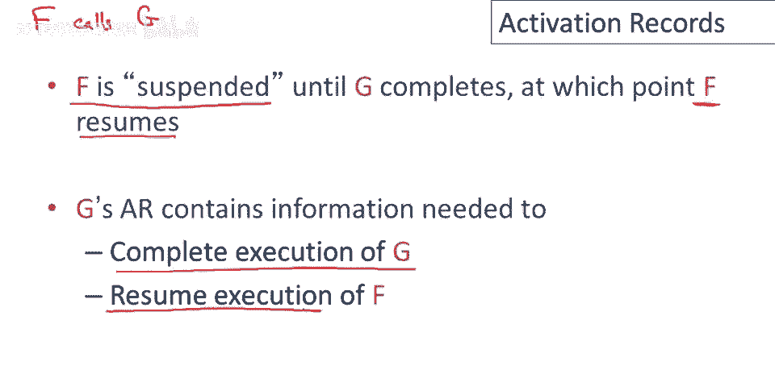

所以让我们通过一个例子，这是我们在上一期视频中看到的一个程序，这是过程f的具体激活记录设计，我们将有一个位置用于f的结果，这将持有f执行完成后返回的值，这里有一个位置用于f的参数，因此f只接受一个参数。

所以只需要一个字来存储函数的参数，将有一个控制链接，指向前一个或调用者的激活，我们还将有一个用于返回地址的插槽，所以是内存中的地址，或我们应在f执行完成后跳转到的指令的地址。

所以现在让我们手动执行这个程序，并计算出栈上的激活记录将是什么样子，所以当程序首次被调用时，它将调用main，将有一个main的激活记录，好的，但我们不会担心那个，我们将专注于f。

所以有一些关于main的东西，但我们不会谈论那个，然后main将调用f好吧，所以当main调用f时，一个激活记录将被推入栈中，你将有四个插槽或四个字段，用于值，那么什么将进入那些呢，第一个插槽用于结果。

嗯，它刚刚开始运行，如果它刚刚开始执行，所以目前那里没有什么可填写的，将在f返回时填充，当f返回时，第二个位置将持有f的参数，所以那将是数字三，第三个插槽将持有控制，所以那将指向main的激活。

第四个位置将持有返回地址，这实际上并不完全简单，因为f在多个地方被调用，所以如果你看程序，main中有对f的调用，f内部也有对f的调用，所以根据函数被调用的位置，在该函数完成后，我们希望返回不同的地址。

在main的情况下，当这个调用f完成时，我们希望返回，调用f后的任何指令，这将是程序执行的结束，因为它是main的退出点，因为在f内部，它将是条件语句的结论，所以这里的双星号将是条件剩下的部分。

然后从f返回，所以根据f被调用的位置，好的，所以在这种情况下，f从main被调用，因此我们将单星地址，I放入激活记录的该位置，好的，然后f被第二次调用，f的主体执行，参数3不是0。

因此我们最终会再次调用f，但这意味着另一个激活记录将被推入堆栈，这也会有四个插槽，它是f的激活记录，如果我应该标记这些，所以这是f的激活，这也是f的激活，这个里面有什么呢？再次，结果，呃。

最初里面没有任何东西，在这种情况下，参数将是2，控制链接在这种情况下将指向f的先前激活，在这种情况下，返回地址将是双星，在两次调用f之后，这就是堆栈将看起来的样子，具有这种特定的激活记录设计。

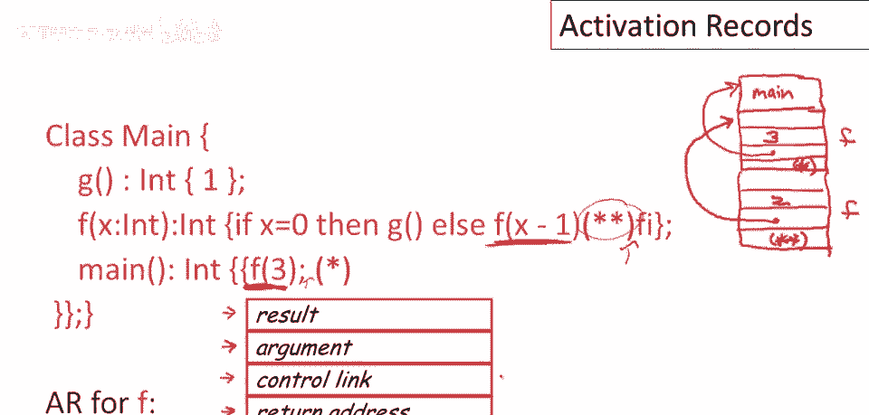

所以这是同一张图片，只是画得更整洁，还有一件事我想指出，即这个激活记录堆栈，让我来区分激活记录，这里不是像你可能在数据结构课上学到的那种抽象堆栈，如果你上过这样的课，所以堆栈上有明确的激活记录。

我们如此对待它们，运行时系统也将如此对待它们，但这也像一个巨大的数组，所有这些数据都只是连续地排列在内存中，这些都是连续的地址，这里有一个激活记录，紧接着在先前激活记录的下一个地址立即之后，编译器。

编译器作者将经常玩技巧来利用，这些激活在内存中相邻的事实，我们将在片刻后看到这样一个潜在技巧，总结一下这个例子的亮点。

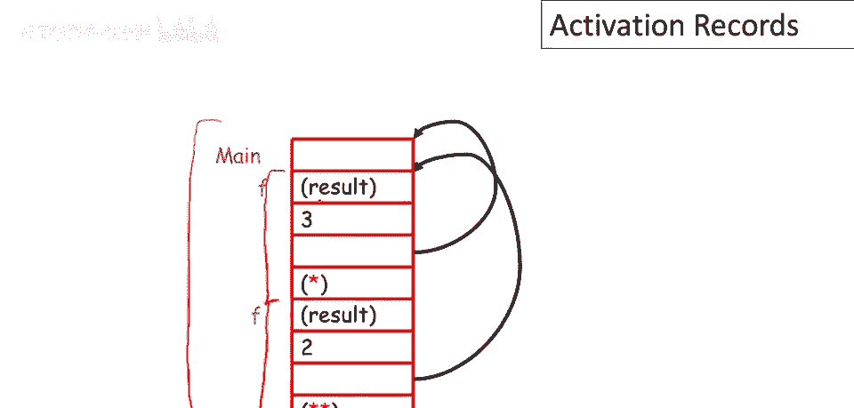

所以到目前为止我想重复，main并不有趣，所以它没有参数或局部变量，并且它的结果从未被使用，因此，虽然它确实有一个激活记录，我们并没有关注那个，我们并不关心，激活记录里面有什么，与什么内容相关。

我们只关注f的激活记录，我只是要确认一下，这很清楚，我在示例中使用的星号和双星号，这些都是内存地址，这些都是实际的内存地址，它们指向代码的地址，这些是调用f后指令的地址，这是f将返回的地方。

最后我想强调这真的只是许多可能激活记录设计中的一种，你可以为f设计不同的激活记录，其中包含不同的信息，这也会很好用，取决于其余代码生成器和运行系统的结构，特别是许多编译器不使用控制链接。

因为它们不需要明确的链接就能找到调用者，调用程序的激活记录，事实上，在你的项目里，酷编译器你不会使用控制链接，大多数激活记录不会在激活记录中包含返回值，因为将其返回在寄存器中会更高效方便，好吧。

所以这只是一种可能的设计，它将会，你可以设计其他激活记录也能正常工作，关于激活记录的重要一点是它只需要包含足够的信息，以使生成的代码能够正确执行，呃，被调用的过程，以及恢复调用程序的执行。

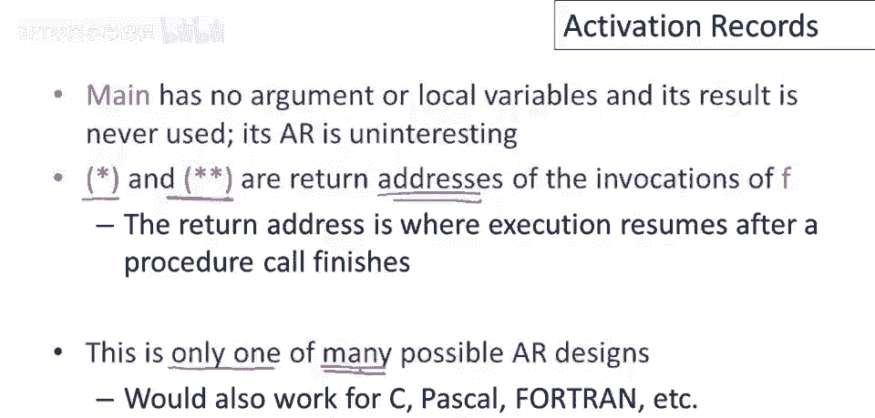

到目前为止我们只看了这个激活记录的程序调用，我们还没有谈论激活返回时会发生什么，所以让我们考虑在我们的例子中会发生什么，在第二次调用f之后，就是这个，这个下面的激活返回，所以会发生什么。

是我们将使调用者，成为当前激活，这实际上将成为栈的顶部，所以我在这里有一个大而粗的绿色箭头，来表示这现在是当前激活，这个上面，好的，所以这是调用，这是谁是调用者，它现在将继续执行，有趣的是要注意。

就像我之前说的，这并不像数据结构课程中的栈那么抽象，这只是一种抽象，虽然已恢复为当前过程，此数据在此处，这个，运行的激活仍在内存中，实际上我们可以查看，我设置这个例子，实际上我们需要。

因为调用过程的结果存储在这里，好的，所以当f再次执行时，它需要查找该结果，以了解被调用过程的结果。

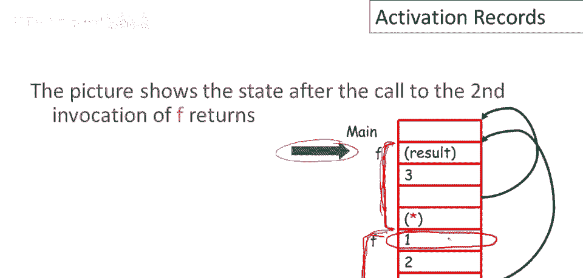

将返回值放在帧首位的优点是，调用者可以从自己的帧固定偏移处找到它。

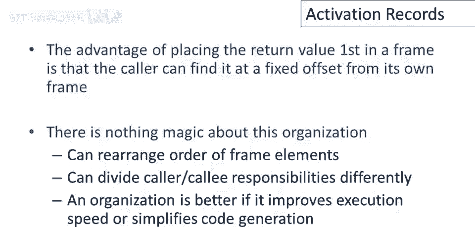

让我们后退并看看，当第二次调用f返回时，第一个调用已恢复执行，这个调用，该调用的代码将知道，此激活记录的大小为4，此激活记录中有4个单词，因此它可以找到被调用过程的结果，在4加1位置和5个单词后。

特别是他们可以找到这个单词，即使这个已从栈中弹出，我之前说过，该数据仍在，至少直到另一个过程被调用，因此，如果我们立即读取函数调用结果，我们可以获取该结果，然后在调用过程继续执行中使用它。

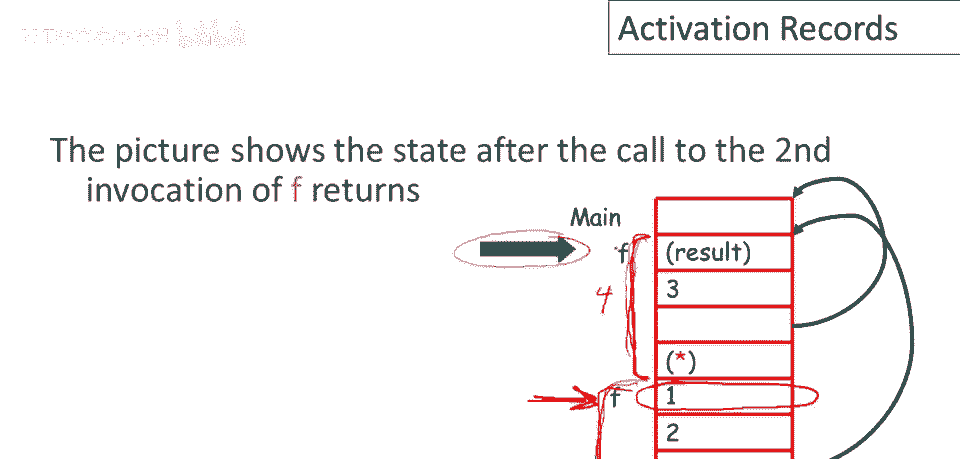

再次强调，我知道我已经说过几次，但组织方式绝对没有魔力，我们可以重新排列帧中元素的顺序，我们可以不同地分配调用者和同事的责任，实际上，唯一的衡量标准是，如果一个组织比另一个更好。

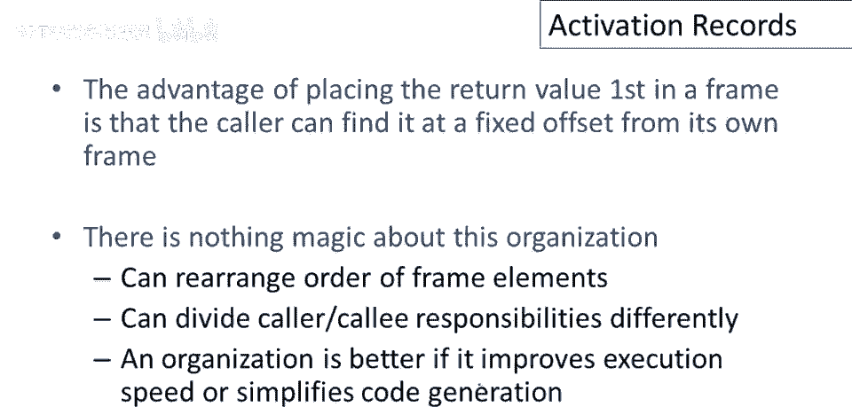

如果它导致更快的代码或更简单的代码生成器，我之前也提到过，但在生产编译器中也是一个重要点，我们将尽可能多地将在帧内容放入寄存器中，特别是，将方法结果和方法参数传递到寄存器中。

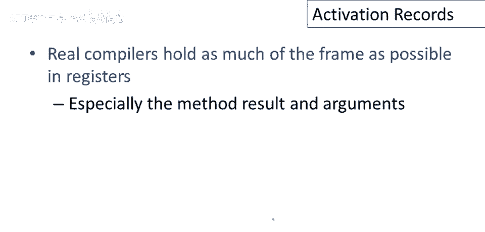

因为这些被频繁访问，最后。

总结我们对激活和激活记录的讨论，问题是编译器必须在编译时确定，好的，这发生在静态布局的激活记录，并且还需要生成正确访问该激活记录位置的代码，这意味着激活记录布局和代码生成器必须一起设计，好的。

所以你不能只设计你的代码生成器，然后后来再决定你的激活记录布局将会是什么，反之亦然，这两件事需要一起设计，因为它们相互依赖。

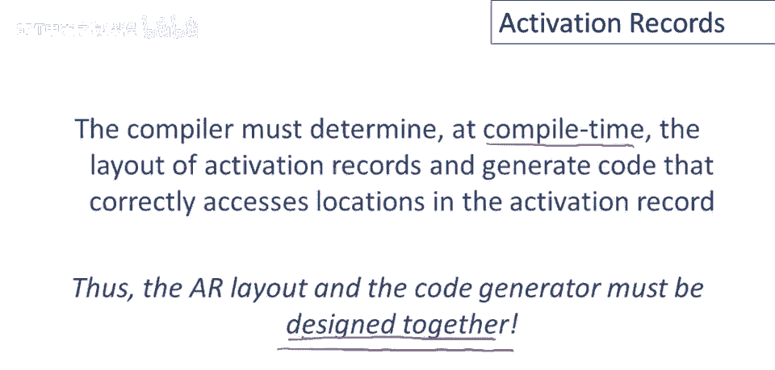