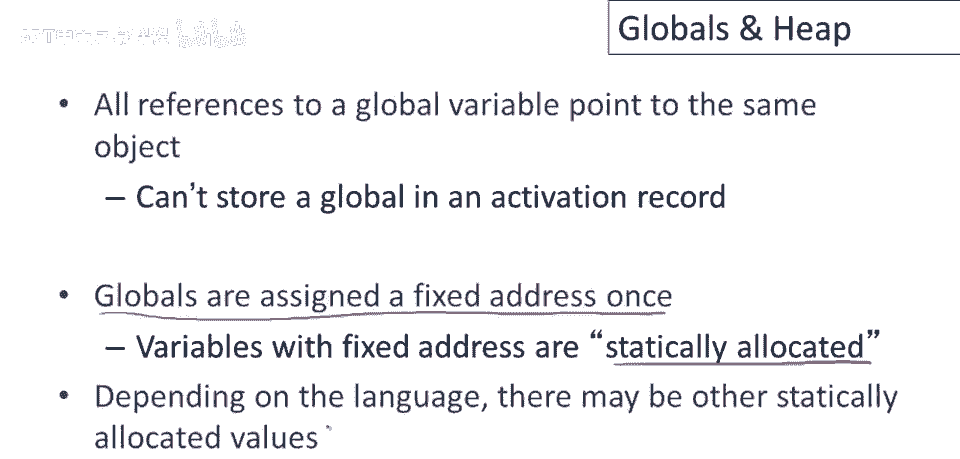
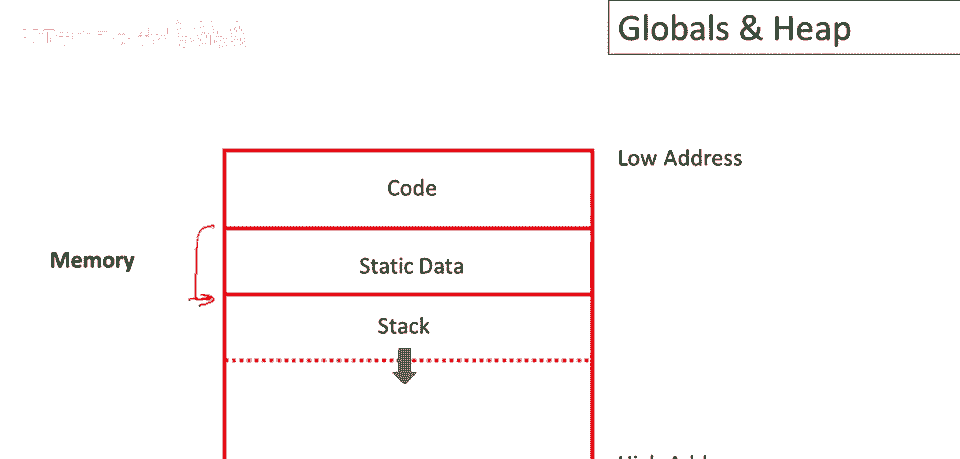
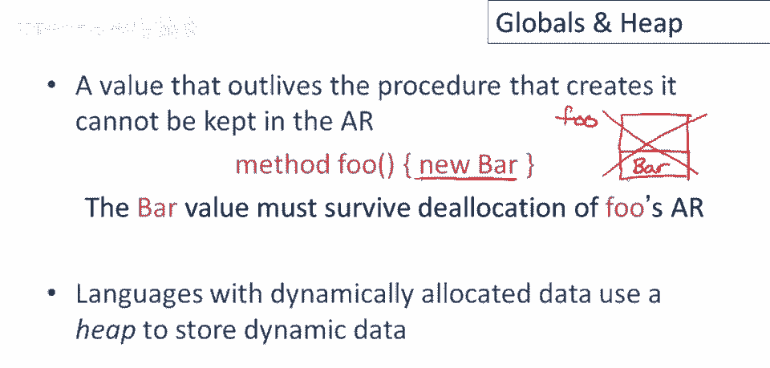
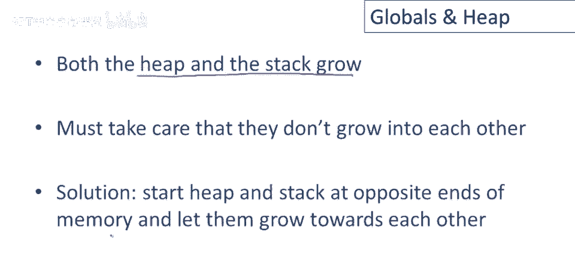
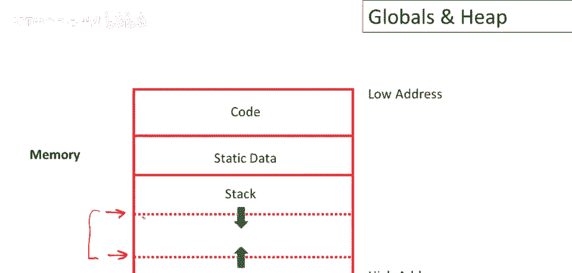

# 【编译原理 CS143 】斯坦福—中英字幕 - P59：p59 11-04-_Globals_and_Heap - 加加zero - BV1Mb42177J7

本视频中，我们将继续讨论运行时组织，通过讨论编译器如何处理全局变量和堆数据结构。

让我们从讨论全局变量开始，全局变量的基本属性是所有引用都指向同一个对象，这就是全球的含义，因此我们不能将全局变量存储在激活记录中，因为激活记录，当然，在激活完成时会释放，那么这将分配我们的全局变量。

因此全局变量的实现方式是所有全局变量都被分配一个固定的地址一次，这些具有固定地址的变量被称为静态分配，因为它们本质上在编译时分配，因此编译器决定它们将生活在何处，然后它们将在程序的所有执行中生活在那里。

取决于语言，可能还有其他静态分配的值，我们实际上稍后会看到一些，但它们的行为与全局变量完全相同。

因此添加全局变量稍微改变了我们的运行时组织图，我们之前有代码，然后紧接着是所有的静态数据，所以这些都是全局变量和其他静态对象，在程序执行期间具有固定地址的东西，然后栈在后面。

因此栈将从静态数据区的末尾开始，并朝着程序分配内存的末尾增长。

现在转向堆，任何比创建它的过程生存时间更长的值也不能存储在激活记录中，让我们看看这个例子，所以这里我们有一个foo过程，让我们看看foo的激活记录或帧，假设foo分配了一个bar对象。

并且我们打算将该对象存储在foo的激活中，现在当这个方法返回时，当然，激活记录将被释放，因此bar对象也会消失，但这在这里不起作用，因为请注意动态分配的对象，我们在foo执行期间分配的对象。

也是foo的结果，因此这必须，这必须对foo的调用者和foo退出后可用，这意味着这个bar对象，嗯，以及所有动态分配的数据都必须存储在激活记录之外的地方，具有动态分配数据的语言通常使用堆来实现这一点。

此时，语言实现需处理不同数据，首先是代码，许多语言，非多数，嗯，许多语言代码固定，只读，编译器创建程序执行所需所有代码，可一次分配，许多语言非如此，运行时可动态创建代码，这些如全局变量，通常为固定大小。

但可能可读写，而非代码，我通常不想能写，栈用于存储每个当前活跃过程的激活记录，激活记录通常为固定大小，每种过程的每个激活记录都有固定大小，将包含所有局部信息，执行特定激活所需的局部变量和临时变量。

堆用于其他所有内容，那么，堆就是存储所有不，属于这些其他类别的数据，如果你熟悉C语言，堆和C由程序员使用，malloc和free管理，Java中有new用于动态，分配数据，然后垃圾回收。

实际上负责回收堆中，这里有点问题，因为堆和栈都在增长，所以我们必须确保它们不会相互增长，不要踩到对方的数据，有一个很好的简单解决方案，从内存的两端开始堆栈，让他们向对方增长。

让我们再次看看运行时组织图并回顾一下，首先我们有代码，然后我们有静态数据，然后我们有堆，它向高地址增长，注意堆不一定会随着过程返回而增长，堆也会缩小，因此，程序运行时，堆会变大变小。

取决于当前运行的过程数，现在堆将从内存的另一端开始向低地址增长，因此，当我们分配对象时将从内存的末尾分配，或从程序分配的内存末尾向上堆栈顶部，如果这两个指针相等，哪两个指针？我们有栈分配指针。

下一个栈帧将分配在哪里，我们有堆分配指针，下一个对象将分配在哪里，如果有另一个动态分配的对象，只要这两个指针不交叉，只要它们永远不会相等，程序就有内存添加另一个栈帧或另一个动态分配的对象。

程序可以继续运行，如果这些指针变得相等，那么程序实际上已经用完内存，在这一点上，运行时系统将终止程序，或尝试从操作系统获取更多内存，或采取其他措施来处理没有更多内存的事实，没有更多的内存。

但只要这两个指针不交叉，注意这种设计允许堆和栈以最适合程序的方式共享这个，数据区域，因此，这种相同的设计，无需任何更改，将适用于需要大量堆和少量栈的程序，以及需要大量栈和少量堆的程序。

以及堆和栈大致平衡的东西，只要它们不超过分配给程序的总内存。

