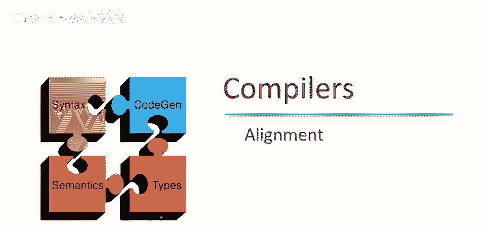
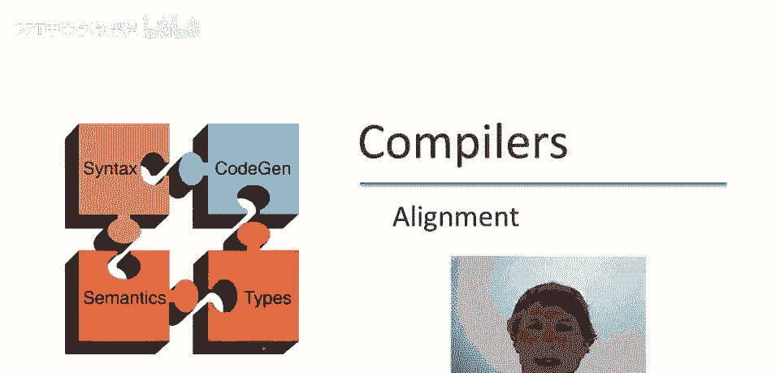
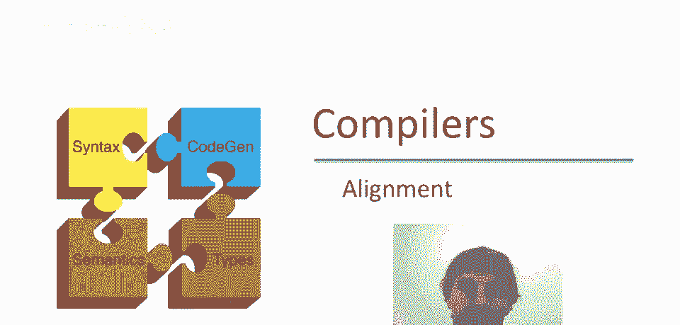
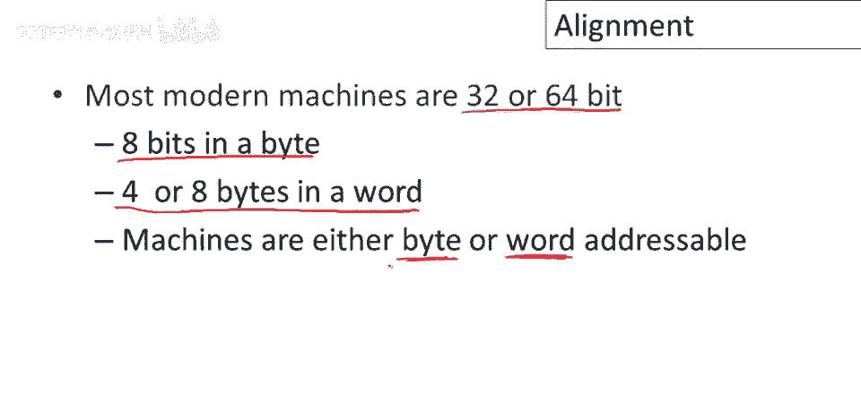
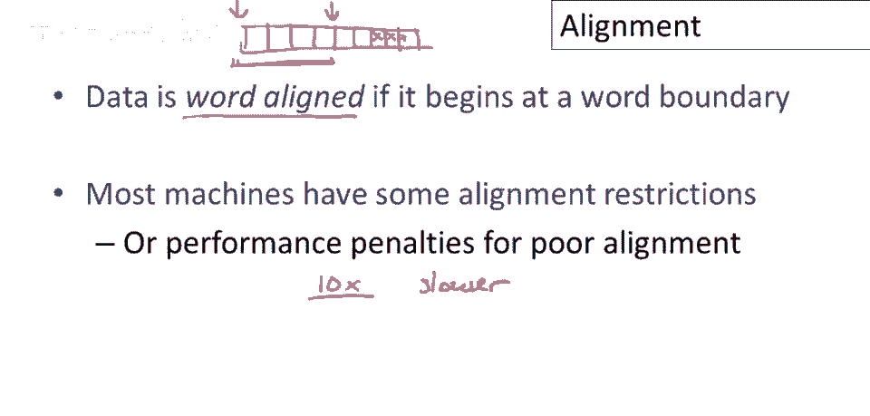
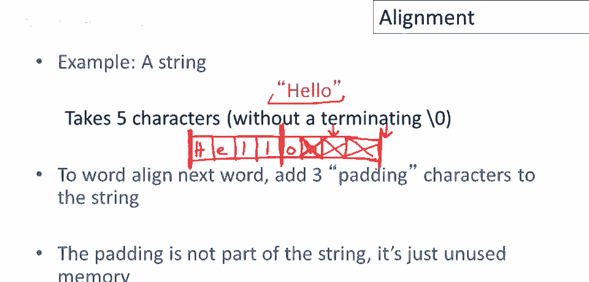

# 【编译原理 CS143 】斯坦福—中英字幕 - P60：p60 11-05-_Alignment - 加加zero - BV1Mb42177J7

在这段视频中，我们将讨论对齐，一个非常低的级别，但机器架构中非常重要的细节。

首先，让我们回顾一下现代机器的一些属性，嗯，目前大多数现代机器都是32位或64位，意味着它们要么是32位要么是64位的字，字实际上被分成更小的单位，我们说一个字节有8位，然后4或8个字节是一个字。

取决于它是32位还是64位机器，另一个重要属性是机器可以是字节或字寻址，意味着在机器的本地语言中，在机器码中，可能只能命名整个字，或者可能以单个字节的粒度引用内存。

我们说数据是字对齐的，如果它从字边界开始，所以如果我们考虑内存中的数据或内存的组织，它被分成字节，假设这是一个32位机器，所以4个字节是一个字，一个字从这里开始，下一个字从这里开始。

那么如果数据分配在字边界上，比如说在这4个字节中，那么这将是一个字对齐的数据块，如果一块数据开始于字的中间，所以比如说，例如，它从这里开始，是的，我们有一些分配在这里的数据，这个数据不是字对齐的。

因为它的开始不在字边界上，重要的是机器有一些对齐限制，这些限制有两种形式，所以有些机器，如果数据没有正确对齐，意味着你尝试引用机器要求的方式没有对齐的数据，那么机器可能无法执行该指令，程序可能会挂起。

甚至机器可能会挂起，但重要的是程序不会正确执行，所以没有正确对齐数据是不正确的，现在有一些机器实际上允许你将数据放在任何你喜欢的地方，但代价是巨大的，所以可能是。

访问字边界对齐的数据比访问非字边界对齐的数据更便宜，而这些性能惩罚往往是巨大的，这些性能惩罚往往是巨大的，访问错位数据可能慢十倍，访问机器偏爱对齐的数据。

让我们看一个数据对齐问题常出现的情况，最常见需要担心对齐的情况之一，是在字符串分配中，假设我们有这个字符串，嗯，字符串，Hello，我们想，嗯，存入内存，所以让我把我们的记忆画成字节序列，好的。

所以我会标记一些字节，假设这是32位机器，让我标出单词边界，嗯，更粗的边界，1，2，3，四，二三四，好的，所以这是单词边界，现在假设我们，我们尝试有对齐的数据，单词对齐的数据。

所以我们将字符串分配在单词边界开始，所以h字符将进入第一个字节，然后e和l，然后 l then o，现在可能有一个终止空，取决于字符串如何实现，但让我们假设我们有，这是一个很好的，呃，字符串的放置。

字符串从单词边界开始，这应该会满足机器的任何对齐限制，现在的问题是，下一个数据项放哪，我们可以在下一个可用字节开始下一个数据项，那很好，如果我们非常关心不浪费内存，但我注意到那个数据项将不会按字对齐。

我们可能会遇到正确性或性能问题，嗯，如果机器有对齐限制，简单的解决方案是简单地跳转到下一个字边界，并分配下一个数据项，下一个单词是什么，从下一个单词边界开始，这两个字节会发生什么，嗯，这些字节只是垃圾。

它们，它们，它们根本不会被使用，程序永远不会引用它们，它们的值无关紧要，因为程序不应该引用它们，这只是未使用的内存，注意如果没有终止零，那么那里会有终止空字符，那么字符串后面会有三个未使用的字节。

所以总结一下，这是处理，嗯，对齐，当你有对齐限制时，数据从边界开始，通常是要求的字边界，而你分配的具体数据长度不是整数，意味着它没有直接结束在下一个要求的边界上，那么你就跳过中间的任何字节以获取数据。

