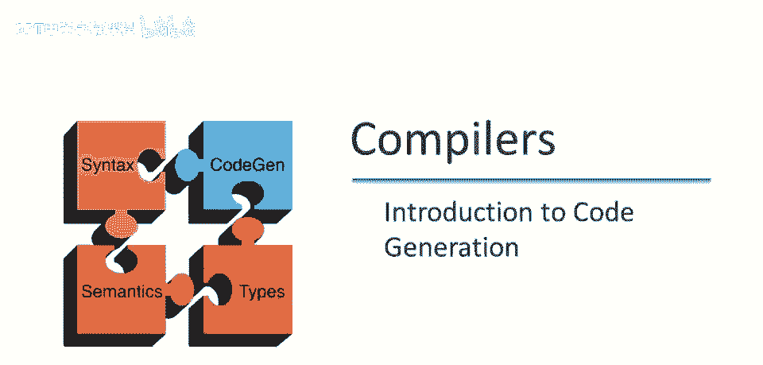
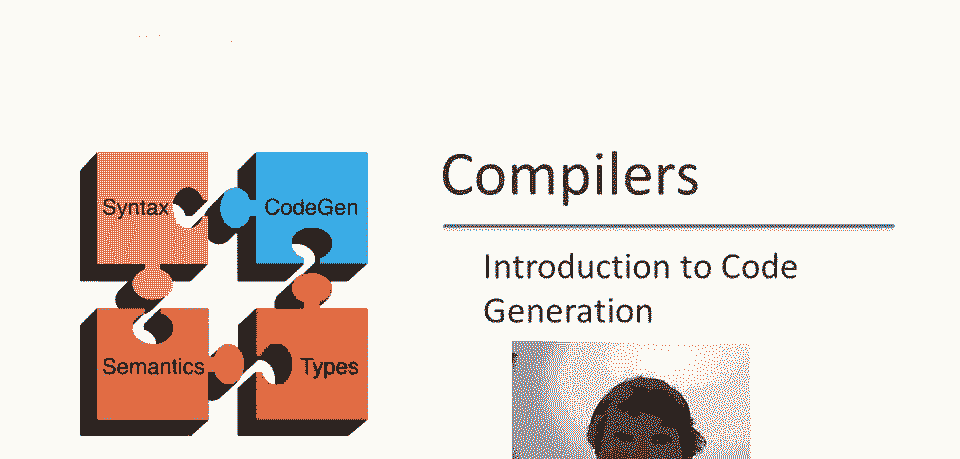
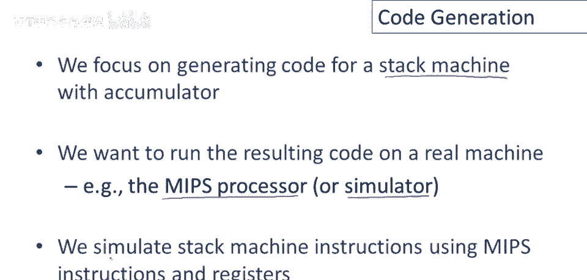
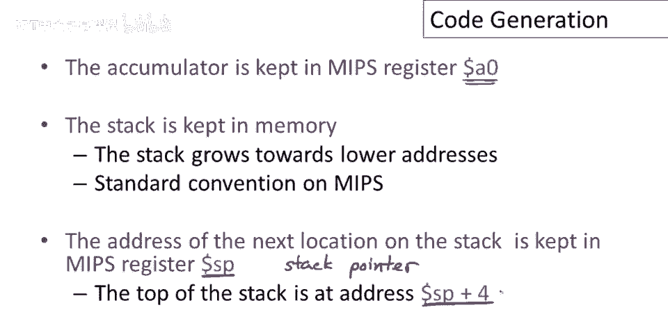
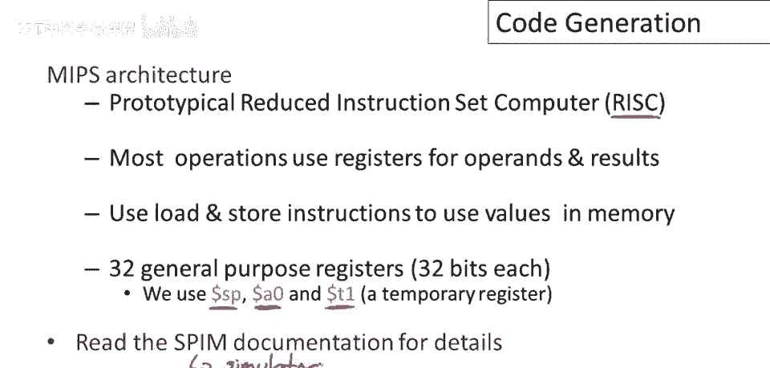

# 【编译原理 CS143 】斯坦福—中英字幕 - P62：p62 12-01-_Introduction_to_ - 加加zero - BV1Mb42177J7

多视频后，运行时，组织与栈机，终于可讨论代码生成。

如前视频所述，将聚焦栈机代码生成，这可能是最简单的策略，通常不产生高效代码，但策略有趣，并非完全不现实，对目的足够复杂，要在真机上运行结果代码，我们将使用mips处理器，特别是使用mips的模拟器。

它几乎可以在任何硬件上运行，这对课程项目将非常方便，基本思想，基本策略将是使用mips模拟栈机。

指令和寄存器，在设计我们的模拟时第一个决定是决定累加器放在哪里，我们将它保存在寄存器中，零，任何寄存器都行，但我们只用零，始终为累加器，栈将保存在内存中，在此指出，当我们谈论一个单寄存器栈机时。

名义上那个寄存器，在这种情况下，零是栈机逻辑栈的顶部，但为了避免术语上的混淆，我将把零称为累加器，和堆栈，所有内存栈上的数据，所以考虑零，累加器与内存中的堆栈区分，MIPS上的堆栈向低地址增长。

这是MIPS的标准惯例，MIPS中堆栈下一个位置的，地址将保存在寄存器sp中，这个寄存器，实际上有一个助记符名称，代表栈指针，通常在MIPS机上，编译器用sp指向栈，栈顶始终在地址p+4处。

记住栈向低地址增长，栈指针中的地址是栈上未分配的下一个位置，栈指针实际上指向未使用的内存，因此栈顶在下一个更高的字地址，即p+4。

MIPS架构相当古老，它于20世纪80年代设计，它是或曾是典型的精简指令集计算机或RISC机，风险机器的理念是使用相对简单的指令集，大多数操作使用寄存器作为操作数和结果。

然后使用加载和存储指令将值移入和移出内存，因此，所有计算主要在寄存器中进行，内存操作主要是加载和存储数据，有三十二个通用寄存器，这是32位机器，我们只会使用其中三个寄存器，我们已经讨论过，SP栈指针。

A零，累加器，我们还需要一个寄存器来存储临时值，因此，像加法和乘法这样的操作，需要两个寄存器来存储操作数，因此，我们将使用累加器来存储其中一个操作数，使用临时寄存器来存储另一个。

在MIPS架构的SPIN文档中，有更多详细信息，SPIN是我们将使用的执行MIPS的模拟器，代码，现在，当然。

为了为MIPS生成代码，也需要一些MIPS指令，我们只需要非常少的指令，五个，实际上，对于我们的第一个例子，它们在这里，我们需要的第一条指令是加载或加载字，它的工作方式是，它取寄存器二中的值。

取寄存器二中的内容，添加一个固定偏移量，这是一个直接嵌入在代码中的数字，作为固定偏移量添加到寄存器二的内容，这是一个内存地址，它将该内存地址的值加载到寄存器一中，加法指令将寄存器二和寄存器三的内容相加。

并将结果存储在寄存器一中，存储操作或存储字操作将寄存器一中的值存储到内存中，因此，它存储在内存地址，内存地址是什么？它是寄存器二中的内容，加上代码中的固定偏移量，以及立即加无符号，将其视为无符号加。

它取寄存器二中的值和一个立即值，因此，这只是一个直接嵌入在代码中的常数，它将该值添加到寄存器二中，并将结果存储在寄存器一中，这里的无符号方面意味着溢出不被检查，我们不会，我们不会检查。

是否生成了一个超出，嗯，范围的数字，嗯，嗯，超出我们能表示的范围，如果有符号数，最后立即加载，只需一个代码中的常数并将其放入，嗯，名为第一个参数的寄存器中，好吧，所以这是我们需要的五个指令。

嗯 做一个非常简单的事例。

所以现在我们可以做我们的第一个程序了，并不意外，它是我们在之前的视频中看过的同一个程序，当我们谈论堆栈机代码时，让我们看看，这里是用我们小小的抽象堆栈机语言编写的加七加五的程序。

现在我们的目标是使用mips指令实现这个程序 所以在这里，在右边，我将列出我们将使用的指令来模拟这个程序，或在mips机器上实现这个程序 好吧，第一条指令是将七加载到累加器中，我们可以使用立即加载来做。

我们将立即加载，值七 a零是我们的累加器寄存器，所以这条指令将七放入累加器，下一个指令我们想将累加器的值推入栈中，我们怎么做呢 嗯，我们必须将值存储到栈上，并记住栈指针指向下一个未使用的内存位置。

所以我们只是直接存储在栈指针指向的位置，就是这样，相对于栈指针的零偏移，累加器的值将值推入栈中，现在为了恢复栈指针指向，下一个未使用位置的不变性，我们必须从栈指针中减去四，好的。

所以这两条指令一起实现了一个推，它们将贝塔值推入栈中，并将栈指针移动到下一个未使用的地址，好吧 现在我们可以做下一个指令了，将五加载到累加器中 嗯。

我们已经知道如何做了 将是立即加载到累加器寄存器a零中，立即值五，现在准备做加法，那怎么工作呢 嗯，首先，我们必须加载栈顶的值，因为第二个参数是从栈顶取的，并且因为mips只能对寄存器中的操作进行操作。

该值需存入寄存器，我们使用临时寄存器，现值距栈指针偏移4，因从栈指针减4，并载入寄存器t1，然后可执行加法，累加器加寄存器t1值，结果存回累加器，最后弹出栈，栈上值处理完毕，如何弹出？仅加4至栈指针。

栈指针回移。

