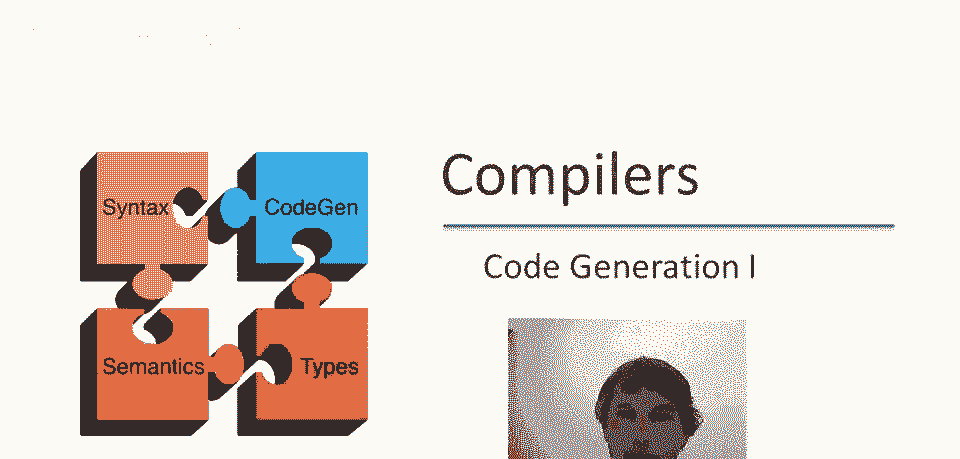
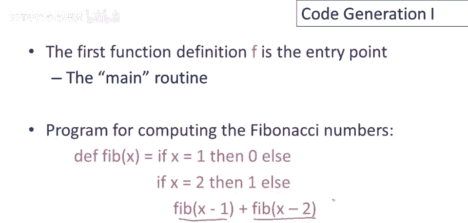
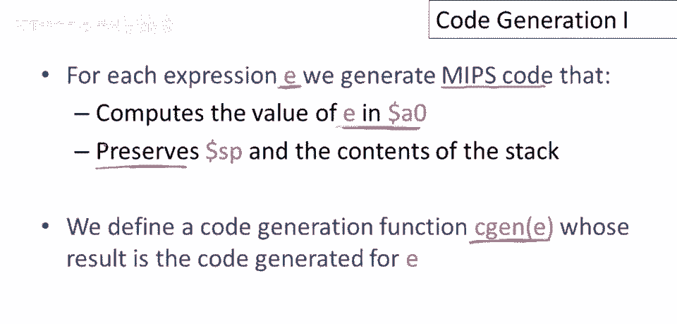
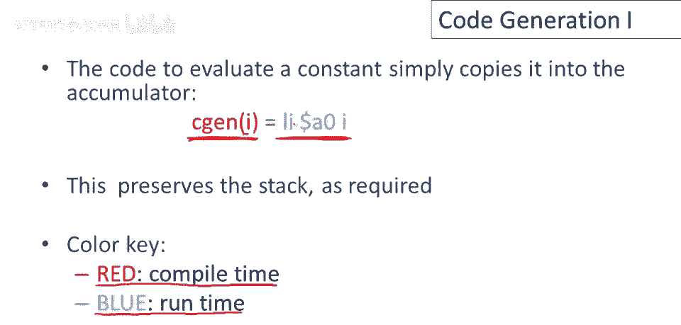
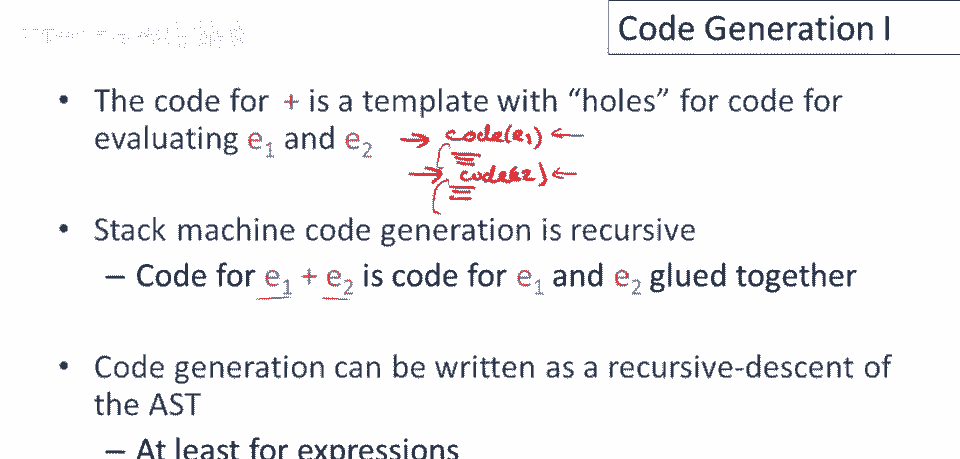
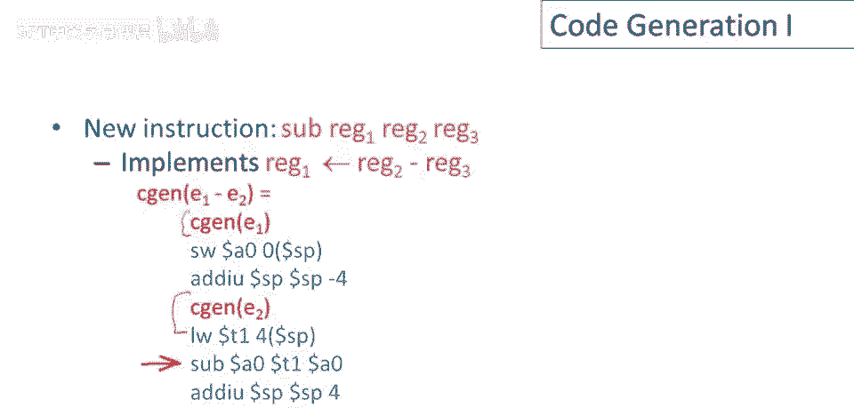
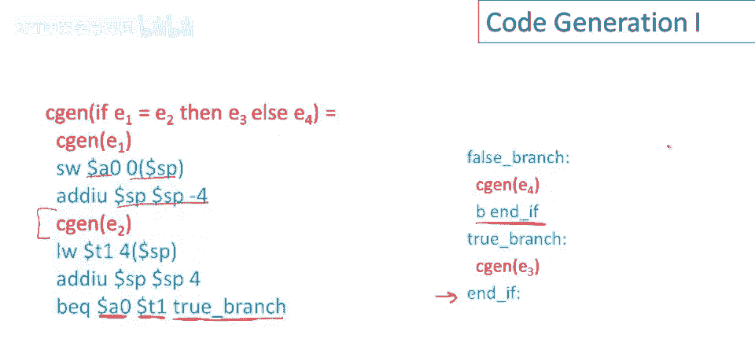

# 【编译原理 CS143 】斯坦福—中英字幕 - P63：p63 12-02-_Code_Generation_ - 加加zero - BV1Mb42177J7

接下来两视频，将研究代码生成，比之前讨论的简单，栈机语言更高级的语言。

这是有整数和整数运算的语言，这是语法，程序由声明列表组成，声明是函数定义，它有函数名，函数接受参数列表，参数只是标识符，函数有一个表达式，这是函数的主体，函数体内看像什么，看起来表达式可以是整数。

标识符，如果-那么-否则，我们只允许整数相等测试，然后是表达式的和，表达式的差和函数调用。

列表中的第一个函数定义是入口点，这是主例程或程序启动时运行的函数，这种语言足够写斐波那契函数，这就是它，只是一个标准定义，如果x是1，结果为0，如果x是2，结果为1。

否则为fib(x-1)和fib(x-2)的和。

现在为这种语言做代码生成，需要为每个表达式e生成代码，需要为每个表达式e产生MIPS代码，完成两件事，首先代码将计算e的值，并将其留在累加器a0中，所以当e的代码完成后，e的值将存储在累加器中，此外。

e的代码，生成的代码将保留栈指针，和栈的内容，这意味着无论栈是什么，当我们开始执行e或e的代码时，栈将在执行完e的代码后完全相同，我们将编写一个代码生成函数，一个c gen of e产生代码，好的。

所以c gen of e是产生程序的东西。

它将完成这两件事，现在我们的代码生成函数，将通过案例工作，我们将会有不同类型的代码，或为每种语言表达式生成的特定代码，因此，要评估一个整数常量表达式，我们只需将该常数加载到累加器中，因此。

对于常量i的代码生成，i是立即加载到累加器的指令，i的值，显然，这保留了所需的栈，因此，这不会修改栈指针，或栈中的内容，因此，栈在指令执行前和执行后完全相同，我还想指出，或我想强调。

这里我将遵循一个惯例，红色表示编译时执行的事情，蓝色表示将在运行时执行的事情，因此，在这种情况下，编译时我们执行函数，C gen of i，这会产生将在运行时运行的代码，好的。

Cn of i是我们在编译时执行的，它产生将在运行时执行的程序，这有助于您在脑海中分离并牢牢掌握，这些程序中真正的时间划分概念，编译器内部发生的事情，然后有推迟的计算，直到我们正在生产的程序实际执行。

好吧现在，让我们看另一个例子，让我们，嗯，让我们考虑两个表达式的相加并思考为它生成的代码，我们要做什么？当我们执行e一加e二时，首先发生的事情是，我们必须计算子表达式的值，我们必须知道要添加的整数。

所以我们最好为e一生成代码，这将在编译时发生，我们肯定会编译时生成该代码，然后一旦我们有了e一的值，嗯，记住我们只有一台单寄存器栈机器，所以我们必须将该值，保存在某个地方，直到我们也知道b二的值。

我们将把它放在哪里？我们将做我们总是做的事情，我们将它放在栈上，因此，e一是，e一的代码，保证e一的代码将e一的值留在累加器中，因此，我们将做的是，在我们评估完一之后，我们将累加器的值存储到栈上。

我们知道如何做到，将恢复的零压入栈，然后必须调整栈指针，然后我们可以为e two生成代码，好的，再说一次，蓝色部分，这是运行时执行的程序部分，这是编译时发生的代码生成调用，好的。

因此我们为e two生成代码，它放在这里，在这段为e one推值的代码之后，一旦我们有了e two的值，现在我们可以执行加法，我们如何做到这一点呢？首先，我们获取e one的值。

因此我们加载栈上的e one的值，注意这是因为e two的代码保证，e two的代码生成保证会保留栈，你知道这里的e two代码，让我暂时离题一下，e two的代码可以非常复杂，这可以是一个完整的程序。

它可以调用函数，你可以分配数据结构，它可以打印东西，它可以做各种复杂的事情，但由于我们拥有这个不变量，所有表达式的代码生成都将保留栈，我们知道无论这个有多复杂，执行多长时间，完成时。

执行栈将处于相同的状态，这就是使我们能够知道，我们存储的e one的值在哪里，它将在栈的顶部，好的，因此我们将e one的值加载回临时寄存器，现在我们可以做加法，好的。

因此我们将t one和a zero相加并存储回累加器，现在我们必须弹出栈，现在注意，这里所有代码都是为e one加e two，当我们完成时，我们建立了两个不变量，e one加e two的值在累加器中。

由这条指令建立，这里的弹出恢复了栈的状态，这里的栈状态与，我们进入这里的代码块时完全一样，为了完全精确，我实际上应该以稍微不同的方式写出这个代码生成函数，它应该是这样的。

所以我们在做的是为e one生成代码，然后我们在文件或其他类似的东西中打印出，执行推的代码，好的，然后生成两个的代码，现在这些代码生成调用也打印到同一文件，好的，所以你知道它们打印出了指令。

无论指令是什么来执行一个，这是打印退出代码，做推送，我们打印做e二的代码，然后打印做ad和pop的代码，是的，ad和pop，好的，这只是为了，你知道这边更冗长，所以我会省略打印，只用蓝色。

指示被推迟的指令，但我希望你能理解这意味着什么，这里所有红色，当然是在编译时完成的，所以你知道，我们正在调用这些编译时代码生成函数，打印语句在编译时执行，然后我们在某个地方，在某种数据结构或文件中。

累积所有将在运行时执行的指令。

所以让我们考虑对这个代码的可能优化，而不是将e一的执行结果推入栈，如果我们将e一的执行结果存储在临时寄存器t一，那代码会是什么样子呢？在那种世界里，为e一加e二生成代码，我们会做什么。

我们为e一生成代码，接下来将是，而不是将结果推入栈，我们会取e一的执行结果，当然它在累加器a零，并将其存储在临时寄存器，然后我们会为e二生成代码，接下来将是e二的代码，然后我们就可以做加法。

我们会取e二的执行结果，它在累加器a零，将其加到t一的值中，并将结果存储回累加器a零，当然这里没有从栈中推入和弹出，所以这段代码保持了栈，而且看起来，它实际上将e一加e二的值放入累加器。

不幸的是这段代码是错误的，所以这实际上是错的，你不应该这样做，要明白为什么，让我们考虑如果，如果e二本身是，实际上让我们举个具体例子，我们做例子，一加二加三，像这样括号，好的，那么会发生什么。

所以e一这里，我们正在做一加二加三，这将是一个立即加载，e一的代码将是立即加载，到数字一的零中，好的，然后我们将有移动，我们将尝试保存该值，我在临时寄存器t一中，现在我们将为e二生成代码，e二是什么？

e二是自身的一个加表达式，因此我们将递归调用代码生成器来生成二的代码，加三，因此我们为新的第一个表达式生成代码，这将是一个立即加载，I到数字二的零中，现在你应该能看到将要出错的地方。

因为既然使用相同的代码生成策略，它也将尝试使用t一持有临时值，所以它将累加器移动到t一，从而覆盖之前子表达式评估的值，数字一，好的，所以该值将被覆盖，然后我们将做加和，和哦，抱歉，我犯了一个错误。

我们不会做加和，让我擦掉忘了为三生成代码，所以现在我们加载三的值，I到累加器中，嗯，现在我们可以做加和，现在进行加和，所以我们做零，t一a零，当你执行这个，你得到什么，你得到二加三，即五，这很好，嗯。

但现在，现在我们有这个子表达式的值，在累加器中，现在我准备好做外层加和，因此产生另一条加法指令，这完全一样，但不幸的是t1的第一个值，我们试图存储的第一个临时变量已被覆盖，那么里面是什么。

此时t1中的值是2而不是1，我们得到1，1加2加3等于7，这不是我们想要的，所以这里的问题是，当然是在嵌套表达式的情况下，特别是同一种类的嵌套表达式，如果表达式试图使用固定的寄存器来存储临时值。

如果你试图为两个不同的表达式生成代码，抱歉，两个同类型的表达式嵌套在里面，它们会踩到彼此的临时中间结果，这就是为什么我们必须使用栈来存储中间值。

所以这个例子说明了代码生成的一些特征，我只想强调几点，首先注意加法的代码实际上是一个模板，其中有为评估e1和e2的代码留出的洞，有一些固定的指令我们会发出，然后有一些地方我们可以直接插入。

e1和e2的代码，好的，这就是我所说的模板，有一些固定的东西，这些是实际执行加法的指令，然后有一个地方我们可以直接插入任意代码，无论是什么，用于实现e1和e2，我们将在其他类型的表达式中看到相同的模式。

另一个重要的一点是栈机代码生成是递归的，也就是说，你知道e1加e2的代码，是e1和e2粘合在一起的代码，递归地我们为e1和e2生成代码，它们将有自己的模板，它们甚至可能是我们刚刚看到的同一种类的表达式。

和，这意味着，代码生成可以写成抽象语法树的递归下降。

至少，呃，对于表达式，好吧，让我们考虑另一个新指令，让我们添加减法指令，这就像加法指令，所以sub只是减去两个寄存器而不是添加它们，代码生成，然后对于减法表达式，正如你所想。

看起来很像加法表达式的代码生成，那么我们有什么，首先我们有一个地方插入e一的代码，然后我们要将e一的值存储在栈上，我们需要记住这个中间结果，然后我们可以去计算e二的值，这里是插入e二代码的地方。

然后最后我们将e一的值加载回一个临时寄存器，实际上执行操作，减法，然后弹出栈，关于这段代码要注意的是它与加法代码完全相同，除了这条指令。

就在这里我们做减法，而不是加法，接下来我们将讨论if then else表达式的代码生成，为此，我们需要一些控制流指令，实际上，我们需要两个，这里是分支相等指令，如果这个标签的两个寄存器内容相等就跳转。

然后我们还需要一个无条件跳转，这个只是做无条件跳转和分支，无条件跳转到特定的汇编指令，现在让我们看看表达式的代码生成。

如果e一等于e二，那么计算三，否则计算e四，首先我们得评估谓词，为了评估谓词，我们首先得评估e一，到现在这个二元操作的模式应该很熟悉了，所以我们评估第一个子表达式，我们将结果保存在栈上。

所以我们将它推入栈，这需要两个操作，一个是将累加器的结果保存在栈上，另一个是移动栈指针，然后我们评估e二，现在我们已经评估了谓词的这两个参数，e二的结果在累加器中，e一的结果在栈顶。

因为e二的评估会保留栈，呃，所以现在我们将e一的值加载回一个临时寄存器，然后我们弹出栈，然后我们可以实际进行比较，所以现在我们做分支相等，所以现在我们做分支相等，如果e1等于抱歉，实际是e2在0的值。

如果等于e1，则转到真分支，好的，否则将通过，如果不等，好的，因此我们称其为假分支，嗯，我们要做什么，如果我们通过，如果测试失败，那么我们要评估e4，这将把e4的值留在累加器中，那将是整个。

如果-那么-否则在谓词为假的情况下，所以当我们完成时，我们现在将转到一些代码，它将清理并结束，如果语句，我们稍后会看到它做了什么，否则，嗯，我们仍然需要实现真分支，因此我们在这里放置真分支的标签。

我们在真分支上做什么，嗯，我们只评估三，好的，然后结束，实际上没有清理要做，因为，e3和e4都保留堆栈，并将它们表达式的结果留在累加器中，我们从e3到达结束if，如果我们执行了真分支。

那么累加器中的值是e3的值，我们通过这条分支到达结束if，如果我们执行了假分支，那么累加器中的值是v4的值，因此这正确实现了和-如果-否则表达式。

