# 【编译原理 CS143 】斯坦福—中英字幕 - P64：p64 12-03-_Code_Generation_ - 加加zero - BV1Mb42177J7

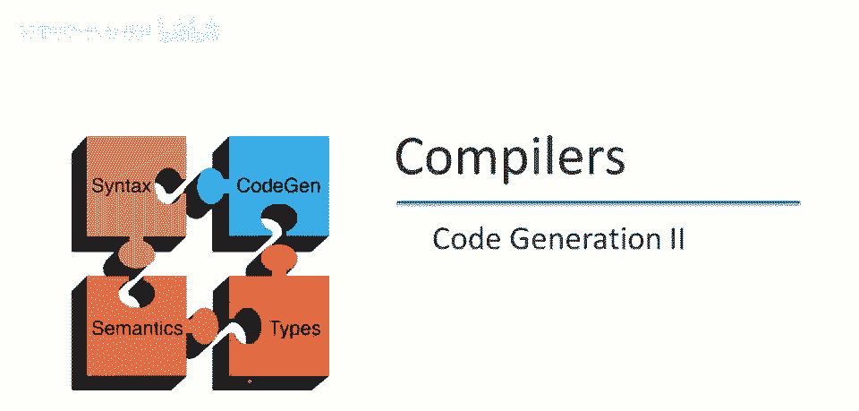

本视频是前一个视频的续集，我们将完成简单语言的代码生成，处理函数调用，函数定义，和变量引用。

为了提醒你我们在做什么，这是简单语言，我们再次有不同种类的表达式，我们上次处理了所有这些，除了变量引用和函数调用，当然，我们还有一个函数定义，如我在介绍中所说。

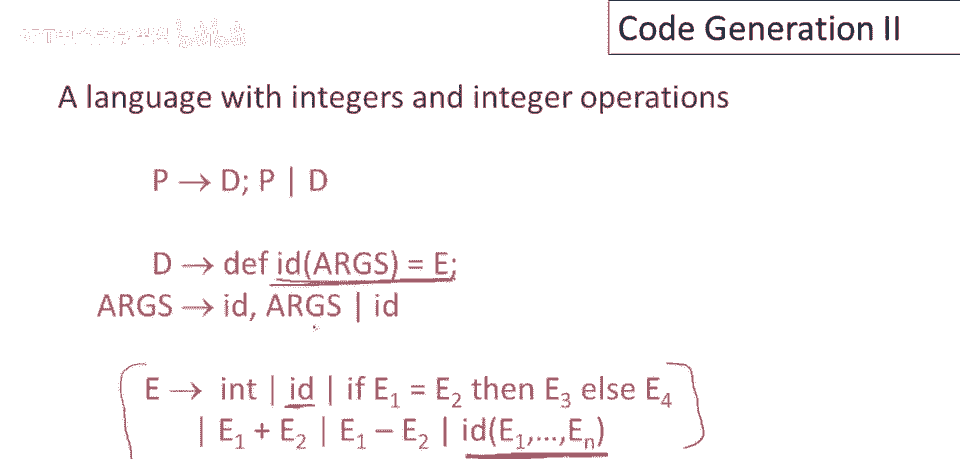

这些是我们将在本视频中查看的三个结构，设计函数调用和函数定义的代码生成的主要问题是，这两个都将密切依赖于激活记录的布局，因此，函数调用的代码生成，函数定义的代码生成和激活记录的布局都需要现在一起设计。

对于这个特定语言，一个非常简单的激活记录将足够，因为我们使用栈机，我们在代码生成中模拟栈机，函数调用的结果将始终在累加器中，这意味着无需将函数调用的结果存储在激活记录中，此外，激活记录将持有实际参数。

因此，当我们计算带有参数x1到xn的函数调用时，我们将这些参数推入栈中，并且碰巧的是，这些是语言中的唯一变量，除了函数调用的参数外，没有其他局部或全局变量，因此，这些是激活记录中需要存储的唯一变量。

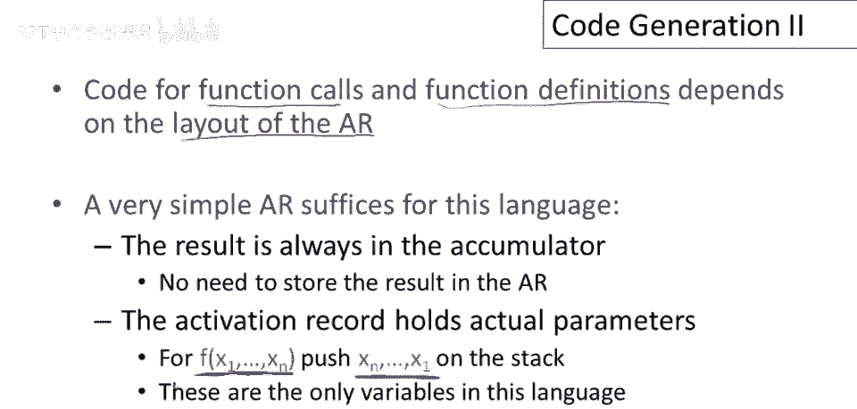

现在回忆一下栈机纪律保证，函数调用期间栈指针保持不变，因此，当我们从函数调用退出时，栈指针将与我们进入函数调用时完全相同，这意味着我们不需要激活记录中的控制链接，控制链接的目的是帮助我们找到前一个激活。

由于栈指针被保留，当我们从函数调用返回时，他们将没有困难地找到它，并且在函数调用期间我们永远不会需要查看另一个激活，因为语言中没有非局部变量，我们，然而，需要返回地址。

并且它需要存储在激活记录的某个地方，结果，指向当前激活的指针将是有用的，现在，这是指向当前激活的指针，而不是前一个激活，该指针将生活在寄存器fp中，它代表帧指针，这是一个，这是一个。

这是mips上的寄存器名，名字用来表示帧指针，按惯例，编译器将帧指针放在这里，帧指针的作用是什么，嗯，它指向当前帧，这就是名字的来源，但它的作用我们将在几分钟后看到。

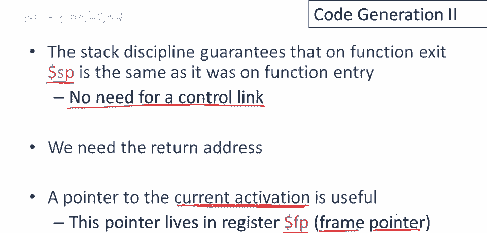

好吧，所以，对这个语言总结一下，一个激活记录，包含调用者的帧指针，实际参数和返回地址就足够了，所以让我们考虑对函数f的调用，它有2个参数x和y，那么在调用执行之前，在我们开始执行函数的主体之前。

这就是激活记录的样子，所以我们将有旧的帧指针，这是指向调用者帧的帧指针，不是指向我们正在执行的函数的帧，原因是我们必须把它保存在某个地方，因为帧指针寄存器将被当前激活的帧指针覆盖，所以我们必须保存旧的。

以便我们从当前函数返回时可以重新启动调用者，然后是函数的参数，它们按逆序推入栈中，最后一个参数先推入，第一个参数在栈顶，这样做的原因是，这将使找到参数的索引更容易，简单一点，然后是栈指针，所以有一个。

这里什么都没有，我们将在调用lee，我们正在调用的函数将推入返回地址，所以这是返回地址将去的地方，这些元素，调用者的帧指针，函数的参数，以及被调用函数的返回地址将构成f的激活记录。

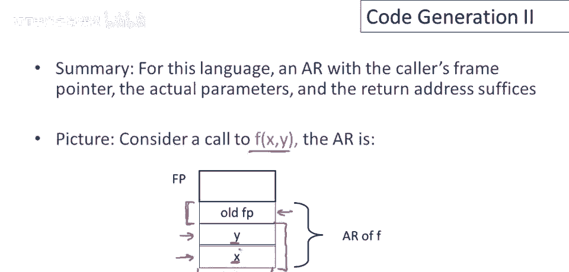

一些术语，调用序列是调用者和被调用者的指令序列，用于设置函数调用，好的，这在编译器术语中称为调用序列，我们将需要一个新的指令来显示这个的调用序列，对于函数调用，那将是跳转和链接指令，所以跳转和链接。

它跳转到作为参数给出的标签，并将跳转和链接后下一个指令的地址保存在ra寄存器中，代表回邮地址，跳转和链接指令会发生什么，如果有跳转和链接至标签l，然后有一个加法指令紧随其后，我不知道它是什么。

这是这条指令的地址，跳转和链接后的那条指令将被存入寄存器a，这条指令将跳转到l，它将这条加法指令的地址存入我们的a，并执行l处的任何代码，然后l处的代码可以执行跳转，回到这里执行返回。

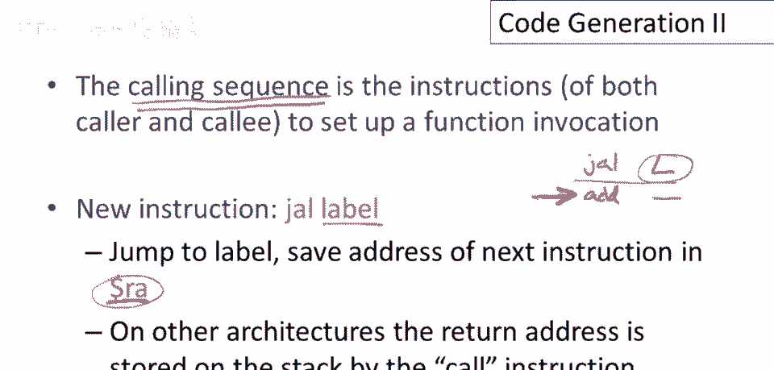

嗯，给调用者，现在我们可以实际生成函数调用表达式的代码了，假设我们有一个调用f(e1， e2， 。 en)，其中，当然e1到en是表达式，让我换个颜色，这些都是表达式，不是值，我们怎么做呢？首先。

我们将开始构建激活记录，我们保存当前帧指针，这是调用者的帧指针，好的，它指向调用者的帧，然后我们将它在栈指针处存储，嗯，我们得增加栈指针，然后我们为最后一个参数生成代码，嗯，对于n。

这段代码将被插入这里，然后我们把它推入栈中，所以我们存储结果，它将在累加器中，A零在栈上，然后我们，嗯，增加栈指针，好的，然后我们对所有参数这样做，以e1结束，所以我们为e1生成代码并将其推入栈中。

好的，所以现在所有参数都在栈上，好的，然后我们只需进行跳转和链接，我们已经完成了大部分工作，以及调用序列中我们可以在调用者侧完成的，这段代码在调用者的函数中执行，好的，这是调用序列的调用者侧。

它构建了尽可能多的激活记录，特别是，它评估实际参数并将它们推入栈中，成为调用函数激活记录的一部分，然后执行跳转链接，跳转到被调用函数的入口点，我们正在，这是对f的调用，跳转到f的入口点。

还有一些需要注意的事项，首先，如前一页幻灯片所讨论的，当我们执行跳转链接指令时，将返回地址保存在ra寄存器中，该地址为这里的地址，跳转链接指令后的，下一个指令的地址，同时注意。

我们构建的激活记录目前是4n，嗯，加4字节，所以这里的n是参数的数量，每个参数占用4字节，然后4字节用于旧帧指针。

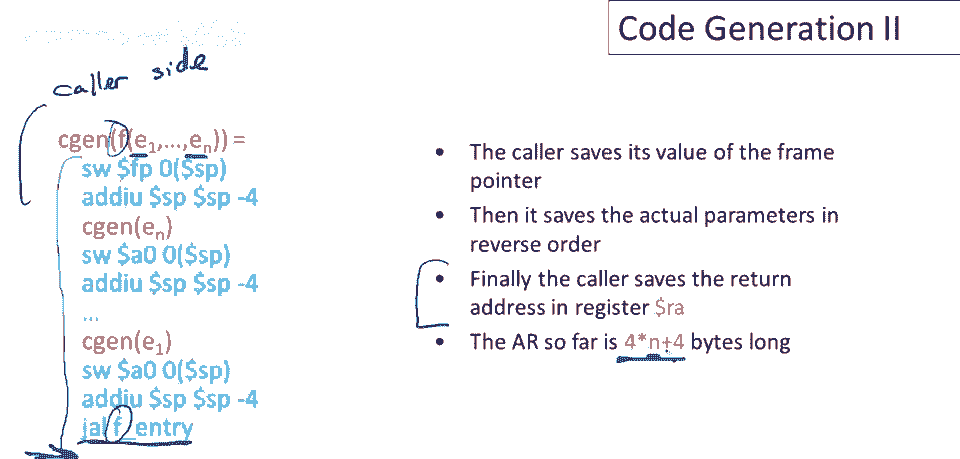

现在我们可以讨论调用序列的被调用方，我们需要一个新的指令，jr指令代表跳转寄存器，它跳转到寄存器参数中的地址，现在被调用方是函数定义的代码，好的，这是实际执行函数主体的代码，我们如何为它生成代码呢？

现在让我们看一下，实际上，这里的第一件事是，嗯，被调用方侧的第一条指令是入口点，我们缺少标签，所以这将被标记为f_entry，好的，这是跳转链接指令的目标，然后我们设置帧指针。

将栈指针的当前值复制到帧指针中，该指针指向被调用函数帧的末尾，对于被调用的，正在执行的新函数，我们还在栈的当前位置保存返回地址，记得调用序列的调用方侧还有一件事要做，调用序列的调用方侧缺少的一件事。

即返回地址，我们直到跳转链接指令执行后才知道返回地址，所以ali是必须保存该值的指令，好的，在跳转链接之后，a寄存器包含返回地址，现在我们将它保存到帧中，然后我们推入栈指针，好的。

现在只需为函数体生成代码，所以现在激活记录已经完全设置好了，现在我们可以为函数体生成代码，函数体执行后，当然，栈指针将被保留，嗯，这意味着返回地址，呃将是，呃，栈指针偏移4处。

因此我们可以将返回地址加载回，呃，返回地址寄存器，好吧，然后我们可以弹出栈，所以这里我们将弹出，呃，当前帧从栈中，并且那将是某个大小z，我们，呃，还没告诉你它是什么，但我们将在一分钟内计算z的大小。

这将是一个立即值，所以那是一个我们插入的常数，然后加载旧帧指针，好的，一旦我们增加了栈指针，我们弹出了现有帧，所以现在我们指向帧指针，我们首先指向前一个栈帧之外的第一件事，那是什么？

那是我们在f的栈帧中保存的第一件事，那就是旧帧指针，所以现在我们恢复了旧帧指针，这样调用我们的函数将会有其帧指针恢复，然后现在我们准备好返回并继续调用函数的执行，我们只需通过跳转到返回地址的寄存器即可。

好吧，所以请注意，帧指针指向帧的顶部，不是帧的底部，好的，这实际上将在我们讨论如何使用帧指针时很重要，当我们谈论关于变量引用的下一部分时，调用者弹出返回地址和实际参数，以及栈中保存的旧帧指针的值。

调用者弹出整个激活记录，并恢复调用者的帧指针，那么z的值是多少呢？有n个参数，每个占用4个字节，因此激活记录大小为4倍，N加上另外两个值，嗯，在激活记录中，一个是返回地址，另一个是旧帧指针，好的。

为两个更多单词的空间是8字节，因此这是激活记录的大小，因此这是我们要添加到栈指针的量。

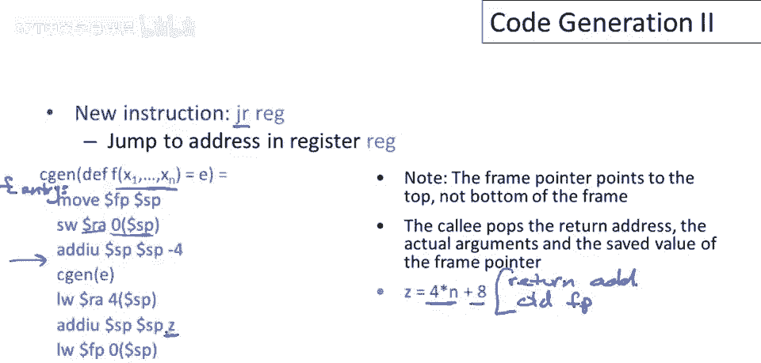

弹出f激活记录，调用前概览，嗯，调用者帧指针，和，当前栈指针值和函数条目，好的，调用后，嗯，调用函数后，调用序列一侧完成，栈上有什么，好的，有旧帧指针和两个参数，栈指针指向下一个未使用位置。

这是返回地址将去的地方，对吧，然后执行跳转链接，我们跳过去，返回地址被推入栈中，帧指针被移动以指向当前帧的值，好的，指向帧顶，好的，通话后发生了什么，弹出所有堆栈，弹出调用函数的整个激活记录。

现在注意我们回到相同状态，函数调用必须保持不变，堆栈在调用中保持不变，调用后堆栈应与调用前完全相同，就像进入调用时一样。

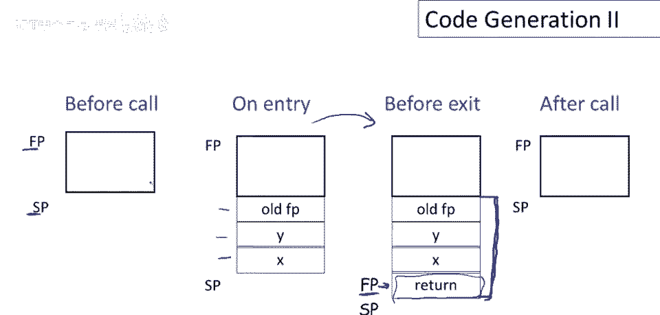

我们几乎完成了简单语言的代码生成，最后要讲的构造是如何为变量引用生成代码，函数的变量就是它的参数，即函数的参数，这种简单语言中没有其他类型的变量，这些变量都在激活记录中，实际上。

我们只需要能够生成代码来查找变量在其适当的位置，在激活记录中，但有一个问题，那就是栈会随着中间值的增减而增长和收缩，当你调用函数并执行其体，值将在栈上弹出和推入，激活记录除外，回想加号和减号的代码生成。

以及if then else，中间值在栈上弹出和推入，这意味着激活记录中的这些变量，不在固定的偏移量，嗯，从栈指针，因此我们很难使用栈指针来决定或找到这些变量。

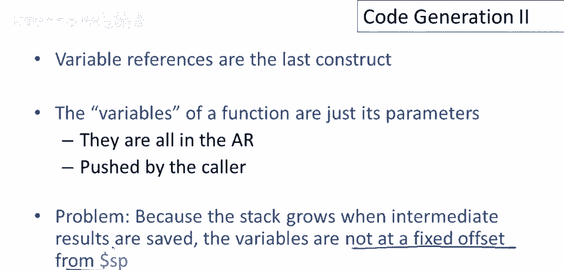

所以解决方案是使用帧指针，嗯，帧指针始终指向激活记录中的返回地址，并且在函数体执行期间它不会移动，因此我们总能相对于帧指针找到相同位置的变量。

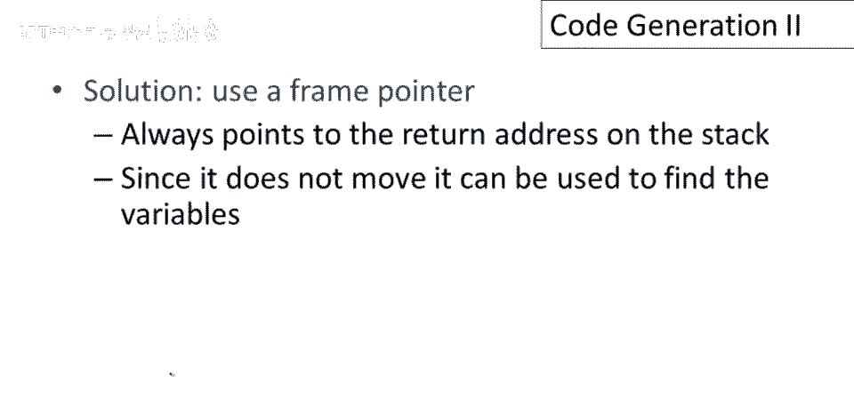

那么我们如何做到这一点呢，让我们考虑i，第i个参数x_i是函数的参数，第i个参数到函数，所以相对于帧指针它将在哪里，将在偏移处，Z从帧指针，而z只是4倍，I正确，实际是生成推入堆栈参数的原因。

按相反顺序，从函数的最后一个参数开始，因为这使索引计算简单，如果按其他顺序推入参数不会更复杂，在其他顺序，这使索引工作更容易理解，而且无论如何，这个索引在编译时计算，注意这个数字，4次。

I是编译器知道的东西，我们在代码中放入的只是一个固定偏移量，我们实际上并没有在运行时进行乘法运算，z在这里只是一个由编译器静态计算的数字，所以无论如何我们只加载偏移量z，即4次i，i为索引。

参数列表中位置，嗯，列表参数中的变量，距离帧指针偏移处，xi在激活记录中存储，我们将其加载到累加器，这是变量引用的完整代码生成。

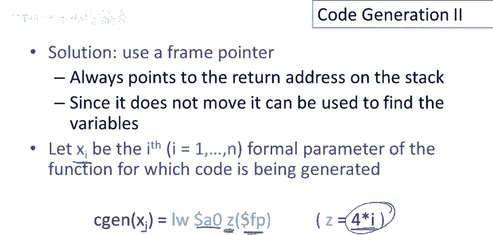

这是一个小例子，所以对于函数，嗯，我们一直在看的两个参数函数，X和y，X是帧指针加4。

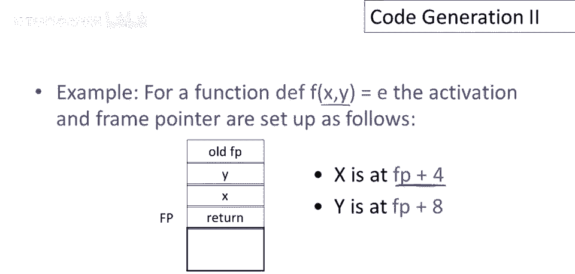

y是帧指针加8，总结一下要点，嗯，激活记录必须与代码生成一起设计，所以你必须同时做这些事情，不能只设计激活记录而不考虑要生成的代码，不能只考虑写代码，而不做关于数据存放位置的决定，因此。

代码和操作数据的代码必须同时设计，代码生成可通过抽象语法树的递归遍历来完成，就像类型检查一样，代码生成可表示为递归树遍历，这是思考代码生成的一种非常方便的方式，因为它允许你一次考虑一个情况，而不必混淆。

同时考虑所有不同的结构，最后，建议使用栈机编译器，若实现课程项目，栈机最简单，提供问题分解框架，因其简单，是学习编译器的好方法。

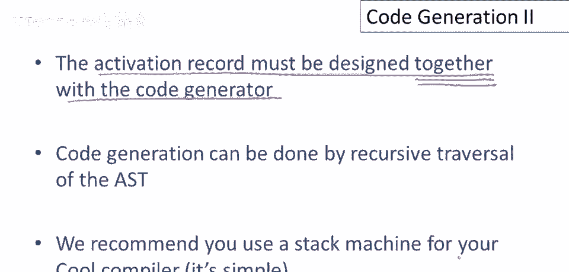

需意识到生产编译器不同，嗯，不如栈机代码生成简单，如前几视频所述，主要区别在于，生产编译器强调保持值和寄存器，从寄存器操作更高效，而非从栈中保存和加载值，特别是当前激活记录中的值，当前栈帧，生产编译器。

尝试将它们在寄存器中而非栈中保持，通常生产编译器，在激活记录中使用临时变量时，这些将直接布局在激活记录中，不从栈中推入，这意味着它们将在激活记录中分配预定义位置。

就像函数参数和之前看的简单语言在激活记录中分配固定位置一样，因此，这些临时值也将分配固定位置。

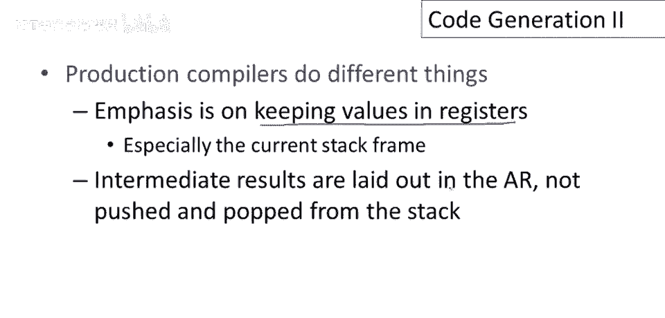