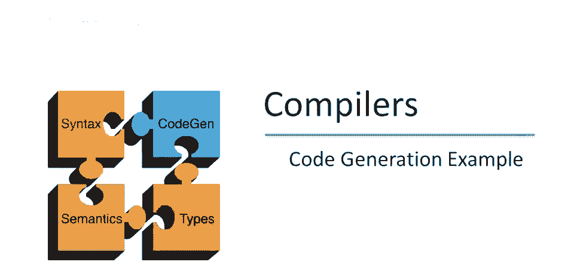
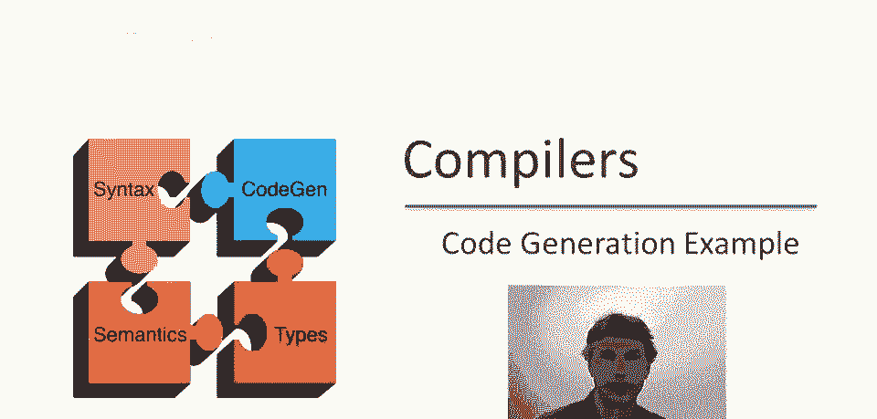
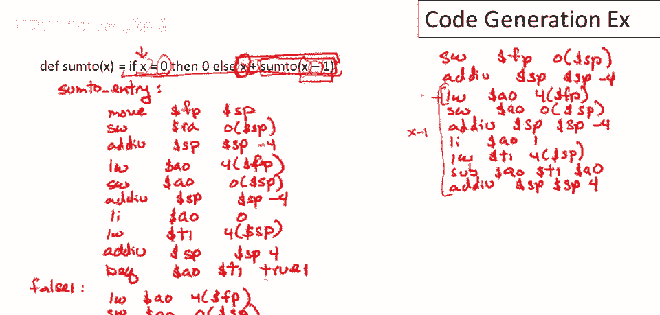

# 【编译原理 CS143 】斯坦福—中英字幕 - P65：p65 12-04-_Code_Generation_ - 加加zero - BV1Mb42177J7

本视频中，将生成一个小程序的代码。

要查看的程序接受正整数x，并将从0到x的所有数字相加，若x为0，则结果为0，否则为x加上从0到x-1的所有数字之和，这不是一个有趣的程序，但它展示了之前视频中讨论的所有功能，所以，让我们深入探讨。

讨论如何为程序生成代码，首先给函数的入口点一个标签，即为sum_to_entry，现在，我们，需要为调用方生成代码，调用方序列，抱歉，刚才说了什么，首先，我们需要设置帧指针，其值即为栈指针。

这是此激活的帧指针，然后，我们需要存储返回地址，在当前栈指针的值处，然后移动栈指针，每当我们在栈上存储东西时，我们需要将栈指针移动到下一个未使用的位置，好的，好的，现在，我们需要为这个。

if-then-else生成代码，如果你回去看if-then-else的代码，首先需要为谓词的第一个子表达式生成代码，我们将为x生成代码，这很容易，就像为变量生成代码一样，只需在帧的当前位置查找变量。

并在正确的偏移量处，从帧指针开始，好的，好的，一旦我们完成这个，我们，正在为谓词生成代码，我们如何做到这一点呢？我们已经为这个表达式生成了代码，现在我们需要将该子表达式保存在某个地方。

因为我们要为另一个子表达式生成代码，即相等，这是一个二元运算符，因此，我们需要保存该值，我们在栈上计算过，好的，那么我们将这样做，因此我们将零值存储在栈上，这总是涉及移动栈指针，好的。

现在为谓词的第二个子表达式生成代码，好吧，这也容易，这只是一个立即加载立即值到累加器，好吧，现在我们要加载，嗯，我们为谓词的第一个参数保存的值回到临时寄存器，实际上进行比较，所以这是更多代码。

这实际上是条件的一部分，好吧，所以我们做加载字，到t1，我们之前保存的值，好的，现在我们需要，我们需要弹出栈，好的，所以我们将在这里这样做，好吧，因为我们用完那个值了，所以我们将，好的。

现在我们可以做分支，所以现在我们测试谓词的两个子表达式是否相等，如果它们相等，则跳转到真分支，我在这里给真分支一个唯一标签，因为这可能是更大程序的一部分，其中有很多，如果-那么-否则。

我在末尾附加一些标识数字，而不是写出真分支，我将只称这个为真一，好吧，好的，如果我们继续执行，那么我们在假分支，我们称之为假一，现在我们在为假分支生成代码，这是这里的求和，好吧，我们如何做到这一点呢？

整个东西是一个加表达式，这意味着我们必须首先生成代码，呃，对于第一个子表达式，这仅仅是x，好吧，那么我们做什么呢？我们加载以生成x的代码，我们呃，查看x当前偏移量，但它是帧内的适当偏移量，使用帧指针。

好的，它是唯一的参数，因此它在帧指针的4个位置，抱歉，过程的唯一参数，因此它存储在第一个参数位置，在方案中总是从帧指针的4个位置开始，现在我们已经加载了它，我们不得不保存它，因为它是二元操作的一部分。

所以我们要将该值保存到栈上，好的，现在我们将，呃，调整堆栈，接下来我们要做什么，现在我们，呃，我们已经计算了这个子表达式，这个x，我们还不能做加法，直到我们计算第二个子表达式，即函数调用。

所以现在我们必须为函数调用生成代码，我要向上移动，到屏幕的另一边，这里来显示其余的代码，好的，为函数调用生成代码的第一步，是开始设置我们的激活记录，这是为函数调用设置新的激活记录，我们即将进行。

那么我们要做什么，我们存储，呃，帧指针，好的，为了存储我们的旧帧指针，呃，在栈上，好的，在栈上，好的，现在，嗯，我们必须计算参数，好的，我们需要计算x减一，因此，这段代码将插入函数调用的模板中。

那么那里会发生什么，嗯，我们正在计算减法，减法的模板是先生成第一个子表达式的代码，然后生成第二个子表达式的代码，然后减去它们，对吧，那么让我们这样做，所以我们首先为x生成代码，好的。

由于它是二元运算的第一个参数，我们将它保存在栈上，好的，现在为减法的第二个参数生成代码，好的，现在执行减法，因此，我们必须将第一个参数加载回临时寄存器，我们必须实际执行减法，抱歉这里，好的。

现在我们可以从栈中弹出临时值，好的，所以现在我们已经完成了减法，让我看看，那就是全部，呃，从这里到这里是计算x减一，好的，这是计算x。

这是计算一，然后整个东西是计算减法，好的，所以现在我们计算参数，我们要做什么，嗯，我们将其保存在栈上，所以现在我们将结果保存在栈上，我们将其保存在正在构建的新激活记录中，好的，呃，然后。

我们必须推进或移动堆栈指针，总是如此，现在我们已经准备好实际执行函数调用，所以现在我们做跳转链接到sum2的入口点，好的，现在当这个返回时，它将返回什么，它将返回计算sum2的结果，在累加器中，对吧。

所以现在我们可以执行加法，因为现在我们计算了加法的第二个参数，我们如何做到这一点，嗯，回顾加法模板，接下来重载栈中保存的临时值，好的，现在可以实际执行加法，好的，然后弹出栈中的临时值，好的。

实际上结束了else分支，嗯，else分支，整个的假分支，嗯，如果那么否则，好的，所以现在我们在其余部分分支，如果那么否则代码，我们将称之为标签，如果一和现在来的是真分支的代码，我们要放什么那里。

并不很复杂，嗯，因为在真分支上我们只是在加载，或生成零的代码，这只是一个加载，立即加载，立即，好的，这就是整个真分支，所以现在我们在，嗯，那里不应该有调用，打扰一下，实际上我可以稍微擦掉一点，好吧。

现在我们在，实际上我看到我写错地方了，所以让我们修复它，这是假分支末端的分支，在else末端的末端，if的一部分，我们将绕过真分支的代码，它只有一条指令，所以下一个指令是标签，如果这样，接下来做什么。

我们已为整体生成代码，如果，那么，否则，所以，现在这里是函数定义的其余模板，所以现在我们只需生成返回给调用者的代码，我们如何做到这一点呢，我们必须从返回地址加载，呃，从堆栈，好的，现在弹出栈。

弹出整个激活记录，激活记录多大，嗯，记得总是两个字，一个是返回地址，一个是帧指针，然后是等于参数数量的字数，这里只有一个参数，所以有三个字，所以是12字节，栈指针增加12，对，然后加载，呃，旧帧指针。

存储帧指针，好，然后返回，再一条指令，跳转到返回地址，这就是简单函数的全部代码，求和2，有几点要指出，代码由许多模板拼接而成，我们一边走一边指出它是如何工作的，但最终你确实得到一个线性序列的代码。

如果你有任何困惑，值得回去看看那些模板和例子，理解代码如何组合和如何工作，另一件要指出的是这是非常低效的代码，比如这里我们生成代码检查x是否等于0，注意这里我们加载x，这是加载x。

然后我们立即将x存储回栈中，我们刚刚从帧中加载它，我们立即又把它存回内存，然后加载一个立即值，然后我们重新加载x的值，你知道，移动x的值，你知道，到处移动，我们加载它，我们存储它，我们再加载它。

所以有很多浪费的动作，这是这种非常简单的代码生成策略的结果，我们希望能够组合代码，但能够以正确的方式组合这些模板，代码不必如此低效，在后续讲座中讨论的许多技术中，我们将讨论更智能的代码生成技术。

