# 【编译原理 CS143 】斯坦福—中英字幕 - P69：p69 13-02-_Operational_Sema - 加加zero - BV1Mb42177J7

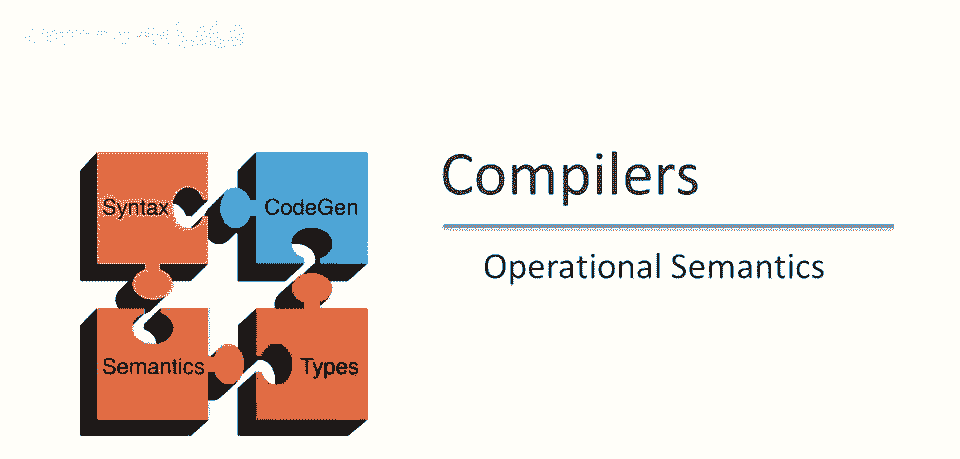

在这段视频中，我们将开始讨论形式操作语义。

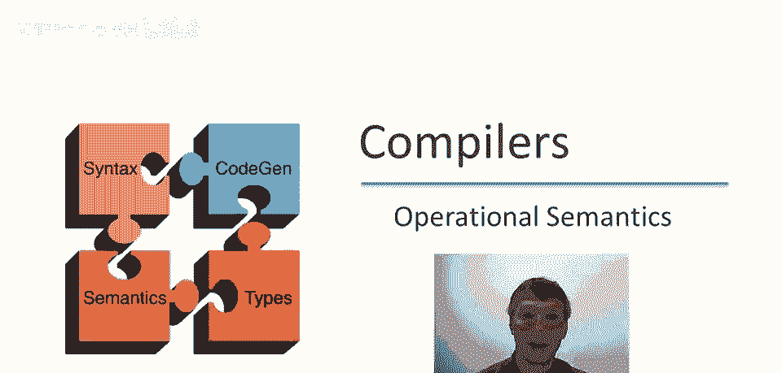

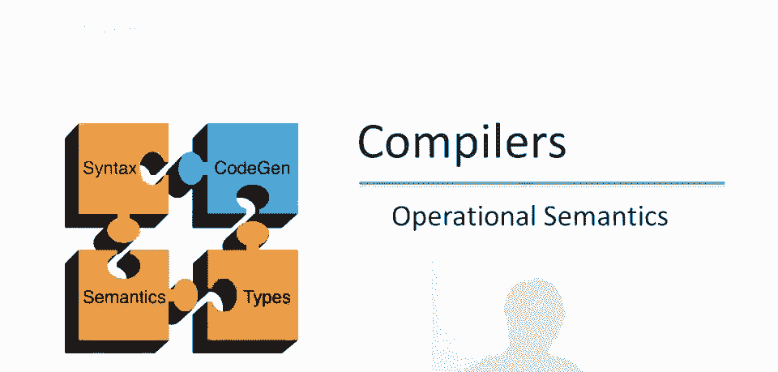

就像我们处理词法分析一样，解析和类型检查，定义形式操作语义的第一步是引入符号，结果我们发现，我们想使用的操作语义符号，与我们在类型夹克中使用的符号相同，或非常相似，我们将使用逻辑推理规则。

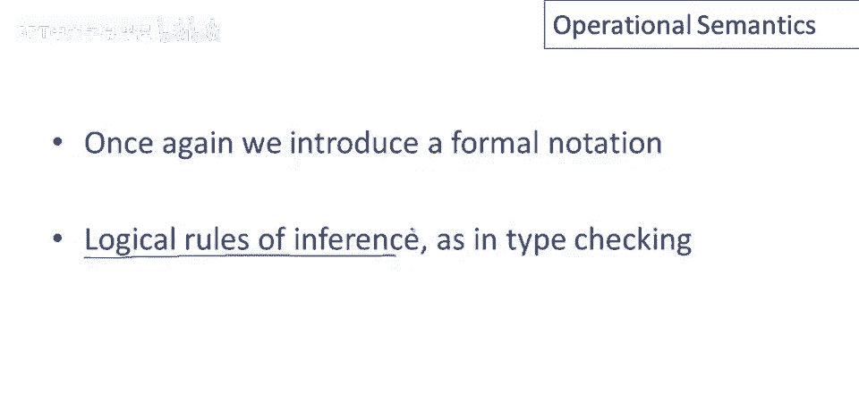

以类型检查为例，我们展示的推理规则类型，证明了一些东西，在某些上下文中我们可以显示某些表达式具有特定类型，类型C，对于评估，我们将做非常相似的事情，我们现在将在某种上下文中显示。

这将不同于我们在类型中拥有的上下文，因此，这将是评估上下文而不是类型上下文，因此，上下文中实际包含的内容将不同，但目前真正重要的是存在某种上下文，在那个上下文中，我们将能够显示某些表达式评估为特定值。

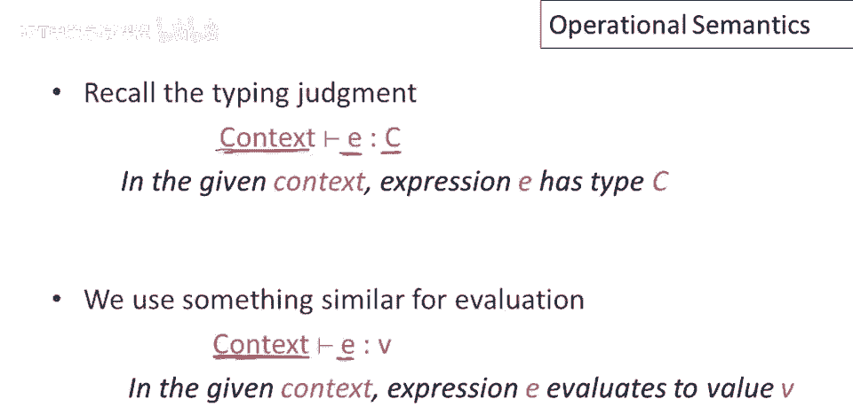

V，例如，让我们看看这个简单的表达式，E一加E二，让我们说，使用我们的规则，我还没有展示给你，但让我们说我们有一堆规则，并且我们可以显示，在初始上下文中，E一在同一上下文中，好的，因此。

这些上下文将是相同的，E一在该上下文中评估为值五，E二也在同一上下文中评估为值七，然后我们可以证明E一加E二评估为值十二，如果你考虑一下，这条规则说的是，如果E一评估为五，E二评估为七。

那么如果你评估表达式，E一加E二你将得到值十二，那么上下文在做什么呢？在这条特定规则中它并没有做很多，但记住类型检查中的上下文是做什么的，上下文是为表达式的自由变量赋予值的，因此。

我们需要对像E一加E二这样的表达式说些什么，关于可能出现在E一中的变量的值，你需要说，以便于说它们评估为什么，因此，可以说整个表达式E一加E二将评估为什么，现在让我们更精确地谈谈上下文中将包含什么。

因此，让我们考虑表达式或语句y等于x加一的评估，好的，因此，我们将把y的值设置为x加一。

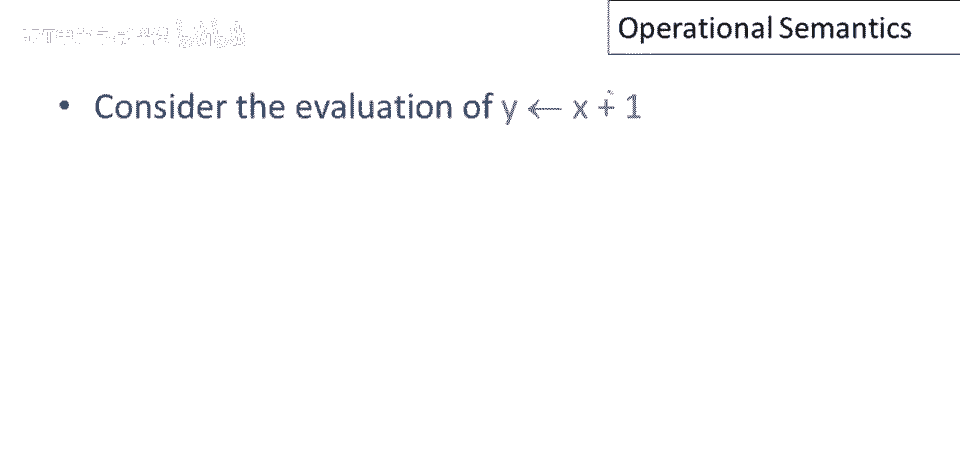

为了评估这个表达式，我们需要知道两件事，首先，要知道变量在内存中的位置，所以，例如，变量x的值需要查找，然后加1，该值需存入y的内存位置，好的，变量与内存位置有映射，好的，在操作语义中称为环境，环境。

可能有点混淆，因为我们曾用环境指代其他事物，好的，现在忘掉其他环境用法，谈论操作语义时，环境指映射，变量与内存位置关联，此外，需要存储，存储将告诉我们内存中的内容，仅知道变量位置不够，若知道x的值。

若知道x的位置，例如，嗯，这很重要，这是获取x值的方法，还需知道确切存储的值，存储是内存位置到值的映射，这些是存储在内存中的值，所以是两级映射，为每个变量关联内存位置，然后每个内存位置有值。

现在谈谈使用的符号。

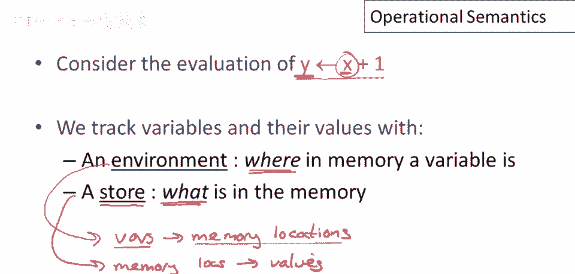

嗯，记录环境和存储，如前所述，变量环境映射变量到位置，我们将以如下方式书写，以变量和位置对列表形式，用冒号分隔，例如这个环境，说变量a在位置l1，变量b在位置l2，并且，环境的一个方面。

是跟踪在作用域内的变量，另一个方面，是跟踪在作用域内的变量，环境中提到的变量仅是当前范围内的。

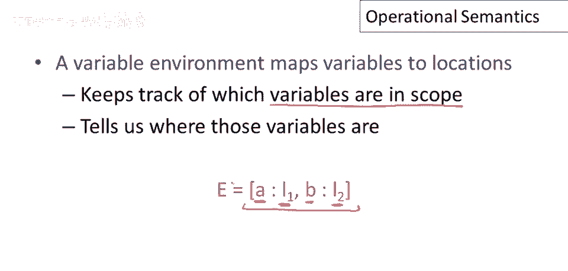

在我们评估的表达式中，现在，如我们所说，存储映射内存位置到值，我们还将存储作为成对的列表写出，在这种情况下，存储s中的内存位置l1包含值为5，内存位置l2包含值为7，我们用箭头分隔这些对。

只是为了使存储看起来与环境不同，这样我们不会混淆两者，存储有一种操作，即替换值或更新值，在这种情况下，我们取存储s，并将位置l1的值更新为12，这定义了一个新的存储s'，好的，请记住这里，存储只是函数。

至少在我们的模型中，我们可以通过取旧存储s的旧函数，并在一点上进行修改来定义新的存储s'，这定义了一个新的存储s'，使得如果我应用s'到新的位置l1，我得到新的值12，如果我应用s'到任何其他位置。

任何不同于l1的位置，我得到存储s中持有的值，对不起，我得到存储s中位置的值。

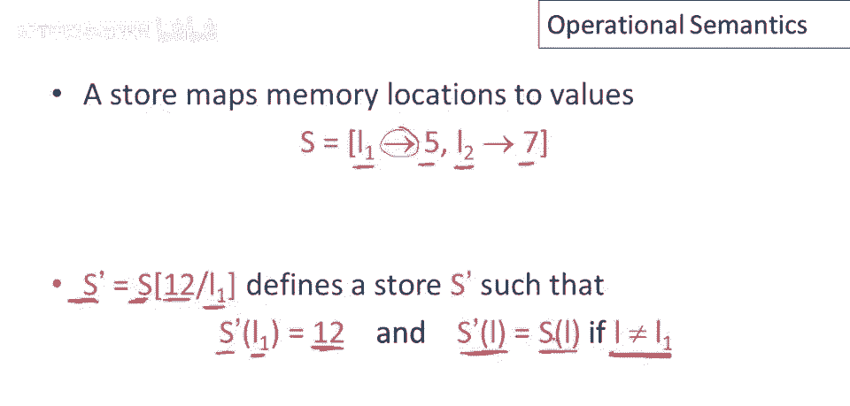

现在在Cool中，我们有更复杂的值和整数，特别是我们有了对象，并且所有对象，当然，都是某个类的实例，我们将需要一种表示对象的操作语义符号。

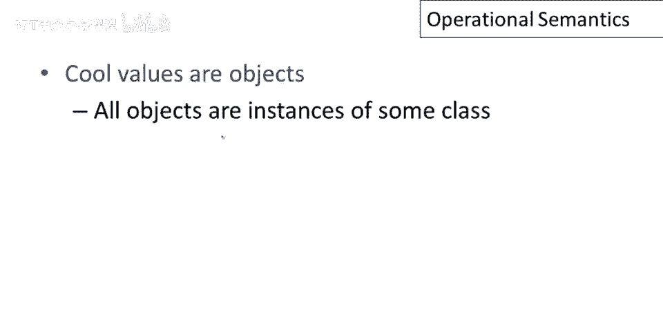

因此我们将使用以下方式写下对象，一个对象将以其类名开始，嗯，在这种情况下类名x，它将跟随属性的列表，好的，在这种情况下类x有n个属性a1到an，并且与每个属性相关联的是存储该属性的内存位置，所以看。

属性a1存储在位置l1，一直到属性an，存储在位置ln，这将是一个完整的对象描述，因为一旦我们知道对象在内存中的存储位置，我们可以使用存储查找每个属性的值。

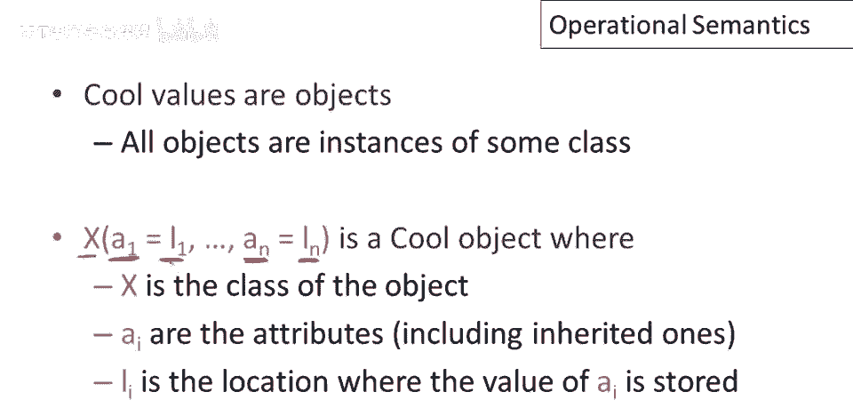

酷中有无属性名的特殊类，我们将有一种特殊的书写方式，整数仅有一个值，和，将写成int和一个整数值，布尔值类似，它们只有一个值，真或假，字符串有两个属性。

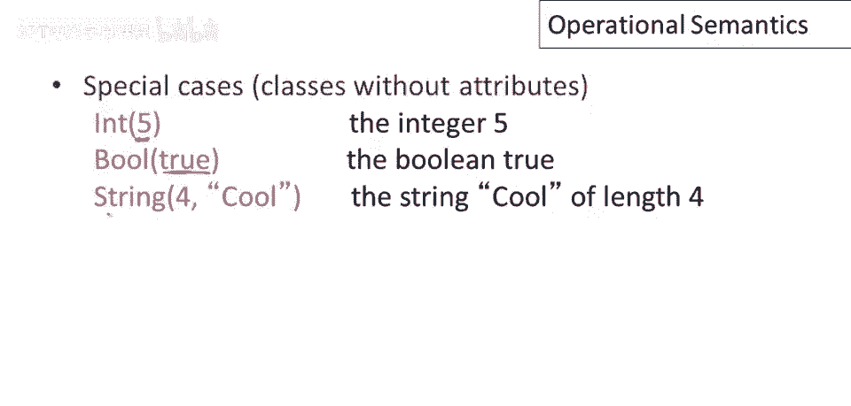

字符串长度和字符串常量，还有一个特殊值为void的object类型，我们将使用void术语表示，简而言之，void特殊在于无法操作，除了测试是否为void，特别地，不能派发void。

即使类型为object也会报错，唯一能做的是测试是否为void，具体实现通常使用空指针表示void。

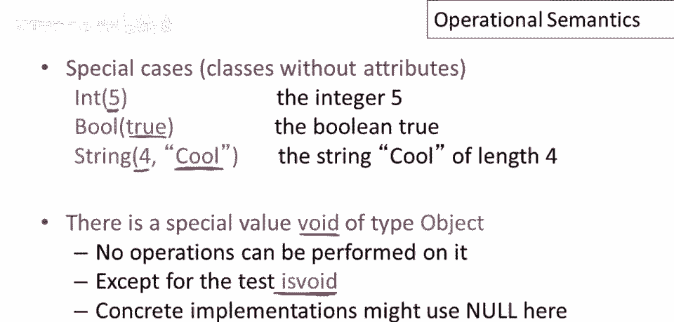

现在可以详细讨论，操作语义中的判断将如何，所以上下文将包含三部分，第一部分是当前self对象，第二部分是环境，又是，从变量到存储位置的映射，第三部分是内存，存储，从内存位置到值的映射，好的。

所以在一个上下文中表达式e将评估为两件事，首先你会产生一个值，所以，例如，我们之前看到7加5产生12，这是评估的一个结果，但第二件事是它将产生一个修改后的存储，表达式e可能是一段复杂的代码。

可能本身就是整个程序，它可能包含赋值语句更新内存内容，所以评估后，将有一个新的内存状态需要表示，所以s prime代表评估后的内存状态，所以现在注意几件事，首先当前self对象和环境不会改变。

它们不会被评估改变，所以哪个对象是self参数，和当前方法，以及变量和内存位置映射不会被运行表达式改变，这很合理，你不能在cool中更新self对象，你没有以任何形式访问变量存储位置的权利，因此。

这两件事是不变的，它们不会，它们在评估下是不变的，当你运行一段代码时，它们不会改变，然而，存储会改变，内存的内容可能会被修改，这就是为什么我们需要在评估前后存储的原因，还有一个细节。

这种形式的判断总是有一个限定，即判断仅在e终止时成立，因此，如果e进入无限循环，那么你将不会得到一个值，你也不会得到一个新存储，因此，这种判断应该总是被理解为说，如果e终止。

那么e产生一个值v和一个新存储s'，总结一下评估的结果是一个值和一个新存储。

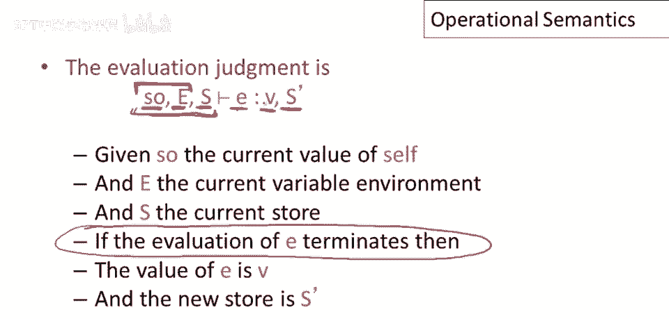

并且新的存储模型表达式的副作用，再次注意，一些事情在评估结果中不会改变。

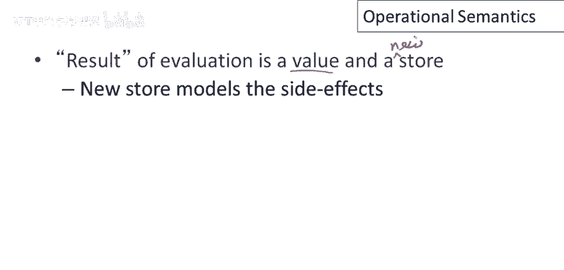

这实际上对于编译很重要，因为我们将能够利用它们不变的事实来生成高效代码，因此，变量环境不会改变，self的值，我们谈论的对象不会改变，并且注意这里还有一个细节，self对象的内容。

self对象中的属性可能会改变，它们可能会被更新，但是，属性存储的位置不会改变，因此，对象存储的布局不会改变，这就是我们在这里所说的，实际对象的内容，即，当然，是存储映射的一部分。

这些可能会通过评估被更新，操作语义还允许非终止评估，这是这里的最后一点，因此，意义是，嗯，那些，那些判断仅在假设，嗯。

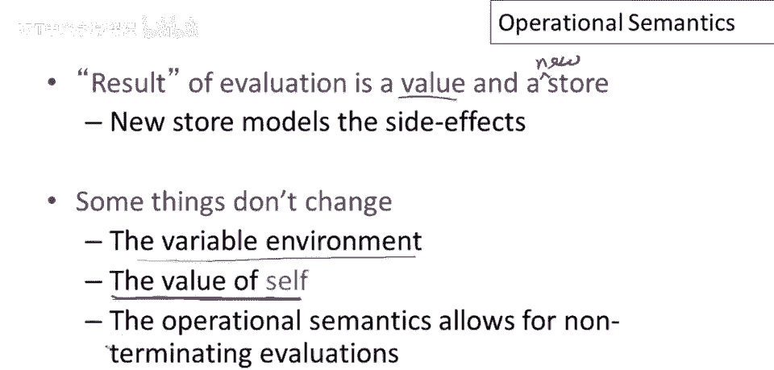

那些判断仅在假设。