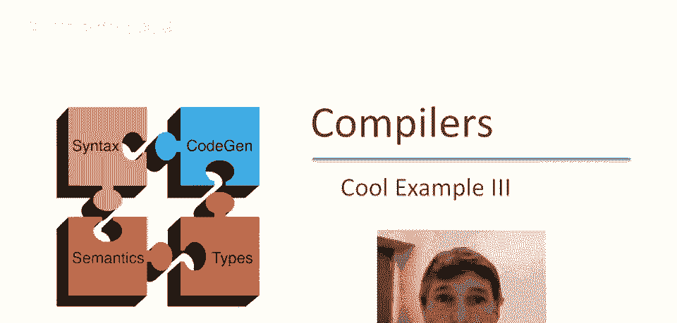
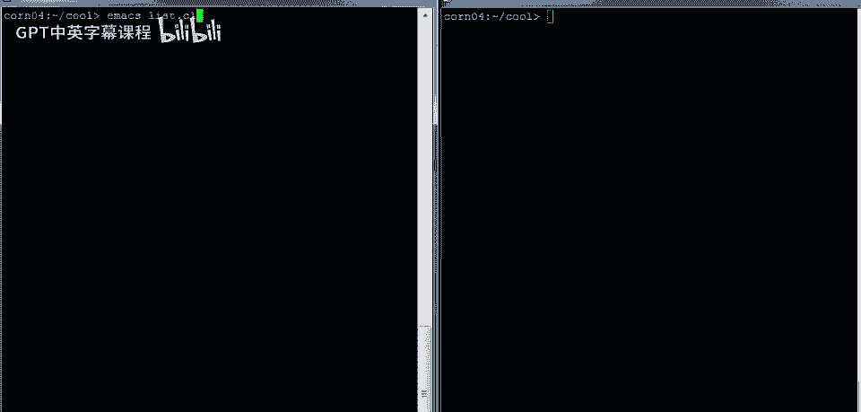
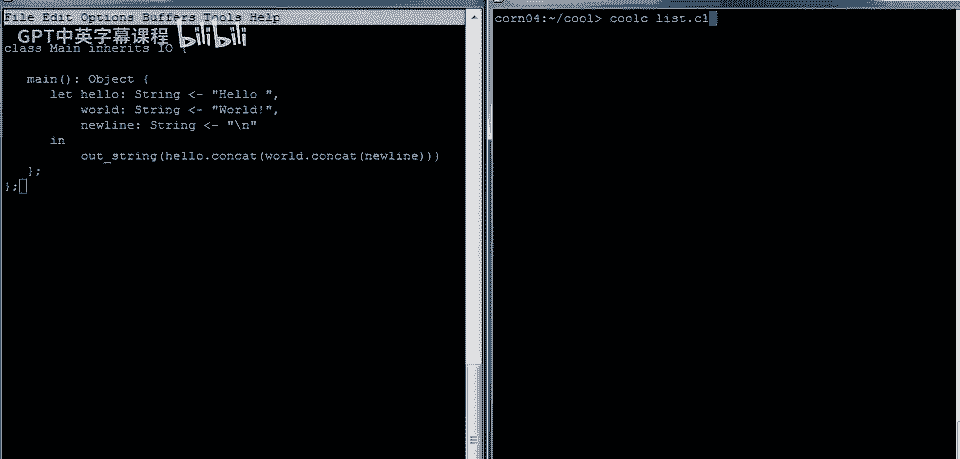
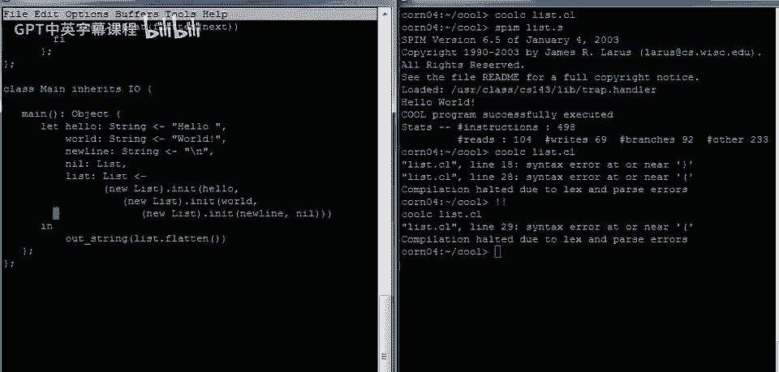
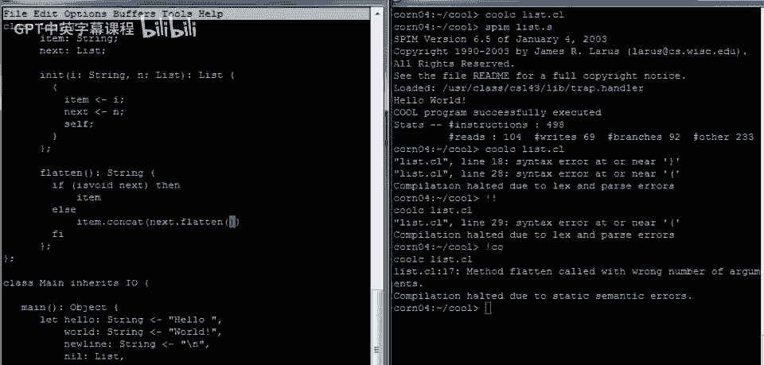
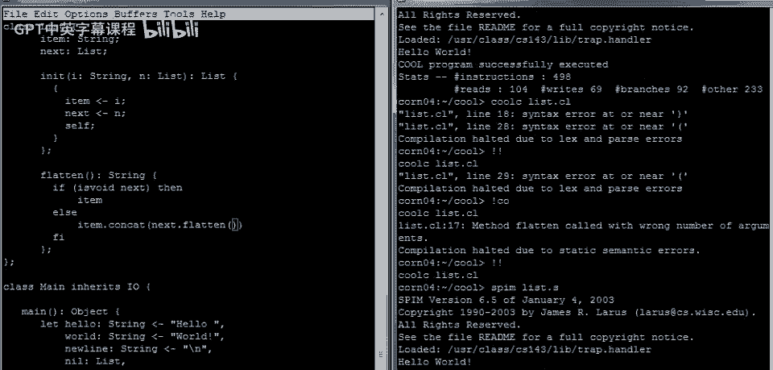
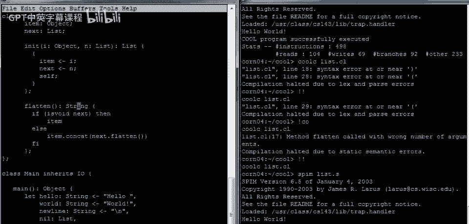
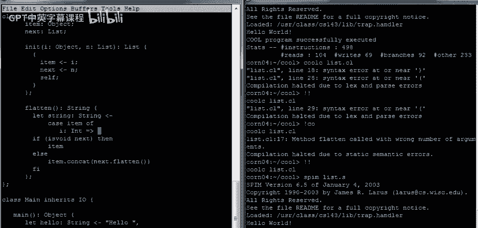

# 【编译原理 CS143 】斯坦福—中英字幕 - P6：p06 02-03-_Cool_Example_III - 加加zero - BV1Mb42177J7

再次问候，在这段视频中，我们将结束对酷的概述，以一个编写酷程序的更多示例结束。

对于我们的最后一个示例，让我们看看一个实际上操作有趣数据结构的程序，因此我们将从这里开始打开一个文件，让我们这次将程序命名为list。cl。

和往常一样，我将开始编写我们的main例程和方法，再一次，嗯，让我们，嗯，让我们让它继承自io，这样我们可以在这里做io，例程，让我们从非常简单的事情开始，一如既往。

让我们只是打印出hello world，但以一种不太寻常的方式，让我们最终编写一个列表，列表抽象，让我们首先手动构建一个列表，或者至少手动构建列表的元素，然后，我们将实际构建列表抽象并将它们放入列表中。

所以嗯，让我们有一些字符串，所以我们将有我们的字符串，Hello，这还将说明如何同时进行多个let绑定，我应该说同时，如何在单个let表达式中进行多个let绑定，你只需列出它们。

并注意这使用逗号作为分隔符，而不是分号作为终止符，因此，此let绑定将定义三个名称，嗯hello world和new line，所有这些都是字符串，然后，嗯，我们将要，嗯，现在将这些打印到屏幕上，因此。

我们将需要能够执行out string，并且由于main继承自self，我们可以在没有对象的情况下这样做，因为再次只是将调度到self对象，并且我们希望以正确的顺序将这些字符串连接在一起。

因此我们将做hello，点，这是hello字符串，可连接到世界和字符串，因此可连接到新行，应该完成工作，再谈一点关于这个，让这些let绑定，逗号是分隔符，意味着不在列表末尾，仅分隔列表项，不是终止符。

现在关闭主过程，关闭类定义，保存，现在看看是否编译。

哦，第一次尝试惊人，在print中运行，Hello world，呃，如预期，现在，呃，而不是分别引入3个字符串，然后连接它们，写一个抽象，可构建字符串列表，该抽象将有一个函数，执行连接，执行连接。

将有一个名为list的类，每个列表需要，我认为有两个组件，首先将有一个列表项，它将是字符串，然后当你有一个指针，指向列表的尾部，指向其余部分，所以有一个next字段指向，或另一个列表，另一个字符串列表。

现在需要一些方法，为了使用这个列表，需要以某种方式初始化列表，初始化函数将接受一个项和其余列表，列表的下一部分，它将做什么？需要设置对象的字段，这必须作为一系列赋值语句完成，因此需要一个语句块。

并将item设置为i参数，并将item设置为i参数，设置下一个属性为n参数，现在，嗯，实际上我们想要，嗯，这个初始化对象，这里这个方法返回对象本身，嗯，因此，这样便于连接init的调用。

所以我们将让它返回self，它将返回self对象，这是语句的结束，块，然后这是方法的结束，我上面犯了个错误，我们需要声明返回类型，嗯，Vignette及其将返回的内容，当然它返回一个列表类型的对象。

我们需要在那里声明一个列表声明，好的，这样就解决了knit问题，现在我们可以使用这个来构建，所以我在这里构建一个列表，嗯，我们应该做什么，嗯，让我们实际上有一个新的变量叫做list，嗯。

这将在这里引入在这个let中，嗯，这一系列的let绑定，让我们只构建一个由这些三个对象组成的列表，所以我们将说我们将有一个新的列表，然后我们将初始化它以包含字符串，Hello和。

列表的其余部分应该是什么？那应该是一个另一个初始化为包含字符串world的列表，那列表里面应该是什么？好吧，必须有一个另一个新的列表对象，我们将初始化它以包含新行，现在这里我们应该放什么？

实际上这里有点问题，不是吗？我们需要在这里放一个列表对象，但我们不想分配一个新的列表对象，我们希望那实际上相当于一个空指针，在Cool中并没有这样的名称，实际上你不能写下空指针的名称。

它叫做void在Cool中，没有，没有特殊的符号表示那个，因此需创建未初始化变量，实际上为空的无初始化列表变量，将是一个空指针，我们称之为nil，为带类型列表且无初始化器的nil，将指向无或，呃。

空指针，然后可用nil终止列表，最后需关闭所有嵌套的父元素，就这样吧，这就是我们的列表，好的，我们有三个字符串的列表，现在我们要做的是打印它，所以我们想要有一个叫to_list的列表。

然后有一个函数将该列表展平，然后我们将打印它，所以这就是，呃，主程序应做什么，现在，必须编写flatten函数，flatten不接受参数，将返回字符串，将返回单个字符串，flatten是一个简单的函数。

我们该做什么，我认为有两种情况，一是字符串已结束，二是尚未到达字符串末尾，那么让我们测试一下，我们如何知道，是否已到字符串末尾，嗯，若下一个指针为空，则字符串中再无内容，实际上有一个特殊测试。

在Cool中，它称为is void函数，所以如果下一个为空，好的，所以下一个字段是，所以下一个字段为空，那么我们返回什么，那么结果就只是，嗯，这个项，列表中最后一个元素的项，否则，我们想做好什么，嗯。

否则我们想取项目并连接到它，其余列表展平的结果，这就是我们的展平方法，让我们看看是否有效，让我们编译这个，我们得到了几个语法错误，让我们回去看看发生了什么，我们有一个语法错误，嗯，在末尾，嗯，展平方法。

我们看到我们遗漏了关闭条件的关键字，所以条件必须以with fee结束，让我们看看现在是否有效，我们仍然有语法错误，嗯，在第二十九行，这里的错误是我们忘了声明这个变量的类型，它是一个列表。

然后它被初始化为这个，嗯，到这个大的表达式我们写出的，然后我们把缩进做得更漂亮一点，注意实际上有一些值得注意的事情，这个定义，这个列表变量的定义依赖于之前在let中定义的变量。

所以每当一个let绑定被创建时，绑定的变量的名称实际上在随后的let表达式中是可用的，所以在这种情况下，这个列表变量使用了hello world和new line，这些都是在之前定义的。

在同一let构造中。

让我们保存这个并来这里编译它，我们看到代码中还有另一个错误，所以如果我们上来，我们看到我们在这里犯了一个错误，我在这里使用了函数式表示法，调用flatten的next。

但实际上我想做的是在next上调度方法flatten，所以应该像这样写。

好吧，可能快接近了，让我们看看是否有效，啊哈，它编译了，现在让我们看看它是否运行，确实如此，它打印出了hello world。

正如我们所期望的那样，回到我们的程序，让我们以某种方式泛化列表抽象，假设我们可以有一个任意对象的列表，不仅仅是字符串，这将需要我们改变一些东西，现在可以用对象初始化，现在到了展开列表的时候。

嗯，我们想产生一个字符串，我们想展示，产生一个打印表示，但列表中不一定是字符串，我们需要一种遍历列表的方法，并对列表中可能存在的不同类型的事物做不同的事情，对列表中可能存在的不同类型的事物做不同的事情。

有一个很酷的构造，用于在运行时恢复对象的类型，这被称为case构造，所以让我先引入一个let表达式，我们要构造的字符串，类型为字符串，将被初始化为某些东西，现在它将是一个case，我们要case什么。

将取决于事物的类型，列表中的项可能是，它可以是不同的类型，我们想对不同的操作，取决于实际项是什么，所以我们将做case item，然后关键字是of，现在case表达式有不同的分支。

对于列表中可能存在的不同类型，所以假设它是int，好的，所以这做的是这个，这表示如果项是int，那么我们将将其重命名为i，我们将i绑定到该整数，然后我们可以对i做些什么，我们可能想对i做什么。

我们可能想将其转换，转换为字符串。

所以我会做i to a of i，如果实际上，该项恰好是类型string，列表中的项必须是类型string，那么我们就可以直接使用项本身作为字符串表示，我们可以为其他类型的类型做同样的事情。

如果我们系统中还有其他类型的类型，我们可以在这里继续列出其他情况以及如何将它们转换为字符串表示，但让我们在这里有一个默认情况，我们将说如果它是任何其他类型，若有分支，则覆盖，若类型为对象，则应中断。

称为o，好的，应调用中断函数并退出，这是我们的情况，嗯，需以issac结束，case的反向，使用构造函数中的字符串，若下一个字段为void，则返回字符串，否则返回连接字符串，与列表其余部分的展开，好的。

有几个问题需要修复，这里使用i到a方法，列表需要继承，从转换类a到i，还有另一个问题，我明白了，嗯，就在这里，如果你注意到，case语句需要产生字符串，好的，结果板不返回字符串，实际上板终止程序。

但类型是返回对象，因此我们需要说服类型检查器，接受这段代码，需要将此分支类型化为字符串，我们可以做的是，这很丑陋，但这是必须做的，我们将它放入一个块和一个语句块，嗯，首先调用中断，再次。

那将只是终止程序，现在我们可以在后面放置任何字符串表达式，那将给整个块类型字符串，因此我们可以在这里放置空字符串，例如，并以分号结束，因为这是在一个块中，我们可以用大括号关闭它，好的。

这只是为了让类型检查器高兴，这可能是我们需要做的全部，所以让我们尝试编译这个，我们需要包含转换库，好的，目前有一个语法错误，因为我们忘了在on后面加分号终止符，我们每个，每个的，每个的，嗯。

我们在let中引入的变量，好的，我们得保存那个，让我们再试一次，哎呀，实际上我没能修复语法错误，那是因为我把分号放错了地方，嗯实际上，我忘了在let中绑定的变量之间要用逗号分隔。

但case的分支必须用分号终止，我之前关于使用分号终止let绑定的说法是错误的，只是在case分支中需要，在这个例子中，好吧无论如何，回到这个，让我们看看它是否编译并成功了，现在让我们运行它。

它现在工作了，当然，我们实际上还没有利用列表中不同类型对象的能力，所以让我们，嗯，让我们做那个，嗯，让我们添加，嗯，一个整数在这里，类型为int，让我们给它数字42，我们可以把它插在这里。

现在我们可以传递任何对象，嗯，给init在第一个位置，所以我们会直接把42放那里，当我们编译并运行这个，它应该打印hello world 42，如果一切按预期进行，它做到了。

这结束了我们关于酷的简短之旅，还有一些特性我们没有在这些例子中展示，但你可以在示例目录中查看更多程序，更多程序将，嗯展示你所有不同的语言特性的里里外外和细节，以及我们在此涵盖的，作为结束。

