# 【编译原理 CS143 】斯坦福—中英字幕 - P71：p71 13-04-_Cool_Semantics_I - 加加zero - BV1Mb42177J7

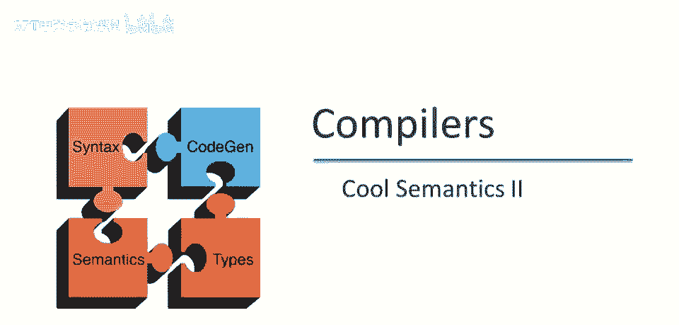

本视频中，我们将继续讨论Cole的操作语义，将查看Cool中最复杂的两个操作，新对象的分配和动态分发。

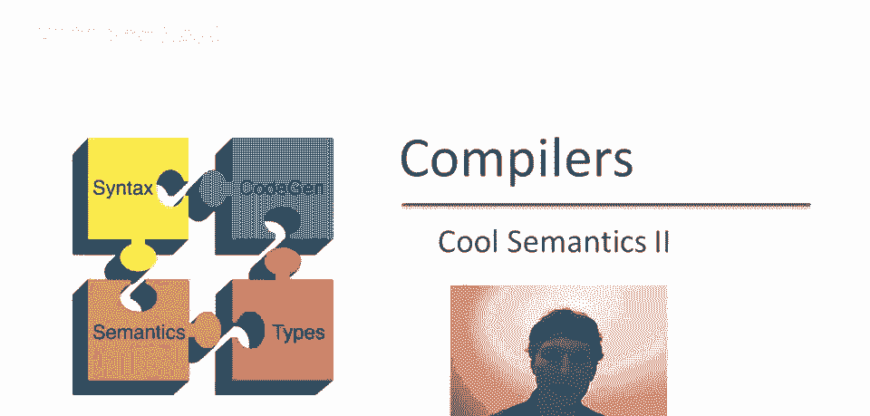

首先非正式讨论新对象分配时发生的事，首先必须为对象分配空间，本质上意味着为对象的属性留有足够空间，将分配位置，给类t对象的每个属性，如果我们分配的是新的t对象，将对象的属性设置为默认值，稍后说明默认值。

以及为何需要设置默认属性，然后评估初始化器，类声明中的每个属性都可以有初始化表达式，将评估这些并设置结果属性值，然后返回新分配的对象，这是设置新对象涉及的步骤，如您所见，不仅仅是分配一点内存。

实际上在进行相当多的计算，嗯，在Cool中分配新对象。

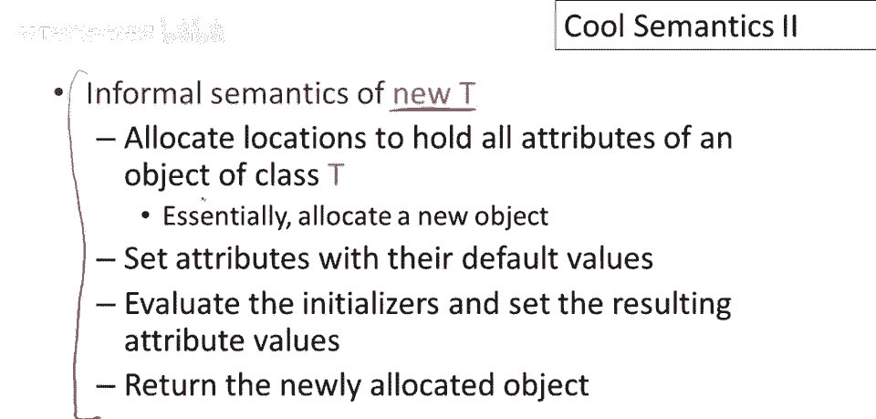

每个类都与该类关联有一个默认值，对于整数，默认值为零对于布尔值，默认值为布尔值false，对于字符串，默认值为空字符串，然后对于不是这三个基本类的任何其他类，对于任何其他类，默认值为void。

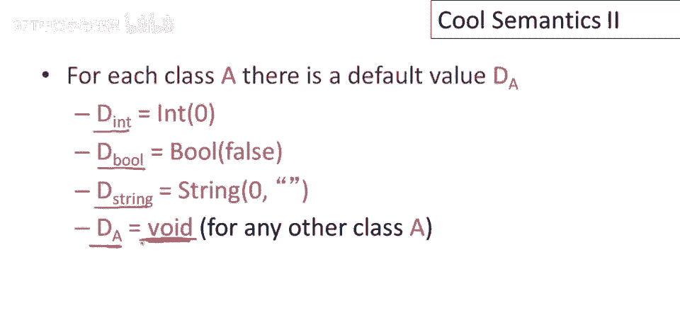

在操作规则中，我们需要一种方式引用类的属性，因此我们将定义一个名为class的函数，它接受类名，并返回该类的属性列表，这里是类A的所有属性，假设它们是a1到an，此外，此函数还将告诉我们每个属性。

声明的属性类型，初始化属性的表达式，此列表的另一个重要特征是它包括类A的所有属性，包括继承的，还有一个细节是这些属性出现的顺序，这实际上将变得重要，当我们定义属性初始化的语义时，规则是属性按最远祖先。

首先顺序列出，好的，我指的是什么，假设我们有三个类，嗯，A、B和C，以及A，抱歉，B继承自A，C继承，自B，好的，假设A定义了两个属性a1和a2，B定义了两个属性b1，B2，C定义了两个属性c1和c2。

那么C类的，我们将按以下顺序列出属性，首先将是a1，然后是a2，因为A是最早的祖先，好的，它是，嗯，对象层次结构中离根最近的，类A或任何类中的属性总是按，它们在文本中出现的顺序列出。

所以首先出现的是a1和a2，当然，这两个属性的类型和初始化器也在这里列出，但我们只关注信息出现的顺序，所以接下来将是类B，所以类B的属性将是下一个，当然，这些属性的类型和初始化器也将列出。

然后最后将是类C的属性，再次按它们在类定义中列出的顺序，好的，这定义了任何类的属性的顺序，它总是从最早的祖先，嗯，沿着继承链，嗯，到类。

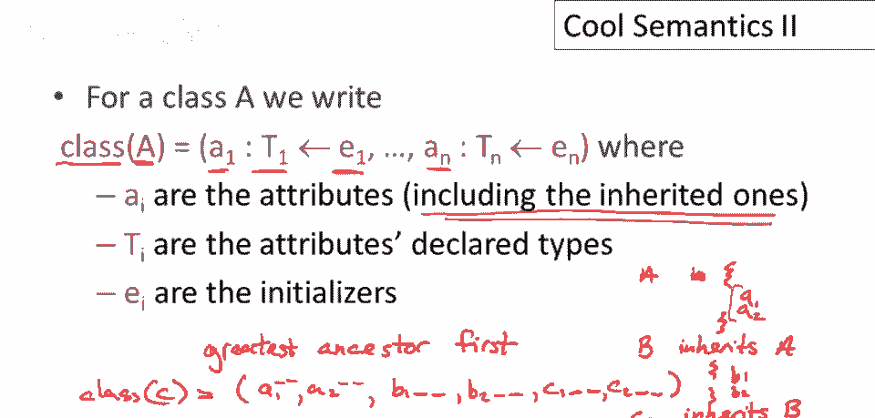

嗯本身，它是类函数的参数，现在我们可以准备正式定义new t的语义了，让我换个颜色，所以我们要，为类型t分配一个新对象，它将在具有self对象s的上下文中，零环境e和存储s，我们首先要做的就是弄清楚。

我们实际上要分配的是什么类型的对象，唯一的问题是t是否为self类型，因为记住self类型不是实际类的名称，如果t不是self类型，接下来将分配的类实际上是，T实际上是一个类名，并且该对象将分配的类型。

如果t是self类型，将要分配的对象类型，将是self对象动态类型的，因此，我们将查看self对象的动态类型，称为x，那将是我们要创建的类，那将是我们要创建的对象类型，好吧，有两种可能性。

如果对象分配类型为t的对象，t实际上是一个类名，否则，它是与self对象相同动态类型的对象，好吧，所以现在我们要查找，嗯，T零是什么类型，我们获取属性列表，类型和初始化程序为t零。

这告诉我们如何构建这种类型的对象，好吧，接下来我们要为每个属性分配位置，因为它们属于属性，我们将为每个属性分配一个位置，然后，我们将创建一个具有类标记t零的对象，属性将绑定到这些新位置，因此。

第八个属性将绑定到我们刚刚分配的新位置，然后我们要更新存储，好的，因此，我们将取我们的初始存储，不，这与我们开始的存储相同，我们将取s并更新它，因此，在这些新位置，这些位置持有每种属性的默认值，好的。

这给了我们存储s一，现在，嗯，我们必须评估初始化程序来实际初始化属性，并且我们必须考虑在这些属性初始化时的环境，并记住规则是，在属性的初始化程序中，类的所有属性都在范围内，好吧，在这种情况下。

初始化程序的环境将仅包括初始化程序，属性，对不起自己，好的，这些都是这些是属性名称，并且ice属性绑定到新的内存位置，该位置持有该属性的默认值，最初，好吧，最后，为了评估初始化程序。

我们只需将它们作为块按它们在类函数中出现的顺序评估，这就是为什么在类函数中指定顺序很重要，因此，请记住，这些属性包括所有继承的属性，首先评估最祖先属性的初始化，然后向下工作到类本身声明的属性。

注意这里的环境，包含所有属性和范围，这是一个有趣的观点，这个环境与新t实际评估的环境无关，你知道，这些环境e和e'是完全独立的，好的，所以new，所以e'在范围内有类的属性的名称，E是一个，你知道。

是其他一些环境，有一些函数，某个地方正在调用new t，那里的变量与这里的完全不同，好的，但无论如何，评估这个初始化块将产生一些值，和一个新的存储，该值未用于任何目的，好的，但新的存储是最终存储。

这是分配对象时得到的存储，那么new t的结果是什么，它是新的对象本身。

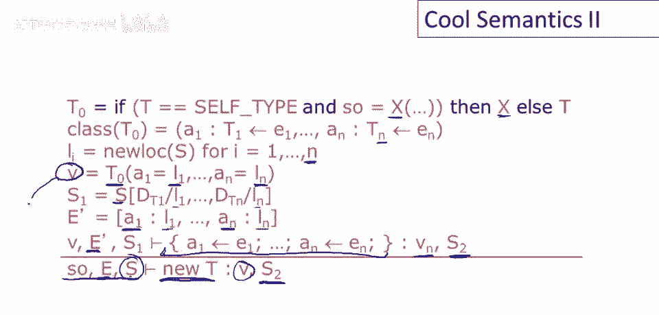

V，总结new的语义，嗯，注意前三个步骤分配对象，这些都是实际分配对象内存的事情，然后剩余的步骤通过评估一系列赋值来初始化对象，关于初始化可能最重要的事情，或其中最重要的事情之一是初始化器评估的上下文。

或初始化器评估的状态，所以注意只有属性在范围内，我们强调这一点，这与类型检查中的规则相同，所以当你在类型检查类声明时，只有属性在类的初始化器的范围内，你知道，对于类的初始化器，然后那是相同的，自然地。

当我们实际上在运行时评估初始化器时使用的相同的东西，属性的初始值是默认值，我们需要默认值，因为确切地说，属性在其自己的初始化器内部范围内，所以可能是，嗯，例如，有一个初始化器是完全合理和酷的。

比如说像这样，我将省略所有类型，只是为了，呃，节省时间，但可以给属性a，赋值为a，这完全没问题，因为初始化器的右边，所有属性和范围都有，这有意义的前提是，A必须有某种默认值，在计算初始化器之前。

我可能已经读过属性，注意初始化时，或，在对象的初始化中，self是对象本身。

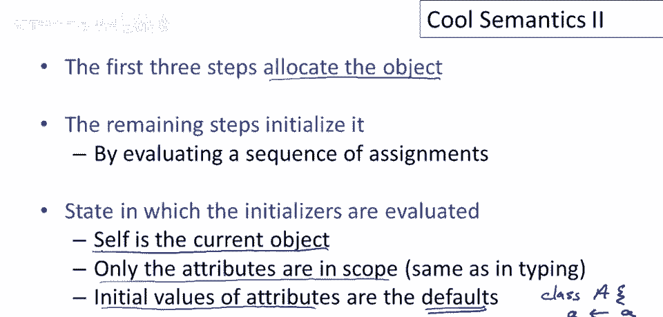

是self对象，我指的是什么，我忘了在上张幻灯片上提到，快速回到那张幻灯片，注意在初始化器的评估中，上下文是什么，self对象是v，self对象是v，这是我们刚构造的新对象，所以对于。

e1到e n的初始化表达式，如果它们使用self，它们将指向，正在初始化的对象。

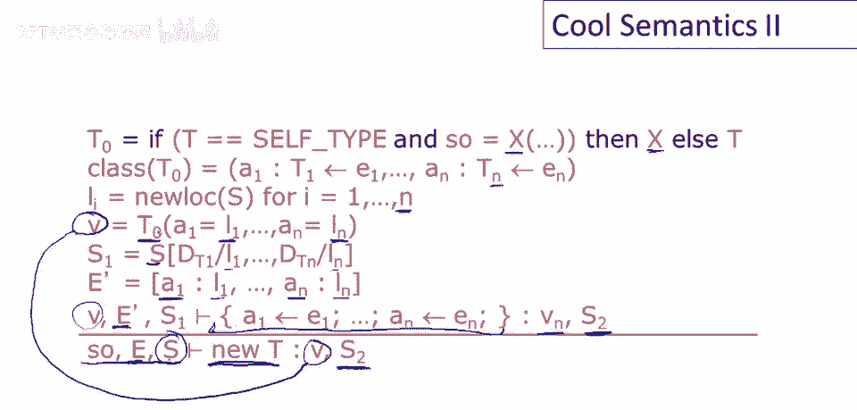

好的，回到这个，呃，总结，嗯，你知道，可能会有点惊讶，呃，Cool中new的语义，有多复杂，不仅仅是Cool具有这种属性，实际上，每个面向对象的语言，对新对象的初始化，都有相当复杂的语义。

这是继承等特性。

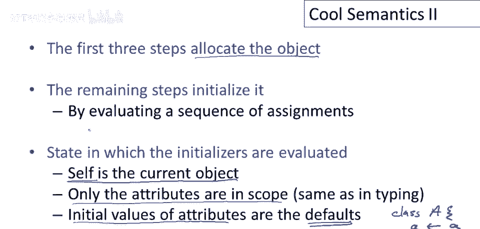

以及初始化器能够引用属性，导致的这种复杂性，现在让我们谈谈动态分派的语义，动态分派评估概述，然后看正式操作规则，评估分派时首先发生的事，将参数e1至e_n评估，接下来评估目标对象，E_0。

评估该表达式以获取实际分派对象，下一步，查看目标对象的动态类型，评估E_0后，查看其类标签，然后使用该类型确定应使用哪个函数，应使用哪个函数f，因此将查看方法表，对于类x和f的方法。

然后创建新的位置和环境，为调用设置，设置新的参数位置，用实际参数初始化这些位置，将self设为目标对象。

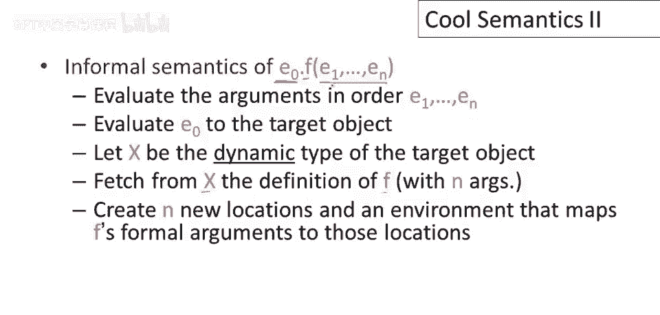

然后评估f的函数体，为了在类中查找方法，需要在操作规则中表示出类中存在哪些方法，因此将找到一个称为impulse的函数，代表实现，类A中方法f的实现，首先是一系列形式参数。

它将告诉我们f的形式参数是什么，然后是f的函数体，即f的函数体是什么，现在可以讨论方法分派在Cool中的正式操作语义细节。

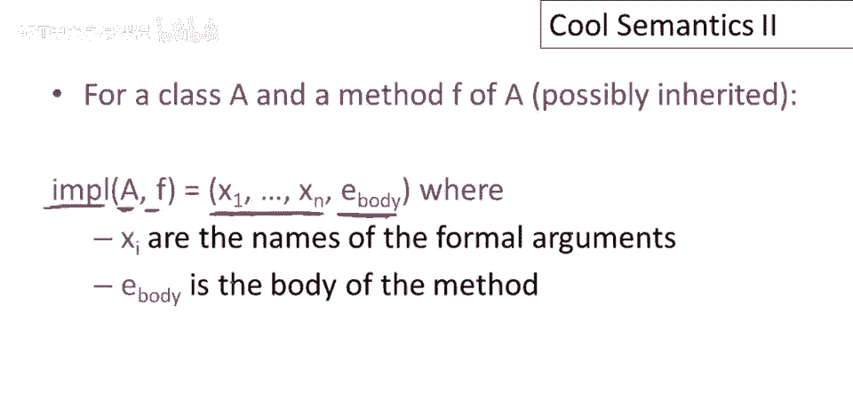

再次切换颜色以作对比，所以首先评估n个参数，因此前n行处理这些，注意每个评估的参数都可能产生副作用，因此它从某个存储开始，但可能产生不同的存储，所以完成所有这些后。

我们评估了n个参数和一些存储s_sub，接下来评估E_0，这是我们要分派的表达式，这将给我们一个对象，V_0和一些更新的存储s_sub_n加1，好的，现在我们必须检查V_0。

我们想了解V_0内部是什么或V_0由什么组成，特别是我们感兴趣的是V_0的类标签，V_0的类标签，V_0的类标签，V_0的类标签，V_0的类标签，我们还将关注其属性内容，与其属性相关的位置。

但首先让我们关注类标签，好吗，因为我们将使用该类，记住这是v0的动态类型，这是程序运行时v0的实际对象类型，我们将使用该类查找应运行的f的定义，我们在类x中查找方法f，我们想了解其实现。

特别是我们获取形式参数的名称，好的，x1到xn，我们获取函数的主体，嗯或方法，好吧，因此我们接下来要做的就是，我们必须在内存或存储中，为方法调用的实际参数分配空间，所以我们分配新的位置，好的。

每个实际参数一个，现在我们可以构建一个环境，来评估方法，好吧，那么这个环境将包含什么，我们需要考虑在方法内部，范围内的名称，嗯，类的所有属性都在范围内，好的，这是一个具有属性a1到am的类x。

因此环境将具有这些名称定义a1到am，那么这些属性的实际位置是什么，嗯，这些是v0的位置，这是我们正在调度的对象，那将是self对象，属性名称将指向self的属性，好的。

所以这里的位置是v0对象中属性的位置，此外，方法体内的形式参数也在范围内，所以我们在包含属性的环境中添加，所有形式参数，好的，它们位于新的位置，l_x1到l_xn，好的，注意这个定义方式的一个细微差别。

我们正在取一个初始环境，我将在这里显示，我将用蓝色标记这些括号，所以我们正在定义属性的初始环境，然后我们在那上面进行更新，好的，我们不是在简单地定义x1映射到l(x1)。

我们正在替换x1在这个环境中的定义，用映射x1到l(x1)的另一个定义替换，我们为什么那样做呢？问题是，一个方法可能有一个形式参数，它与属性名相同，例如，我可以有一个类A，它有一个属性，小a在里面。

它还有一个方法f，它接受一个，呃，一个名为a的形式参数，好的，如果我这样做，当然，我忽略了类型和其他许多东西，所以这里有一个名为a的属性被声明，然后有一个方法，它接受一个名为a的参数，现在的问题是。

当我在这个方法的体内引用a时，我得到哪个a，是这个a吗？这个a绑定到形式参数吗？它是绑定到属性吗？我们必须给出一个答案，一个或另一个，Cool的答案是，它绑定到隐藏外层名称的形式参数，好的。

这就是这些更新在这里强制执行的原因，因此，如果形式参数与属性之一具有相同名称，它将替换环境中的属性定义，好的，一旦我们设置了环境，我们需要设置我们的存储，存储有什么变化？嗯。

我们只需要在参数的位置存储每个参数的实际值，最后，我们准备好评估函数体，有趣的部分是执行该操作时的上下文，所以请注意，运行方法时的self对象，F是我们要调度的对象，好的，然后环境是e prime。

在新设置的环境中，再次注意，这是对上下文的完全改变，e prime，环境e prime与环境无关，E e prime完全从我们正在调用的方法的信息中构建，没有从方法的起源环境中借用任何东西。

从调用方法的地方，最后，所有这些都是在反映所有由评估参数执行的副作用，由评估e零执行的存储中完成的，完成的，反映所有由评估参数执行的副作用，由评估e零执行的存储，通过扩展商店与实际参数的位置。

因此我们评估方法的主体，我们得到一个值和一个更新的商店，这个值和商店是结果，嗯，整个的，嗯，动态分派的执行。

总结我们关于动态分派的讨论，方法的主体被调用，带有环境E，E定义了形式参数和self对象的属性，商店就像调用者的商店，除了它还有实际参数绑定到为形式参数分配的位置，注意规则中帧或激活记录的概念是隐式的。

我们实际上没有构建一个包含，你知道，所有值，所有参数和返回地址，所有这些东西在一起，这些信息没有收集在一个地方，它更抽象，我们实际上不必说，嗯，你知道，是否东西在栈上或在堆上分配，这是一个很好的特性。

允许我们可能有一个范围，可以实现正确语义的实现，现在我们没有做静态分派的语义，但非常相似，唯一的区别是，在查找将要分派的类的过程中，所以在静态分发中，你可能能够，你知道，你可以命名你想要分派的类。

所以有一条额外的线，嗯，来决定被调用的类的正式规则，你可以查看手册了解它是如何工作的。

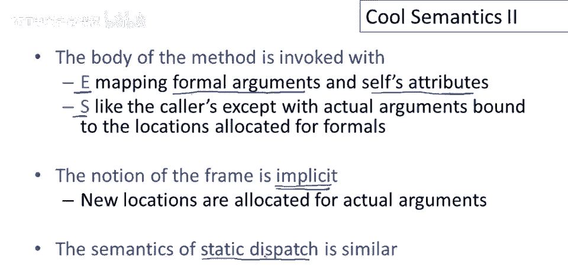

值得指出的是，虽然操作规则非常详细，嗯，它们有意省略了一些你认为它们应该覆盖的案例，让我们再次看一下我们的分发示例，所以嗯，这里注意我们查找v零的类，所以v零是一个对象，我们检查它的类标签。

然后我们在那个类中，查找我们正在分派的方法的名称，我们得到了方法定义，或者，你已了解方法定义，现在可写其余规则，若类x无方法f，会发生什么，此规则假设方法f确实在类x中定义，规则未说明应如何处理。

若类x无方法f，实际上不会发生，类型检查已确保，查找类x中的方法f时，它一定存在，类型检查规则之一，即动态分发不能指向未定义的方法，类型检查已完成的事实，使我们能省略一些情况，有些检查我们不必做。

因为知道类型系统已有效完成它们，若没有类型检查，规则会更复杂，并需实际说明类型检查未覆盖的所有情况，即未类型化的情况，正确。

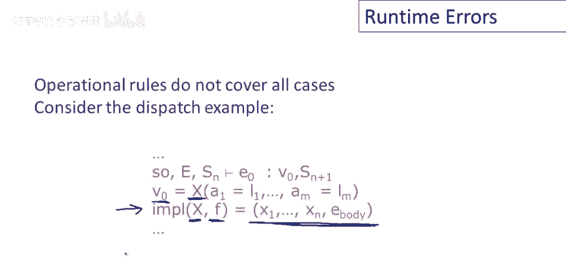

类型检查无法防止某些运行时错误，然而，在Cool中，嗯，有四种，嗯，分发空值，嗯，除以零，嗯，子字符串索引超出范围，或内存耗尽，尝试分配新对象，但没有足够空间，在这种情况下，执行必须优雅中断。

意味着带有错误消息，不仅仅是段错误，或其他硬性崩溃，手册中有一些指南，关于正确Cool实现应如何处理，这四个情况总结最后几段视频的内容。

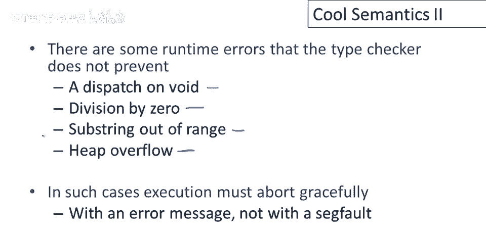

操作语义规则非常精确和详细，如果你理解它们，那么你真正理解如何实现正确的Cool编译器，规则足够完整，细节足够，你完全可以按照规则去做而不会出错，只要你实现规则告诉你的，但你需要仔细阅读规则。

我会强调这一点，因为规则中实际上有很多内容，它们以某种方式编写，以达到某种效果，我指出了一些规则中的微妙之处，所以你知道，你真的需要研究规则才能理解它们的含义，并能正确地实施它们，这也是一种很好的方式。

深入了解这些规则实际上是一种很好的学习方式，关于编程语言设计中涉及的形式思维，以及编程语言具有语义意味着什么，以及实现某物正确性的含义，说了这么多，我应该说，大多数语言都没有明确的操作语义，有一些。

有一些实质性语言和相当现实的语言确实具有正式语义，但您熟悉的多数语言都没有，最后，呃，就作为一个评论，你知道，当可移植性很重要时，当您真正希望编写的软件在不同环境中表现完全相同时，所以你知道。

如果我取相同的程序并将其移动到不同的机器或不同的操作系统，并且我还想有一种保证，软件将表现得像它，像它一样，你知道，在旧机器上，或新旧环境中，那么我确实需要一些独立定义。

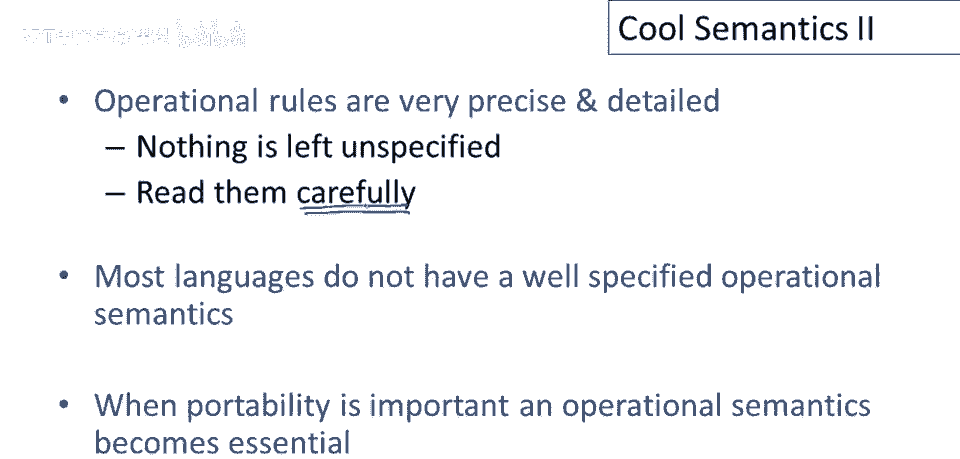