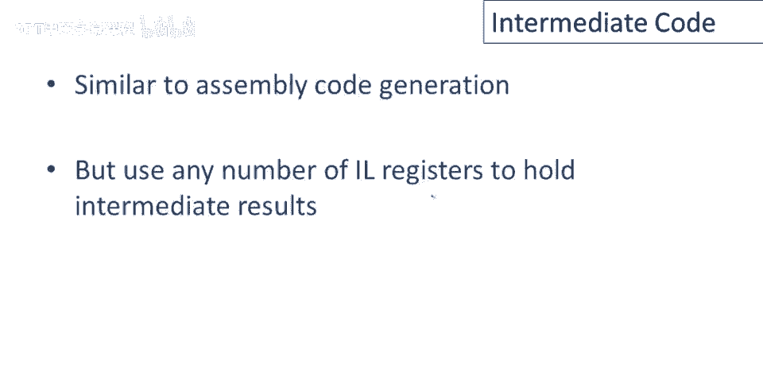

# 【编译原理 CS143 】斯坦福—中英字幕 - P72：p72 14-01-_Intermediate_Cod - 加加zero - BV1Mb42177J7

本视频中，将简要介绍中间代码及其编译器中的应用。

首先需要解答的问题是中间代码或中间语言是什么，和，顾名思义，中间语言就是如此，它是介于源语言和目标语言之间的语言，记住编译器的作用，编译器将用某种源语言编写的程序，翻译成某种目标语言，因此在这门课中。

例如，源语言常很酷，目标语言常是MIPS汇编代码，实际上，中间语言在这两者之间存在，使用中间语言的编译器首先将其源语言翻译成中间语言，然后稍后翻译中间，中间语言中的代码为目标语言，你可能会想。

为什么要让生活变得如此困难，为什么为什么为什么分两步做，如果可以一步完成，结果表明，对于许多目的，这个中间级别实际上非常有用，因为它提供了一个中间级别的抽象，特别是，中间语言可能比源语言包含更多的细节。

所以，例如，如果我们想要优化寄存器使用，嗯，你知道，像Cool这样的源语言，在源级别没有寄存器的概念，因此无法表达，你可能想用寄存器做的优化，所以一种中间语言，至少包含寄存器，将允许你谈论。

并编写算法尝试改进程序中寄存器的使用，另一方面，中间语言将比目标语言更少细节，例如，中间语言可能略高于特定机器特定指令集的级别，因此更容易重新定位，将中间层代码应用于多种机器，正因为没有，嗯。

特定机器的所有细节，经验表明，拥有中间语言实际上是个好主意，几乎所有编译器都有中间语言，实际上在实现中，一些编译器有不止一种，源语言与目标语言间，本课程余下部分仅考虑一种中间语言。

我们要看的中间语言将是高级汇编，如前一幻灯片所示，该语言将使用寄存器名，但数量不限，可以使用任意数量的寄存器，不必限于3个，2或64个寄存器，控制结构将很像汇编语言，特别是，将有明确的跳转和指令标签。

语言还将包含操作码，因此它们看起来像汇编语言级别的操作码，但其中一些操作码将是高级的，例如，我们可能有一个名为push和push的操作码，最终将翻译为特定目标机器的多个具体汇编语言指令。

在我们将看到的中间代码中，每条指令只有两种形式，它将要么是一个二元操作，要么是一个一元操作，并且始终在右侧的参数，在这种情况下，y和z将是寄存器或常数，它们也可以是立即值，嗯，这是一种非常。

非常常见的中间代码形式，广泛使用，它被广泛使用，实际上它有名字，它被称为三地址代码，因为每条指令最多有三个地址，最多两个参数，然后是一个目的地，现在要看到这段代码实际上很低级，注意到你知道。

涉及多个操作的高层表达式，将不得不翻译成只执行一次操作的指令序列，例如，如果我有一个表达式x等于，抱歉，x加y乘z，让我在这里放入括号以显示关联，因此乘法比加法更紧密地绑定，我们将不得不。

这种形式的中级语言不能直接编写，相反，我们不得不写成如下所示，我们首先必须计算y乘z，并将其分配给一个新的寄存器或临时变量，或你知道一个新的寄存器t1来持有中间值，然后我们可以使用t1来计算x加t1。

整个表达式的值，将存储在另一个寄存器中，强制你一次只使用一个操作的影响，基本上可以一次执行一个基本操作，结果必须存储在寄存器中，这给程序的每个子表达式命名，所以如果我回头看这里的这个表达式，我看到。

你知道，y乘以z是匿名的，在这个表达式x加y乘以z中，表达式y乘以z本身没有名字，通过像这样重写，实际上命名了中间结果，所以再次，总结一下这一点，编写复合表达式为一系列指令的后果。

每次只执行一个操作是每个中间值都将有自己的名字。

生成中间代码与生成汇编代码非常相似，我们不会详细讨论这一点，因为它非常相似，但我会为你简要概述，生成汇编代码和生成中间代码的主要区别，是我们可以在中间语言中使用任意数量的寄存器来存储中间结果。

生成中间代码，我们可以编写一个名为ien的中间代码生成函数，它接受两个参数，它接受我们要生成代码的表达式，以及结果应存储的寄存器，为了给你一个例子，这是我将做的唯一例子。

让我们看看为加法表达式生成中间代码，所以我想为e一，加上e二，并将结果存储在寄存器，T中，所以首先我要做的是，我将为子表达式生成代码，我需要一个地方来存储子表达式的结果。

所以我将为这些结果制作新的寄存器名称，我将为e一生成代码并将其存储在某个寄存器t一，我将为e二生成代码，并将结果存储在某个寄存器t二，然后我们可以计算总和，所以t将等于t一和t二的和。

注意这是一个三地址指令，我们在这里遵守规则，仅在我们的中间代码生成器中使用三地址指令，并且还注意到由于我们有无限数量的寄存器，这实际上导致生成中间代码非常简单，实际上它比为堆栈机器生成代码还要简单一点。

回忆一下在堆栈机器中，这里需保存栈上e一的中间结果，这涉及，你知道，不止一条指令来实际推入结果并调整栈指针，诸如此类，嗯，这里我们可以直接保存在寄存器中，然后使用那个寄存器名。

呃，稍后，这就是关于中间代码的全部，对于这门课，你应该能使用中间代码，在我们将使用的水平上，在讲座中，在未来的视频中，实际上我们会经常查看中间代码，特别是用它来表达某些优化。

你也应该能够编写简单的中间代码程序，你应该能够编写在中间代码上工作的算法，但我不期望你懂如何生成中间代码，因为我们不会进一步讨论，而且坦率地说，它没有引入任何新思想，它实际上只是代码生成的一种变体。

我们已经详细讨论过的想法。

