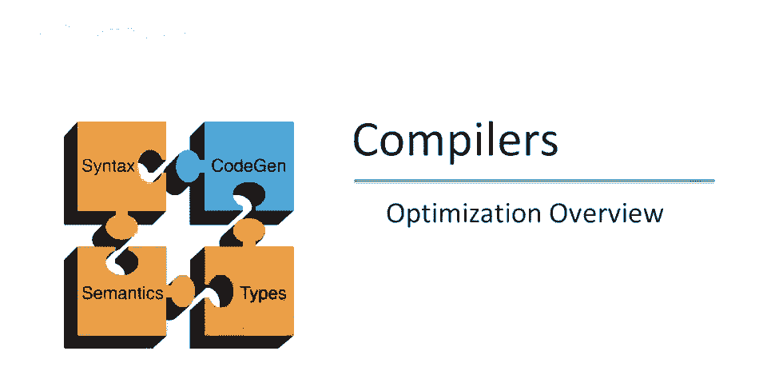
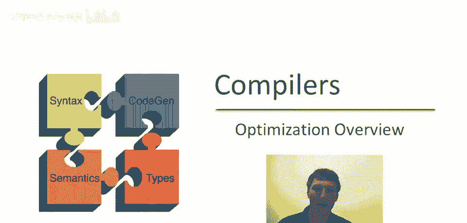
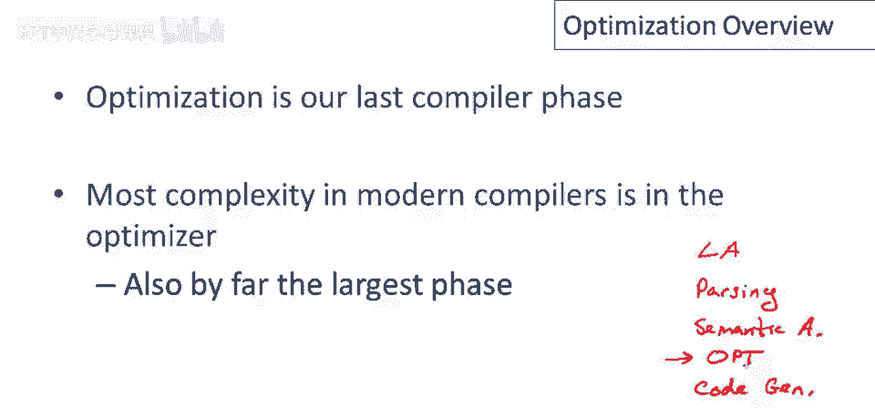
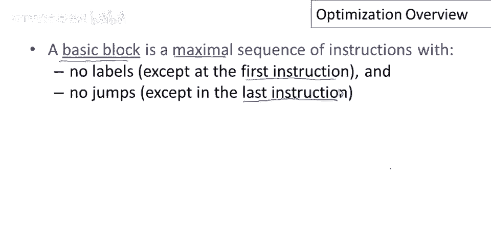
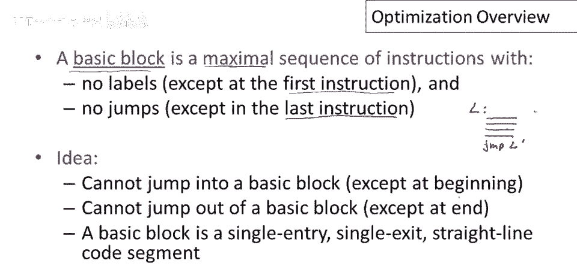
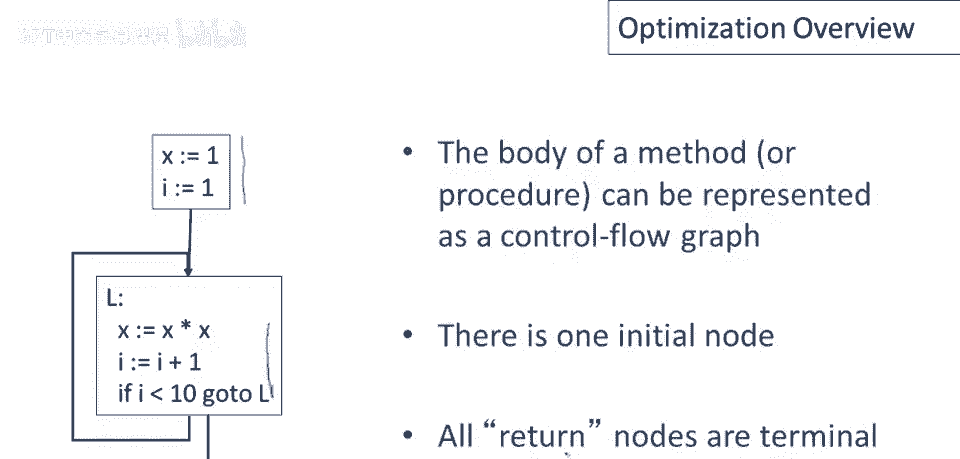
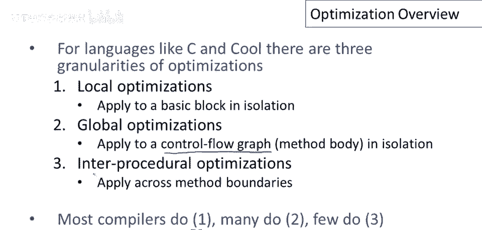

# 【编译原理 CS143 】斯坦福—中英字幕 - P73：p73 14-02-_Optimization_Ove - 加加zero - BV1Mb42177J7

我们现在准备开始下一个主要话题，程序优化，在这段视频中，我们将简要概述优化原因和权衡，以及编译器决定实施哪种优化的权衡，嗯，对于编译器决定实施哪种优化。

优化是编译器讨论的最后一个阶段，嗯，让我们非常简要地回顾一下，嗯，编译器阶段，首先是词法分析，然后是解析，然后是语义分析，在那之后，嗯，我们讨论了代码生成，现在我们要讨论优化，好的。

实际上优化在代码生成之前进行，因为我们想在提交到机器码之前改进程序，但当然是我们讨论的最后一个，但只是想指出这里，优化通常位于语义分析和代码生成之间，在现代编译器中，这是大多数动作发生的地方。

它通常拥有最多的代码，也是编译器中最复杂的部分。

现在，一个非常基本的问题是何时执行优化，我们实际上有一些选择可以在抽象语法树上进行，一个很大的优势是它是机器无关的，但对于许多优化我们想这样做，结果表明抽象语法树将太高。

我们实际上无法表达我们想执行的优化，因为这些优化依赖于机器的低级细节，或我们生成代码的机器类型。

这些细节在抽象语法树中不存在，另一种可能性是在汇编语言上执行优化，这里的优势是机器的所有细节都暴露了，我们可以看到机器正在做的一切，我们可以谈论机器的所有资源，因此原则上。

任何我们想执行的优化都可以在汇编语言级别上表达，现在，在汇编语言上执行优化的缺点是它们依赖于机器，然后我们可能需要为每种新的架构重新实现我们的优化，正如我们在上一个视频中提到的，嗯。

另一种选择是使用中间语言，可能，如果设计得好，仍然与机器无关，意味着它可以，它可以略高于非常具体的，特定架构的细节，我的意思是，它仍然可以代表一大类机器，但与此同时，暴露足够的优化机会。

编译器可以很好地提高程序的性能。

我们将研究对中间语言优化的，由该语法给出的操作，因此在这种情况下，程序是一系列语句，语句由赋值组成，可以是简单的复制或一元或二元操作，我们可以从栈中推入和弹出东西，然后我们有几种不同的跳转。

我们有比较和跳转，我们比较两个寄存器的值，然后根据条件跳转到标签，我们有无条件跳转，最后有标签，跳转的目标，这里是寄存器名称，我们也可以在操作符的右侧使用立即值而不是寄存器，我们假设典型的操作符。

一些典型的操作符家族，如加、减、乘，等等。

现在优化通常针对语句组，最重要的和最有用的语句分组是基本块，因此，基本块是一系列指令，我们通常希望它是最长可能的序列指令，因此我们希望它是最大的，这个序列有两个属性，首先，除了可能的第一条指令外。

没有标签，并且在指令序列中没有任何跳转，除了可能的基本块的最后一指令外，基本块背后的想法。

以及我们要求这些两个属性的原因是因为它是保证流动的，执行是保证从块的第一个语句，到最后一个语句的，因此，基本块内的控制流是完全可预测的，一旦我们进入块，一旦我们从块的第一个语句开始，它可能有一个标签。

将有一系列语句必须全部执行，在我们到达最后一个语句之前，它可能是跳转到代码的其他部分的跳转，一旦我们到达这里。

一旦我们到达这个第一个声明，我们保证执行整个块，不会跳出去，没有跳出的方法，也没有方法跳入块内，你不能从程序的其他随机部分开始执行，比如从第二或第三条指令开始，进入块的唯一方式是通过第一条指令。

离开块的唯一方式是通过最后一条指令，这是一个基本块示例，为了展示基本块的有用性，让我们观察我们可以优化这段代码，好的，因为3总是在2之后执行，这条指令总是在这条指令之后执行。

我们可以将第三条指令改为w等于3乘以x，好的，因为我们可以看到t是2x加x或2倍的x，这里我们又在添加一个x，所以w实际上总是等于3倍的x，嗯，一个问题，这当然是一个正确的优化，并且完全正确。

因为语句2总是保证在语句3之前执行，我们可能还会问是否可以消除这个语句，一旦我们将其替换为3倍的x，你知道，也许我们不再需要这个赋值了，如果这是t唯一被使用的地方，如果t是一个临时值。

只是为了计算w的值，然后我们可以删除这个语句，这取决于程序的其他部分，我们必须知道，嗯，t是否在程序的其他地方有其他用途，嗯，程序的其他地方。

我们仅通过查看单个基本块无法看到，下一个重要的语句分组是控制流图，控制流图只是一个基本块的图，如果执行可以从块a的最后一指令传递到块b的第一指令，那么从块a到块b有一条边，所以本质上。

控制流图只是显示了控制流如何在块之间传递，当然，在块内没有有趣的控制流，我们知道基本块将从第一条指令执行到最后一条指令，所以控制流图是总结程序中有趣决策点的一种方式，的一种方式，在过程或其他代码中。

显示有趣控制流决策点，这是一个简单的控制流图，由两个基本块组成，第一个基本块在循环外，包含初始化代码，然后我们在循环中有一个基本块，基本块包含底部三个指令，有一个分支，或测试分支，我们退出或去其他地方。

或循环并再次执行循环体。

好的，方法体可表示为控制流图，我们使用总有一个特殊入口节点的惯例，控制流图有一个特殊起始节点，通常很明显，将是顶部列出的那个，然后会有一些返回节点或你可以从中返回的节点，你知道，如果有返回语句在过程内。

返回节点或退出点，过程将总是终结的。

意味着那些块不会有出边，优化目的是提高程序资源利用率，本课程目的，当我们谈论优化时，在我们的示例和视频中将讨论执行时间，我们谈论的是，将讨论使程序运行更快，这是人们最关心的。

因此大多数编译器都花很大力气使程序运行更快，但重要的是要认识到，还有许多其他资源可以优化，实际上，对于你能想到的任何资源，那里，很可能有一个编译器在努力优化它，在特定应用领域，例如。

我们可能关心的编译器是代码大小，我们可能关心发送的网络消息数量，其他通常优化的内存使用，磁盘访问，所以，数据库，例如，尽量减少访问硬盘和电源的次数，嗯，对于电池供电设备。

优化的一个重要方面是它不应该改变程序计算的内容，答案仍然必须相同，好的，因此我们可以提高程序的资源利用率，但我们不能改变程序将产生的内容。

现在对于像C和Cool这样的语言，以及你可能熟悉的其他语言，人们通常谈论3种优化粒度，一种是局部优化，这些是对基本块孤立的优化，这些是在单个基本块内发生的优化，然后是所谓的全局优化，这实际上被误命名了。

因为它不是整个程序的全局，人们所说的全局优化，意味着控制流图，它是整个函数的全局，对，所以全局优化适用于单个函数，并优化该函数的所有基本块，最后有跨过程优化，这些是跨越方法边界的优化，它们取多个函数。

并移动东西以尝试优化整个函数集合，许多编译器做一种，事实上几乎所有编译器都做一种，嗯，许多编译器今天做两种，但实际做三种的并不多，好的，所以你看，随着粒度的增加，编译器的数量在减少，嗯。

部分原因是这些优化更难实现，所以实现跨过程优化需要更多的工作，嗯，但也是因为很多收益在于，更局部的优化，稍微扩展一下最后一点。

实际上，虽然我们知道如何做许多许多优化，经常有意识地决定，不实现研究文献中已知的最先进的优化，这对我来说有点不幸，作为一个真正喜欢编译器的人，花了很多时间思考优化。

也许对于专业的编译器研究人员来说有点难以接受，人们并不总是想要实现最新最好的优化，但值得理解为什么可能不是这种情况，这本质上归结为软件工程，其中一些优化真的很难实现，我的意思是它们实现起来很复杂。

其中一些优化在编译时间上很昂贵，所以即使编译是离线的，不是程序运行的部分，你知道，程序员仍然需要等待，直到优化编译器完成编译，这些优化中的一些在编译时间上很昂贵，所以即使编译是离线的。

不是程序运行的部分，你知道，程序员仍然需要等待，直到优化编译器完成编译，优化程序可能需要几小时甚至几天，你知道这不一定很好，其中一些优化收益低，它们可能会改善程序，但可能只提高一点点，不幸的是。

文献中许多最复杂的优化具有所有这些特性，它们很复杂，它们需要很长时间运行，而且它们效果不大，因此并不奇怪，并非所有都能在生产编译器中实现，实际上，你知道，指出了优化真正的目标是。

我们真正想要的是最大收益最小成本，我们实际上在谈论成本效益比，因此优化在代码中花费一定量，复杂性，我的意思是，等待编译器运行，以及其好处，改进程序的程度必须足够大以证明这些成本。

