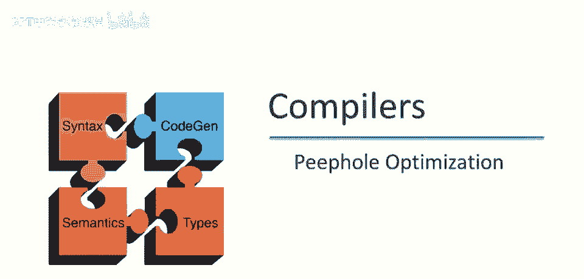
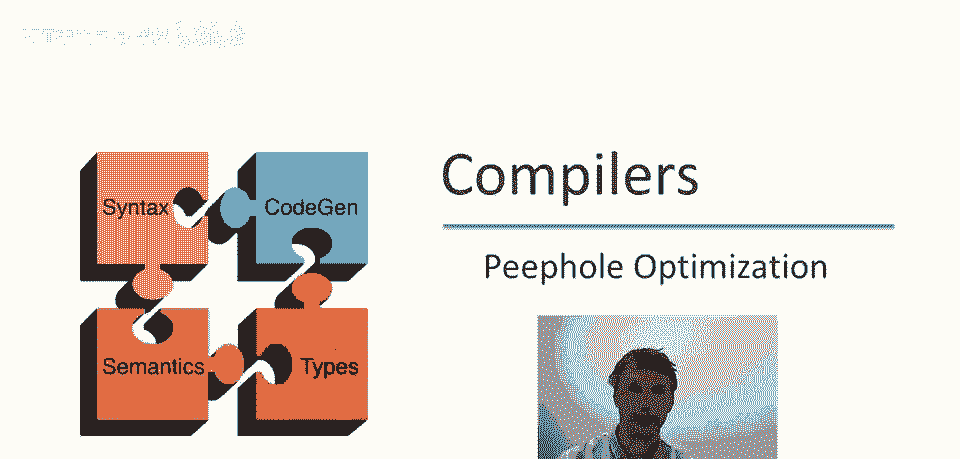
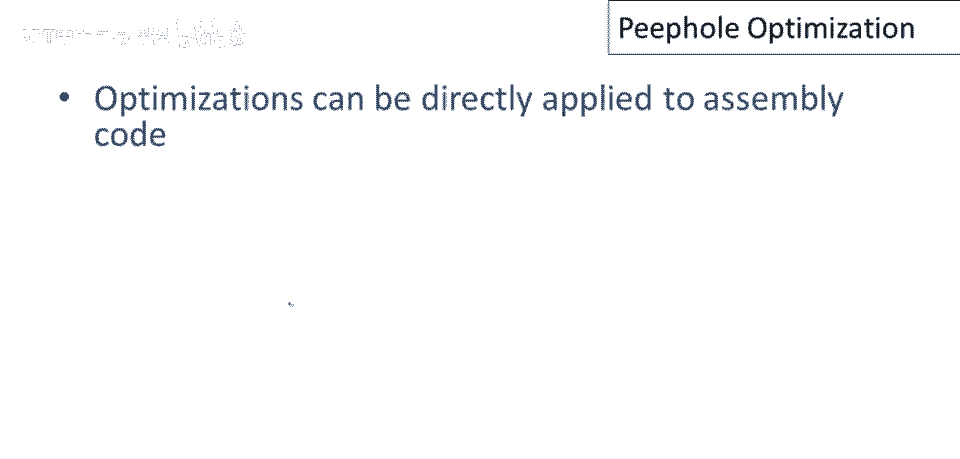
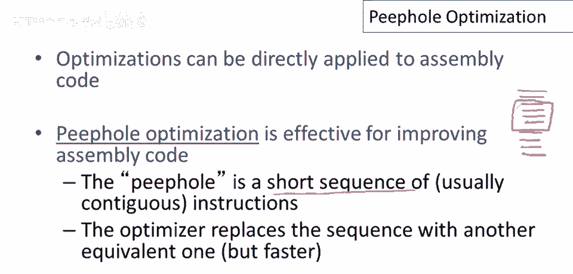
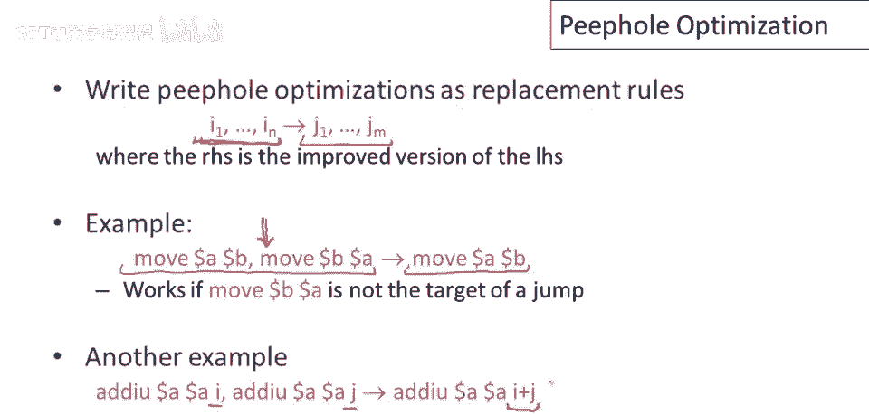
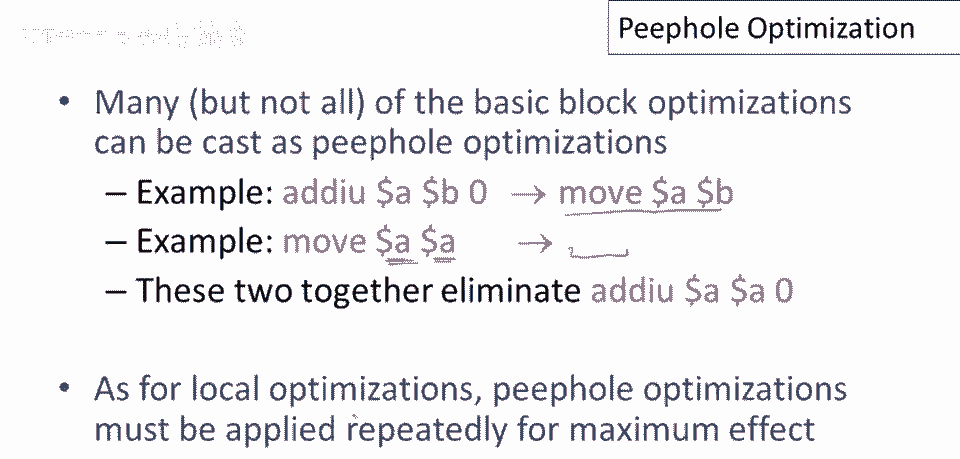
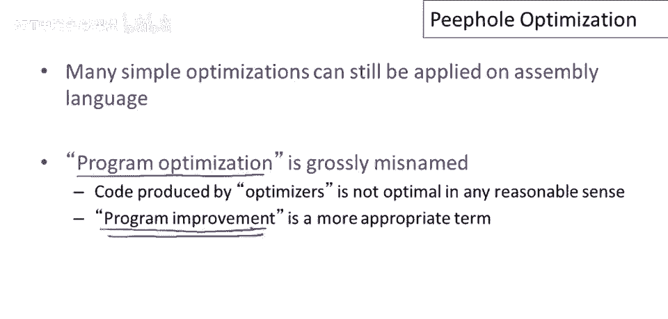

# 【编译原理 CS143 】斯坦福—中英字幕 - P75：p75 14-04-_Peephole_Optimiz - 加加zero - BV1Mb42177J7

在这段视频中，我将谈论局部优化的变体，直接应用于汇编代码的称为窥孔优化。

基本思想是，而不是优化中间代码，我们可以直接在汇编代码上优化。

窥孔优化是其中一种技术，窥孔代表一段通常连续的指令，所以我们的程序，我们可以，可以将其视为一系列指令，我们的窥孔是该程序的一个窗口，所以如果我们的窥孔大小为四，我们可以想象自己通过一个小孔看着程序。

我们所能看到的就是四个指令的短序列，然后我们可以优化该序列，然后我们可以滑动窥孔以优化程序的不同部分，优化器将做的是，它将，你知道，盯着这个短的指令序列，如果它知道一个更好的序列。

你将用另一个序列替换它，然后它将重复这个，如我所说，你知道，应用其他转换可能对相同的或其他汇编程序部分。

所以窥孔优化通常被编写为替换规则，所以我们将指令窗口放在左边，所以将有一些指令序列，我们将知道一些其他指令序列，我们更喜欢在右边，所以如果我们看到左边的指令序列，那么我们将用右边的替换它，例如。

如果我从寄存器b移动到寄存器a，然后从寄存器a移动回寄存器b，那么第二个移动是多余的，它可以简单地被删除，因此我们可以将这个两个指令序列替换为一个指令序列，这将在没有可能跳转目标的情况下工作。

所以如果代码永远不会跳转到这条指令，那么这条指令可以被删除，另一个例子，如果我向寄存器a添加i，然后随后向寄存器a添加j，我可以做一个常数折叠优化，并将这两个加法合并为一个加法。

其中我将i加j的和添加到寄存器a。

所以许多，但并非全部，我们在上一视频中讨论的基本块优化可以转换为，也如窥孔优化，例如，若将零加至寄存器，然后存储至另一寄存器，那可替换为寄存器移动，若将值从同一寄存器移至自身，这就像自我赋值。

该指令可删除，替换为空指令序列，综合这两条指令为这两优化，抱歉，能否消除向寄存器添加零，首先，这个翻译成从a到a的移动，然后，从a到a的移动将被删除，正如这个小例子所示，就像本地优化一样。

人员优化需要反复应用以获得最大效果。

我希望这个简单的讨论已经向您表明，许多优化可以直接应用于汇编代码，嗯，直接对汇编代码，优化中间代码并没有真正的魔力，若用任何语言编写的程序，中间语言汇编语言，谈论该语言程序的转换有意义，以改善程序行为。

此时提及程序优化很重要，程序优化实为糟糕术语，编译器不产生最优代码，纯属偶然，若编译器能生成给定程序的最佳代码，实际上编译器所做的，他们有一系列优化，可改善程序行为，他们会尽可能多地改进。

程序优化实质就是程序改进，我们试图让程序更好。

