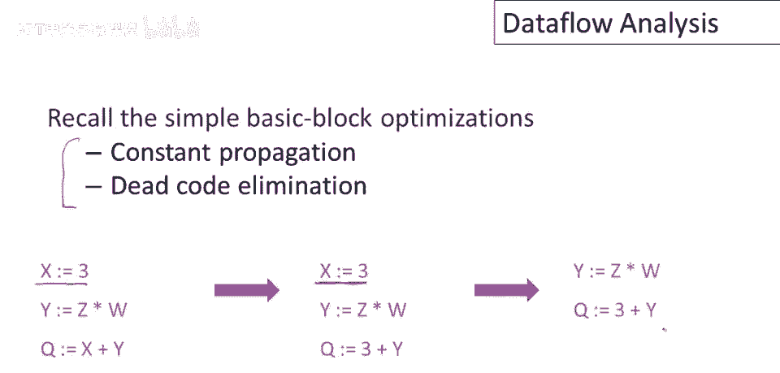
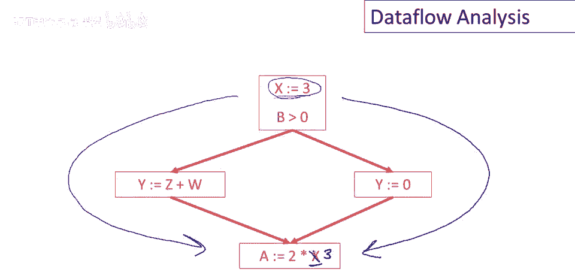
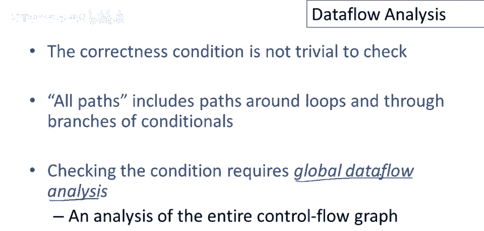
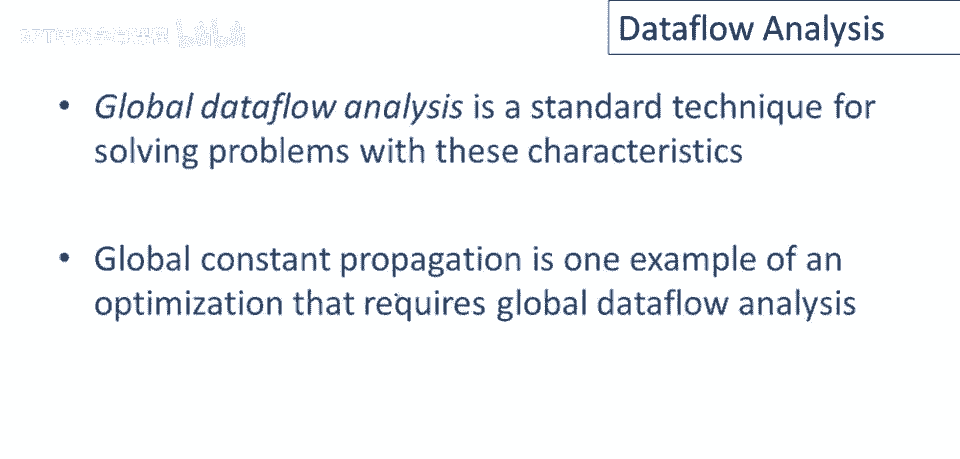

# 【编译原理 CS143 】斯坦福—中英字幕 - P76：p76 15-01-_Dataflow_Analysi - 加加zero - BV1Mb42177J7

本视频中，我们将开始讨论全局程序优化，结果发现要讨论全局优化，还有另一个话题要处理，最初称为数据流分析。

让我们先回顾简单的基本块优化，特别是常量传播和死锥消除，这是一小段代码，我们注意到给x赋了一个常数，我们从局部优化讲座中知道，该常量赋值可向前传播，若基本块为单赋值形式，这特别容易做到。

若此处x的值未使用，程序中的任何其他地方，该语句为死代码，可删除，这是一个基本块的简单示例，嗯，合并常量传播和死代码消除。

这些优化可扩展至整个控制流图，现在我们有一个非平凡的，我记得控制流图是基本块的图，节点是基本块，边显示基本块间的控制转移，所以这第一个基本块有一个测试，和一个if语句，如果测试为真，进入不同的基本块。

如果测试为假，现在在这个控制流图中，观察到x被赋常数，然后下面有x的使用，实际上，在这种情况下，用常数三替换x的使用是安全的，就像我们在单个基本块中传播常数一样，嗯，我们至少在某些情况下。

也可以在整个控制流图中传播常数。

但实际上有些情况并不安全，嗯，传播常数，所以这里再次，让我们观察，我们有x的赋值，常数赋给x，下面我们使用x，但不能将此处的x替换为3，为什么不能呢，因为在这里我们有另一个x的赋值，x取值于。

这个例子的有趣之处在于，注意x只被赋予常数，因此x被赋予一个常数，这里x也被赋予一个常数，但这里的x值是未知的，我们不知道哪个常数将被赋予，因为如果我们从这条执行路径来，那么x将是四。

如果我们从这条路径来，x的值将是三，因此我们不能用这些值中的任何一个替换这里的x，这种情况下，将常数传播到x的使用不安全，那么问题就是，我们如何知道何时可以全局传播常数。

现在关于常数传播，结果有一个简单的标准，嗯，用常数k替换x的使用，我们得知道以下事实：到x使用的每条路径上，所以每条通往x使用的路径，x的最后赋值是x等于k，所有通往x的路径，这很合理，直观上我认为。

嗯，我们一定在那条路径上赋值了常数x，那实际上必须是每条路径上x的最后一次赋值。

让我们再次看看我们的例子，这里我会换个颜色，嗯，所以这里我们有赋值x等于三，这里我们使用x，现在我们需要做的是检查，以将x替换为3，每条到达x的路径，它到达x，沿该路径，x是正弦3，只有两条路径。

这条路径和这条路径，显然，这个赋值在这两条路径上都适用，因此，最后一条赋值在这两条路径上，在所有路径上都是，嗯，X等于3，因此可替换此X为3。

与这种X用法相反，示例中，路径上X赋值为3，我们有一条路径到达这里，实际上让我画整个路径，沿此路径，最后对X的赋值为4，因此不能将任何常量值传播到此X使用。

总体上，变量赋相同常量锁定所有路径的条件，使用该变量的难度并不容易检查，因为所有路径包括绕过循环的路径，以及通过条件的路径，如我们在示例中看到的，通过一系列技术实现这些条件，称为全局数据流分析。

专门用于检查此类条件，本质上，全局数据流分析被称为全局，因为它需要对整个控制流图进行分析。

暂时退一步，有许多全局优化任务，我们希望编译器执行常量传播，全局常量传播只是其中之一，结果发现所有这些全局优化问题具有一些共同特征，首先，优化始终依赖于知道某些属性，X在程序中的特定点。

所以我们想要知道一些非常局部的信息，例如，在程序的特定点，x是否保证是常数，好的，那是，那是常量传播的性质，然而，即使我们想了解一些局部事实，一些你知道特定于程序中某个点的事实。

证明这个事实需要知道整个程序，所以或至少整个控制流图，正如我们在常量传播的情况下看到的，要确定x在程序的特定点是否为常数，需要推理所有通往该语句的路径，那是一个全局属性，我一直在阅读所有可能的路径。

你知道，从方法入口点的路径，一直，你知道，通过循环和跨条件，到特定语句，好吧，总的来说，这是一个很难解决的问题，对于某些问题，解决它真的非常昂贵，正是这一点使我们得以拯救，总是可以保守，因此。

对于这些优化，如果我们想要知道某些属性，X那么我们真正想要知道的是x是否肯定正确，所以如果我们说属性为真，那么我们必须正确，我们不能犯错误，这就是为什么我们可以保守的原因，但说不知道总是可以的。

放弃并说没关系，我们不知道属性是否成立，在最坏情况下，我们就不优化了，如果我们不能建立条件，那意味着优化肯定正确，然后我们要安全行事，不做优化，所以有近似技术或不一定给出正确答案的技术是可以的。

只要我们总是正确，当我们说属性成立时，否则我们只是说不知道属性是否成立，总之，全局数据流分析是一种标准技术或技术家族，用于解决我们刚刚讨论的问题，全局常量传播是要求全局数据流分析的一个优化示例。

在接下来的几个视频中，我们将更详细地研究全局常量传播和另一种数据流分析。

