# 【编译原理 CS143 】斯坦福—中英字幕 - P77：p77 15-02-_Constant_Propaga - 加加zero - BV1Mb42177J7

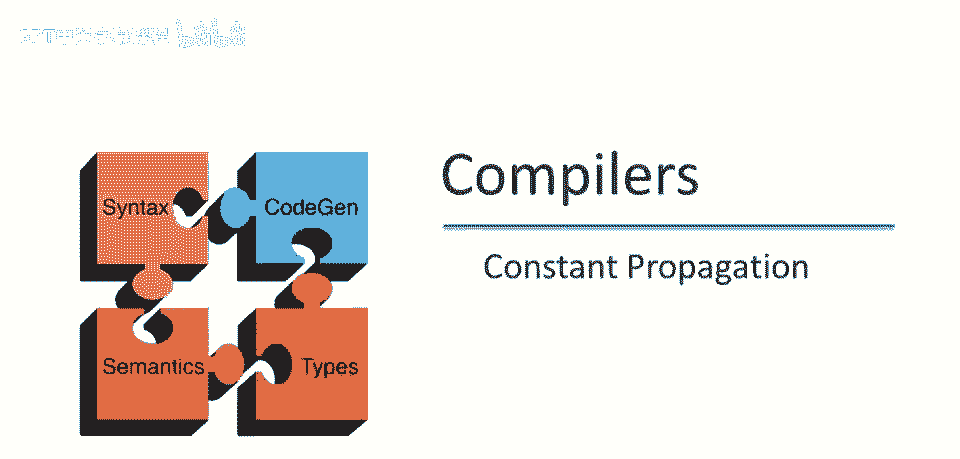

本视频中，我们将继续讨论全球数据流分析，详细看看全局常量传播如何工作。

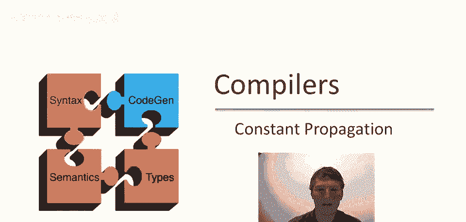

首先，让我们回顾一下进行全局常量传播的条件，因此，用常数k替换变量x的使用，我们需要知道以下属性，到x使用的每条路径上，x的最后赋值为x=k，好的，再次，对于x使用的每条路径，这必须为真。

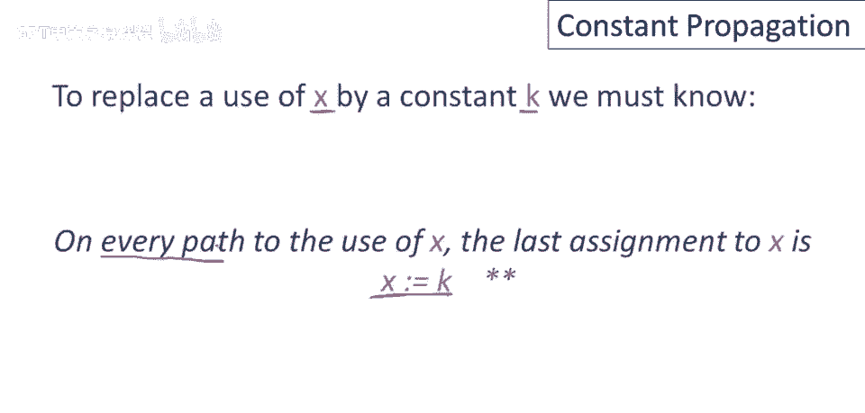

现在，只要该属性成立，就可以在任何一点执行全局常量传播，本视频中，我们将看看，为所有程序点计算单个变量x属性的情况，我们将取一个，我们将专注于一个变量x，并计算它在每个程序点是否为常数。

很容易将算法扩展为计算所有变量的属性，一种非常简单但效率低下的方法是，只需为方法体中的每个变量重复计算一次。

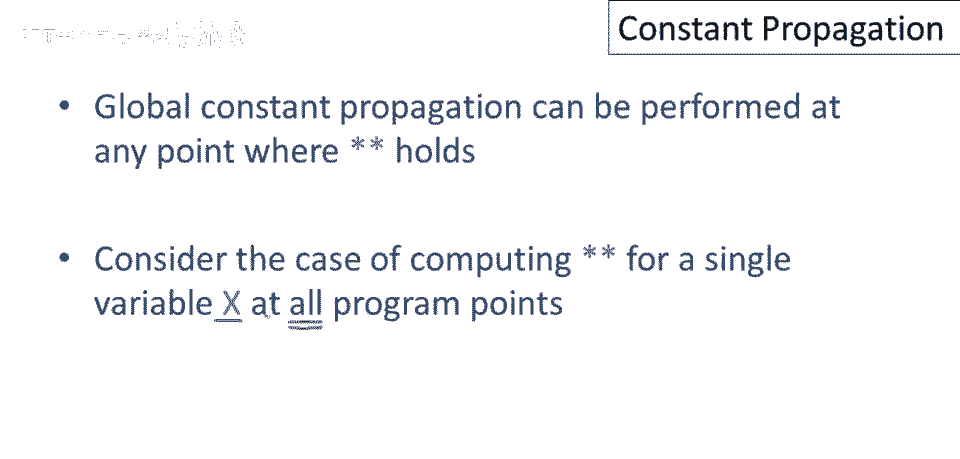

我们将以以下方式关联变量x在每个程序点上的值，让我们从最后一个开始，嗯，我们将给x分配这个特殊值，发音为top，如果x不是常数，因此，如果在程序的特定点无法确定x是否为常数，那么在那个点。

我们将说x是top，这将是我们的安全情况，说我们不知道x的值总是可以的，当我们说x的值为top时，我们实际上在说，我们不知道x是否为常数，在程序的这个点，x可以有任何值，对吧，另一种可能是。

我们将说x是某个常数c，好的，这是一个特定的常数，如果在程序点上说x是常数c，这意味着，实际上在那个程序点，我们相信，或者我们已证明x始终是该常数，现在有一个第三种可能性，可能不是立即直观的。

但正如我们将看到的，在全局常量传播算法中扮演着非常重要的角色，实际上，在所有全局数据流分析中，那就是bottom，好的，就这样，这个值读作bottom，直观上，这个想法是，那是top的反义词。

bottom的解释是此语句永不执行，当我们不知道语句是否执行时，我们会说x在那个点上的值为bottom，意味着我们不知道程序中的那个点是否可达，在那个点上x的值无关紧要，因为那个语句从不执行。

我们将给x分配这三种值之一，bottom，某个常数，或top。

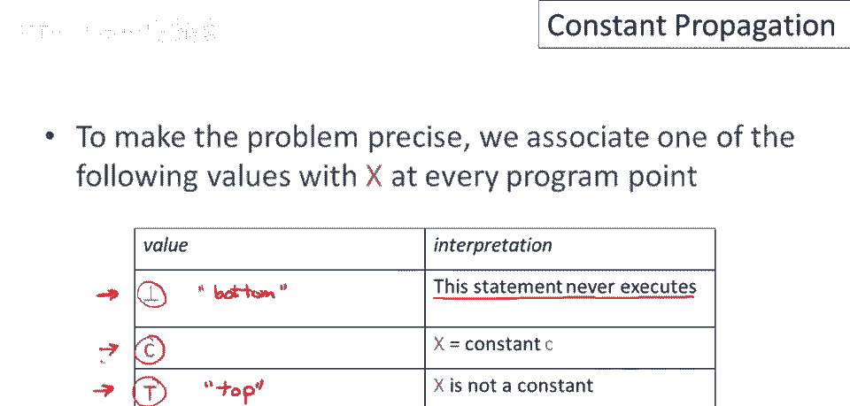

让我们通过一个手动的例子开始，我们的目标是对于每个程序点决定x是否可以是常数，肯定不是常数，或者我们认为该语句可能永远不会执行，好的，执行将从控制流图的顶部开始，这是入口点，在执行开始之前。

我们不知道x的值，我没有对之前的基本块中的代码做出任何假设，因此为了安全起见，我会说在这个点上x有一个未知值，我们不知道x的值，它可以是任何东西，所以x等于top。

这是我们希望第一个基本块的入口具有的性质，现在，在赋值x等于三之后，这些指示我们谈论的是哪个点，所以在赋值x等于三之后，我们肯定会知道x是常数三，现在有一些值得指出的事情，即我们的程序点。

我们附加这些知识到的点，或这些事实是在语句之间，所以当我说x等于三在这个程序点时，我的意思是，在执行这个赋值之后，x等于三，但在这个条件语句的谓词执行之前，我知道x等于三，好的，程序点在语句之间。

每个语句前和后都有一个程序点，接下来发生的事情是这个条件分支，注意分支没有更新，x甚至没有引用x，所以在分支执行后，我们肯定会知道x在两个分支上仍然等于三，好的现在，做右分支，下一步赋值给y。

不影响x的值，所以赋值给y后，仍知x等于三，现在，看左分支，这里先赋值给y，不影响x的值，所以赋值给y后，我们知道x仍等于3，现在给x赋值，好的，所以在这个程序点之后，我们将知道x的值不同。

现在我们知道x等于4，好的，现在这条语句后我们知道x等于4，这条语句后我们知道x等于3，好的现在，那么在这条语句之前发生了什么我们知道了什么，好的，a等于2x，这里指出，之前和之后有程序点。

所以这里的程序点，在a赋值之前不同，与x等于4和y等于0之后的程序点，直观上，x等于4后，我们仍在左侧路径，知道x等于4，这里y等于0后，我们仍知道我们在此路上，X等于3，但在我们到达a等于2倍之前。

X我们不再知道从哪条路来，这是这两条路径的合并点，都导致此声明，关于x的值我们能说些什么，嗯，没有常数可分配给x，因为在一条路径上x是3，在另一条路径上是x是4，因此我们在这里必须说。

在赋值执行之前a等于，X，抱歉，X等于顶部，我们不知道x的值，另一种说法是，我们不知道x是常数，所以赋值后执行，不影响x的值，我们也会有x等于顶部。

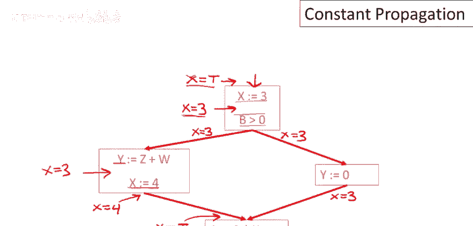

现在注意一旦我们有全局常量信息，一旦我们知道每个程序点，x的状态如何，优化将非常容易，我们只需查看与语句相关的信息，然后会告诉我们当该语句执行时x是否为常数，如果x在那时是常数。

我们可以用常数替换x的使用，关键问题，当然，我们如何计算这些属性，我们手动做了一个例子，如何在系统化方式下，对任意控制流图计算x属性。

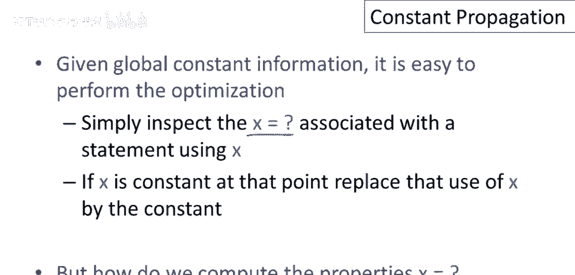

现在可讨论数据流分析算法，所有算法中有一基本原则，值得立即提及，复杂程序分析可表达为，相邻语句间信息变化简单规则组合，仅关注局部规则，并且，构建全局数据流分析的方法实际上。

通过仅查看单个语句及其邻居的规则组合。

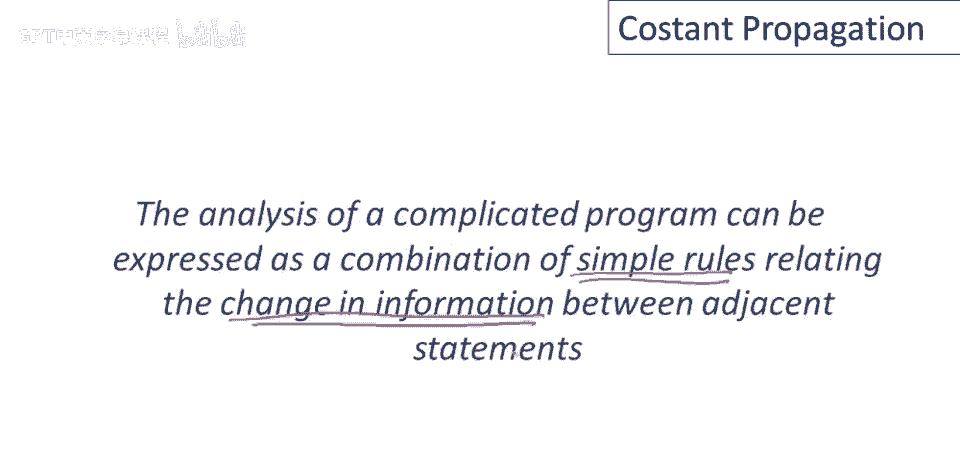

规则背后的想法是将信息从一个语句推送到下一个，因此对于每个语句s，我们将计算x在之前和之后的值信息，记住，那是我们想要附加信息的程序点，因此我们将有一个名为c的函数，代表常数信息，c将接受三个参数。

它接受变量x的名称，它接受我们正在谈论的语句，程序中我们正在查看的具体语句，然后或进或出，这是区分x在s执行前的值，与s执行后的值。

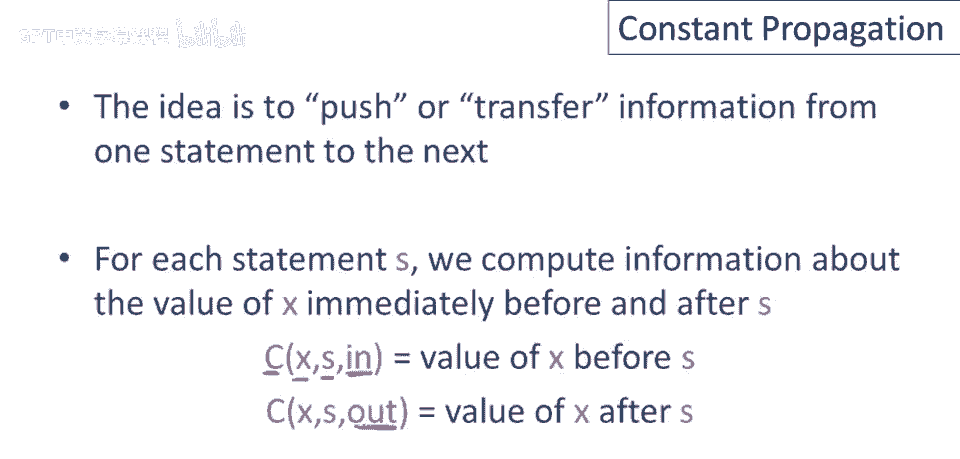

我们将定义，一组传递函数，从一条语句到另一条语句传递信息，在常量传播的规则中，我们需要谈论一个语句及其前驱，因此，我们将说每个语句s都有一些立即前驱，P1到Pn，好吧，所以这些是引导到语句的一步的语句。

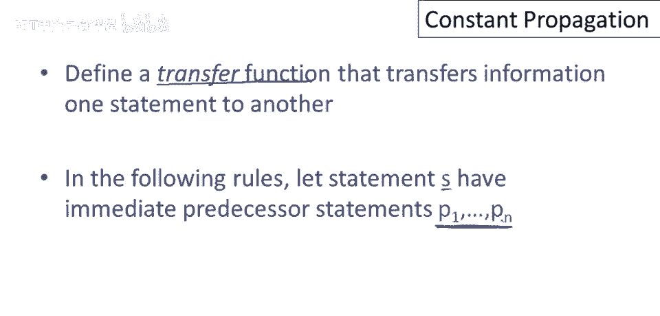

S，我们先做第一条规则，我们有语句s和其前驱语句集，P一，P二，P三，P四，我们感兴趣的情况是，假设x在这些前驱语句后为top，在某个前驱语句后，无所谓哪个，嗯，若x在先前点后为顶。

则x在s执行前须为顶，好的，这就是这条规则说的，若x的任何先前点为顶，则s的x输入也为顶，对吧，这有道理，它说，若不知x在某路径到s是否为常数，我们不知道x在s是否为常数，因为我们所知道的是。

执行已下达，特定来自特定前驱，因此我们无法预测s执行前x是否为常数，s执行，现在让我们看另一种情况，假设在某个前驱执行后x为常数c，另一个进程或不同处理器后，x为不同常数d，即d≠c，在s执行前。

关于x我们知道什么，我们不知道x必须是顶部，因为我们不知道s会是哪个常数，因为在运行时我们不知道哪条路径会到达我们，这是我们手动做的例子中看到的情况，另一种可能是所有前驱都同意，嗯，x的值可能是什么。

所以假设我们有，你知道这里的前驱，执行后，X已知为常数c，X已知为常数c，在此前驱后，还有另一种可能，假设此前驱后，仅知X为底部，好的，规则说，若X有底部属性，或所有前驱对X的可能常数一致。

在程序点之前，在s执行之前，我们知道x将获得，保证是常数c，想想就明白，为什么正确显而易见，首先显然，如果沿着x已知为常数c的路径，因为它们都一致，当我们到达s，X必定取值为c，底部情况如何。

记住那意味着什么，这意味着此语句从未执行，所以这里有一个前驱p，它从未执行，这意味着如果p从未执行，那么沿着这条路径从p到s就无法到达，所以唯一能到达s的路径是那些x已知为常量的路径，好吧。

这就是为什么在这种情况下可以说，如果控制，如果执行到达s，那么可以保证它在x为常数c的状态下到达，最后一种可能是，假设x对所有前驱都是底部，好的，那意味着什么，嗯，这意味着s的所有前驱从未执行。

它们都是不可达的，因此，如果x的所有前驱从未执行，那么s本身也永远不会执行，因此可以推断，在进入x时x为底部。

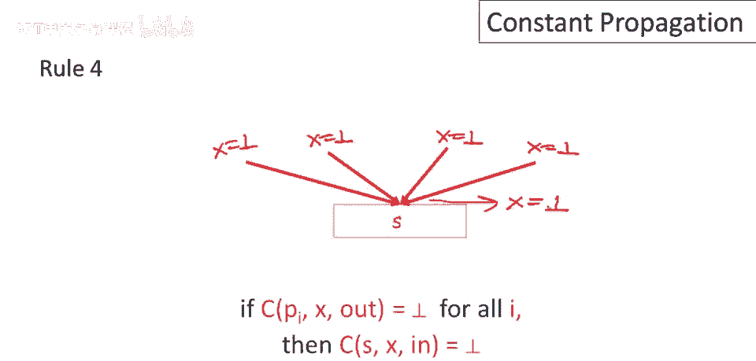

我们刚刚查看的前四条规则，将一个语句的输出与下一个语句的输入相关联，我们还需要规则，将一个语句的输入与该语句的输出相关联，因此，我们必须将信息从语句的输入推送到该语句的输出。

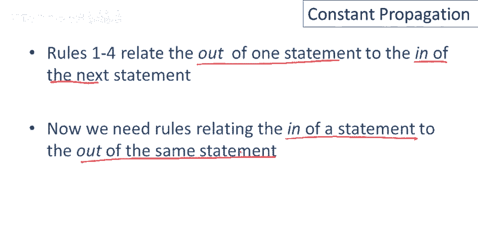

所以再一次，有许多情况，让我们先看看一个简单的，如果x在进入s的程序点之前为底部，那说明s从未从未到达，s从未执行，因此，x在s之后，在s之后也将为底部，因此，如果s之前的程序点从未到达。

那么s之后的程序点肯定也无法到达，另一种可能是，我们在语句中为x赋值为常数c，在这种情况下，语句的输出将等于c，好吧，因此，x在语句执行前的状态并不重要，执行完语句后，x将是常数c。

我应该说与之前的规则有冲突，好的，可能是x在语句执行前为底部，因此，规则六的优先级低于规则五，所以我们，如果我们能说x在语句执行后为底部，我们更愿意这样说，所以规则五将首先应用，然后如果规则五不适用。

所以，如果x是其他常数d或x等于top，然后我们会应用这条规则，并且我们得出结论，x之后将是常数c，这很有意义，如果x是d或x是top，这意味着，就我们所知，控制可以到达这个语句，然后我们在此所说的是。

嗯，在执行完此语句后，执行后，控制可到达此语句，X必定为常数c，另一种可能是我们对x进行了赋值，但右侧比常数更复杂，因此，此情况适用于除常数赋值外的所有情况，好的，因此。

这里的f仅代表比简单常数更复杂的表达式，在这种情况下，我们不知道值是什么，我们不会尝试猜测该计算的结果，我们将说x等于top x，执行此语句后，我们不知道x的值，再次，规则五优先，因此，如果规则五适用。

那么我们会应用规则五，而不是规则七，但如果控制能到达此语句，即上面，x等于某个常数，C或x等于top，那么我们将应用规则七，并得出x在语句后为top的结论，最后，规则八，嗯。

另一种可能是我们赋值给的不是x，在这种情况下，如果x等于某个值，K语句之前，我们就保持这个值，好的，所以无论x在语句底部之前是什么，常数或顶部，如果赋值给的不是下一个变量。

下一个将在语句执行后具有相同的属性。

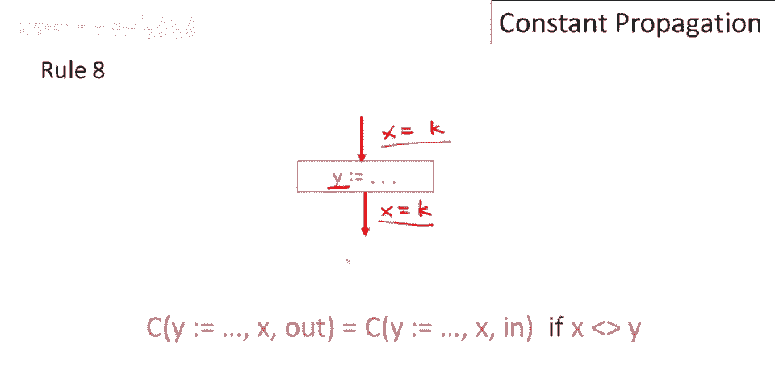

现在我们可以将规则整合成算法，嗯，对于每个入口点，对于程序的每个入口语句，我们将说在进入时我们不知道x的值，所以在那个入口点之前，我们将说x有一个未知值top，然后其他地方我们将说x的值是bottom。

好的，这实际上很重要，所以我们正在做的是直观上，它在说，好吧，就我们所知，除了程序的入口点，肯定可以执行，我们不知道控制流图中其他任何语句是否实际上被执行，因此，我们最初将假设它们不是。

我们只是说x的值是底部，除了入口点之外，现在我们要做的是一种约束满足算法，我们将选择一些语句，不满足1至8规则之一，然后使用适当规则更新，将在控制流图中查找，根据规则信息不一致的地方。

然后更新信息以符合规则。

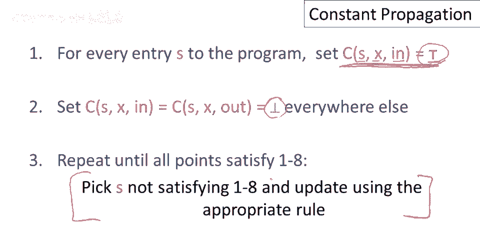

再看下示例，开始时x等于入口处的top，然后有其他所有程序点，我在这里标出，好的，这些都是我们关心的其他程序点，再次，每个语句前和后都有程序点，嗯，我们将所有这些设为bottom，这意味着到目前为止。

控制未到达任何这些点，我们尚未证明这些语句可以执行，现在我们在程序中四处看看，并尝试找到信息与规则不一致的地方，然后更新信息，所以让我换个颜色，开始时，信息实际上到处一致，除了第一个语句。

因为如果x之前是top，而我们给x赋值为3，那么结果不应该是x等于bottom，实际上应该是x等于3，应该是这里适当的信息，一旦我们更新了它，然后我们可以看到下一个语句不一致。

因为现在我们知道这个语句可达，我们有一个语句，并得出结论点之后不可达，这与规则不符，我认为这是规则8的应用，这里有一个不引用x的语句，所以x之前的值在语句后仍然是x的值，所以这变成x等于3。

然后现在我们可以看到这条信息不一致，语句结束处的i与结束处的i不一致，在这种情况下只有一个前驱，所以这些值应该相同，所以x在这个点应该是3，实际上也应该是3，这里有一个对变量的赋值。

下一个的信息应该前后相同，同样的事情现在有一个赋值，X，该赋值前的点是可达的，因为这是常量赋值，嗯，应知x赋值后为常数，这里又有进出的问题，此语句输出与结束不一致，这需要更新，但现在这应是什么？

我们有不一致的先行者，因此这必须是top，然后是x的赋值，抱歉，对非x变量的赋值，信息应仅传播，同样更新如下，现在x已知为top之后，现在查看所有程序点，信息一致，所有规则，如果你，如果你，如果你检查。

语句前后的信息或跨语句，抱歉，或先行者和后继者之间是否正确，根据规则，到处都正确。

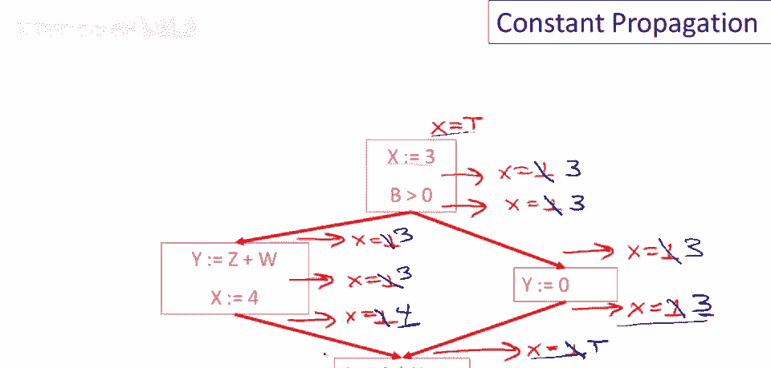