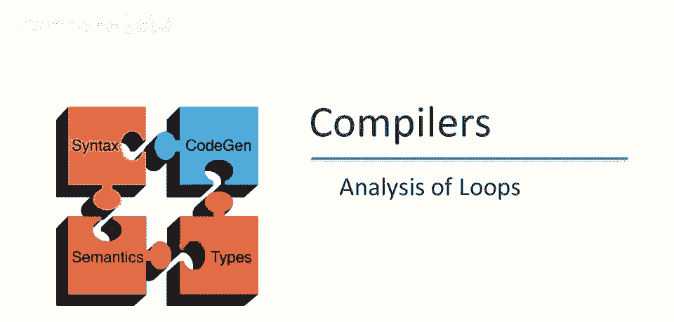
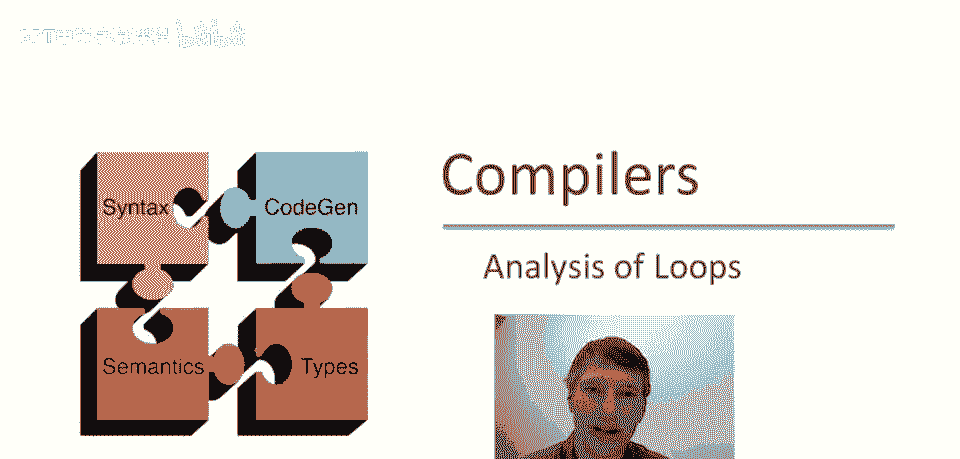
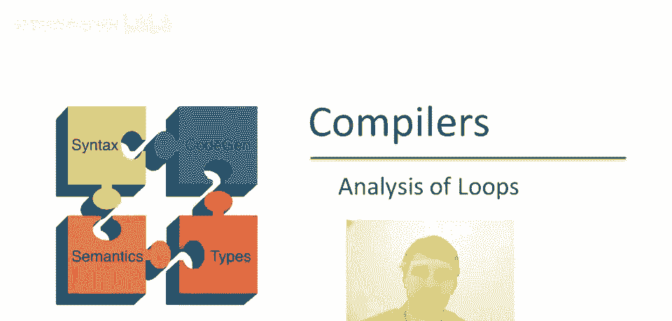
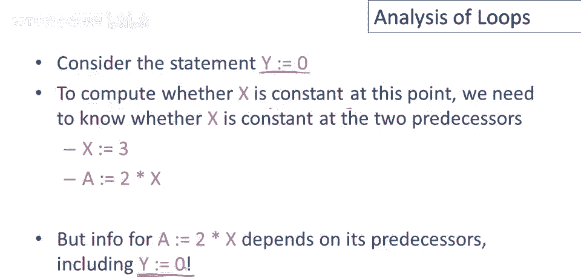
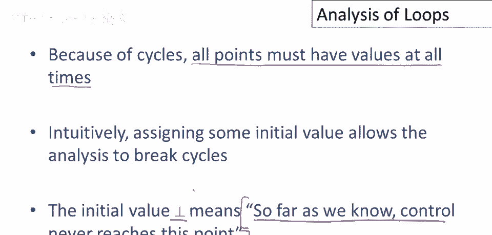

# 【编译原理 CS143 】斯坦福—中英字幕 - P78：p78 15-03-_Analysis_of_Loop - 加加zero - BV1Mb42177J7

本视频中，我们将继续讨论控制流图分析，重点关注无疑是最有趣的部分。

循环分析。

这是一个带循环的控制流图示例，分析中需要特殊元素bottom的需求，与循环分析紧密相关，让我们思考如何用此特定控制流图，进行常量传播示例分析，关于x我们知道什么，好的，最初我们一无所知。

在进入控制流图之前，其值为top，在赋值为3后，我们将知道x的值为3，这里的条件分支，谓词不会影响x的值，因此两条分支上都是3，对y的赋值不会影响它，因此这里也是3，现在我们来这里，好的。

让我们关注这个语句，分析x在y等于0时的规则是，好的，所以这里的x值，在赋值给y之前是一个函数，所有前驱节点的值，好的，我们还没有这里的值，所以问题是，你知道，这条边上x的值是什么，为了弄清楚这一点。

我们需要看它的前驱节点，好的，那么它的前驱节点是什么，这里有一个点在谓词之后，这里有一个点在两个语句之间，这里有一个点在执行y之后，我们正在沿着边向后走，嗯，看着，你知道，我们需要为x知道的信息。

我们需要在这里知道它，我们需要在这里知道它，我们需要在这里知道它，然后因为这个边意味着，我们再次需要在y等于0的两个前驱节点上知道它，现在我们处于循环中，这并不太令人惊讶，我的意思是，如果你有。

如果关于x的信息依赖于语句的前驱，并且你确实遵循递归，那么最终你会陷入这样的循环，并且没有好办法，至少不是立即明显的方法来解决这个问题，我们如何获取关于前驱的信息，当y的前驱依赖于自身时。

y的前驱等于零。

所以更精确地说，嗯，再次查看那个特定语句，为了计算x在点，就在语句y等于零之前是否为常数，我们需要知道x在两个前驱处是否为常数，该信息依赖于其前驱，其中包括y等于0，好的，这就是难题。

我们如何解决这个递归问题。

有一个标准解决方案，实际上在许多数学领域都使用，不仅仅是循环分析，当你有这些类型的递归关系或递归方程时，标准解决方案是打破循环，从一些初始猜测开始，所以你有一些初始近似值，可能甚至不期望是最终结果。

但允许你开始，因此，由于循环，所有点，所有程序点在所有时间都必须有值，因此我们将分配一个初始值，这就是bottom的作用，bottom意味着到目前为止我们知道控制从未到达这一点，记住这一点。

我们说过这个，几段视频之前，这将使我们能够取得进展并看到。

让我们继续分析这个，嗯，控制流图现在，我们假设在所有点，最初x有一个底部值，除了入口点，所以入口点是特殊的，我们假设我们不知道关于x的任何信息，因为我们知道控制达到了初始点，但最初我们将只是说好吧。

其他地方x都是底部，所以底部那里，底部那里，好的，我将填写所有值，我在这里到处写，在合并这两个路径后确实还有一个，所以表示一下好吧，所以现在我们有初始设置，现在记住程序是什么，我们去看信息不一致的地方。

然后更新它，信息不一致的地方在哪里，显然这里不正确，因为知道如果if控制到达x等于三之前，那么赋值后x将等于三，嗯再次，谓词不会改变x的值，所以我们必须更新两个分支的结果，在谓词之后。

以及在这个不影响x的赋值之后，使信息一致，我们现在回到有趣的情况，我们知道x等于三，进入y等于零的这条分支，就我们所知控制从未到达另一个前驱，所以我们将开始假设这部分，那条路径从未被采取。

如果那条路径从未被采取，那么它不会贡献任何东西，所以在程序的这个点，我们将知道x等于三，假设所有这些信息都是正确的，我们将能够得出结论x等于三，在这个点并注意我们如何打破循环并开始。

所以我们就假设你知道，这个循环中的最后一条边从不执行，如果不是这样，我们稍后会发现的，这个下面的值将不再是底部，然后我们会再次更新赋值，好的，所以让我们继续，所以我们有，呃，在y被赋值为零之前x等于三。

对y的赋值不会影响x的值，所以使之后的信息一致，我们不得不使x等于三，现在有两个路径的合并，好的，所以在执行这个赋值之前，我们也知道x等于3，赋值a不会影响x，我们会更新那一点，谓词不会影响x的值。

所以我们会知道x在这条回边上等于3，现在信息已经改变，现在我们知道控制可以到达这条边，因为我们遵循了一条控制路径，一路到这里我们有了关于x的新信息，所以现在我们必须再次检查一切是否仍然正常。

所以这里我们有x等于3在这条边上，x等于3在这条边上，我们之前的结论是x在进入时等于3，到语句，Y等于零，好吧，那仍然是一致的，控制流图中没有不一致的地方，所以所有信息都与所有规则一致，所以我们完成了。

这是最终分析，我们能够得出结论，所有这些点这里，我说每个点，除了入口点，x是，实际上是常数。

三。