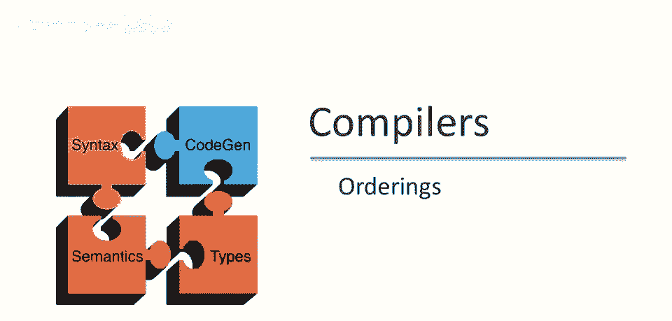
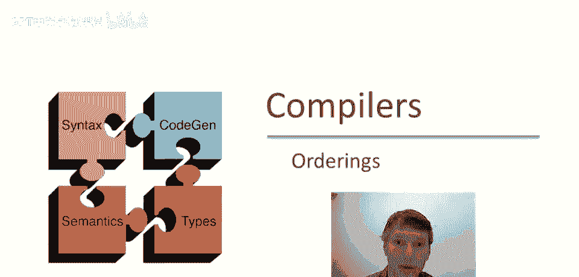
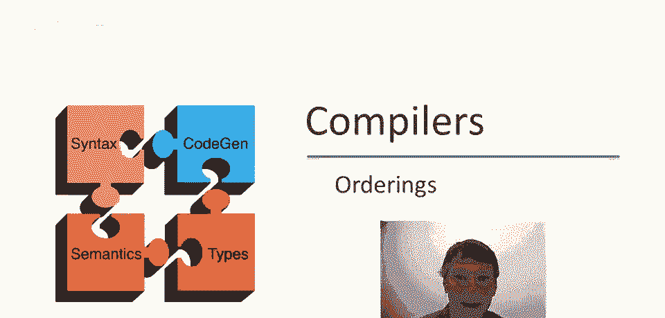
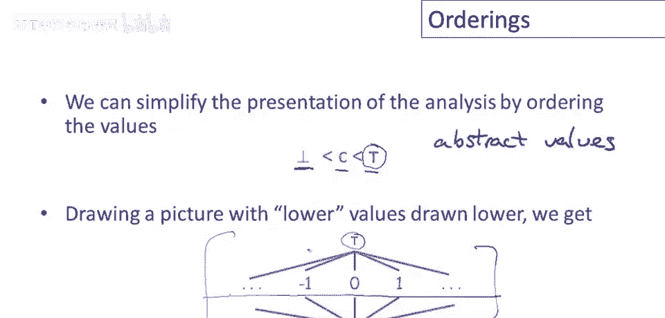
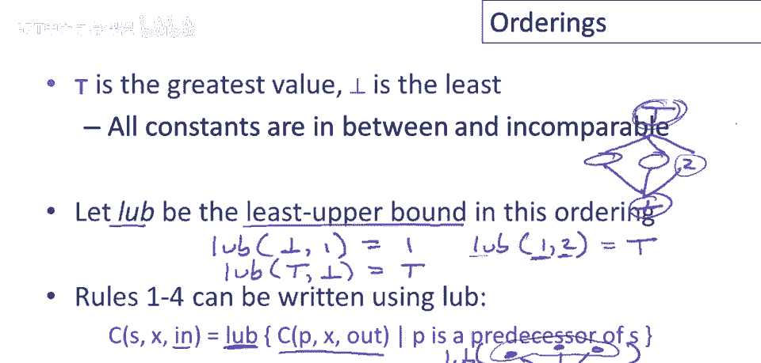
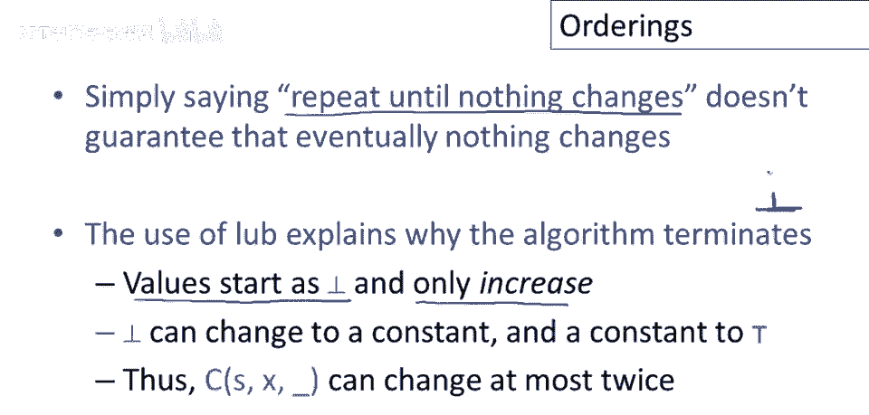
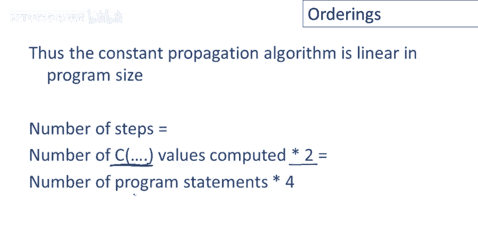

# 【编译原理 CS143 】斯坦福—中英字幕 - P79：p79 15-04-_Orderings - 加加zero - BV1Mb42177J7

在最近几段视频中，我们一直在讨论一种抽象计算，使用像底部这样的元素，常数，以及顶部，在这段视频中我们将开始稍微概括这些想法。

我们首先要谈论的是。

朝着概括迈出的第一步是讨论这些值的顺序，首先我想介绍一个技术术语，我们在程序分析中计算的值，常量和顶部，这些称为抽象值，以区分具体值，因此，具体值是程序实际计算的运行时值，如实际对象和数字，等。

程序分析使用的抽象值通常，更抽象，特定抽象值可代表一组可能的具体值，在用于常量传播的特定抽象值集中，实际上只有一个，非常抽象的值，那是顶级，代表任何可能运行时值，代表所有运行时值，无论如何。

结果有一种方法可以简化，我们一直在讨论的分析展示，我们将说底部小于所有常数，所有常数小于顶部，所以如果我们画一张图，较低的值画在底部，顶部绘制高值，值间关系，得到此图，底部在下，低于所有其他值。

底部小于所有常数，好的，知道所有常数在中层，好的，也知道常数间不可比，好的，零不比一大，例如，零和一不可比，其他常量对亦如此，因此你有，底部在底部，所有常数在中间，它们不可比，然后大于其他一切的是顶部。

现在定义了顺序，我们可以定义集合元素的操作，即最小上界或最大下界，这意味着取最小的元素，大于集合中所有元素的最小上界，例如，如果最小上界为底部和1，则等于1，好的，如果最小上界为顶部和底部，则等于顶部。

也许更有趣的是，1和2的最小上界，这里有两个不可比较的常数，记住最小上界的含义，它是排序中大于所有元素的元素，大于我们取最小上界的所有元素，所以我们的最小上界只有两个元素，但1和2的最小上界。

大于它们两者中最小的元素是顶部，应该说大于它们两者的是顶部，好的，所以最小上界，如果你考虑一下，如果我们再次画出我们的图片，我们有底部和顶部，如果你在这里挑选一些点，比如我们想取底部和2的最小上界。

你只是在挑选大于两者的最小元素，那将是顶部本身，类似地，对于顶部和底部，你将得到顶部，如果你有任何不可比较的元素，那么你必须挑选一个大于两者的元素，在这种情况下，那总是最终成为顶部。

有了最小上界这个概念，结果规则1到4，它们只是在计算最小上界，所以语句的in就等于，所有前驱的out的最小上界，这就是规则1到4所说的，如果你记得我们那里有什么，我们有和，我们有一堆前驱。

然后有一些类型的语句，S，我们只是在做所有前驱的信息，我们只是在取这些前驱的最小上界，好的，这就是进入S的信息。

抽象值的排序也有助于澄清我们分析算法的一个重要方面，即为什么它会终止，所以记住算法的终止条件是重复，重复应用规则，直到什么都不改变，直到控制流图中没有更多的不一致性，没有更多的信息需要更新。

仅仅因为我们说我们将重复直到什么都不改变，这不保证最终一切不变，那可能永远持续下去，每次更新都会引入新不一致，我们从未真正达到所有信息一致的点，所以排序实际解释了为何不能发生，算法保证终止，所以记住。

除了入口点外，值开始时为底部，所以它们从排序的最低位置开始，然后仔细看规则，规则只能使值在程序点增加，底部可提升。

在给定程序点上可改变至某个常数，然后另一更新可提升该常数至顶部，但当然一旦我们达到顶部，没有更大的元素，若规则只能使元素增加，最终我们必将耗尽可增加的元素，好的，这意味着我们为每条语句计算的信息块。

对于每个变量，对于输入或输出，最多改变两次，好的，所以可以从底部到常数，从常数到顶部，但之后将不再更新，并且，这意味着我们描述的常量传播算法，实际上是程序大小的线性，所以，步骤数将被常数值的数量限制。

我们尝试计算乘2，因为每个可变2次，由于入口和出口值各1，算法可能执行的总步数是程序语句数乘4。

