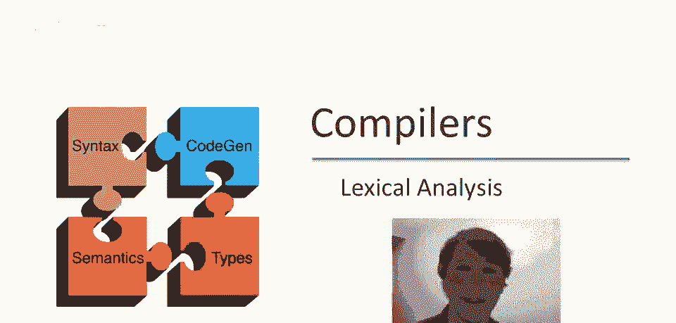
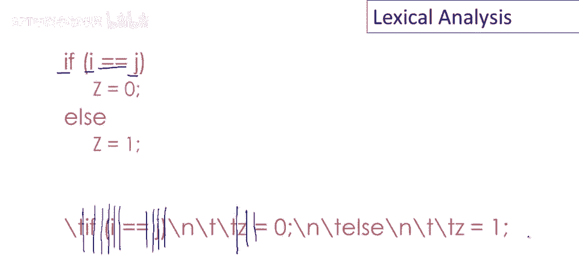
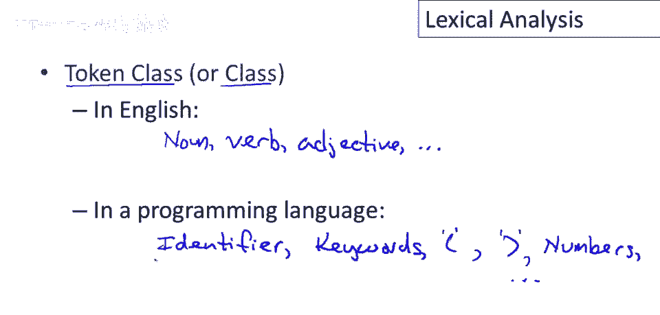
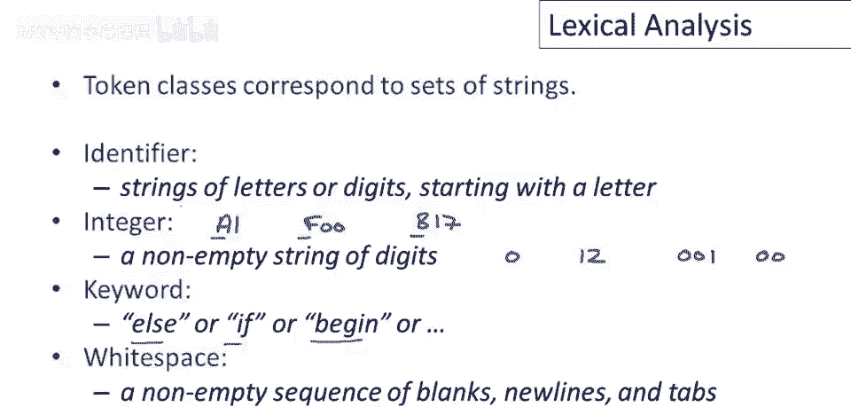
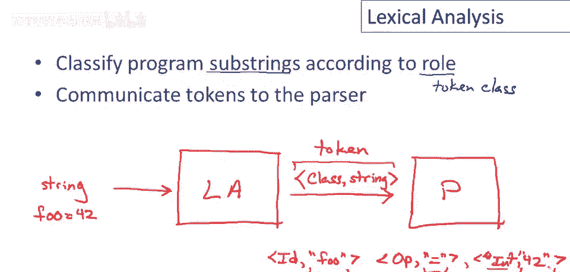
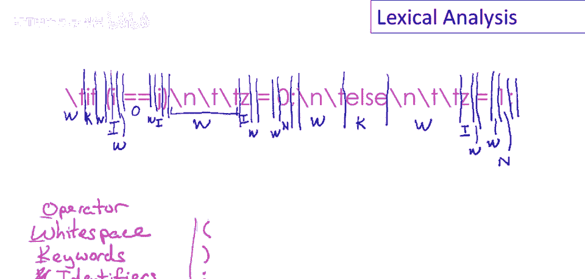
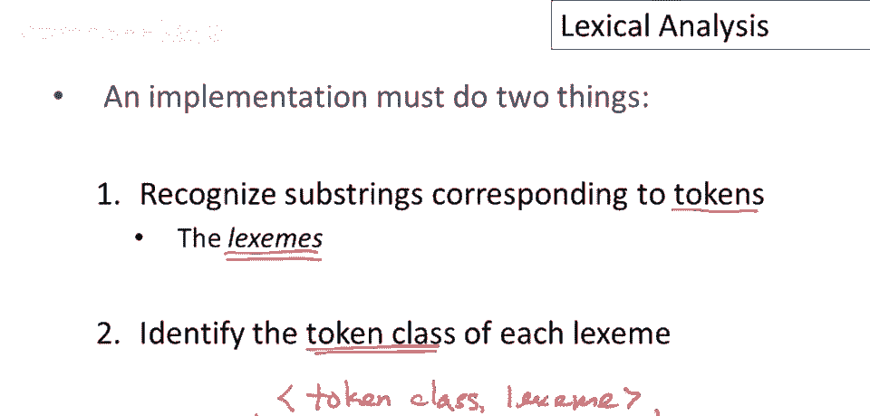

# 【编译原理 CS143 】斯坦福—中英字幕 - P7：p07 03-01-_Lexical_Analysis - 加加zero - BV1Mb42177J7

欢迎回来，这是关于编译器实现的系列视频的第一集。

回忆上次，编译器有五个阶段，呃，我们将从词法分析开始讨论，这可能需要三到四个视频才能完成，至少，然后我们会按顺序继续其他阶段，让我们先看一个小代码片段，词法分析的目标是将这段代码，分成其词法单元。

如关键字，如果变量名i和j和关系运算符双等号，等等，作为一个人类，这，如我们上次讨论的，这是一件很容易的事，因为有各种各样的视觉线索关于单元的位置，不同单元之间的边界，但程序，一个电分析器没有那种奢侈。

事实上，什么是奢侈，词法分析器将看到的是更像这样的东西，所以这里我把代码写出来，仅作为一个包含所有空白符号的字符串，从这个表示，这是一个线性字符串，你可以认为这是文件中的字节，词法分析器必须工作。

它将通过放置不同单元之间的分隔符前进，所以它将识别那里有一个分隔符，在空白空间和关键字之间，然后在关键字之后有一个分隔符，因此更多的空白空间，左括号，i另一个空白空间，双等号和等等，它继续画这些线。

分割，嗯，字符串成其词法单元，我不会完成整个东西，但你应该明白。

它不仅仅在这些字符串中放置分隔符，然而它不仅仅识别这些子字符串，它还需要根据它们在字符串中的角色对不同的元素进行分类，我们称之为标记类，有时我也会简单地称之为标记的类，在英语中这些角色是，动词形容词。

好吧，还有很多或没有，还有一些，在编程语言中，嗯，The，类，标记类可能是标识符等，嗯，关键字，嗯我，然后是语法片段，像打开的，括号，或关闭的，这些将是独立的类，嗯，嗯，数字，同样，还有更多类。

但有一组固定类，每个这些，嗯，对应程序中可能出现的字符串集。

标记类对应字符串集，嗯，这些字符串集可以描述，嗯啊，相对直接，例如，大多数编程语言中的标识符标记类，可能是以字母开头的字母或数字字符串，例如，变量名或标识符可以是a1，或foo，或b十七。

所有这些都是有效标识符，并且通常允许有其他标识符字符，但这是基本概念，非常非常经常，标识符的主要限制，它们必须以字母开头，嗯，整数，整数典型定义为非空数字字符串，如零或十二，好的，一后跟二。

我应该说实际上是一个字符串，不是数字在这种情况下，你知道，这实际上会接受一些数字，你可能想不到像零这样的东西，零，一可以表示一个数字，甚至是零，零可以是有效的整数，根据这个定义，嗯。

关键字通常只是一组保留字，所以这里我列出了几个else，如果开始等等，然后嗯，空格本身是一个标记类，所以实际上我们不得不说明在那个字符串中，哪个是程序的表示，那个字符串中每个字符，什么标记或什么标记类。

它是属于的，什么子串是所属的，并且包括，嗯 空格，所以，例如，如果我们有一系列三个空格，如果我输入if然后一个开，我在这里有三个空格，这三个空格将被分组为空格。

词法分析的目标是按照它们在程序中的作用对子串进行分类，这就是标记类，好的，它是一个关键字吗，变量标识符，然后将这些标记传递给解析器，所以嗯，在这里画个图，让我们嗯，换颜色，词法分析器与解析器通信，好的。

这里的功能是词法分析器接收一个字符串，通常存储在文件中，所以只是一串字节，然后当它发送给解析器时，是一系列对，即标记类和子串，我刚刚说过的，字符串在这里，完美 哪个是一个，所以它发送一个字符串。

它是输入的一部分，所以发送一个字符串，它是输入的一部分，与班级一起，它在语言中的作用，嗯，在语言中，这对称为标记，好的，那么，例如，如果我的字符串是foo等于42，好的，然后它将通过词法分析器并输出。

嗯，我会写在这里，嗯，三个标记，这些将是，嗯，标识符，操作符说等于，嗯，整数，哦，打扰一下，四十二，我仅将这些作为字符串，强调这些是字符串，这不是数字四十二，此时，它是字符串四二，这是一个。

它在编程语言中扮演整数角色，以及解析器视为输入的，这是对吗？词法分析器本质上遍历输入字符串，并将其拆分为对序列，其中每对是一个标记类和原始输入的子串。

让我们回到示例，从视频开头，它被写为字符串，现在我们的目标是词法分析这段代码，我们想遍历并识别标记子串，以及它们的标记类，所以要做这个，我们需要一些标记类，所以让我们给自己，一些来工作的，我们需要空格。

所以这是，嗯，空白序列，新行，制表符，诸如此类的事，嗯，我们需要关键词，我们还需要变量，这些我们称为标识符，嗯，我们需要整数，这里我叫它们数字，然后我们会有些其他操作或类，像打开，括号闭合，括号和分号。

这些很有趣，这三个很有趣，因为它们是一个字符标记类，即它是一个字符串集，但集合中只有一个字符串，所以n的打开对应于恰好包含打开n的字符串，语言的标点符号都在单独的标记类中，我们在这里添加的另一个标点是。

嗯是赋值，将在单独的标记类中，因为它是一个非常重要的操作，但双等号将归类为关系操作符，我们只将其归类为，嗯和操作符放在这里好吧，所以现在我们要做的是，我们将遍历并标记化，嗯这个字符串。

嗯对于每个子字符串，嗯它属于哪个类，我将只使用类的第一个字母，嗯来表示它只是为了节省时间，嗯，所以我不必把所有东西都写出来，我们改变颜色，这样我们可以用不同的颜色做，所以第一个标记是空白标记，然后是。

嗯如果关键字所以k，然后有一个空白，这是另一个空白，然后嗯打开for，这是它自己的标记类，所以我会让它自己在那里标识，然后有一个标识符，好的嗯，空白和然后一个操作符，双等号，嗯，另一个空白。

所以那是空白，空间，跟随另一个标识符，跟随再次关闭括号，标记类中的一个标点符号，然后是三个空格字符，因此它们被分组为一个空格标记，嗯，跟随另一个标识符和更多空格，然后是另一个单字符标记，赋值运算符，呃。

空格和数字，然后是再次分号，标记类中的一个标点符号，两个空格字符组合在一起，接下来是一个关键字，因此它被分类，作为关键字标记类，另一组空格字符，然后是另一个标识符，实际上有一个空白。

我们几乎用标记覆盖了它，I赋值运算符本身，在一个标记类中，空格数字，最后分号本身，这就是我们的标记化，我们识别了输入中的子字符串，并且我们也用标记类标记了每一个。

总结词法分析实现必须做两件事，第一项工作是识别输入中对应标记的子字符串，这里是一些编译器术语，这些子字符串称为词素，因此程序中的单词称为词素，然后第二项工作是对于每个词素，我们必须识别它的标记类。

词法分析器的输出是一系列对，这些是标记类和词素，整个东西。

