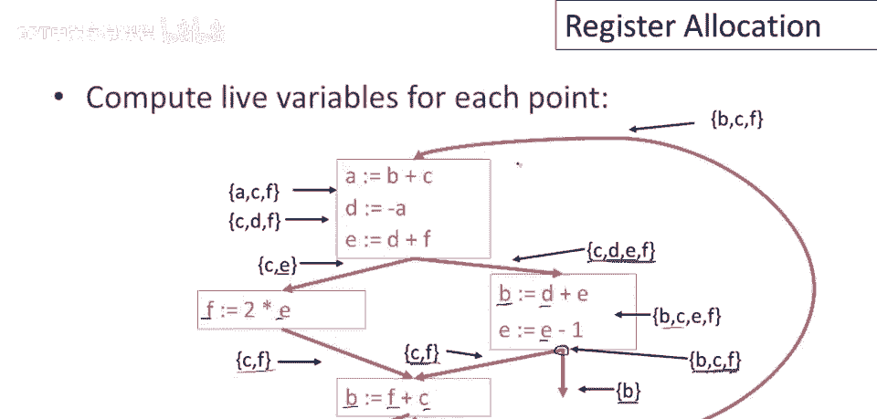

# 【编译原理 CS143 】斯坦福—中英字幕 - P81：p81 16-01-_Register_Allocat - 加加zero - BV1Mb42177J7

本视频中，将讨论寄存器分配，这是编译器最复杂的事之一，以优化性能，并涉及全局流分析讨论的概念。

回忆中间代码可使用无限临时变量，这简化了许多事，特别是优化，因为，无需担心，保持代码中寄存器的数量，但它会使最终汇编代码复杂化，因为我们可能使用了太多临时变量，这在实践中确实是个问题。

所以中间代码使用比目标机器更多的临时变量并不罕见，问题在于。

重写中间代码，以使用不超过机器寄存器的临时变量，我们打算这样做的方法是，使用算法优化，将为每个寄存器分配多个临时变量，因此将有一对多的映射，从临时变量到寄存器的一对多映射，所以好吧，显然这里有点问题。

如果我们确实使用了很多临时变量，将无法将它们全部放入一个寄存器中，因此需要某种技巧，我们将在几分钟内说明这种技巧，实际上会有这种情况失败，我们需要某种备用方案，但默认计划是尽可能多地临时放入同一台机器。

注册并完成所有操作而不改变程序的行为。

我们如何做到这个神奇的事情，我们实际上如何，嗯，制作一个单寄存器，保持多个值，好吧，寄存器有多个值是可以的，只要它一次只含一个值，让我们考虑这个程序，我将在这里切换颜色，好的，这是一个简单的三语句程序。

注意a在头两句中用，写在第一句，读在第二句，E写在第二句，读在第三句，F仅在第三句写，实际上这3个值，A e 和 f，它们从不同时存在，当我们读完一个，我们实际上已经完成，我们已用尽a的所有用途。

我们将在这个小代码片段中，假设a和f在其他地方未使用，结果a e和f实际上可以，都存在于同一个寄存器中，那看起来会怎样呢，把它们都分配到特定寄存器，寄存器R1，把cd和b分配到各自独立寄存器。

那么代码看起来像这样，寄存器R1是R2加R3，然后寄存器R1是R1加R4，然后寄存器R1是R1减1，好的，现在注意，这仅仅是代码的逐字翻译到寄存器，但存在多对一映射，嗯，左边的名字到右边的寄存器名。

寄存器分配是个老问题，实际上，最早在1950年代的原始FORTRAN项目中识别，但最初的重新分配使用了相当粗糙的算法，并且很快或非常快地注意到，这实际上是一个代码生成质量的瓶颈。

实际上是寄存器分配能力限制了其做好工作的能力，对整体平等影响重大。

编译器可产生代码的整体质量，约30年后，1980年，突破出现，人们发现，IBM一组研究人员发现基于图着色的风险分配方案，该方案优点是简单，易于解释，全局性，利用整个控制流图的信息，同时。

实践中效果良好。

现代寄存器分配算法的基本原则，如果有两个临时变量，T1和T2，我想知道它们何时可共享寄存器，它们允许共享寄存器，它们允许在同一寄存器中，如果它们不在同一时间活跃，好的，因此，在程序的任何一点。

T1或T2中最多只有一个活跃，更简洁的说法，我已部分说过，即如果t两，T1和T2同时直播，好的，如果两个都在运行，那么他们就不能共用一个寄存器，这就是陈述的否定形式，它只是告诉你，如果需要同时两个值。

让我们看看控制流程图，现在我们知道，为了解决重定位问题，需要进行寄存器分配，至少在这方面，我们需要活跃信息，计算程序各点的活跃变量，这就是，我快速过一遍，假设循环退出时只有b是活跃的。

b是这段代码的输出，它在其他地方被使用，但其他变量都不活跃，那么如果我们倒推，记住，活跃度是向后分析，这里看到b已写，在此语句前非活跃，但f和c被读，因此c和f在此基本块前都活跃，好，类似地。

如果我们再上一层，这里看到e现在活跃，f已死，因为f在此处被写，e被读，且在此路径上还有另一个出口，b活跃，现在在此点，此基础块后，活跃变量集为b，C和f，因为b在一路径上活跃。

而c和f在另一路径上活跃，记住，某物为活跃，仅需在未来某些可能，执行演化上活跃，因此，从这个节点，若变量活跃，从这里节点退出时，它是实时的，从这里逆推，因为e是红的，所以b和f在这里是实时的。

在这个声明中，C和f没有被引用，因此它们只是向上传播，B从实时集中删除，因为它被写入，但d在这个集合中被添加，对于此图中的其他边缘也类似，如果你去检查所有其他边缘，你会看到现场是正确的。

这仅遵循上一视频中给出的简单规则。

现在如何使用活跃信息进行寄存器分配，嗯，我们将构建一个无向图，在此图中，将为每个临时变量创建一个节点，因此，每个变量将在图中有一个节点，如果两个临时变量在某些程序点同时活跃，将在它们之间有一条边。

好的，回顾这个小例子，我们可以看到，例如，程序此时，C和e都存活，都在活跃集中，此基本块执行后，因此c和e不能在同一寄存器。

好的，继续，这称为数据结构，此图称为寄存器干扰图或简写为RIG，再说一次，基本思想是，两个临时变量可分配在同一寄存器，如果寄存器干扰图中它们之间没有边连接。

所以这是寄存器干扰图，针对我们的例子，这是从之前几页给出的代码和，对齐分析构建的图，很容易从图中读出约束条件，因此，例如，B和C不能在同一寄存器，因为B和C由边连接，好的，说它们在某部分同时存在。

在程序的某个点，因此它们必须在不同的寄存器，另一方面，注意B和D之间没有边，好的，所以这条边缺失，因此b和d可能分配在同一寄存器，它们的生命周期或存活时间不重叠。

寄存器干扰图的好处是，它提取了描述合法寄存器分配所需的确切信息，因此它给我们所有可能合法寄存器分配的表示，我还没有说我们实际上如何从寄存器干扰图中得到一个寄存器分配，但第一步是以某种精确的方式描述问题。

不能在同一寄存器中存在的图约束，为我们做到了这一点，它的另一个优点是它提供了寄存器需求的全球视图，意味着遍历整个控制流图，考虑控制流图各部分信息，帮助我们做关于寄存器重要性的全局决策，最后注意重建后。

寄存器分配算法与架构无关，未展示算法，暂时相信，最终会发现不依赖机器属性，除了寄存器数量，仅需知道机器这一属性，为使用该算法进行寄存器分配所需，仅需知道机器的寄存器数量，使用该算法进行寄存器分配。

