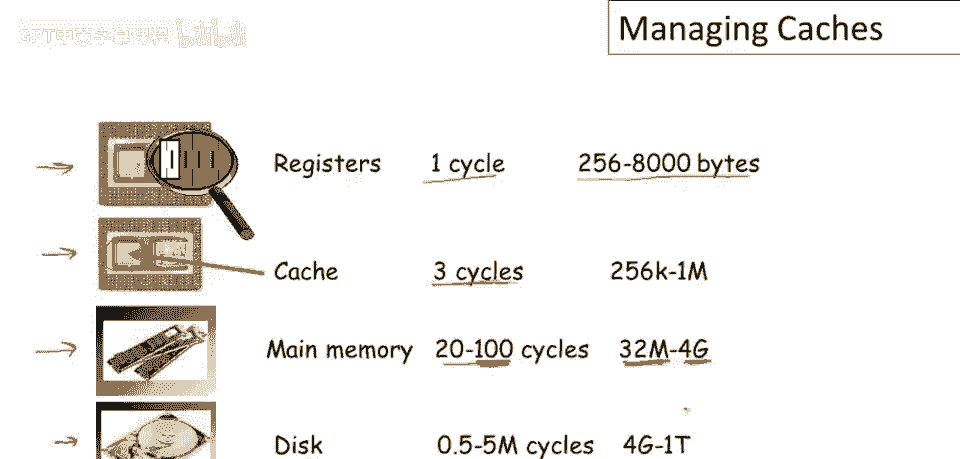
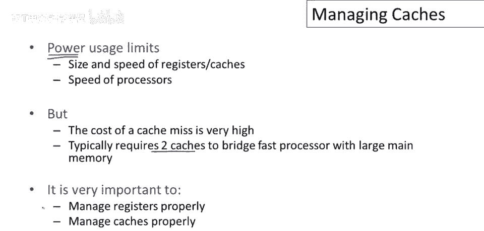
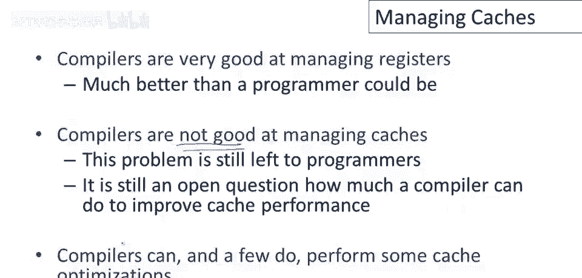
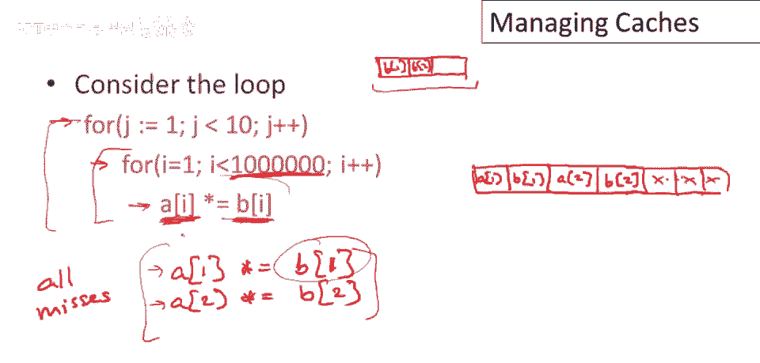
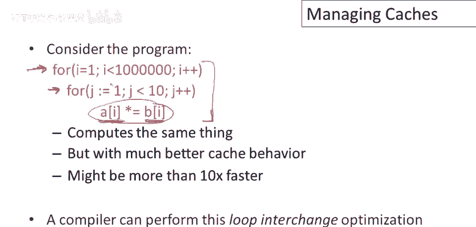

# 【编译原理 CS143 】斯坦福—中英字幕 - P84：p84 16-04-_Managing_Caches - 加加zero - BV1Mb42177J7

前几视频讨论了管理寄存器，本视频，将花时间讨论另一重要资源，现金，编译器能做什么不能做什么。

现代计算机系统有复杂内存层次，若从处理器最近层开始，会发现芯片上有若干寄存器，这些访问极快，通常单周期内可访问，与时钟频率相同，问题是建造高性能内存非常昂贵，因此我们无法拥有很多。

通常你知道你可能有256，比如说到8千字节寄存器总共可用，现代处理器上的很大一部分芯片面积将用于缓存，缓存也非常高性能，但不如寄存器那么高性能，平均可能需要3个周期从缓存中获取，但你可以得到更多。

现代处理器最多有一兆缓存，远离处理器的是主内存，动态随机存取存储器，分配更多时间访问更昂贵，典型值是20到100个周期，我认为你知道更多在100，如今大多数处理器接近100和20，但你能得到很多。

你得到32兆字节，这将是一台相当小的机器，最多4GB，最大配置处理器，最远是典型硬盘，这需要非常，长时间达数十万或百万周期，但可拥有大量存储，GB至TB存储。

现在，如我所说，寄存器和缓存大小速度有限，这些受限于功率，如今和其他因素一样，因此，人们希望有尽可能多的寄存器和现金，但如何做大做快有实际限制，相对于处理器的速度，现在，不幸的是，缓存未命中代价很高。

如前页所示，若能从缓存中几周期内获取，若不在缓存中，那可能需要几个数量级的时间从主内存中取出，因此，你认识的人，尝试构建，缓存，在处理器和主内存之间，以隐藏主内存的延迟，因此大部分数据在缓存中，如今。

通常需要多级缓存才能很好地匹配快速处理器，与非常大的主内存速度相匹配，所以现在处理器中通常有2级缓存，一些处理器甚至有3级缓存，那么，关键是管理这些资源非常重要，嗯，对于高性能来说。

正确管理这些资源至关重要，特别是要管理寄存器和缓存。

若要程序性能好，编译器已变得非常擅长管理寄存器，实际上，我认为今天大多数人会同意，对于几乎所有程序，编译器比程序员更擅长管理寄存器，因此，将分配寄存器的任务留给编译器是非常值得的，或分配寄存器给编译器。

然而，编译器不擅长管理缓存，虽然编译器能做一点，这就是我们将在本视频余下部分讨论的内容，大部分情况下，如果程序员想要获得良好的缓存性能，他们需要了解机器上缓存的运行行为。

他们需要了解他们的程序正在做什么，需要了解编译器能做什么，然后他们仍需编写程序，以利于缓存友好，这仍是一个开放问题，编译器能多大程度提高缓存性能，尽管我们发现编译器能做几件事。

要看到编译器实际能做到的，让我们看看这个示例循环，这里有什么，我们有外层循环j，内部循环i，每次内部循环读取b_i向量，B_i，你知道，你知道，计算该值，将结果存入a_i元素，该程序缓存性能极差。

表现会很差，所以让我们想象缓存是内存块，那么这里会发生什么，我的意思是，第一轮迭代会是什么，我们将，你知道，加载b1并存储其函数到a1，那么什么会被加载到缓存中，是a1和b1，对吧。

假设它们只是进入不同的元素，并且让我们说只是为了争论，假设它们落在缓存中的前两个元素，然后我们要进行这个的第二轮迭代，我们将会，呃，我们将加载b2并写入a2，所以，嗯，a2和b2将被加载到缓存中，对吧。

然后继续，这将会一遍又一遍地重复，加载a的一个元素和b的一个元素，重要的是要注意所有这些对a和b的引用都是缺失的，好的，每一个都是缓存缺失，因为在循环的每次迭代中，我们引用新的元素，好的。

所以我们在上一次迭代中并没有引用相同的元素，所以现在让我们暂时忽略，同一个缓存行中可能存在多个元素的事实，好的，所以如果你们中的一些人可能已经知道，当我们从内存中获取数据时，我们不会只获取一个单词。

好的，所以通常，当我们引用b1时，例如，你知道，如果b1存储在这里，我们将获取整个缓存行，这将是一块内存，它可能包含，你知道，b的其他元素，所以我们也可能同时将b的另外一些元素加载到缓存中。

但这里重要的是在循环的每次迭代中，我们引用新鲜的数据，好的，并且如果这些数据值足够大，如果它们占用整个缓存行，那么循环的每次迭代都将是对两个元素的缓存，缺失，我们不会从缓存中获得任何好处。

此循环将以主内存的速率运行，以主内存的速率，而不是缓存的速率，这里另一个重要的事情是此循环边界非常大，我特意选它很大，暗示它比缓存的大小大得多，当我们接近循环的末尾时，会发生什么，我们将填满整个缓存。

整个缓存将充满来自a和b的值，然后它将开始覆盖已经在缓存中的值，如果这个循环，你知道如果这些向量的尺寸是缓存尺寸的两倍，嗯，当我们绕回来并完成内循环的整个执行时，缓存中的内容是a和b数组的第二半。

不是第一半，然后当我们回到并执行外循环的另一个迭代时，现在缓存中的内容，也将不是我们引用的数据，所以当我们绕回来并开始内循环的执行时，第二次。

当我们引用a_sub_1和b_sub_1以及a_sub_2和b_sub_2时，缓存中的内容，是来自a和b向量高编号元素的值，不是低编号元素，所以所有这些引用都是缺失的，所以此循环的基本问题。

如果循环像这样结构化，几乎每个内存引用，并且如果数据值足够大，嗯再次，以至于它们填满整个缓存行，嗯，那么每一个内存引用都是缓存缺失。

现在让我们考虑相同程序的另一种结构，我在这里将i循环放在外层作为外循环，将j循环放在内层作为内循环，我们在这里做的是加载b_sub_i并写入a_sub_i，然后我们在相同的数值上重复该计算十次。

所以这里我们将获得出色的缓存性能，第一次引用将是缺失的，但随后的九次引用，数据将已在缓存中，或者将完全耗尽我们的计算，并且这些特定的a和b值，然后我们将继续下一个，嗯，a和b值。

我们将完成内循环并继续外层，嗯然后做外循环的另一个迭代，这种结构的优点是它将数据带入缓存，然后尽可能地使用该数据，然后再继续下一个数据，而非每项数据都做一点，然后返回，你知道，一次遍历。

然后返回并遍历所有项目，项目再次，再做一点，好吧，这种特定结构，我们交换了外层循环的顺序，抱歉，交换了内层和外层循环的顺序，它计算完全相同的东西，但具有更好的缓存缓存行为，它可能会运行超过10倍快。

现在编译器可以进行这种简单的循环交换优化，这种特定类型的优化称为循环交换，因为你只是在交换循环的顺序，在这种特定情况下，很容易看出这是否合法，编译器实际上可以弄清楚，不是很多编译器实际上实现了这种优化。

因为通常很难决定是否可以反转循环的顺序，因此通常，程序员需要弄清楚他们想要这样做，以提高程序的性能。

