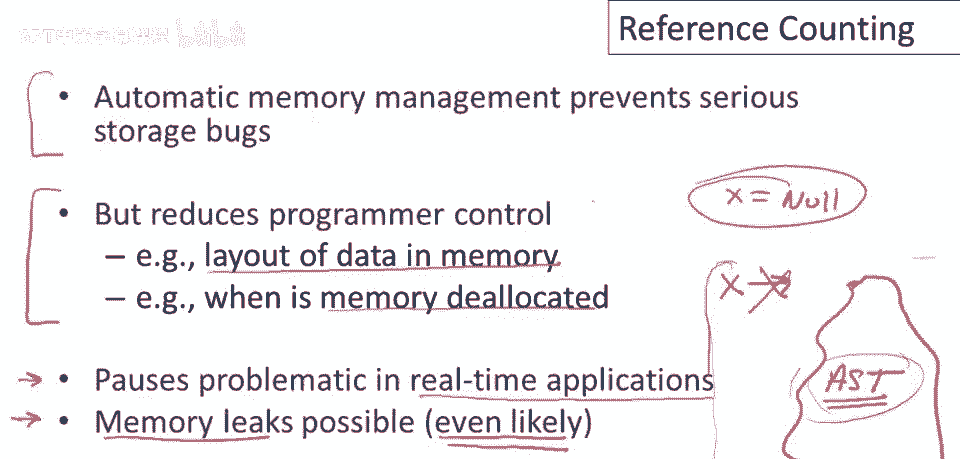

# 【编译原理 CS143 】斯坦福—中英字幕 - P89：p89 17-05-_Reference_Counti - 加加zero - BV1Mb42177J7

本视频中，我们将结束关于自动内存管理的讨论，以我们要讨论的垃圾收集的第三种也是最后一种技术。

称为偏好计数，计数。

基本思想是，而不是等待内存完全耗尽，我们将尝试收集一个对象，一旦没有更多指针指向它，因此，一旦我们丢弃最后一个指向对象的指针，它变得不可达，我们将在那时尝试收集它，我们如何做到这一点呢，正如名称所示。

我们将计算每个对象的引用次数，因此，在每个对象中我们将存储指向该对象的指针数量，因此，如果我在内存中有对象，并且它有来自其他对象的三个指针，并且在这个对象中某个地方会有一个专门的字段包含数字三。

如果这个数字降到零，如果我们丢弃这些指针并且这个数字变成零，那么我们就知道没有人指向这个对象，它可以被释放，这意味着每次赋值都必须操纵引用计数，以保持指向对象指针数量的准确计数。

因此，分配新对象将返回一个引用计数为1的对象，因此，对象由new创建，它将已经有一个引用计数为1，返回的指针是对象的唯一引用，我们将写对象的引用计数，X是X的引用计数，现在当我们有一个赋值时。

X被赋予Y，嗯，我们将不得不更新X指向的对象和Y指向的对象的引用计数，在赋值之前，所以这里发生了什么，所以如果Y指向P，让我们在这里画我们的对象，所以Y是一个局部变量，它指向内存中的某个对象P。

X也是一个局部变量，它指向某个对象，O好吧，所以现在X正在获取Y的值，这将移动这个指针从我之前指向的地方，指向与Y相同的东西，那么会发生什么呢，P的引用计数将增加1，而O的引用计数将减少1。

因为我们减小了O的引用计数，当我们丢弃了这个指向对象O的指针，O，需检查引用计数是否为零，若引用计数降为零，可释放o的内存，然后，除更新引用计数和检查o的引用计数是否为零外，实际还需执行赋值本身。

因此每次赋值，我想强调，程序中每个赋值现在都转化为需执行的四个操作以维护。

引用计数，引用计数有优缺点，其一大优点是增量收集垃圾，执行时无长时间暂停，因此对于大型暂停可能成问题的应用，如实时应用或交互应用，引用计数有很大帮助因为它最小化了最长暂停时间，好的，因此程序不会暂停。

不会在一段时间内停止运行，因为它在收集垃圾，它总是以小增量收集垃圾，因此你不会看到长暂停，或至少基本引用计数实现也相当容易，很容易遍历并修改代码以添加引用计数，可以很容易地想象一个代码生成器。

它会为添加引用计数的实现生成不同的代码，所以实际上，简单实现引用计数对编译器所需的变化，并不那么广泛，现在有一些缺点，嗯，关于引用计数，嗯一个是在每次赋值时操作引用计数真的很慢。

所以如果你记得发生了什么，我们有两个引用计数的更新，所以我们必须更新，你知道两个对象的引用计数，嗯，为了做到这一点，这是执行赋值的代码，然后我们有一个if语句，然后我们实际执行赋值。

所以有两个引用计数更新，检查引用计数是否为零的测试，然后我们实际做赋值，所以开销很大，你正在将程序中的每个赋值，将其成本至少膨胀四到五倍，这将对许多程序的性能产生非常明显的影响，现在可以优化引用计数。

例如，如果我们对同一对象有两次更新，假设，在一个基本块内，甚至在一个控制流图中，编译器，一个智能优化编译器可以经常合并这些引用计数操作，所以，而不是更新对象的引用计数两次，它可以只更新一次，同样。

如果有更多的引用更新到同一对象，潜在的所有这些都可以在程序的某个区域合并，问题是，这变得非常棘手才能正确，一个简单的引用计数实现相当慢，但容易正确，一个非常高级的引用计数实现。

或高度优化的引用计数实现稍微快些，但仍然有明显的性能影响，如果你对所有对象进行引用计数，但它比简单实现快得多，然而，它很难正确实现，引用计数的另一个问题是它不能直接收集循环结构，为了看到这一点。

让我们画一个小堆，带有循环结构，假设我们有一个局部变量，X，它指向堆中的某个对象，该对象有一个指针指向另一个对象，好吧，然后第二个对象有一个指针回到第一个对象，好的。

所以这里x指向一个长度为二的循环链表，好的，如果我们在这里添加引用计数，它们会是什么样子呢？这个对象在这里，第二个对象这里只有一个引用指向它，所以它的引用计数是1，而这个第一个对象有两个指针指向它。

一个来自x，另一个来自另一个对象，所以它的引用计数是2，好的，这是我们的小堆，我们可以看到这里没有垃圾，因为所有对象都可以从局部变量或程序变量中访问，如果我们给x赋一个新值。

假设我们有了赋值语句x得到null，好吧，这个指针就消失了，那么会发生什么呢？当我们做那个赋值时，我们将改变这个对象的引用计数，现在它将变成1，如果我们看这里，嗯，热量，我们现在看到这些物体。

这两个物体不可达，好的，所以这些是不可达的，但请注意它们的引用计数不为零，因此我们不能收集它们，垃圾收集器或引用计数实现将检查引用计数并看到，哦，这些是1，因此我们不能删除它们。

它看不到的是这些对象的唯一引用来自其他，不可达的对象，所以底线是引用计数不能收集循环结构，处理它的方法只有两种，一种是程序员记得，每当循环结构即将变得不可达时，以某种方式打破循环，例如。

如果在摧毁指向x的指针之前，我们记得进去说，设置，你知道这个指针到这里为空，如果我们在这个循环中清除了一个指针，所以不再有循环，那么引用计数将正确工作，因为当这个指针从x中删除时。

这个对象的引用计数将变为零，然后，这个对象的引用计数也将变为零，在删除这个对象之后，好的，另一种可能性是回溯引用计数，通过其他垃圾收集技术来收集循环，因此在某些引用类型的系统中，例如。

大部分垃圾收集是通过引用计数完成的，但每隔一段时间，每隔很长时间，你可能会运行一个标记和清除收集器，来清理任何循环但不可达的数据结构。

我们现在准备结束关于自动内存管理的讨论，所以我只想在这里做出一些高级别的观点，首先，毫无疑问自动内存管理是一件好事，它防止了非常严重的存储错误，编程中最困难的错误之一，当你使用垃圾收集语言时。

你真的有一类事情不必担心，因此，它确实是一种更高效的方式进行编程，所以如果你的问题，如果你的程序非常适合自动内存管理，若使用提供那种支持的系统，你才疯狂，管理的缺点是减少程序员控制。

不再控制内存中数据的布局，不再控制内存何时释放，不再控制数据在内存中的位置，对程序使用的内存量控制也非常有限，那么，如果这两件事不重要，如果你的，如果你的应用不是极度数据密集型。

数据在内存中的精确布局和内存中保留的数据量很重要，垃圾回收可能效果很好，但有些应用程序，特别是高端数据处理，和科学应用，使用大量数据，需要高效使用内存，垃圾回收实际上变得太低效，无法做好工作。

那些领域的人，仍使用手动内存管理，实时应用中，暂停可能成问题，因此，如果程序需要保证，截止日期，许多与外界交互的嵌入式系统，如控制危险机械，和类似的东西，它们必须有响应时间，以确保不会发生可怕的事情。

你知道，引入可能暂停任意时间的自动内存管理系统，你知道，使确保那个非常困难的问题，因此，实时应用中并不总是使用垃圾收集，过去几年进步很大，实时垃圾收集器，自动内存管理的程序员，可能面临内存泄漏问题。

自动内存管理防止内存损坏，但无法防止保留过多数据，可能严重影响程序性能，垃圾收集语言可能出现内存泄漏，甚至可能很常见，我认为你知道，你不太清楚或不必太清楚，记忆是如何被使用的，更容易出现内存泄漏。

在Java程序中，你将有一些变量，比如x指向某个数据结构，这个数据结构很大，好的，假设这是编译器的抽象语法树，计算中可能出现一个点，不再需要抽象语法树，假设已转换为中间语言，从抽象语法树。

余下的编译处理将在中间语言上进行，表示和生成代码，不再回头查看抽象和文本，嗯，编译器，我的意思是，抱歉，这，垃圾收集器，不知道，你将来不会再使用抽象语法树，如果你有一个指向这个巨大数据结构的变量。

即使你不使用它，它也会停留，并且会占用内存，所以正确做法是当你到达程序的某个点，你将不再使用这个数据结构，将x赋空值，在那时将x赋空，实质上丢弃指向数据结构的指针，现在垃圾收集器，无论何种形式标记清除。

停止并复制引用计数，将看到这不再可达并收集这个大结构，这非常，在生产Java程序中很常见有这种内存泄漏，你只是有忘记的指针，不再使用的数据。

如前几课所述，垃圾回收很重要，每个程序员都应了解其优缺点，也是编程语言实现的一个有趣方面，有比这些讲座中讨论的更先进的垃圾回收算法，人们主要考虑改进垃圾回收的维度，使垃圾回收并发。

这意味着允许程序在收集时继续运行，程序运行时，另一常见情况是，实际上生产收集器中有一个称为代收集器的东西，基本思想是我们不想不断，检查那些非常长寿的对象，每次收集时都会发生很多收集。

有些对象会存活很长时间，程序中大部分时间存在的巨大数据结构，一旦我们在几次收集中看到它们，我们可以假设它们将在未来几次收集中继续存在，因此在一代集合中，抱歉，下一代收集器，旧物件。

存在一段时间的物件放入单独区域，收集频率较低，这使收集器能专注于最可能成为垃圾的物件，即最近分配的物件，我们已稍作讨论实时，因此有尝试限制长度或界限的收集器，最长暂停长度，对程序的最大中断。

最后是并行收集器，因此垃圾收集系统中，实际上有多个垃圾收集器同时运行，并协调他们的行动。

