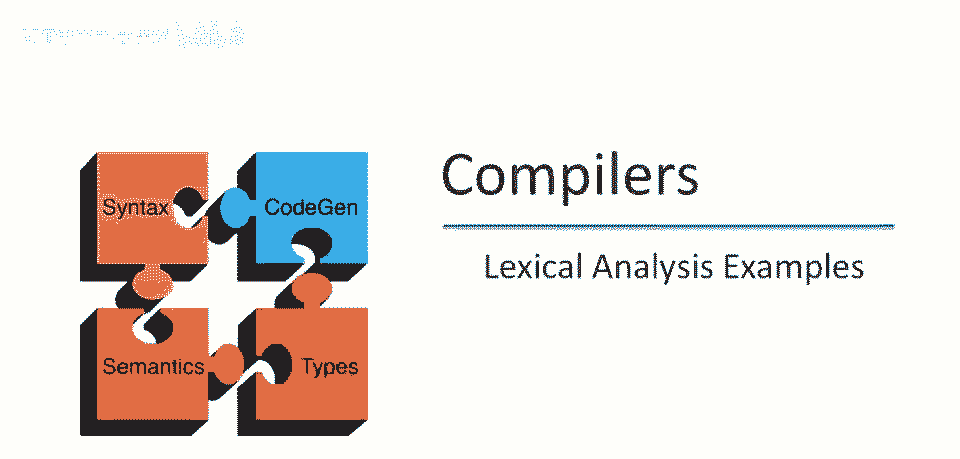
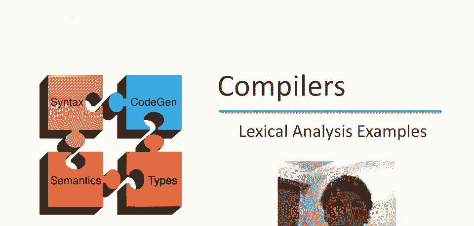
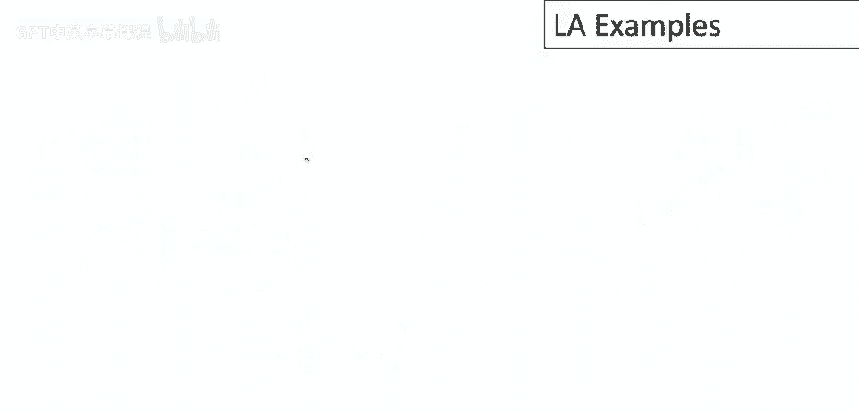
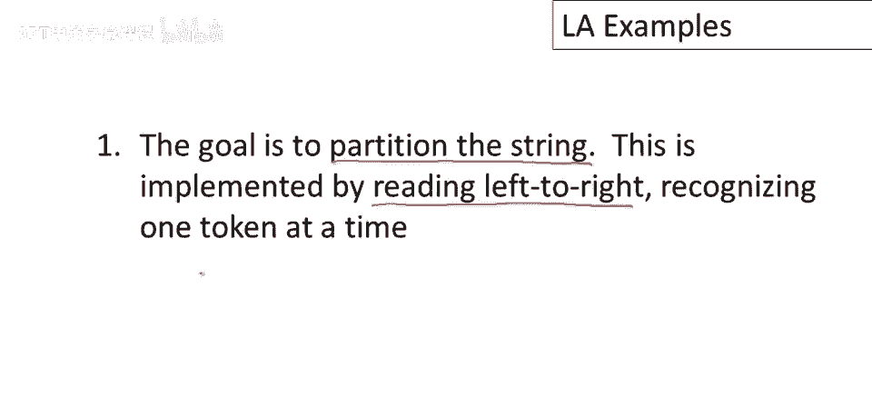
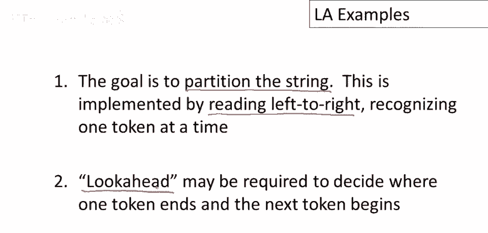
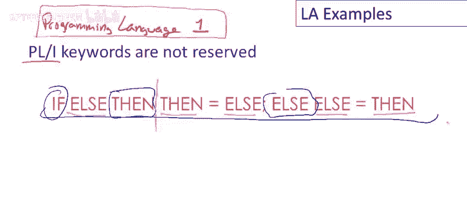
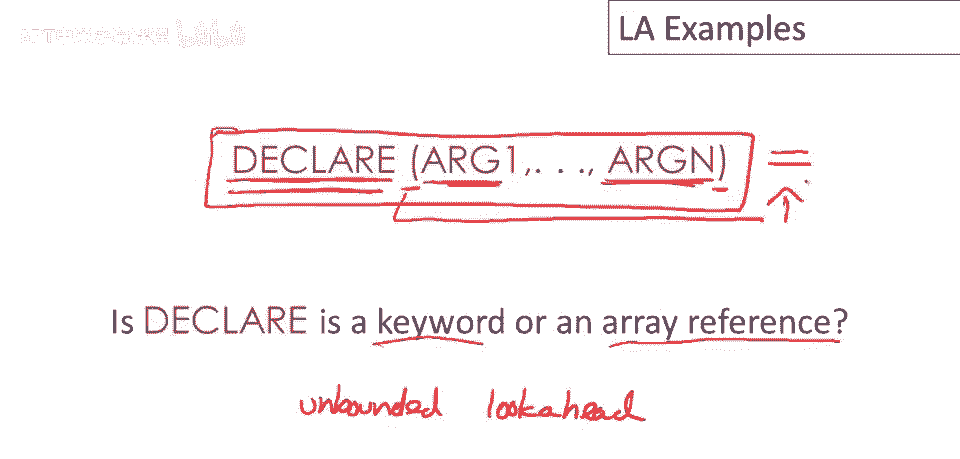
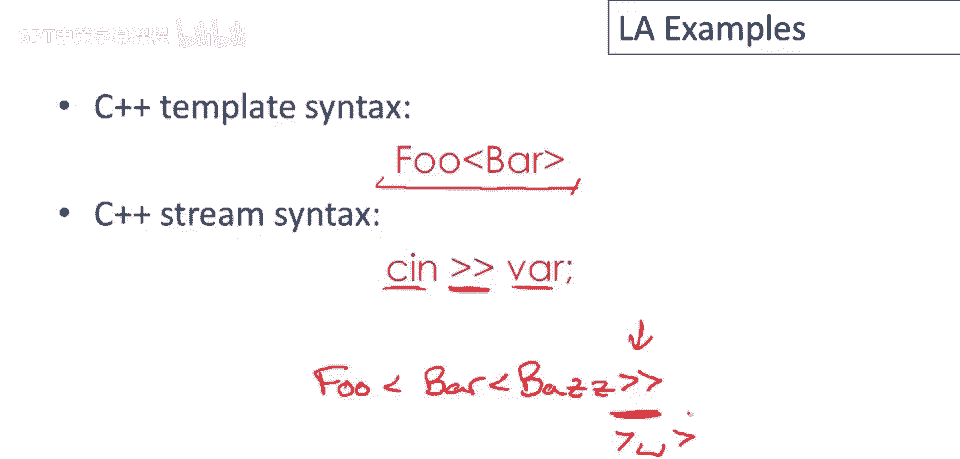
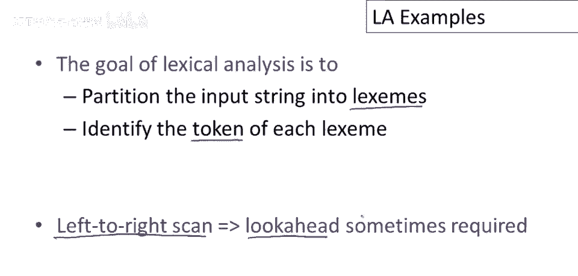

# 【编译原理 CS143 】斯坦福—中英字幕 - P8：p08 03-02-_Lexical_Analysis_ - 加加zero - BV1Mb42177J7

欢迎回到本视频，我们将继续词汇分析的讲座，结合过去编程语言中出现的一些有趣的词法问题。

我们已经稍微谈过一些关于Fortran的内容，Fortran中一个有趣的词法规则是，空格不重要，所以空格无关紧要，类似uv a r one这样的，呃，变量名bar one完全等同于v a空格r one。

因此，这两个程序片段必须具有完全相同的意思，Fortran的想法是，你可以拿你的程序，并删除所有空格，这应该不会改变程序的含义，让我们看看Fortran的空格规则如何影响词法分析。

这里有几个Fortran代码片段，我应该说，这个例子来自《龙书》，实际上，后来的几个例子也来自《龙书》的旧版，呃，不过，我们有什么，这实际上是，呃，Fortran循环的头部，你知道它是一个循环。

因为它有关键字，Do，类似于现代C或C++中的for，所以这是一个，这是一个循环关键字，然后我们有迭代变量i和i将变化的范围，所以在这种情况下，i将从1变化到25，然后这里的数字5，这有点奇怪。

在现代语言中看不到的东西，在旧版的Fortran中，你的do语句在循环的顶部，然后循环的大小或包含在循环中的所有语句都由一个标签命名，它们紧跟在do语句之后，所以循环将从头部，do语句一直到标签5。

所以任何被标记为5的语句，所有在中间的这些语句都是循环的一部分，所以循环会执行这些语句，然后我们回到头部，它会继续执行那些，直到，对于迭代变量i的所有值都执行了，在这种情况下，1到25。

现在这里是另一个代码片段，正如你所见，这个几乎和上面的完全一样，唯一的区别是让我换颜色，此处特定片段在此位置有逗号，此片段有一个句号，结果是这个差异至关重要，这两段代码含义完全不同，所以此片段。

第一个实际上是一个do循环，如我之前所说，所以它具有，你知道，关键字，执行标签五，变量i和范围1到25，现在此片段下方，这实际上是一个变量名，do五i所以如果我写时不加空格，记住空格不重要。

这将是一个do五，i然后这是一个赋值，等于1。25，好的，所以你可以看到，呃，这些符号，这个序列，第一个符号序列被完全以不同方式解释，取决于是否有句号或逗号在后面，所以让我们更精确一点。

我们如何知道do是什么，所以让我们只关注这里的关键字do，当我们处于这一点时，当我们关注在这里，在o的后面，并记住i，这个实现方式，是通过从左到右扫描，所以我们将沿着这个方向走过，输入。

成功查看每个字符，当我们的焦点到达这一点时，我们可以做出决定，这是一个这是一个关键字，因为我们已经看到了整个关键字do，问题是我们的信息不够做出这个决定，我们不知道这是do，还是最终将成为。

变量名的一部分，如do五i，唯一知道的方法是向前看输入，到这个位置，看看是否有逗号或句号，这是一个需要向前看的词法分析示例，以理解do在从左到右行进中的作用，预览输入以查看后续符号。

在那时无法区分do的作用，因为到此为止符号序列完全相同，唯一区分它们的是更远的东西，可以想象，大量预览使词法分析实现复杂，因此，词法系统设计的一个目标是，最小化预览量或限制所需预览量。

你可能想知道为什么Fortran有这个关于空格的奇怪规则，结果是在穿孔卡机上很容易意外添加空格，因此，他们向语言中添加了这条规则，这样穿孔卡操作员就不必总是重做工作。

幸运的是今天我们不再用穿孔卡输入程序，而是，这个例子帮助我们更好地理解词法分析的目的。

如我所说，目标是分割字符串，我们试图将字符串分成语言逻辑单元，这是通过从左到右读取实现的，我们正在从左到右扫描输入，一次识别一个标记。

由于这一点，可能需要预览来决定一个标记的结束，以及下一个标记的开始，再次，我想强调预览总是需要的，但我们希望最小化预览量，事实上我们希望将其限制为某个常数。

因为这将大大简化词法分析器的实现，现在只是为了说明预览是我们始终需要担心的问题，让我们考虑之前看过的这个例子，只是注意当我们从左到右阅读时，让我们看看这个关键字，这里的else，当我们读到e时必须决定。

那是一个变量名还是单独的符号，或者我们想将其与后续符号一起考虑，因此，在扫描e后有一个预览问题，我们必须决定，它是单独存在，还是属于更大的词法单元，你知道在这个例子中有单个字符的变量名，如i，J，和z。

因此e也可能是其中之一，另一个例子是双等号，当我们读到一个单等号时，我们如何决定它是单个等号，像这些其他赋值一样，还是它实际上是一个双等号？为了做到这一点，需要预览，若焦点在此，需前瞻，见另等号。

我们知晓，或将知晓，嗯，将两合为一符，而非单看等号，另例，古老语言，阿佩尔一语言有趣，由IBM设计，IBM设计，代表编程语言，一个没问题，旨在成为编程语言，至少在IBM内供所有人使用。

并应包含任何程序员可能需要的所有功能，因此它应该非常，非常通用，限制很少，PL/1的一个特点是关键字未保留，因此P和P1，你可以使用关键字，既作关键字也作变量，所以可以使用关键字和其他非关键字角色。

这意味着你可以编写，有趣的句子或程序，让我大声读出来，因为听起来很有趣，如果否则然后等于否则，否则否则等于然后，这里的正确组织，当然是这个是一个关键字，这是一个关键词，这也是一个关键词，其他东西会变色。

这里是所有变量，这些都是变量名，你可以想象，这使词法分析有点难，因为当我们只是从左到右扫描，就像我们在这里通过，当我们说我们到了这一点，你知道，如何判断这些是变量名或关键字，不考虑表达式其他部分。

因此词法分析和P1相当具有挑战性。

这是P1的另一个例子，我们有一个程序片段，我们有声明一词，然后一个开和一个闭，包含一堆参数，我指出这里的平衡括号，结果取决于整个表达式的上下文，这可能是关键字，也可能是数组引用，我指的是，当我说。

声明这里可能是关键字，也可能是数组的名称，这些可能是数组的索引，碰巧的是，仅凭这些无法决定此片段是否有效，是一个有效的声明，也是一个有效的数组引用，这取决于接下来发生了什么，可能取决于，例如。

是否有等号在这里，在这种情况下，这将解释为赋值，并且declare将是数组的名称，这个例子的有趣之处在于，由于这里的参数数量不限，可能有n个参数，对于任何n，这需要无限向前看，好的，因此。

要正确实现这一点，嗯，当您从左到右扫描以决定declare再次，是关键字还是数组引用时，我们需要扫描超过整个参数列表以查看接下来发生了什么。

Fortran和peel one分别于1950年代和1960年代设计，这些经验教会了我们很多关于编程语言词法设计不应该做的事情，所以今天的情况好多了，但问题并没有完全消失。

我将使用C++的例子来说明这一点，这是一个您可能熟悉的C++模板语法示例，或者您可能已经在Java中看到了类似的语法，C++还有一个称为流输入的操作符，因此。

此操作符从这里读取输入流并将结果存储在变量中，问题是这里，存在嵌套模板的冲突，例如，如果我有一个模板，操作看起来像这样，并且，好的，注意这里发生了什么，我的意图是有一个模板的嵌套应用。

但我最终得到了两个大于号在一起，这看起来就像流操作符，问题是，词法分析器应该做什么，应该将其解释为模板的两个闭括号，还是应该将其解释为两个大于号粘在一起作为流操作符，结果很长一段时间以来。

C++编译器都对此感到困惑，多数C++编译器已修复，此情况C++编译器视为流操作符，将报语法错误，你认为解决方案是什么，实际上唯一修复方法是使这，词法分析，正确方法是插入空格，因此必须这样写。

必须记住插入空格，这样两个大于号就不会连在一起，现在必须插入空格修复有点丑，呃，程序的电气分析。

总结，词法分析的目标是将输入流分割为词素，好的，我们将划下分割线在字符串中，决定词素边界，并识别每个词素的标记，正因为从左到右扫描，有时需要前瞻，有时需要预览输入流以确定当前字符串。

我们正在查看的当前子串，在语言中扮演什么角色。

