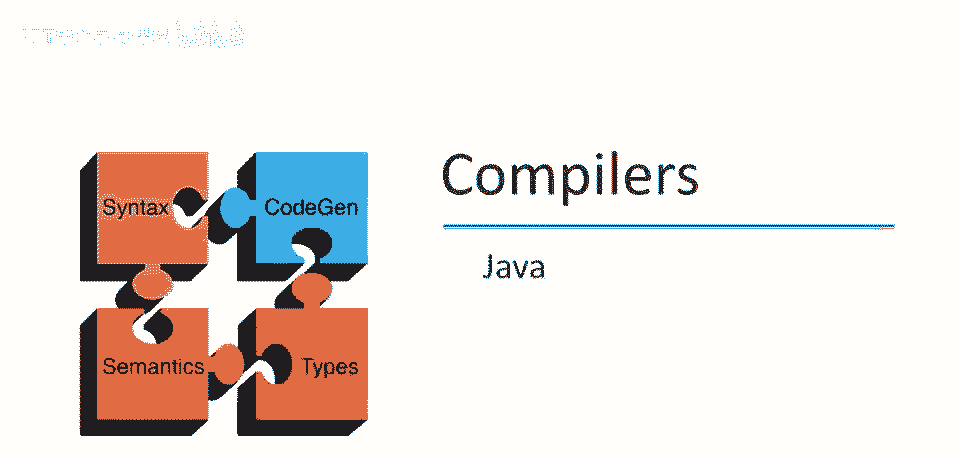
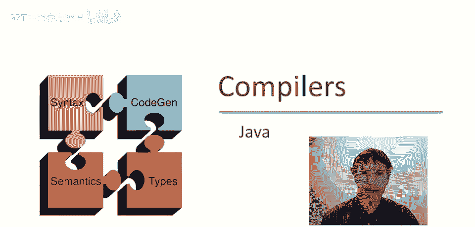
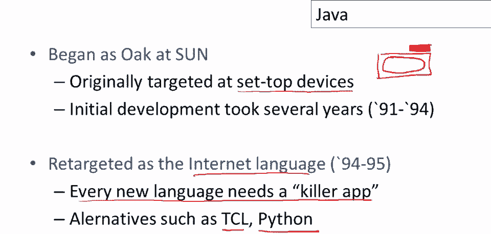
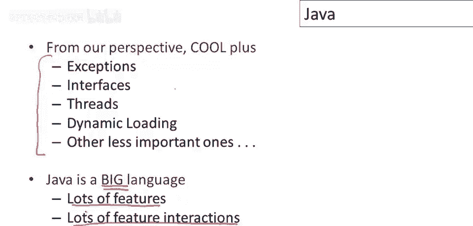

# 【编译原理 CS143 】斯坦福—中英字幕 - P90：p90 18-01-_Java - 加加zero - BV1Mb42177J7

在接下来的视频中，我们将应用课堂所学，分析Java的各种特性，这将让我们有机会看看真正的编程语言及其设计，嗯。

已经完成，也会讨论一些不酷的特性，课程中尚未涵盖的。

从这个角度看，Java是一种超级酷的语言，很酷，加上更多特性，核心中有更多特性，Java和酷非常相似，Java和酷都是类型化面向对象垃圾收集语言，它们都在20世纪90年代初设计。

因此它们共享当时的共同文化，所以在这段视频中我将简单介绍Java的历史，这将是这段相对较短视频的重点，然后在接下来的视频中我们将讨论，Java中不在酷中的所有特性，并使用我们一直在讨论的想法。

通过课程来解释这些想法，但我觉得这些都是重要的语言结构，不幸的是，嗯，因为太耗时或太复杂而无法添加到课程项目中，因此我认为使用像Java这样的语言来说明，嗯，这些想法是如何工作的，以及存在哪些问题。

所以Java最初是一个名为Oak的项目，在Sun Microsystems，最初目标是机顶盒设备，这是一个小盒子，将放在你的电视上，所以你有你的电视屏幕，然后上面会有这个小东西，将放在电视上。

它将控制你所有的有线电视节目，这基本上将连接到某种类型的网络，它将帮助你，你知道让电视更具互动性，所以这是在每台电视本身都不是电脑的时代，Oak的初步开发花了几年时间。

我相信项目从大约91年到94年运行，至少，据我了解，机顶盒市场从未真正起飞，所以这个从未真正流行起来，嗯，消费者从未接受过从不，因此，实际上存在有限的上升空间，或橡树在当时有有限的潜力，然后发生了某事。

互联网发生了，因此，在90年代初，互联网革命真正开始加速，每个人都开始上网，并在1993年左右变得明显，1994年，将需要真正解决互联网特定问题的编程语言，特别是人们非常关心安全性。

他们不想下载大量二进制文件，这些文件是由C语言编写的，并在互联网上传递，因为那些程序是否能按预期工作没有保证，也不会崩溃你的机器，因此，需要在互联网上共享代码，来自你不完全信任的其他人。

这意味着我们需要比C和C++更安全的语言，因此，那里有一个新的语言的机会，实际上有几个候选人，嗯，除了Java，Tickle和Python，嗯，都是非常认真的候选人，成为互联网编程语言，最终。

太阳微系统的支持，太阳对Java的支持，帮助它在互联网上真正获得非常强大的影响力，但你知道这个故事的重点是，每一种新语言都需要杀手级应用，每一种编程语言都骑在一些应用程序的背上进入世界，因此。

必须有一种新的应用程序，人们想要编写，现有的语言服务得不是很好，并提供机会，这使得人们学习新的编程语言变得值得，因此，Java是一种非常安全的语言，它有垃圾收集，它有类型系统，使其在当时。

非常适合互联网编程的兴起需求，它变得非常流行，我认为主要是因为这个原因，如果你嗯，如果你记得，早期有一场关于编程语言经济的讲座或视频，实际上，我会推荐，如果你还没有看过那个，那么回去看看，因为在其中。

我讨论了这些关于语言如何被采用的想法更详细。

因此，Java也在特定的技术环境中出现，这种情况很常见，新语言常大量借鉴前辈，新语言常为旧思想新设计，或许加入些创新，Java受特定影响，至少我理解如此，Java类型系统，或其对类型的承诺。

人们尝试建语言，现实方式扩展大系统，但也要强类型，Java面向对象源于类似Objective-C的语言，C和C++，以及Eiffel，它们也有接口的概念，这是Java的一个显著特征，最后。

Java相当动态，意味着许多事情不是静态完成的，而是动态完成的，如反射就是其中一个例子，实际上还有相当多的其他特性，那里有些历史，有些共享文化，这是一种或曾是函数式家族语言，但它也是，非常动态的语言。

如我开头所说，这个视频只是介绍和概览，在接下来的几个视频中，我们将研究Java的特定功能，以及它们的工作原理，这将包括异常，接口和线程等，还有诸多特性稍后讨论，要明白Java是一门大语言，并不简单。

Java语言手册数百页，功能众多，并且，更重要的是，设计语言难点在于，当然，确保所有功能交互正确，所有特征的组合，和，你知道。

