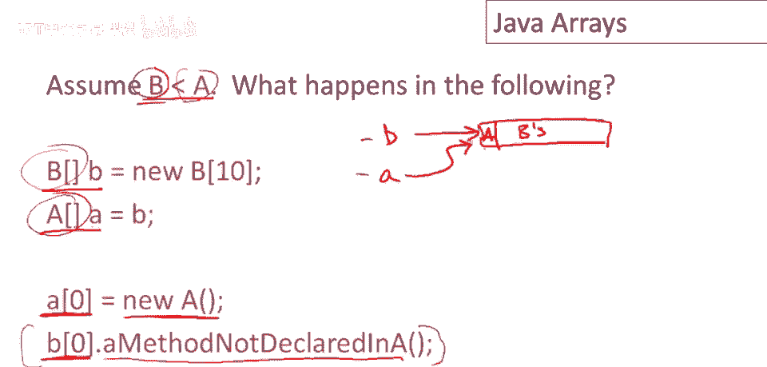
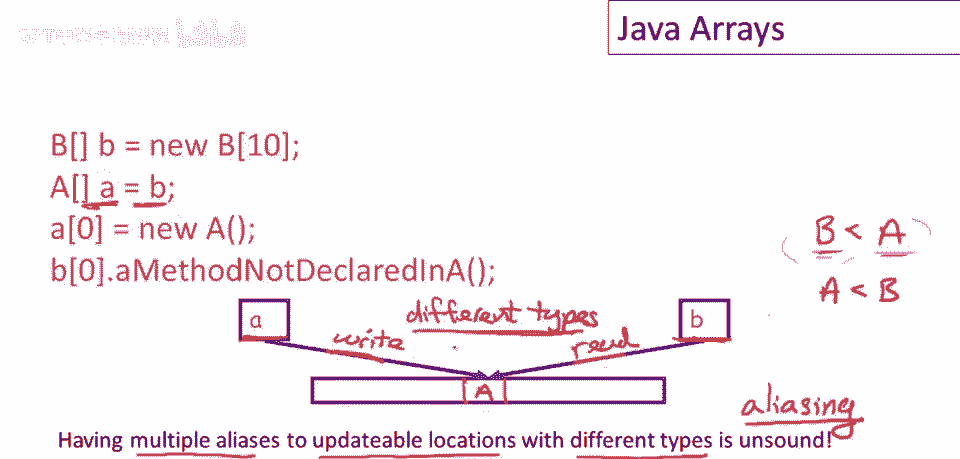
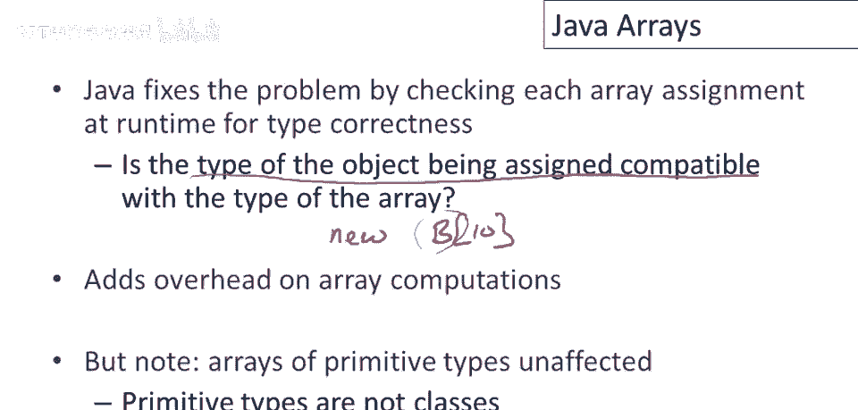

# 【编译原理 CS143 】斯坦福—中英字幕 - P91：p91 18-02-_Java_Arrays - 加加zero - BV1Mb42177J7

本视频将探讨Java数组。

假设有两个类a和b，且b是a的子类，考虑执行以下代码会发生什么，首先将分配一个蜜蜂数组，这是一个用于存储蜜蜂的数组，有一个数组变量小b指向它，然后有一个变量数组a，也指向与b相同的数组，注意a的类型。

a是一个a类型的数组，b是一个b类型的数组，现在我们将执行以下操作，将一个新a对象赋值给a[0]，这应该没问题，因为a是一个a类型的数组，看起来应该没问题，第一个位置将有一个a，然后访问b[0]。

因为a和b指向相同的数组，与a[0]相同，将调用未在a中声明的某个方法，记住b是a的子类，所以b具有a的所有方法，但b可能还有更多方法，由于这是一个b类型的数组，应该能够调用所有b方法。

但当我们调用在b中声明但在a中未声明的某个方法时，将出现运行时错误，因为数组中存储的对象实际上是一个a对象，要理解这个例子，需要查看Java的子类型规则，如果b继承自a，这是其中一种情况。

如果b直接继承自a，那么b是a的子类，就像其他面向对象语言一样。

我们从类型检查的讲座中非常熟悉这一点，类型子类型是传递的，如果c是b的子类，b是a的子类，那么c也是a的子类，这也是完全标准的，a和b是子类型，如果b继承自a，这是其中一种情况，如果b直接继承自a。

那么b是a的子类，就像其他面向对象语言一样，我们从类型检查的讲座中非常熟悉这一点，类型子类型是传递的，如果c是b的子类，b是a的子类，但还有另一个非标准的规则，或它绝对是非标准的。

那就是数组b是数组a的子类型，如果元素类型有子类型关系，所以如果b是a的类型，那么数组b是数组a的子类型，很酷，Cool没有这样的东西，Cool没有raise，所以它甚至没有机会有类似的东西。

但这也是不正确的做法，其他有对象和子类型的语言也不是这样做的。

让我们再次看看我们的小例子，让我以稍微不同的方式解释一下，所以问题是，我们有一块内存，实际上这里并不重要，这不一定是数组，重要的是它是内存的可更新部分，所以我们有指针指向它，我们有两个指针指向它。

A和b，它们都可以读写这部分内存，这可以只是一个单元格，它不需要是多个单元格的数组，但重要的是，有一个内存位置，这两个都指向它，它们都可以读写，好的，麻烦来了，嗯，顺便说一句，这有一个名字，叫做别名。

好的，所以当你有两个名字，两个程序名称指向同一部分内存，这叫做别名，在这里，你知道，我们有两个数组a和b指向同一块内存，好的，现在，别名在真实程序中很常见，它本身并不坏。

但在这个例子中的问题是a和b有不同的类型，好的，一般来说，如果有别名可更新的引用，好的，意味着你有两个名字指向同一个位置，这个位置既可读又可写，所以可以通过两个名字更新，如果这两个名字有不同的类型。

那么这将是不安全的，好的，你将不会有健全的类型系统，要看到问题，让我们说在这里这个例子中我们有什么，嗯，b类型是a的子类型，好的，那意味着什么，嗯，这意味着我们可以通过这个指针做右操作，好的。

并将a对象写入此位置，然后我们可以通过这个指针读取它作为p对象，但现在它没有a的所有方法和字段，将其视为b对象，我们可能会对其实施一些未定义的操作，你可以看到这没有帮助，如果我们交换a和b的角色。

所以你知道如果我们特别地，如果我们反转子类型关系，因此a是b的子类型，我们得到完全相同的问题，因为别名是对称的，然后我们会通过这个b指针做右操作，并从a指针读取，交换读写操作的角色。

我们拥有完全相同的问题，总的来说，多个不同类型的可更新位置的别名是不安全的，实际上这个问题已经在许多不同的编程语言中出现过，Java并不是唯一遇到这个问题的编程语言，它是类型系统的一个相当微妙的方面。

在许多语言中已经做了类似Java的事情，他们实际上为静态类型系统创造了一个问题，嗯。

通过希望数组中的子类型工作，现在标准的解决方案或是在，我应该说在许多语言中，并且在编程语言研究社区中可能最广泛接受的，是您需要为数组设置不同的子类型规则，所以我们会说你知道通常使用的规则。

解决这个问题的标准解决方案是在类型级别上做以下事情，所以嗯，您只允许对数组进行子类型化，所以你知道b数组是a数组的子类型，仅当b和a是相同类型时，如果b等于a，如果你考虑一下，如果我们有一个数组。

现在我们有指向它的两个指针，a和b，我们知道a的类型，b类型的子类型，那仅发生在元素类型相等时，因此我们不能创建两个指向可更新位置的不同类型的引用，这将确保类型系统的正确性。

因此Java以不同方式修复问题，因此，Java不是静态检查数组访问是否都有类型，正确的Java在运行时这样做，因此，每当数组中执行赋值操作时，Java检查被赋值的对象的类型是否与数组的类型兼容。

所以当你在Java中说new b sub ten时，Java，记得在数组内部，这应该是一个b的数组，然后每当您向数组中赋值时，它将检查您要赋值的项是否是，B或B的子类型，显然，这会在数组计算上增加开销。

因此，对数组的每个赋值都将有一个，有一个类型，检查在运行时，幸运的是，虽然，嗯，最常见的数组是原始类型的数组，特别是int数组和浮点型数组，这些不受影响，因为原始类型不是类，它们没有子类型，因此。

你永远无法创建数组，例如，带有任何可能导致此问题的子类型关系的浮点数字符数组，所以对于原始类型，我们得救了或处于更好的状态，它们不需要这些额外检查，但如果你有对象数组，那么在Java中。

我们会向这些数组中赋值。

因此，存在额外的运行时开销。