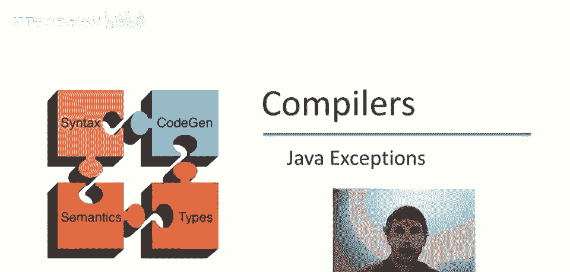
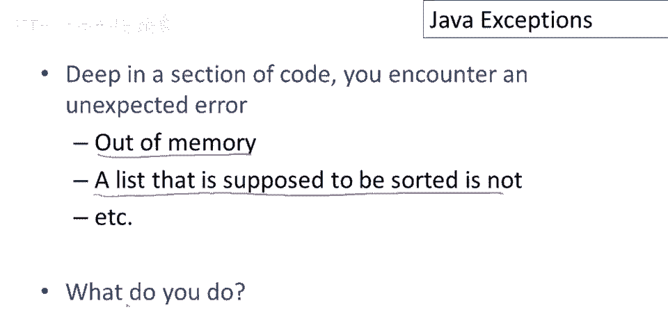
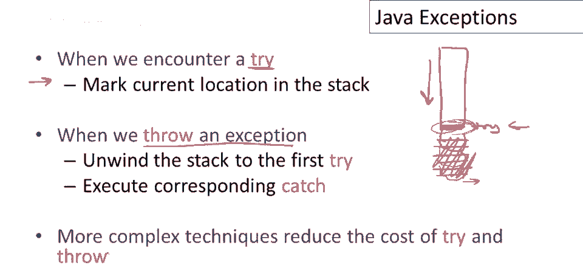
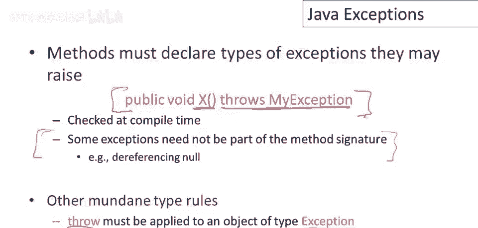

# 【编译原理 CS143 】斯坦福—中英字幕 - P92：p92 18-03-_Java_Exceptions - 加加zero - BV1Mb42177J7

本视频中，将讨论程序员定义的。

异常，考虑以下典型编程场景，深入复杂代码部分，遇到可能出现意外错误的地方，可能发生违反程序重要属性的事，例如，可能发现内存不足的地方，或数据结构不满足要求，某些不变量，所以一个应排序的列表，并非如此。

或诸如此类，问题是如何处理这些错误，如何编写代码以优雅地处理错误，而不是使程序非常丑陋。

许多语言中解决此问题的流行方案，包括Java，是在语言中添加一种新的值类型，称为异常，我们将有控制结构处理异常，这是最流行的两个，它们在Java中的样子，我们可以抛出异常，这将在此时创建异常。

抛出发生的地方，异常将简单地传播出程序，它将，它将基本上在那时停止程序执行，程序将在那时停止，包含结构也会抛出异常，因此异常将，你知道，简单地向上传播到当前执行的代码，直到遇到try catch。

这如何工作良好，我们可以尝试，我们可以执行此表达式，这将是某个表达式，如果此表达式抛出异常，若表达式内抛出异常，则捕获该异常，可在此绑定，指定异常值名，类似于let，捕获此处的异常，命名为x。

然后执行清理代码，处理异常，以某种方式，此设计处理异常的基本思想，嗯，异常发生在你遇到的地方，实际检测异常的地方，可能在代码深处，不是一个处理异常的好地方，你想做的是退出那部分代码，回到更高层次的点。

可以清理并处理异常，然后可能重试较大块的代码。

这是一个使用异常的小例子，呃，异常，所以这里我们有main方法，我们要做什么，我们有一个try块，只调用函数x，如果它抛出异常，那么我们将捕获异常，在这种情况下我们不做任何事情，我们只打印出一条消息。

说出现错误，并终止程序，我们并没有做任何聪明的事情，但我们确实捕获了异常，至少打印出错误，而不是仅仅终止，那么x做什么呢，X简单地抛出一个异常，这个函数x分配了一个异常对象，这只是一个值。

它就像其他类一样，但它有一个特殊属性，它可以被抛出，所以当我们抛出它时，x异常终止，我们最终回到main方法中的try catch表达式中的catch块。

在最后几张幻灯片中，我对异常的工作方式给出了一个非正式描述，可能不是很清楚，事实上，我认为很难给出一个非常清晰的描述，如果没有某种形式的正式描述来说明异常应该如何行为，但幸运的是。

我们在本课程中已经学习了操作语义，所以现在你熟悉了那种语言行为描述，我可以非常简洁地描述try catch实际上是如何真正工作的，好吧，所以我们将为try catch表达式提供操作规则。

并且只是指出这里，有一些字体问题，所以我不得不手工在幻灯片中写下转义字符，所以这些手写的字符都应该是转义字符，现在更重要的事情，异常有一些区别，好吧，异常对象有两种状态，它可能只是一个普通值。

当我说Java中的新异常对象，当我说你知道的新东西，那是异常类的实例，它只是一个普通值，在那个点上它就像任何其他对象一样行为，但当对象被抛出时，有一个区别，所以当异常实际上被抛出时。

它变成了一种特殊类型的值，它被以不同的方式对待，好吧，我们将区分普通对象，V 好，和被抛出的对象，好吧，这些是活动异常，好吧，所以让我们看看异常构造的操作规则，这是try catch块的一个规则。

如果这个表达式评估为一个普通值，如果没有抛出异常，那么try catch块的结果就是那个值，try catch块的工作方式是你评估try块中的表达式，如果它以正常方式终止并带有值。

那么整个表达式的结果就是那个值，好吧现在，另一种可能是你将评估一个try catch块，当你尝试评估try块中的表达式时，你，它将抛出异常，所以它可能会导致抛出异常，所以这是这种情况，好吧，那个抱歉。

是这种情况，其中e1评估为这些特殊值之一，被标记为已抛出的异常，我们该怎么办，嗯，我们解开异常，我们取出被抛出异常中的值，好吧，我们将其绑定到一些局部名称，好吧，这是在catch表达式中命名的。

然后我们评估清理代码，所以有了异常值可用，我们评估e2，无论e2的结果是什么，那就是try catch块的结果。

throw是如何工作的，呃，它非常简单，所以throw只接受一个表达式，它评估表达式以获取值b，然后将其标记为抛出的值，表示为抛出异常，所以它用t这个东西包裹该值，这表示该异常现在已被抛出。

我们只需要谈论语言的其他部分，语言中所有其他结构如何处理这些抛出异常，这非常简单，我们希望这些抛出异常简单地传播到其他任何类型的表达式之外，例如，我们只做一个例子，因为每种语言结构的想法相同。

假设我们评估e一加e二，所以首先我们需要做的是，当然，是评估e一，如果这恰好引发异常，所以出了什么问题，在评估e一时，如果e一评估为抛出异常，那么我们就停止加号的评估，我们甚至不评估e二，注意e。

以上未提及2，1是评估项之一，因此如果e，1异常终止，抛出异常，整个编辑的结果是该异常，其他结构类似，如果if子表达式之一结果为异常，实际上，如果，如果一旦子表达式之一结果为异常。

它们停止评估并传播该异常，唯一阻止异常传播的方法，是在try catch块中捕获。

实现异常的方式有很多，这是一个简单的实现方法，当我们遇到try表达式时，将在栈中标记当前位置，将在栈中标记位置，遇到try的位置，例如，这里是我们的栈，假设栈是这样运行的，遇到try表达式。

在栈中放置标记，表示那里遇到了try，然后继续，你知道，评估try内的内容，可能会向栈中添加更多内容，现在，抛出异常时，如果在这里，突然抛出时我们在这一点，我在执行中，会发生什么，我们将展开堆栈。

我们将所有东西弹出堆栈，我们将弹出所有这些东西，所以都回到第一次尝试，然后执行相应的catch，所以这里我们标记了，你知道代码中的位置，有一个try，我们可以用它找到表达式。

代码中有相应catch块的片段，并将堆栈展开到这一点，然后从catch开始评估，所以这种设计有一个缺点，try实际上是有成本的，即使你不抛出x，即使你不抛出异常。

执行try catch块仍然要付出一些代价，你至少要标记堆栈并记住取消标记，当然，当你弹出堆栈上的东西时，当你离开try块时，所以更复杂的技术试图减少try和throw的成本，并在它们之间进行权衡。

通常你想做的是，因为异常可能在，在大多数程序中相对罕见，使try的成本尽可能低，可能以使throw稍微更昂贵为代价。

现在有一个关于java的小问题，未被捕获的异常在对象终结时会发生什么，如果你不知道对象终结是什么，那么，当一个对象被收集时，当一个对象被垃圾收集时，有可能在该对象上运行一个方法来清理它。

在垃圾收集器实际分配它之前，这被称为终结方法，所以对象可以在java中有终结方法，这些方法本质上是由垃圾收集器调用的，所以当垃圾收集器发现某个对象是垃圾时，它将清理它，它将首先调用终结方法。

你为什么要这样做呢？比如说，我们有一个对象，它可能有一个文件句柄，它可能有一个指向打开文件的指针之类的东西，现在当这个对象变得不可达时，它将由垃圾收集器收集，但如果你不关闭文件，那将会导致问题。

程序中有许多打开的文件，使用它们可能会导致后续问题，特别是当你用完文件句柄时，操作系统通常提供固定数量的文件句柄，所以正确做法是，在垃圾回收时首先关闭文件，并实质上删除这个指针，好的，然后释放对象。

这就是对象终结的作用，所以再次，可在Java中定义方法，垃圾回收器运行前清理资源，若终结方法抛出异常，谁捕获，因垃圾回收器调用，调用时间不可预测，异常处理位置不明确，答案为，无人处理该方法或异常被丢弃。

对象终结期间未处理的异常，仅在方法内处理，否则丢弃。

Java的一个创新是异常是方法接口的一部分，编译器会检查它们，所以在我讲座开始举的例子中有一个方法，X可能抛出异常，我的异常，注意X的声明实际上声明了X可以抛出该异常，它是X接口的一部分。

X的检查接口的一部分，它可以抛出一个特定异常，为什么你想在编译时检查这个，原Java项目中实际观察到的，Java程序可能抛出许多异常，人们容易忽略可能抛出的异常，他们不知道要处理哪些异常，实际上。

当他们将这个添加到语言时，编译器将强制执行，现在，一个方法声明了它可以抛出的所有异常，他们在编译器中发现了许多地方，抛出异常但未正确处理，这导致了更好的错误处理，嗯，Java编译器本身。

人们普遍认为这是个好主意，因为它帮助程序员编写更健壮的代码，因为他们能看到必须处理的异常，现在有一些例外，特别是，有，有一些运行时错误，不必成为方法签名的部分。

因为静态检查方法是否永远不会引发它们非常困难，如解引用等，空指针或整数溢出不必处理和声明在接口，但大体上，任何方法可能抛出的异常必须在Java接口中声明。

然后还有其他关于Java中异常设计的平凡类型规则，例如，Throw必须应用于异常类型的对象，不能应用于任意类型的对象，但总的来说Java中的异常处理得很好，特别是这个想法。

关于声明方法可能抛出的异常类型的想法。

是Java中的新想法。