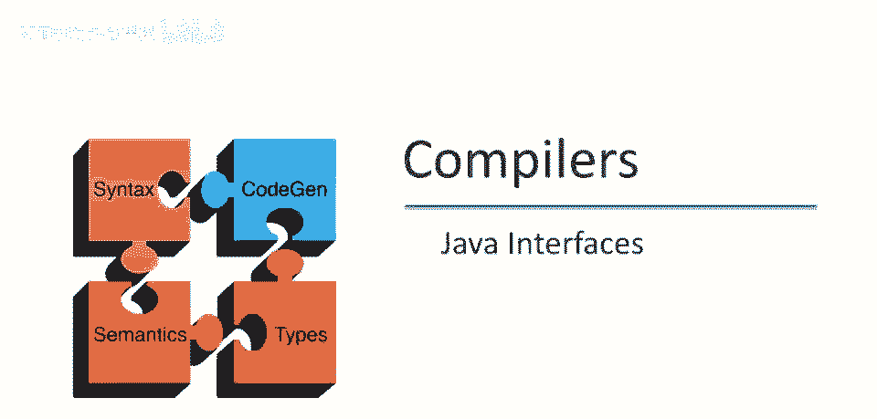
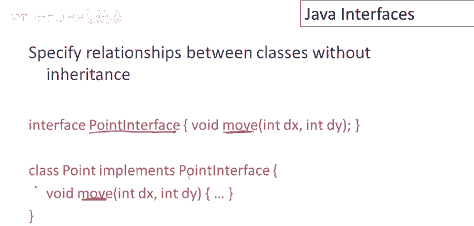
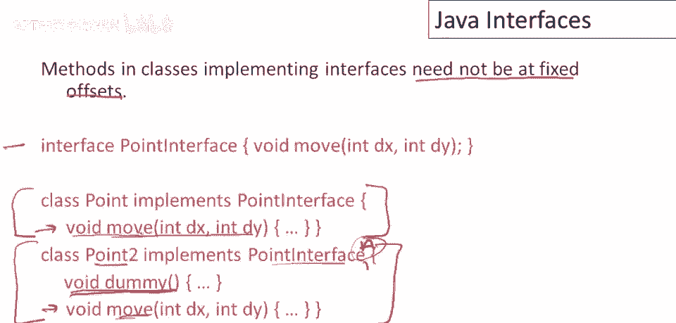
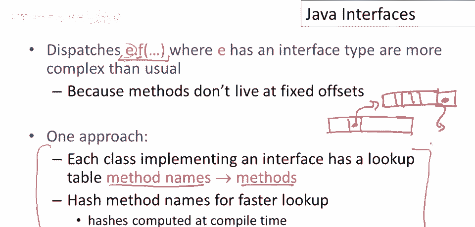

# 【编译原理 CS143 】斯坦福—中英字幕 - P93：p93 18-04-_Java_Interfaces - 加加zero - BV1Mb42177J7

在这段视频中，我们将探讨Java中的接口。

接口定义了类之间的关系，不使用继承，这是一个例子，我们有一个名为Point的接口，Point接口可以包含许多方法，我们只声明这些方法的签名，你也可以有其他东西，不仅仅是方法，但通常它们主要用于方法接口。

这是一个特定方法的示例，移动方法，并接受参数，有特定返回类型，任何其他类或类，抱歉，将实现点接口的类必须提供相同签名的方法，因此这样，因为点接口有移动方法，点类将必须有移动方法。

与声明的接口中的移动方法相同签名，如果点接口有其他方法，那么点类也需实现那些方法，你知道，有同名方法，带适当参数和结果类型。

现在，Java语言手册说Java程序可使用接口，使相关类无需共享抽象超类，或为对象添加方法，翻译是接口在C++中起多重继承作用，因此接口确实类似于多重继承，原因是类可实现多个接口，若我有类x。

实现3接口，A、B和C，这意味着x对象可视为A对象，B对象，或C对象（适当上下文），所以就像，或几乎如x有3个父类，A、B和C，现在有一些重要区别，但这是效果，若要类具备功能，或实现多个接口功能。

Java中可直接实现，声明类实现所有接口，这是应用示例，考虑斯坦福等大学研究生，研究生通常是学生，对，他们上课，具学生属性，获学位和成绩等，研究生通常也为大学工作，他们常是课堂助教或研究助理。

因此我还有其他角色，即大学雇员，如果我花了很多精力在我的大学人事管理软件中，实现处理学生的功能，实现处理员工的功能，那么我想利用这一点，当我开始考虑如何实现研究生的功能时，有一种方法。

如果我有一个实现了，如果我有一个抱歉，员工接口和学生接口的类，那么可以说研究生既是员工也是学生，因此研究生可以实现员工接口和学生接口，这样做的原因是实际上很难做到这一点，如果你只有单继承。

如果你考虑一下，如果我设置了一些员工类和一些学生类，现在我想让研究生成为其中之一，我该怎么办，如果我有一个员工类，我可以让研究生成为它的子类，但现在如何获得学生功能，同样，如果我有一个学生类。

我可以让研究生成为它的子类，但现在如何获得员工功能，所以在单继承中你被迫选择一个类来继承，接口的优势是它们将允许你获得或实现功能，或表达关系，至少是功能到多种不同的事物，因此我可以有一个。

一个研究生类实现了员工和学生功能，所以接口与继承有何不同。

可能，最大的区别是实现接口不如继承高效，这就是为什么你两者都有，因此你倾向于使用继承，如果可以，因为它将比接口更高效，接口效率低的原因是什么，主要原因是实现接口的类不必处于固定偏移量，实际上，我们通常。

不能，通常，将接口中的方法分配到类实现或对象实现的固定偏移量中，所以让我们看一个例子，这是我们的点接口再次，现在让我们说我们有一个类点，我们之前看到的那个实现了点接口，并实现move方法。

必须实现move方法，然后我们有另一个类也实现Point接口，但还实现其他功能，好的，所以它可能实现不属于该接口的其他方法，那么现在如何决定放置move方法的位置呢，我们讨论过的自然实现方式。

比如cool，C是方法按声明顺序排列，因此如果我们明确这样做，移动方法将不在这些类的第一个位置，现在我们可以想象一个单独的编译器过程，以便说点接口的所有方法，在实现点接口的任何类中。

但只要我们实现多个接口就不起作用了，所以让我们说点二类这里实现了另一个接口a好吧，我们已经决定对于点接口，移动方法应该首先，它应该是类的第一个方法，若对A界面做类似决定，你知道该接口中应首列的方法。

那么将产生冲突，通常无完全排序，可给所有方法和接口，使它们可在实现这些接口的所有类中维护，至少无无需预知所有声明的类，和所有声明的接口的完全排序，这在Java中有点，因为我们不想提前知道。

强制声明所有类和接口，未来不可扩展，好吧，接口中的方法不在类中固定偏移。

那么，如何实现接口，实现分发将比平常复杂，对方法f说，e具有某种接口类型，所以如果e i作为它本身，你知道某些类型，如果他被归类为具有某些接口，现在我们在调用该接口的f方法。

然后我们将不得不做更多的工作，这是一种方法，这种方法实际上相当低效，但你可以看到它会起作用，还有，还有其他更高效的方法，但在这里，这里有一种方法可行，所以每个实现接口的类，都会有一个关联的查找表。

将方法名，字符串方法名映射到这些方法本身，然后我们可以对方法名进行哈希以加快查找，实际上我们可以在编译时计算这些哈希，所以想法是，当我们有一个对象时，可能在对象内部，可能在分发指针处，分发指针。

你知道将指向一系列方法，类中正常的方法，但可能在分发表的末尾。

将会有另一个指针指向某种查找表，它将名称，映射到两个方法到代码，好的，所以与每个类的每个对象相关联，我们将有这个查找表，它将映射接口方法名称。

