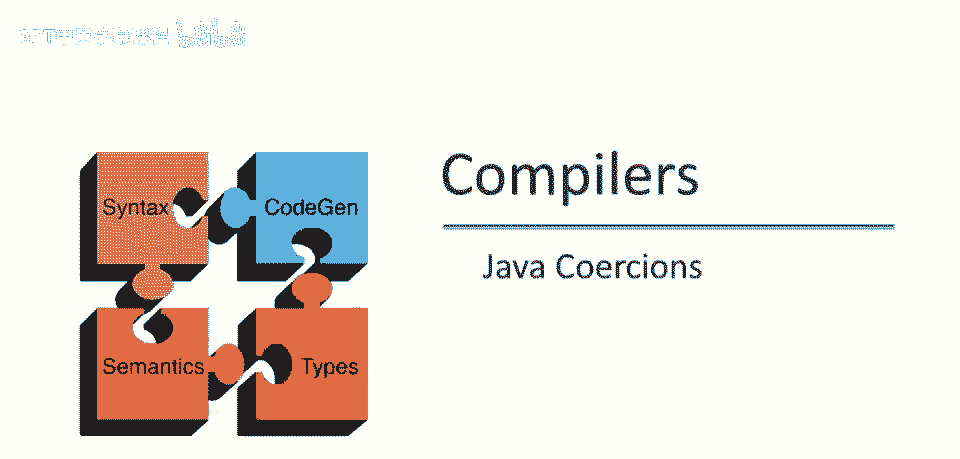
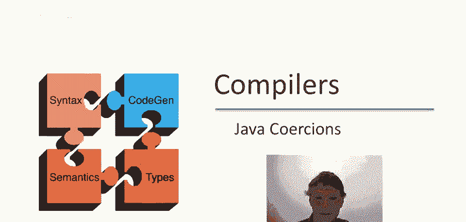
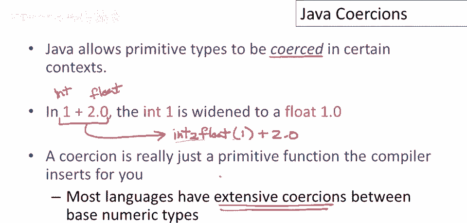
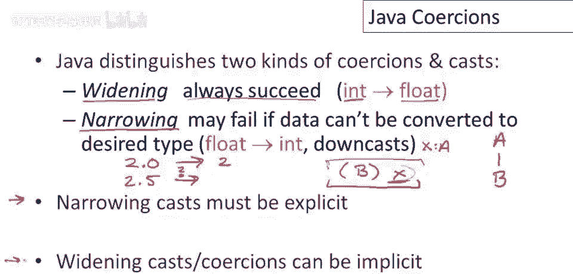
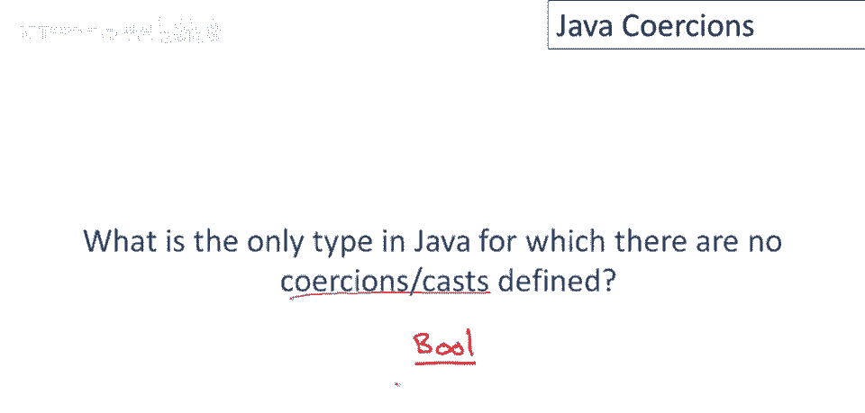
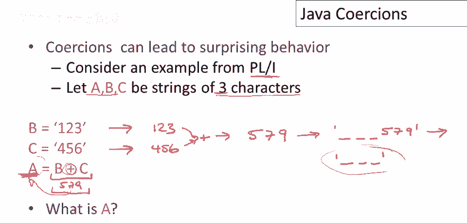

# 【编译原理 CS143 】斯坦福—中英字幕 - P94：p94 18-05-_Java_Coercions - 加加zero - BV1Mb42177J7

本视频将讨论，类型系统中的强制转换，许多语言中都有此特性，我们将专门研究Java中的强制转换。

Java允许在某些上下文中强制转换原始类型，意味着从一种类型转换为另一种类型，例如，考虑表达式1加2。0，此表达式的困难在于，虽然这里的1是整数，而2。0是浮点数，无法直接将整数与浮点数相加。

我们需要将整数转换为浮点数，然后以浮点数进行相加，或将浮点数转换为整数，然后以整数相加，在执行操作之前必须将它们转换为通用表示，通常的做法，也是Java所做的，是将整数转换为浮点数，1。0。

我认为正确看待强制转换的方式，它们是编译器为您插入的原始函数，就像您遗漏了一个函数调用，编译器注意到这一点并将其插入，在这种特定情况下，函数调用会是什么？我们可以认为有一个原始函数将整数转换为浮点数。

以明显的方式，因此，此表达式实际上被转换为表达式intToFloat，应用于数字1加2。0，好的，强制转换可能最好被视为，程序员的一种便利，让您避免编写某些函数调用，当类型转换显而易见时。

编译器可以插入执行该类型转换的函数，大多数语言实际上都有广泛的强制转换，这些转换非常，非常常见，特别是在数字类型之间，这不仅仅是Java，这实际上是许多不同风格的编程语言中的许多不同类型的强制转换。

Java特别区分两种类型的强制转换和强制类型转换，您有扩展强制转换，这些将始终成功，这意味着我会将它们放入，编译器或运行时系统不会抱怨它们，我们已经看到其中一个。

从int到float的转换是一个扩展强制转换的例子，窄化转换可能失败，特别是float到int，这可以正常工作，类似2。0可以明显转换为2，但如果你转换，没有整数表示的东西，比如2。5。

你知道这里有个问题，好的，对于这样的窄化转换，是否应该继续，是否应该截断或向上取整，那么Java会报错并阻止你，好的，嗯，你知道，窄化转换的一个更好例子，Java会抱怨的是向下转型，所以如果我有一个。

嗯，呃，两个类A和B，B是A的子类，然后我有一个A类型的东西，嗯，我可以把它转换为B，可以说，假设我有x，它是A类型的，好的，然后我可以有一个表达式，尝试将x转换为B对象，这里有一个转换。

我表明我想将x表达式视为B对象，这会类型检查，好的，编译器会让它通过，因为B是A的子类，但在运行时它会实际检查，x是否实际上是一个B对象，如果不是，你会得到一个异常，所以这可能在运行时失败。

如果x在转换点实际持有的对象不是B对象，Java的规则是窄化转换必须明确，你必须实际放入函数，你必须在代码中放入类型转换。

这样就很明显你确实想这样做，但宽化转换和强制转换可以是隐式的，如果你在宽化，如果你在提升到超类，整数类型之间，当明确一种类型嵌入另一种时，嗯，编译器会为你填充这些，现在有一个关于Java的小问题。

所以结果表明Java中有一个类型，对于该类型没有定义强制转换或类型转换，好的，所以没有隐式转换，甚至没有从该类型到其他任何类型的显式转换，问题的答案是，哪个是唯一的答案是bool，好的。

因此只有布尔类型没有强制转换或类型转换到其他类型。

我个人并不喜欢强制转换，我认为它显然是为程序员提供的便利，它显然是被广泛接受为编程语言中必要的，因为嗯类型转换，隐式类型转换和转换非常普遍，但我确实认为它倾向于导致程序的行为，与程序员可能预期的不同。

这是一个很好的例子来自语言po one，我们都为之站立的，编程语言，由IBM在20世纪60年代设计并具有许多功能，我们在课堂上已经谈论过几次pone，并且pone有一个非常广泛的类型转换和强制转换。

这可能会导致一些令人惊讶的行为，所以这是一个例子，我们有a、b和c是三个字符的字符串，所以重要的是要知道长度三是类型的一部分，所以b是一个123的字符串，所以您使用字符串4，五六，然后a将是b加c。

问题是a是什么，你可能不会猜到，让我向您展示我认为是正确的答案，所以首先的问题是这里的这个加操作会发生什么，嗯，所以这将被解释为整数加，所以b和c都将被强制转换为整数，并且这将作为整数，算术。

所以b将被转换为数字1，23 c将被转换为数字456，好的，然后我们会将它们相加并得到数字579，好的，所以此表达式的结果是579，但a也是一个三个字符的字符串，这必须转回字符串，结果这个转换分两步。

首先，这个数字转成默认长度的字符串，好的，默认长度恰好是六，所以这转成字符串，看起来像这样，3个空格后是579，然后这6个字符的字符串转成3个字符的字符串，我们只取前3个字符，所以得到这个，因此。

程序存储3个空格的字符串在，这可能不是预期的。

