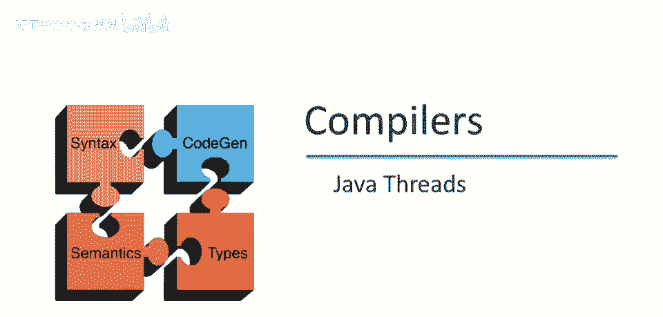
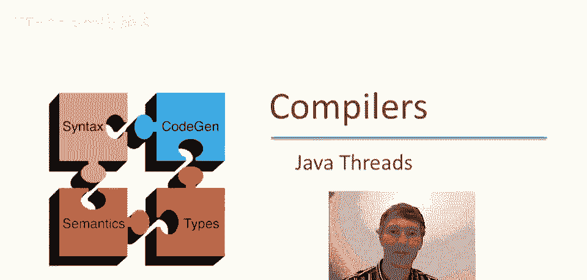
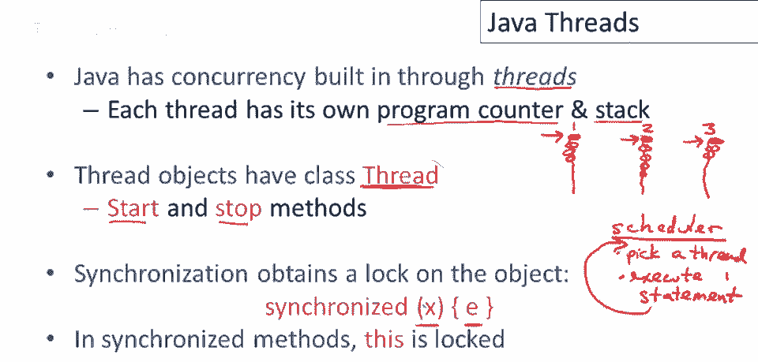
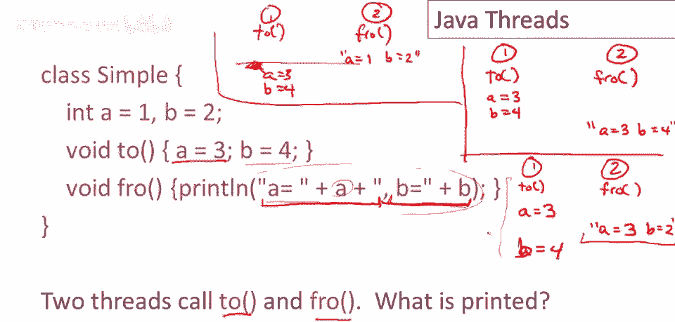
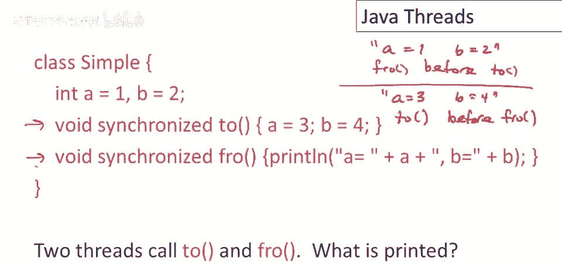
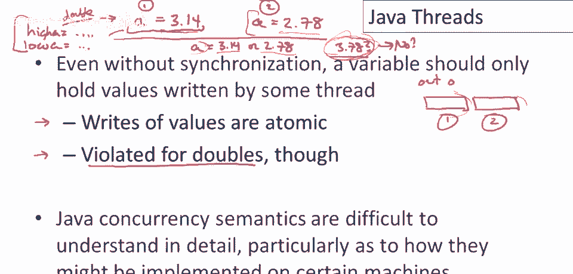

# 【编译原理 CS143 】斯坦福—中英字幕 - P95：p95 18-06-_Java_Threads - 加加zero - BV1Mb42177J7

本视频将讨论，编程语言中的并发，特别是，Java中的线程使用。

Java通过线程内置并发，本视频不解释线程的基础，假设有一定背景，这里简单说下线程，线程像自己的程序，有自己的程序计数器，意味着执行一条指令，有自己的局部变量和激活记录，Java程序。

或任何有线程的语言程序，同时可能有多个线程，抽象地，可认为线程是执行语句，每个线程有自己的局部变量，但可引用共享数据，可引用相同堆数据结构，每个线程执行特定指令，假设线程都在这，有三个线程，一二三。

它们在程序中的某指令，然后有个调度器，每次执行，调度器选一个线程执行，执行一条语句，这是概念上的，不是通常实现方式，然后重复循环，选一个线程，执行该线程一条语句，不断重复，比如，调度可能选线程一。

执行第一条语句，然后选线程二，执行这条语句，然后选线程三，执行该语句，可能决定再执行线程二，然后执行线程一多条语句，然后可能回到线程三，线程二可能再执行一段时间，等等，线程按顺序执行，每次执行时。

哪个线程执行不确定，它将执行多少指令，线程可能交错指令，线程可能交错，实际上，完全随机的顺序，好吧，回到如何在Java线程中实现，Java中的所有对象都有线程类，因此，你必须继承的特殊类，以成为线程。

当你从线程类继承时，你将拥有开始和停止方法，以开始和结束线程，好吧，线程有一些特殊属性，特别是线程可以同步对象，因此，线程可以通过同步构造获取对象锁，所以在Java中。

如果我说synchronized x e。

这意味着程序将在执行a之前获取x的锁，所以这里的程序将是锁定x，然后评估e，然后解锁x，好的，这是一个结构化的同步构造，执行表达式e时，将锁定x，这是主要方式，Java中几乎唯一同步多线程的方式。

这样可控制交错执行，一个线程执行这段代码时，其他线程不能执行这段代码，也不能锁定同一对象x，现在，两个线程能否执行相同语法结构？若局部变量x指向不同对象，但互不干扰，若尝试锁定同一对象x，不会交错。

Java中有种简写，比这种同步结构常用，同步可应用于方法，可以说，嗯，同步，F（这是方法定义），好的，这意味着当这个方法被调用时，这个对象将被锁定，所以这里将被锁定的对象是隐式的。

当synchronize附加到方法名或方法声明时，那总是意味着这个参数将是同步或锁定的对象，让我们看一个简单的例子，并思考如果我们有两个方法，其中一个调用类Simple的方法two。

另一个调用类Simple的方法fro，所以让我们看看那个，让我们来看看，假设有一线程一和线程二，现在线程一会调用方法二，线程二会调用方法fro，所以有一种可能性，假设方法二运行完成。

在fro执行任何东西之前，那么a等于三，b等于四，好的，然后fro会运行，它会打印出，呃，字符串a等于三，b等于四，好的，所以这是一个相对简单直接的情况，另一种可能是线程二在线程一执行任何事情之前运行。

线程二执行完所有指令，在线程一执行任何东西之前，在这种情况下会打印什么，fro会打印出a等于一，b等于二，然后线程二会运行，在fro执行后设置，所以fro执行完成后，它会将a设为三，b设为四。

所以这是另一种可能性，这两种情况都可以，但还有其他一些奇怪的可能性，让我们看看其中一个，如果线程实际上以非平凡的方式交错，所以让我们考虑以下可能性，假设线程二执行了赋值，a等于三，现在fro执行，呃。

打印的第一部分，所以它读取a并开始构建输出字符串，好的，所以它会打印出这里，呃，a等于三，好的，然后假设fro实际上继续运行，并且它也继续打印出，呃，这个的其余部分，好的。

所以它实际上进行了第二次读取b，所以它会打印b等于二，好的，然后有人将跑完其余的路，抱歉，B等于4，因此我们得到了一个看起来不太正确的输出，我们得到了，我们能够看到一个中间状态，线程一仅部分执行。

因此这里输出的在fro show，你知道，只是变量a和b的部分更新，所以一个已被写入，但另一个没有，如果我们不想这样做，如果我们认为这是错误的，我们将不得不使用同步来控制它，所以让我们看一下。

然后使用同步尝试防止这种情况发生。

并且我要提前告诉你，这段代码，或这次尝试是错误的，它实际上并没有解决这个问题，但它也说明了Java程序员最常见的线程编程错误，许多人包括专业程序员都会犯这个错误，许多生产Java程序都有这个特定错误。

所以这是一个非常有教育意义的例子，我认为，所以让我们看一下这里，让我们看看当我们有两个线程时，嗯，将要调用二的线程，将要调用fro的线程，并且让我们说在我们的堆中只有一个对象simple，嗯。

我们只称它为s，所以这是全局在整个堆中，只有一个对象，作为，嗯，简单类的所有对象，所以什么，让我们说线程一将首先执行，并且它首先要做的是因为它是一个同步方法，它将锁定调用参数，因为只有一个简单。

简单类的唯一对象必须是对象s，所以它将锁定s，这将阻止任何其他线程在，嗯，线程一持有该锁时获取s的锁，所以然后线程一可以继续执行语句a等于3，现在尽管我们可以中断，线程二可以运行并注意到这里。

线程二没有检查锁，它，它继续执行这里的代码并在fro方法中，但这不是同步的，那里没有同步关键字，因此，仅仅因为其他人持有简单对象的锁，并不阻止其他方法访问该对象的字段或数据，如果另一个方法本身。

不检查锁，因此，如果另一个方法未同步，它将继续执行，忽略另一个线程持有对象锁的事实，因此，在这种情况下，这可以只是运行完成，我们将打印出a等于三，B等于二，好的，因此，我们只看到两个更新中的一个。

然后调度器可以回来，嗯，让另一个线程运行，它将运行完成并解锁对象，你可以看到，这种特定的修复尝试没有取得任何成果，实际上，在没有同步的情况下，两个方法的所有可能交错仍然存在。

如果只有两个方法中的一个被同步，这个错误常见的原因是人们经常认为，你知道，读取是好的，我可以总是并行读取东西，这不会引起任何问题，因为我没有更改任何数据，是我的写入需要被同步，所以。

如果我要写入对象的字段，嗯，那需要与其他方法协调，因为写入是危险的，但读取似乎不会干扰，这里的观点是，如果只有一个方法，或只有对共享数据的两个访问中的一个被同步，没有帮助，因为同步只有。

如果每个人都检查锁，所以，读者和写者都需要检查锁，以限制这两个方法可能交错集的，所以，正确的方法是什么？只是将同步关键字放在两个方法上，现在不可能有我们之前看到的交错，所以现在只有两种可能的结果。

一个和只有两个可能打印的字符串，一个是a等于一和b等于二，在这种情况下，fro方法在two方法之前执行，所以是fro在two之前，好的，就这样，我的意思是，在所有方法之前，所有行，另一种可能是a等于三。

B等于四，好吧，然后在fro方法之前执行两种方法的全部，当这里的方法都同步时，这些将成为仅有的两种可能的交错。

我将结束这个视频，通过对Java线程做出一些其他评论，因此，我们希望的一个属性是，即使没有同步，变量应该只持有实际上由某个线程写入的值，我指的是什么，假设我们有两个赋值，这是在线程一中。

我们将a赋值为3。14，然后在线程二中，我们将a赋值为2。78，因此，在这些赋值完成后，在它们以某种顺序执行之后，我们期望什么，我们期望a最终等于3。14或2。78，好吧现在。

我们不希望a最终成为其他值，好吧，我的意思是，如果a最终成为3。78，例如，好吧，这会很糟糕，我们不想这样，因为这个值3。78从未由任何线程写入，好吧，这个值是某种方式制造的，我选择3。

78来暗示可能出错的情况，如果我们最终得到了线程一和线程二的位混合，或者数字的片段从线程一和线程二，它们以某种奇怪的方式重新组合，那么我们就可以创建一个从未分配给a的值，好吧。

它从未实际上在任何一个线程中写入，现在，Java确实保证正确性，所以值是原子的，意味着，如果我写入一个值，如果我给一个原始类型赋值，这将原子地发生，并且不会被对同一内存位置的另一个赋值干扰。

除了浮点双精度，所以这并不适用于双精度，它们不一定是原子的，为什么会这样呢？因为双精度，它是一个浮点数字，但它消耗了双倍的内存，这就是为什么它被称为双精度，它消耗两个字，好的，这意味着如果a是双精度。

假设a是双精度，这意味着3。14的右边实际上翻译成两条机器指令，我们需要写a的高位，等于某物，然后a的低位，因此，写代表a的两个字需要两条机器指令，你需要写高位和低位，好的，大多数机器上没有原生双字。

线程二也会发生同样情况，这将被拆分为对半部分的两次赋值，根据之前讨论，这些可能以某种方式交错，你可能会遇到不幸的情况，线程一写了表示a的高半部分，线程二写了表示a的低半部分。

然后你可能得到一个这样的数字，你知道，不是正好3。78，而是来自线程一和二的位混合，线程二的权利，你将创建所谓的凭空值。

显然凭空值是坏的，好的，你不想要那些，并且Java再次保证，几乎所有原始数据类型的权利将是原子的，所以你不会得到凭空值，但出于性能原因，对于双精度数不是这样，好的，一般般，呃，作为，手册上说。

这是对当前硬件的让步，他们不需要双精度权利的原子性，除非你，作为程序员，去标记类型为volatile，所以你必须声明双精度为volatile，如果你那样做，那么它们将保证原子权利，好的。

若写Java程序用Java线程，编程线程读写double并发，需小心声明double变量为volatile，至少目前，未来可能改变，我确信他们想改变，但目前需声明double为volatile。

确保读写原子性，嗯，更广义上，实际上有点独立，这实际上是一个独立观点，Java并发语义实际上很难理解细节，这个，嗯，关于凭空出现值的议题是一个方面，还有其他几个方面，这并不是Java的错。

并发语义实际上很难，实际上，这处于研究前沿，我们并不完全了解我们想要什么，或如何在并发环境中指定语言行为的正确方法，这并不是说我们什么都不懂，我们确实有一些语言具有很好的并发语义。

但在像Java这样功能丰富且完整的语言中，有一些东西在特定机器上如何实现并不完全清楚，在这个问题上已经做了大量的工作，特别是针对Java，Java实际上是最早拥有第一类线程的主流语言。

并试图将其与其他语言特性集成，所有其他现代语言特性我们都喜欢，所以并不奇怪，实际上我们遇到了一些麻烦，理解它们应该在所有情况下如何工作，所以这是Java的一个领域，我认为仍在争论中，而对于他们，嗯。

如果你用线程做相对直接的事情，一切都会很好，如果你在做，语言中有些区域，如果你尝试用线程使用它们，你可能会遇到一点麻烦，所以真正值得尝试理解Java并发和线程，如果你在编写重要的并发Java程序。

