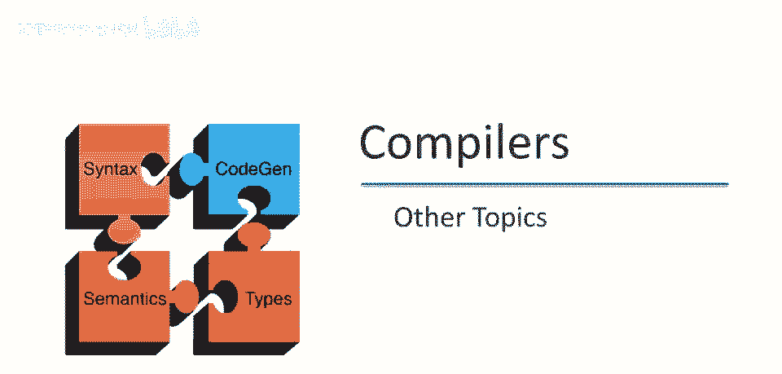
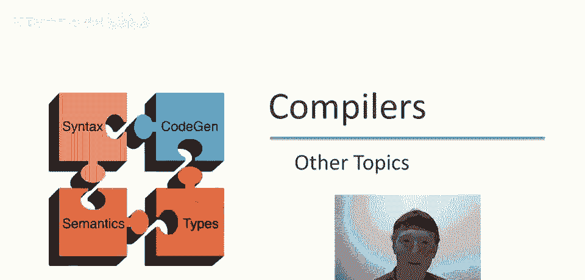
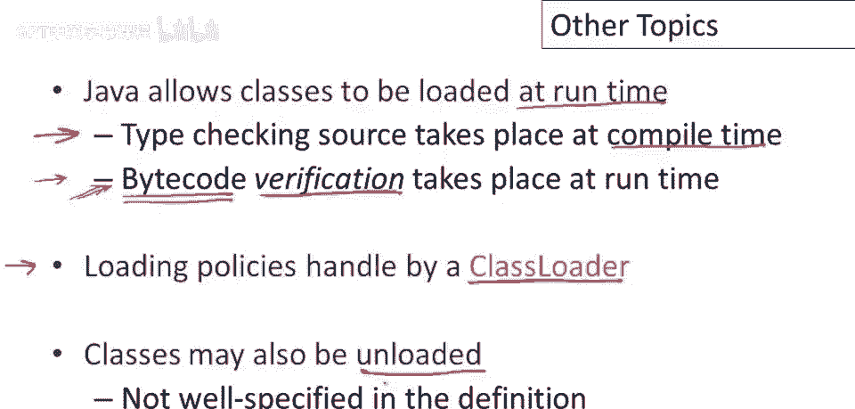
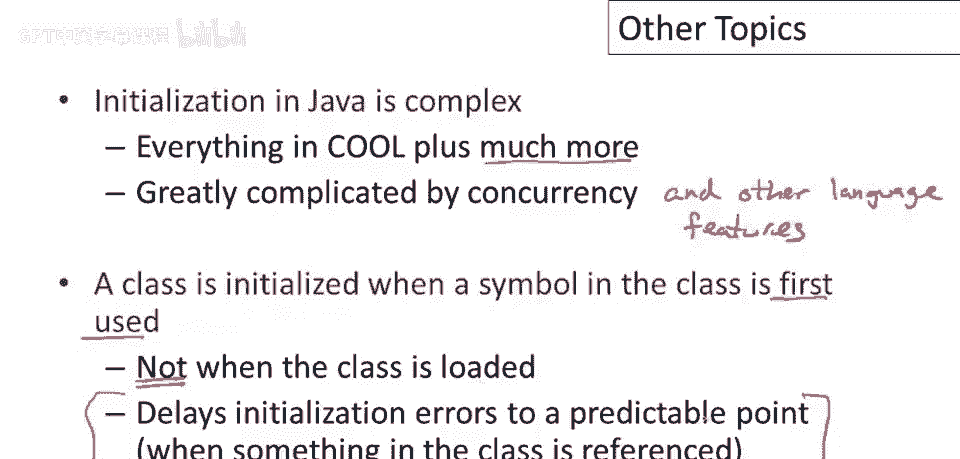
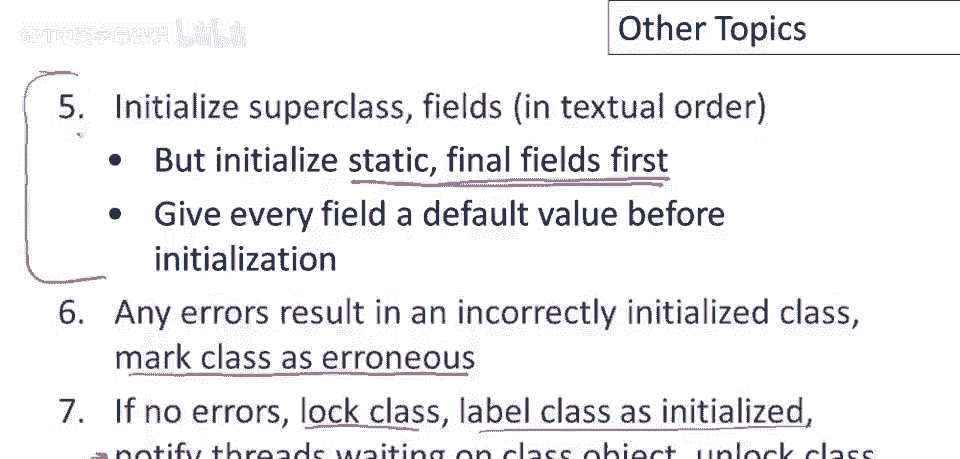
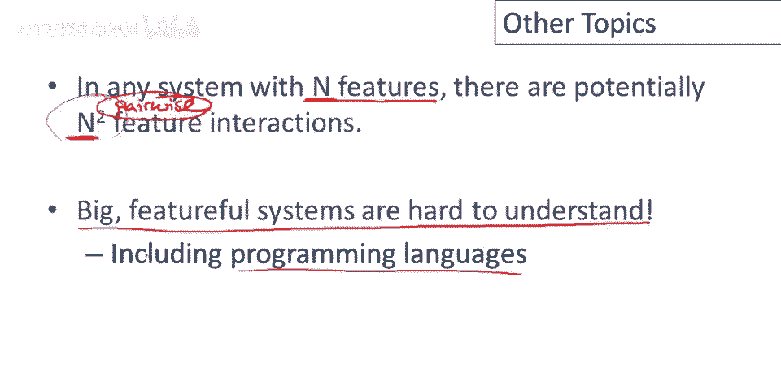
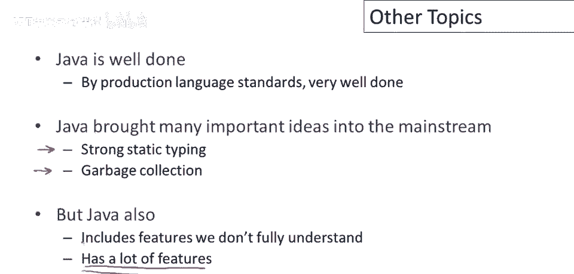

# 【编译原理 CS143 】斯坦福—中英字幕 - P96：p96 18-07-_Other_Topics - 加加zero - BV1Mb42177J7

本视频中，我们将结束关于Java的讨论，通过查看几个附加主题及其如何融入语言设计。

与Java的动态性一致，嗯，Java允许运行时加载类，但这意味着你可以实际向正在执行的Java程序添加功能，通过运行时加载新类，这可能会导致类型，安全性和安全性问题，现在编译时和加载时有区别。

源代码类型检查在编译时进行，这是我们之前视频中讨论的类型检查，但加载器在真正加载类时，加载的是字节码，不是源代码，不会被再次类型检查，这些字节码可能来自不可信的源。

这些字节码可能不是类型检查编译器的输出，在生成字节码之前，字节码可能不满足任务实现的类型假设，所以我们必须再次检查字节码，当类被加载时，一个称为字节码验证的过程就会发生。

字节码验证实际上是对字节码的类型检查，这就是它所做的，该过程略有不同，因为我们没有，这里的代码级别要低得多，因此算法看起来有点不同，但他们真正做的是类型检查，检查字节码，现在加载策略由类加载器处理。

类加载器是Java中的一个特殊类，它决定哪些类可以加载并实际在Java早期，发现了一堆安全问题，攻击者可以控制类加载器，安装自己的类加载器，这会比Java标准类加载器更宽松并破坏系统。

但这些问题很久以前就修复了，Java的另一个有趣之处是类也可能被卸载，所以你知道你不仅可以加载类，你也可以卸载类，上次我检查时，这在定义中并未明确说明，所以当你卸载类时含义有些模糊。

以及所有现有对象发生了什么，例如那个类的对象，现在我想花几分钟谈谈Java的初始化，这相当复杂，这并不奇怪，因为如果你记得Cool的初始化也很复杂，Java仅是酷的超集，所以它具有酷的所有初始化问题。

更多，现在主要复杂性来源是并发，但其他语言特性也增加了Java初始化的复杂性，事实上，嗯，如果你想理解一门新的面向对象语言，可以，研究它是如何进行对象初始化和类初始化的，因为在初始化中，本质上。

语言的所有特性都将相互作用，你必须解释所有这些交互，并解决它们，以便有一个明确的初始化过程，好吧，所以现在让我们谈谈类初始化，我们不会谈论对象初始化，我们只谈论初始化类，这就是。

代表类的对象实际上是如何在类首次引入程序时初始化的，所以首先要知道的是，类在，当类中的符号首次使用时初始化，好的，不是当类加载时，好吧，所以如果你在类中引用了任何符号，在第一次发生时。

这将导致类被初始化，这样做的原因是，如果你在类初始化中有错误，这将导致错误在可预测的地方发生，所以如果你有一个错误，你运行程序五次，你知道这个错误可能会在每次发生时都在同一个地方。

所以它是可重复和可预测的错误发生的地方，如果我们不是在加载类时发生错误，当类可能在许多不同的时间加载时，所以这里的错误，类初始化的错误将成为非确定性的，如果我们不，如果我们不在你知道。

执行中的确定性点延迟初始化。

所以现在我将讨论Java中初始化类对象的过程，首先我应该强调，类对象这个概念是Java有的，而酷没有我提到过这一点，但为了完全清楚，什么是类对象，类对象听起来就像它是什么，它是类的对象，它代表一个类。

好的，这不是类的实例，这是一个对象，它是类，好的，这不是类的实例，这是一个对象，它是类，这是一个表示类的对象，它包含有关类的所有信息，所以你知道它告诉你类的类型，类的字段和其他一切，这用于内省或反射。

在Java中这是必要的，因为有动态加载等功能，所以如果你想要，如果你动态加载一个类，那么你想能够使用那个类，你必须有一种查询类的，本课有哪些方法和物，这就是类对象的作用，所以有一个对象。

Java中每个类都有一个类对象，好的，所以当你加载一个类，首先必须初始化类对象，那怎么做呢，我们锁定该类的类对象，如果该对象已被其他线程锁定，那我们就等锁，好的，所以我们将等到有人告诉我们现在可以继续。

一旦我们获得类锁，我们必须检查类是否已被初始化，好的，结果可能是我们的线程，是同一个线程，已经在初始化类，那怎么会发生呢，记住，一个类，可以有，相同类型的字段，所以我可以有一个，名为x的类。

然后它可以有一个，类型为x的字段，类的初始化方式，如果我们需要初始化，类本身，然后，通过递归初始化所有字段的类，至少确保所有字段的类已初始化，如果我们有一个递归结构，其中字段中提到的类，如名称所示。

如包含类的名称，那么我们会遇到这种情况，初始化类的线程可能尝试再次初始化相同的类，因此，如果我们发现我们正在初始化这个类，我们只需释放锁并返回，另一种可能是类已初始化，所以当我们最终拿到锁。

我们发现其他线程已经进入，并在我们有机会之前初始化了类，那么就没有什么可做的，我们正常返回，如果这些都不是真的，好的，如果我们拿到锁并发现类尚未初始化，并且我们不是已经在初始化过程中。

那么我们将标记类以表示由该线程进行初始化，好的，我们将，我们将指示，你知道类正在初始化，我们正在初始化它，然后我们会解锁类，好的，接下来发生的事情，我们将要初始化超类，这意味着。

然后我们将按文本顺序初始化所有字段，但由于Java中有所谓的静态和最终字段，我们将首先初始化这些，好的，因此，静态最终字段将在文本顺序中的任何其他字段之前初始化，当然，在初始化之前。

我们必须要给每个字段一个默认值，就像在Cool中一样，所以步骤五与Cool中发生的情况非常相似，嗯，如果在初始化时出现错误，呃，初始化的一部分抛出异常，那么我们将标记该类为错误，好的。

我们将标记这个类为不好，不能使用，这是我们能做到的最好，如果在初始化时出现异常，我们只能放弃这个类，所以它有一个特殊的标记，说它是错误的，如果没有错误，如果我们成功初始化了类，并且没有任何错误。

那么我们将再次锁定类，我们将标记类为已初始化，然后我们会通知等待类对象的线程，所以任何被阻塞，等待类对象的人现在将被提醒对象已准备就绪，然后我们会解锁类，好的，就这样，这就是Java类初始化的概要。

我跳过了几件事，简化了它，所以这不是完整的描述，但这些都是主要观点，它们说明了语言的各种特性如何相互作用，所以你需要担心并发，你需要担心异常，你需要担心静态和最终字段，你需要担心继承。

我的意思是所有这些事情都必须一起处理，在设计一个单一的算法来执行类初始化时。

退一步说，关于Java类初始化的讨论说明了设计复杂系统的一般观点，所以在任何具有一定数量特性的系统中，每个系统都将具有一些特性，让我们称之为n，因为你想提供一些功能，显然系统应该做的事情。

所以它将有一些特性来做这些事情，但随着你添加特性，你会得到很多交互，潜在特性之间的交互，如果我们只考虑成对交互，那里的观点是，当然，是当我添加特性时，可能的交互数量以超线性方式增长。

它增长得比特性数量更快，所以添加下一个特性，你必须考虑系统中已经存在的所有先前特性，以及这个新特性如何影响它们，这就是为什么很难扩展或构建具有许多特性的系统的原因，对，这只是成对特性，这些只是。

这只是考虑一个特性与其他特性之间的成对交互，如果我要开始担心特性的子集，并考虑所有可能特性的子集如何相互交互，那么潜在交互的数量将不会，只是它将增长指数，实际上呈指数增长，所以将是，你知道。

远超过二次方，所以大而全的系统很难理解，你知道，这是一个你知道，计算机科学的一般教训，在任何想要设计复杂系统的学科中，并且这个教训适用于编程语言，它适用于您可能想要构建的任何其他类型的软件系统。

但它在编程语言中具有特别的力量，因为这些特征间的交互，发生在非常细的粒度，这些东西可以任意组合，因此在语言设计中，现在，必须确定所有交互，以便程序员能真正理解和有效使用语言，这确实我认为是。

课程中讨论的重大思想之一，也是我希望你们带走的东西之一，从这次讲座开始，至少特别地。

因此，总结并结束我们对Java的讨论，我认为Java是一种按生产标准做得很好的语言，它做得非常出色，因此，它是当今使用中设计最佳、规格最佳的语言之一，它将几个重要思想引入主流，所以当它是新的。

它带来了已经存在了很长时间的想法，但还没有找到进入非常广泛使用的生产语言的方式，特别是Java，是第一种广泛使用的语言，在商业环境中，具有强静态类型，它提供了类型系统提供的真实保证。

并且是一种受管理的语言，具有垃圾收集内存，但这并不意味着它是完美的，Java还包括一些在当时设计时，我们并没有完全理解的功能，现在可以说，这些可能是，Java设计中仍然存在粗糙的区域。

并发时内存语义有效，你知道，可能仍存在，多数人会同意，我认为现在有些问题和小灰色地带，作为程序员，你可能现在想避开，另一件事是工作，我刚有很多特性，如我之前所说，当你有很多特性，你将有更多功能交互。

导致复杂性，难以管理。

