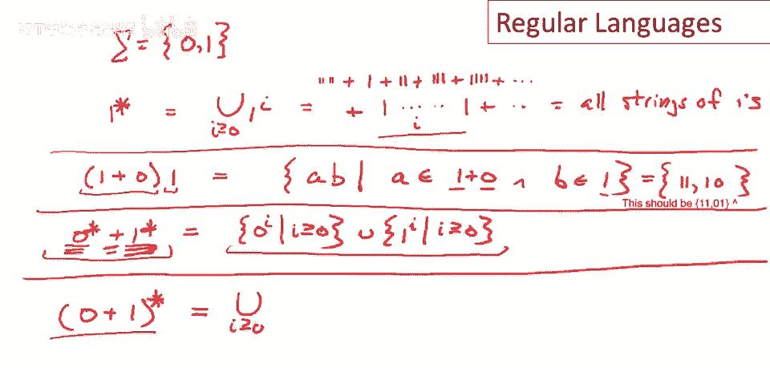

# 【编译原理 CS143 】斯坦福—中英字幕 - P9：p09 03-03-_Regula - 加加zero - BV1Mb42177J7

本视频将讨论，正规语言，用于指定编程语言的词法结构。

简述编程语言的词法结构，是一组标记类，每个标记类包含一些字符串，需要指定每个标记类包含哪些字符串，通常使用正规语言，本视频将介绍正规语言。

然后看示例，在真实编程语言中使用，定义正规语言，通常使用正则表达式，每个正则表达式表示一个集合，有两个基本正则表达式，若写单个字符c，是一个表达式，表示包含一个字符串的语言，即，单个字符c，好的。

一种基本形式，对于任何单个字符，得到一个包含一个字符串的语言，仅包含，该字符，另一个基本元素是正则表达式epsilon，包含，仅一个字符串，空字符串，重要的是记住，epsilon不是空语言，好的。

这不是对应空字符串和空字符串集，它是一个包含，一个字符串的语言，即空字符串，除了两个基本正则表达式。

还有三个复合正则表达式，按顺序逐一介绍，第一个是a加b，对应语言a和b的并集，这是集合a，使得a属于大a语言，小a属于大a并，小b使得b属于小b语言，即两个字符串集的并，连接类似字符串连接。

连接两个集合的字符串，构成新的集合，如果有两种语言a和b，则a和b的连接等于所有字符串，小a连接小b，其中a来自大a语言，b来自大b语言，这是一个笛卡尔积操作，从a中选择字符串，从大B中选择字符串。

然后合并，将a的字符串放在前面，以所有可能的方式选择这些字符串，形成所有可能的组合字符串，这就是语言a连接b，最后有一种循环结构，嗯，这读作a星，或称为清洁迭代或清洁闭包。

a星等于对于i大于等于0的并集，a的i次方a的i次方，次方，那是什么意思，嗯，年龄，第i，次方就是a连接自己，i次，所以这是a的i次方，注意因为i可以等于0，这里有一种可能是a的0次方。

所以a连接自己0次，那是什么，那是空语言epsilon，所以空字符串总是a星的元素，总结一下最后几页。

关于某个字母表sigma的正则表达式是最小的表达式集合，所以让我们定义它，所以正则表达式等于，嗯，epsilon总是正则表达式，另一种可能是单个字符c，其中c是字母表中的元素，好的，这一点很重要。

正则表达式是相对于某个字母表定义的，所以我们必须选择一个字符家族，这些字符将形成正则表达式的基本情况，这里你知道，对于字母表中的每个字符，我们都有一个基本正则表达式，然后我们有复合表达式。

所以另一种可能是正则表达式是两种正则表达式的并集，另一个是正则表达式是两种正则表达式的连接，最后一个可能是正则表达式的迭代，所以这五个情况是某个给定字母表上的所有正则表达式。

所以这五个情况是某个给定字母表上的所有正则表达式，这里描述正则表达式的语法，右边的不同情况，如果你以前没见过，这叫做语法，这对这堂课不重要，这不是这，嗯，这，这堂课是关于，但我们会讲到语法。

当我们讲到解析。

接下来举几个构建正规语言的例子，写出它们并思考含义，如我们所说，谈论正规语言时，首先要说字母表是什么，对于这些例子，我们就用0和1的字母表，这些将是包含0和1字符串的语言，让我们从一个简单的例子开始。

考虑这个语言，一颗星，那又怎样，嗯，描述得如此好的语言，我们知道星星的定义，如果记得那是联合，大于或等于0的1到i次方，好的，那等于什么？那就是，嗯，重复i次的1，这就是11连乘i的意思，好的。

意味着1与自己连乘，i次，所以这将是，嗯，空字符串，这就是1与自己连乘，0后1111连自己，3后1连自己，4后1连自己，任意次，好的，所有1串相等，现在好，做第2例，嗯，考虑语言，一加零，与语言连接。

一，好的，和，记得连接是如何工作的，是跨乘积的，所以我们将第一个表达式的每个字符串与第二个表达式的每个字符串组合，所以这将等于字符串a b，其中a来自一加零，b来自一，好吧，那可能是什么？

有两个选择给a，a可以是1或0，b可以是1，实际上这等于集合，嗯，一一和字符串一一，第二件事，字符串一一和一零，好吧，再做另一个例子，嗯，它稍微复杂一些，让我们逐步构建到有两个迭代的并集。

所以有零星加一心星，想想那等于什么？我们已经知道一心星等于什么，那等于所有一的字符串，因此，类比，零星必须是所有零的字符串，然后我们取这两个东西的并集，所以这实际上很容易写出来，让我们用这种符号写出来。

所以我们有零的i次方，对于i大于等于0，好的，所以它是零星并上一的i次方，对于i大于等于0，那就是所有一的字符串，所以这是这个表达式表示的集合，对于我们的最后一个例子，让我们想想，嗯，零加一，现在迭代。

好的，所以我们把星号放在两个单独字符的并集的周围，而不是在两个字符的单独星号上并集两个东西，所以，这个，这个表达式等于什么？让我们使用星号的定义，所以我们知道这是a的并集，对于i大于等于0的零。

加一i，那看起来像什么，首先看起来像，那里是空字符串，然后在这个语言中另一个字符串是，嗯，呃，是打扰一下，是从零加一开始，所以抱歉，我不应该说另一个字符串，但另一组字符串来自语言。

零加一再然后零加一再连接自身，好的，通常它将是这样，嗯，零加一再连接自身，乘以I次，好吧，那意味着什么，这意味着在每一个位置，如果我们有一个长度为I的字符串，在每一个位置，我们可以选择零或一插入。

这适用于任何长度的字符串，这将是所有长度的字符串都正确的，事实上，这个语言就只是所有字符串，由零和一组成，事实上这意味着它是集合，如果我们回头看字母表，字母表只包含零和一。

这是你可以用整个字母表形成的所有字符串的集合，它有一个特殊的名字，当这种情况发生时，当你有一个正则表达式，它表示你可以用字母表形成的所有字符串，我们将其写为sigma星，好的。

所以只是意味着字母表的所有字符串迭代任意多次，嗯，在继续之前我想在这里做的最后一件事，是实际上有很多种方式可以写每个不同的语言，没有唯一的写法来写这些，所以例如，让我们只拿这里的这个语言。

我们做的第二个，让我换个颜色，另一种写这个的方式，因为我们知道它的意思是这两个字符串，一一和一零，我本可以写成一一加一零，那将意味着完全相同的事情，这两个表达式表示完全相同的集合，类似地，一个星号。

我可以写成一个星号，加1，因为这不会改变任何东西，加入单个字符串，1不会改变任何东西，因为1已经包含在一个星号中，这可能是一种愚蠢的方式来写那个集合，但没关系，它有意义，它意味着完全相同的东西。

就像一个星号，再次强调的是，有不止一种方式写下相同的集合，嗯，呃，写作的权利，呃，呃，你可以写多个正则表达式来表示相同的集合，嗯，我们来到了这个视频的结尾和总结，我们研究了正则表达式。

它们用于定义正规语言，正则表达式是语法，那是我们写下的表达式，它表示一个字符串集，这是正规语言，这就是正则表达式的含义，在标准定义中有五种类型的正则表达式，有一个表示空字符串的表达式。

它由epsilon表示，然后我们有所有的一个字符字符串，然后有三种复合复合表达式，从其他正则表达式构建新正则表达式的三种方式，并集。

