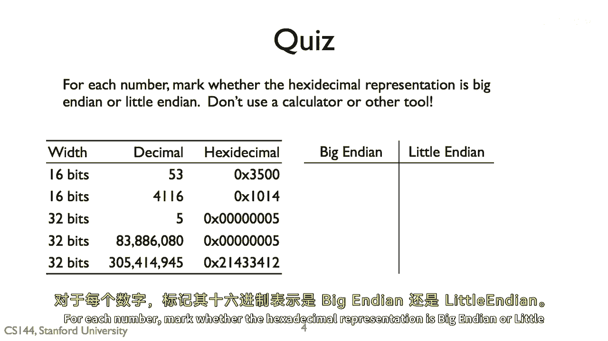

# 课程 P10：字节序详解 🧠

在本节课中，我们将学习计算机中一个重要的底层概念——字节序。我们将了解什么是大端序和小端序，以及如何通过实际的内存数据来识别它们。

---

## 概述

字节序描述了多字节数据（如整数、浮点数）在内存中存储时，字节的排列顺序。理解这个概念对于进行底层编程、网络通信和数据分析至关重要。

上一节我们介绍了数据在内存中的基本表示，本节中我们来看看字节的具体排列方式。


---

## 什么是字节序？

计算机内存以字节为单位进行寻址。当一个数据（例如一个32位整数）需要多个字节存储时，就产生了“哪个字节在前，哪个字节在后”的问题。这就是字节序。

主要有两种字节序：
*   **大端序**：数据的**最高有效字节**存储在**最低的内存地址**。
*   **小端序**：数据的**最低有效字节**存储在**最低的内存地址**。

我们可以用一个简单的比喻来理解：如果把一个多字节数据看作一个单词（例如“ABCD”），那么大端序就像我们正常的书写顺序，从左（A，最高位）到右（D，最低位）存放。而小端序则像是把这个单词倒过来写，从右（D，最低位）到左（A，最高位）存放。

---

## 如何判断字节序？

以下是一个判断字节序的示例。假设我们要存储一个32位的十六进制数 `0x12345678`。

**在内存中的存储方式对比：**



| 内存地址（由低到高） | 大端序存储内容 | 小端序存储内容 |
| :------------------ | :------------- | :------------- |
| 0x1000              | `0x12`         | `0x78`         |
| 0x1001              | `0x34`         | `0x56`         |
| 0x1002              | `0x56`         | `0x34`         |
| 0x1003              | `0x78`         | `0x12`         |

从上表可以看出：
*   大端序更符合人类阅读习惯，从起始地址读出的就是数据的最高位 `0x12`。
*   小端序则相反，从起始地址读出的是数据的最低位 `0x78`。

---

## 核心概念与示例

理解字节序的关键是抓住“有效字节”和“内存地址”的关系。我们可以用一段C语言代码来演示如何检测当前系统的字节序。

```c
#include <stdio.h>

int main() {
    int num = 0x12345678;
    char *byte = (char *)# // 获取num的起始地址（低地址）

    if (*byte == 0x78) {
        printf("当前系统为小端序 (Little Endian)\n");
    } else if (*byte == 0x12) {
        printf("当前系统为大端序 (Big Endian)\n");
    } else {
        printf("无法判断\n");
    }
    return 0;
}
```

**代码解释：**
1.  我们定义了一个整数 `num`，其十六进制值为 `0x12345678`。
2.  通过 `(char *)&num` 获取该整数在内存中起始地址（最低地址）的一个字节。
3.  检查这个字节的内容。如果是 `0x78`（原数的最低有效字节），则为小端序；如果是 `0x12`（原数的最高有效字节），则为大端序。

---

## 字节序的应用场景


了解字节序后，它在哪些地方尤为重要呢？以下是几个关键的应用场景：

*   **网络通信**：不同的机器可能使用不同的字节序。为了确保数据能被正确解析，网络协议（如TCP/IP）规定使用**大端序**作为网络字节序。数据在发送前需要转换为网络字节序，接收后再转换回主机字节序。相关的函数是 `htonl()`, `ntohl()` 等。
*   **文件格式与数据解析**：许多文件格式（如图片、音频、特定数据文件）会明确规定其数据的字节序。在解析这些文件时，必须按照规定的字节序来读取数据，否则会得到错误的结果。
*   **底层系统编程**：在与硬件直接交互、处理内存映射或进行反汇编/调试时，必须清楚当前环境的字节序，才能正确解释内存中的数据。

---

## 总结

本节课中我们一起学习了计算机体系结构中的字节序概念。

我们首先明确了字节序的定义，即多字节数据在内存中的字节排列顺序。然后，我们深入分析了大端序和小端序这两种主要模式的区别：**大端序将最高有效字节存于低地址，小端序将最低有效字节存于低地址**。通过一个具体的内存布局表格和一段C语言检测代码，我们巩固了对这一概念的理解。最后，我们探讨了字节序在网络通信、文件解析等实际场景中的重要性。

掌握字节序是深入理解计算机如何工作的关键一步，它将帮助你在进行系统级编程和跨平台开发时避免许多隐蔽的错误。