# P100：p99 7-6 Physical and Link - Practice Ethernet - 加加zero - BV1qotgeXE8D

现在我们已经了解了ccd，接下来我要告诉你关于以太网的事情，以太网始于1970年代的早期，最初它以每秒10兆比特的速度运行，但从那时起已经进化得很远，首先，ccd是以太网如何工作的核心。

并决定了有多少主机可以共享同一根电缆，我们将看到随着速度的提高，它变得越来越不重要。

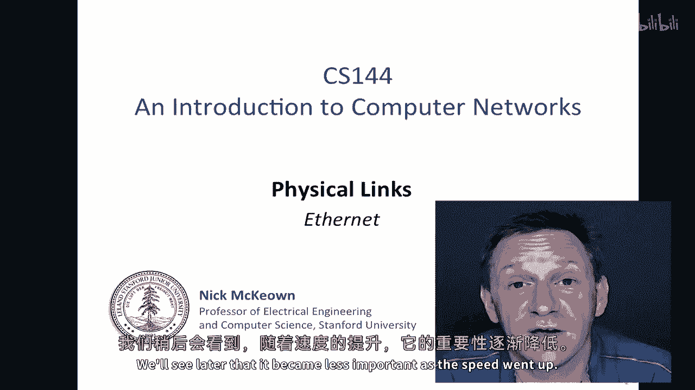

原始的以太网看起来像这样，这些是鲍勃·梅特卡夫绘制的两幅图片，他是以太网在七十年代初期的共同发明人之一，当时他在Xerox Park工作，他后来创立了三家公司，所以在左边显示了他们最初设想的网络拓扑。

包括有线和无线以太网，而在右边显示了第一个以太网网络的具体细节，有一根大而厚的黄色电缆，它总是黄色，它非常厚且刚性，然后这些电缆会在天花板、墙壁或地板下蜿蜒曲折，然后这些大的水龙头会被拧入电缆中。

以建立接口的电气接触，然后一台电脑，随着时间的推移，它变得简单得多。

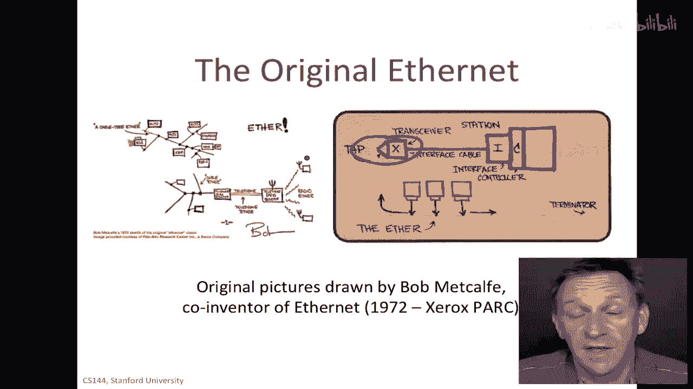

最终演变成我们今天使用的东西，这是以太网帧格式，这是放在链接上的帧格式，第一个位位于左侧，它以前缀开始，前缀是一串一和零，只是为了训练时钟恢复电路，帮助他们开始并恢复时钟，在数据实际上开始到达之前。

有一个起始帧分隔符，这是一个特殊的符号，它告诉我们包即将开始，然后我们进入目的地地址，我们已经知道这是一个四十八位的地址，这是接口制造商分配的全球唯一地址，一比特告诉我们是否是单播或多播。

并且一个位可以被使用，实际上，它可以用来定义一个本地地址，尽管这在实际上非常不寻常，所以，有四个六位在那里来定义全局唯一的地址，因此，以太网的地址数量非常大，使用源地址就是发送帧的本地主机的地址。

在通常的意义上，类型字段指示我们将在数据中找到什么，例如，以太类型的十六进制，哦，八百告诉我们这里有IP在里面，这当然很常见，你记得任何CCD基本网络都有一个最小大小，一个最小包大小，所以我们填充包。

如果数据很短，我们填充它以确保有足够的，嗯，足够的字节，以便在我们发送完数据包之前可靠地检测到碰撞，因此它们被填充到至少四个六个数据字节，因此，如果数据的数量超过四个六，那么当然它就不会填充它，嗯。

但是嗯，否则它会填充它只是为了确保有足够的，最后，有一种被称为循环冗余检查crc的东西，或者帧检查序列，crc正在检查序列，使用像我们在错误检测视频中看到的代码，那将告诉我们是否有位错误，例如。

如果位在电线或传输主机处理之前被损坏。

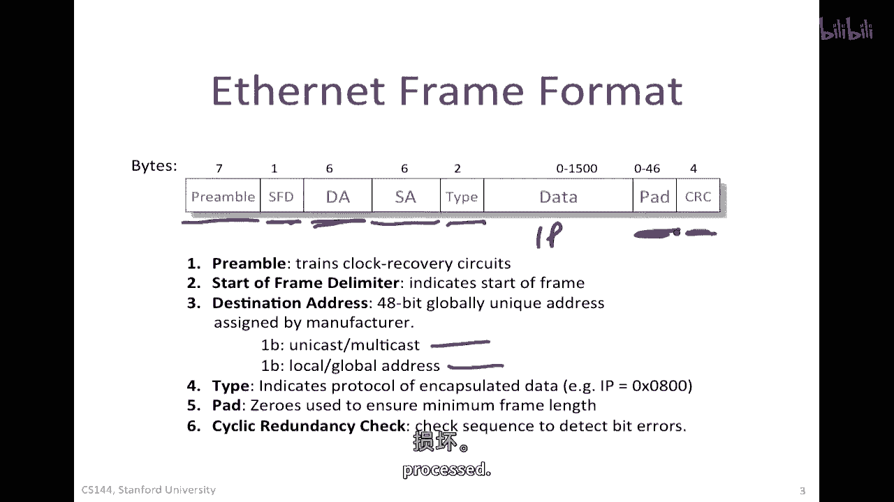

原始的十兆比特每秒，以太网由i tripoli标准化，它遵循i triple e八到八零二三的标准，你经常会听到以太网被称为点三网络，因此，就像八零二三的缩写一样，这只是用于编写标准的组织名称。

定义了以太网正确操作的规范，所以它实际上有两个组成部分，它包含了我们刚刚看到的mac协议和帧结构，然后在下面你 had 一个不同的，嗯，物理层的不同选项可以被使用，最初有一种被称为十基五的。

那就是我之前描述的那根大厚黄色的电缆，而且这种电缆已经过时很长时间了，然后它被一种使用同轴电缆的薄型同轴电缆版本所取代，类似于我们为电视使用的rf电缆，但是，当它开始使用这种类型的电缆时。

以太网真正发生了变化，嗯，这是我们都非常熟悉的rj45电缆，而且那不是因为连接器，它是因为它可以使用的电缆类型，以及网络的拓扑结构，我们一会儿就会看到，基本上，它开始运行在语音级别的无屏蔽扭曲对绞线上。

这在许多建筑物的墙壁中都已经存在，它被称为类别三电话电缆，它是一种相对低质量的电缆，用于将电话连接到交换机，在一家公司，还有一种被称为十基光纤的光纤版本，它最初主要由军事使用，因为他们更难被窃听，嗯。

有兩根光纤和一根單線，一根用于每個方向。

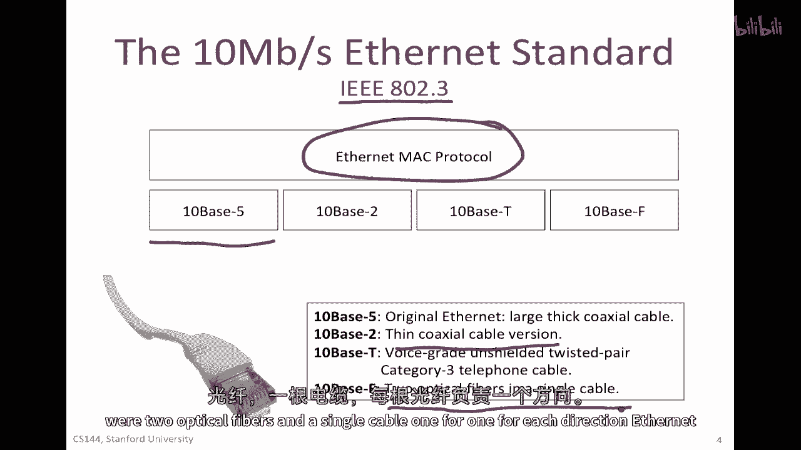

以太網真的飛升，当10BASE-T标准出现用于在双绞线中运行以太网时，因此，每秒10百万比特被传输在类别中，已经存在于世界上几乎每个建筑物中的三根双绞线电话线，它们被排列成星形，换句话说。

那就是那些双绞线电缆将连接到配线间，在通往电话交换站的路上，不仅双绞线电缆确实帮助以太网成功，而且这种拓扑结构，即通过双绞线将终端主机连接到集线器，集线器是一个中继器，集线器是一个中继器。

这将需要接收到的所有信号，然后重复在每个出口的电缆上，除了它进入的那个，所以它实际上没有理解数据包，它只会电学上重复它们，如果有碰撞，那么碰撞将发生在这里的任何地方，它将被检测到，并且交换机将确保。

电压水平足够以确保它可以被检测到，"此外，这种在中心化的管理方式中"，嗯，"在这个枢纽"，这将被管理，嗯，"由网络管理员"，"并且这一中央管理"，"与其在底层进行分布式爬虫管理，不如"，"地板板"。

"或者在阁楼上安装使它管理以太网更加方便得多。"，一旦这些枢纽被放置在这些中心位置，这就导致了以太网的巨大增长，在二十世纪八十年代的中期。

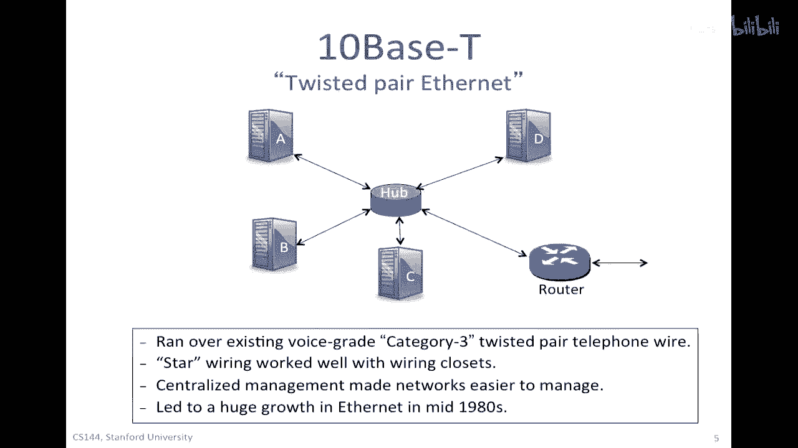

人们想要使以太网越来越快，所以从每秒十兆比特逐渐增加到每秒一百兆比特，然后到每秒吉比特，而且最近每秒十吉比特，所以比原始以太网规范快一千倍，当我们增加以太网的大小时，我们必须解决的问题是。

如果我们在使用cma cd，"然后，我们需要确保我们保持这个要求。"，"p除以r大于或等于2除以c"，换句话说，"包的持续时间比往返时间长"，"以便我们可以确保我们还在传输数据包"，"当碰撞被检测到"。

所以当我们增加时，当我们增加网络的速度时，当我们增加我们的，"只有这样才能使这成为真，"我们需要要么使p增大以抵消r的增加，要么找到其他方法来平衡。"，或者我们需要让l变小，因此。

这就是在以太网速度加快时做出的设计选择。"解决方案是保持包大小不变"，嗯，"因为如果我们将包大小从64字节增加到640字节"，"最初的大小是多少字节，不超过640字节"，"然后。

许多我们想要发送的包都将小于那个"，"像感谢和dns这样的东西"，"查询"，那样的事情，因此这将非常低效，所以决定保持p不变，但是将l减小，百兆比特每秒以太网，千兆比特每秒以太网都有这个，嗯。

两者都有这个要求，那就是l的限制只有一百米，以太网交换的引入使得这变得容易得多。

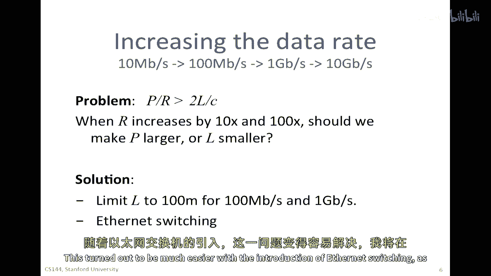

"如我所将在几分钟内描述的"，"随着我们越来越快"，"以太网mac协议没有改变"，"那就是框架结构"，"我们决定何时发送数据包的方式是"，"那段一直没有变化的线"，嗯。

"并称为快速以太网的一百兆比特每秒"，"以太网现在似乎不再那么快"，"并且物理层的标准有两个"，一百基线传输，这是一种用于双绞线电缆的编码结构，然后，一百基线FX用于光纤上的基线传输。

它再次使用类别五电缆，并且我们见过的同一种RJ45连接器，嗯，它实际上开始成为全双工，这意味着电缆中使用了两对而不是只一对线对，一对线对用于在每个方向上每秒传输一百兆比特，而不是使用曼彻斯特编码编码。

它开始使用4b5b编码，我们视为引入时钟恢复过渡的手段，我们在关于时钟的视频中看到了这一点，当然，它的距离限制在一百米，后来出现了千兆以太网标准，嗯，有千兆基T，嗯，有千兆基FX，应该是千兆基T。

千兆基T标准也运行在类别五电缆上，使用RJ45连接器，嗯，当今出售的笔记本电脑和服务器中，它们的以太网速度为一千兆比特每秒，或者一千基础T，结果，在一根类别五电缆上传输一千兆比特每秒的信号非常困难。

所以他们实际上在电缆内部使用四对线，并且他们可以同时在所有四对线上同时传输信号，所以这根电缆上没有任何其他空间，它只能用于千兆以太网，这是一种非常复杂的编码，这超出了我们在这门课程中要描述的级别。

他使用了五级信号，因此，不再只是使用二进制开闭，就像在原始的十兆比特每秒以太网中一样，它使用五个不同的水平来尝试打包尽可能多的信号，尽可能多地在电缆中打包信息，与以前相同，距离限制为100米。

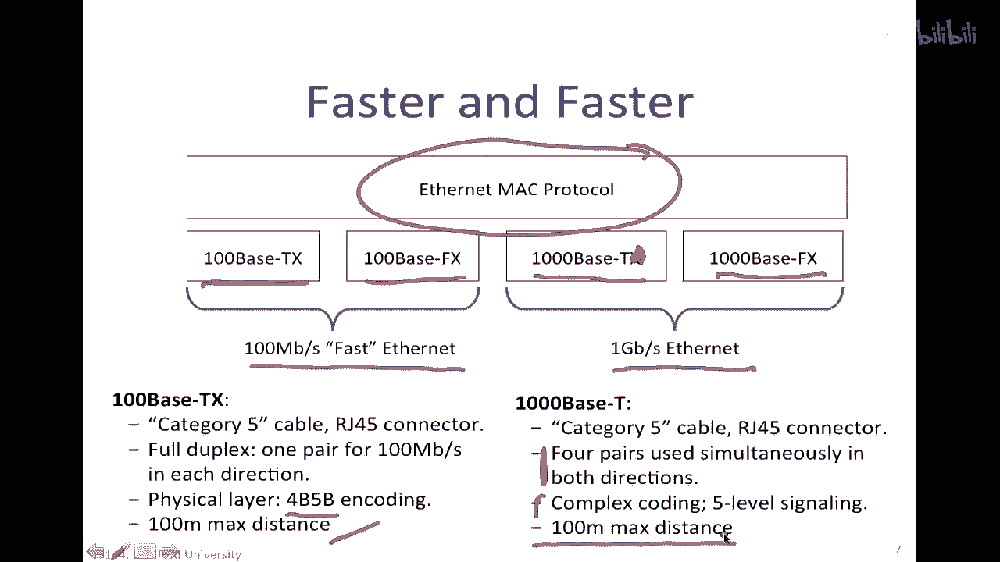

到 late nineteen eighties 年代，基于茶的Tim以太网非常流行，对于100兆比特每秒以太网的工作已经在进行中，"并且显而易见，网络将会越来越快"，"枢纽"，"并且。

配电间的中继器意味着网络可以非常庞大。"，"并且正在大规模部署"，"但是，也清楚地表明对于越来越快的网络"，"每个部分都打算变得极其极其短"，"仅仅下降了一百米"，"所以，许多主机共享一个小型网络"。

嗯，"这个"，网络倾向于被它们看到的碰撞数量所淹没，因为网络上有太多的主机都在试图在同一个网络上讲话，因此，尝试分割这些以太网网络变得自然，以减少碰撞的数量，通常被称为减少碰撞域，同时。

交换硬件的成本正在下降，它变得更容易构建ASICs或专门化的芯片来做，来做交换，因此，所有这些事情一起导致了使用以太网交换机分割网络的趋势。

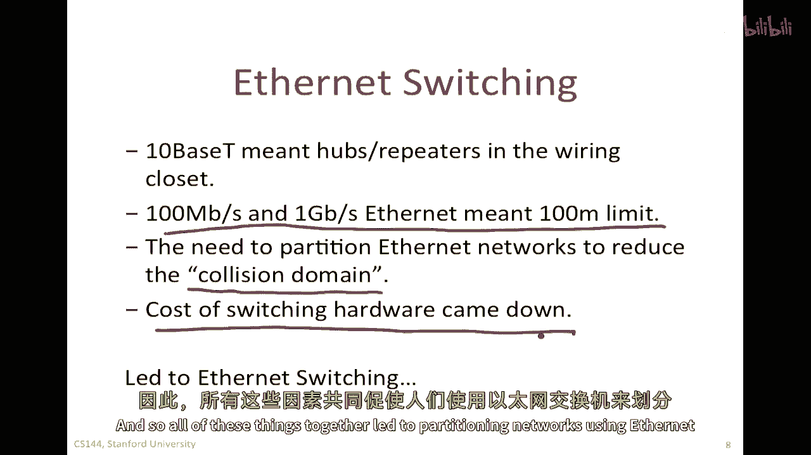

所以，如果有一个中心或中继器，每当一个数据包被发送，所有这些五个链接的中间介质都将变得繁忙并被使用完，所以，在这个圈子里，整个容量大约是每秒十兆比特或一百兆比特，取决于速率，所以，在大型网络中。

假设有数百个终端主机都连接到一个中心或一组中心，这将对他们的总总体容量使用非常有限，如果我们允许同时进行几通通信，所以例如，如果a想要跟b谈话，同时在c正在跟d谈话的同时，因为他们正在与不同的主机交谈。

不同的主机集，为什么我们不允许这样，通过允许通信独立进行，所以，而不是像电信号一样，枢纽只是重复信号，如果它能够实际解析数据包，只将数据包发送到正确的目的地，就像路由器一样，"但是，根据以太网地址"。

"而不是IP地址"，"所以，在被称为以太网交换机之前，这被称为开关。"，他们被称为桥梁，"你会看到有时被人们提到的那些"，"但是我们只是叫他们以太网交换机"，"所以，基本的操作是"，"如果a发送给b"。

"数据包将流向交换机"，"开关将查看以太网地址"，决定将其发送到下一个地方，如果它表中有，那么它就会转发给它的b，同时，也许c正在向d发送一个包，在这里也会发生同样的事情，所以。

现在碰撞仅仅局限于一根电缆中，所以，如果同时发生从两个方向发出的信号，在电缆上，这可能会导致碰撞，尽管在同一时间，也引入了一种叫做全双工以太网的东西，这利用了通信可以在电缆的两方进行。

且不会同时在同一时间碰撞的事实，因此现在，交换机可以完全无需使用cma cd操作，一旦引入了交换机，所有的链接都是满双工的，这就导致了第一个以太网交换机的开发在早期的一九九零年代，年代。

而且几乎几乎所有的以太网网络今天都基于以太网交换机，现在看到以太网集线器是非常罕见的，实际上，对于每秒一吉比特和每秒十吉比特，以太网，没有其他选择，所有这些网络都已经切换，所以优势是多个并发通信。

全双工链接他们可以同时发送和接收，而且嗯，还有管理上的好处，如果有死或故障的终端主机，他们可以被交换机隔离，你可以只是关闭链路，然后完全将其从网络中隔离出来，以防止它损害网络中的任何其他交换机。

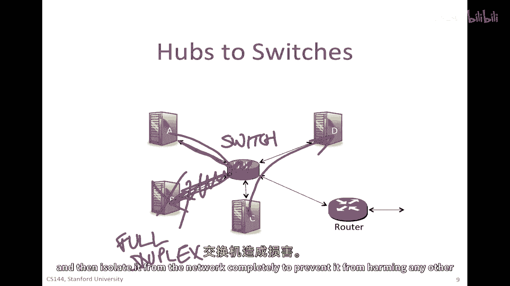

所以以太网交换机已经成为，今天将以太网部署的主要方式，仅仅是斯坦福的以太网交换机的图片，这是这里的以太网交换机，带有所有这些电缆出来，进入插座板，这里通向建筑物中不同办公室的电缆。

所以以太网交换机的工作方式。

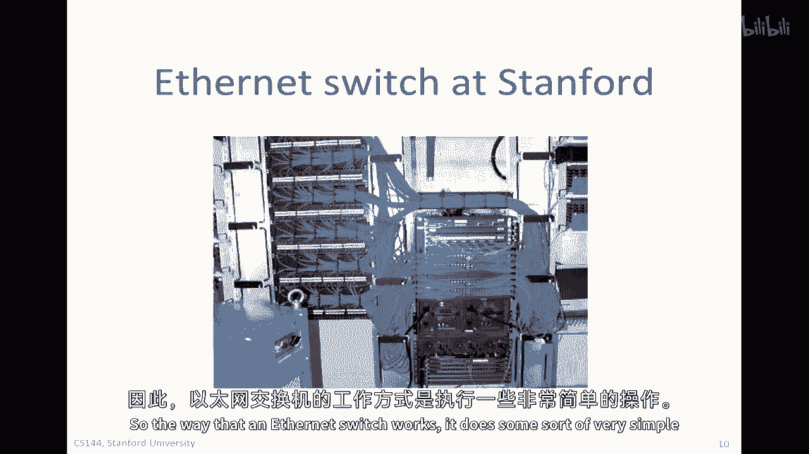

它执行一些非常简单的操作，首先，它是第一个，它执行转发和学习，我们已经见过这种情况，它根据转发表转发数据包，然后，它根据看到的地址学习转发表的内容，所以，当帧到达时，首先，检查每个到达帧的头部。

以检查目的地址的检查，如果以太网目的地址在其转发表中，它将将帧转发到正确的输出端口，或者如果是广播，端口集合，如果以太网目的地址不在其表中，它将广播帧到交换机的所有端口，除了通过哪个端口帧到达的端口外。

然后，表项由检查到达包的，以太网源地址学习得到，所以它将取源地址，在表中查找，如果它找不到那里，它将在表中填充那个说明的条目，好的，如果我将来看到这个作为目的地地址。

我现在知道如何通过将其发送回端口来达到它，这地址连接到，所以那样，下次帧不会广播，它会直接发送到正确的目的地，所以这就是以太网交换机的转发和学习功能，然后还有那个是拓扑维护，它运行生成树协议。

其中交换那些被称为桥协议数据单位的东西，我们看到的BPD在生成树视频中的使用，并运行生成树协议与其他交换机通信，以创建无环拓扑，以便它可以决定哪些端口应启用或阻塞。

以确保在所有网络交换机中创建无环生成树，因此，以太网交换机非常，非常广泛部署在。

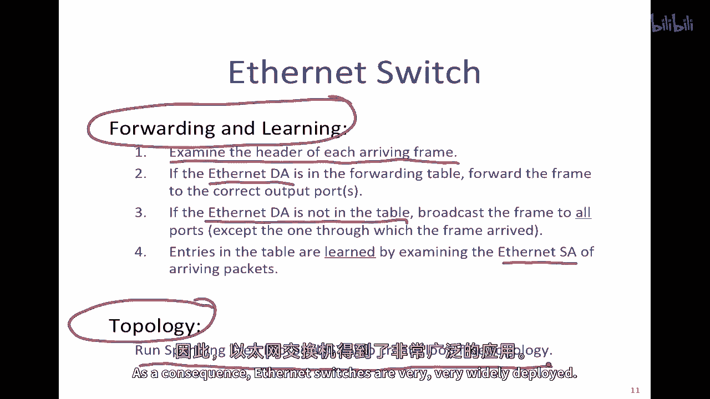

这里是一个可能在，例如大学校园中看到这种情况的例子，这就是我们的学院网络在斯坦福内部每个建筑物中的样子，这可能是一个建筑物或一个楼层的大楼，这可能是我大楼的第三层，和斯坦福的盖茨大楼，这可能是二楼。

那个楼层还有一个交换机，然后它们连接到建筑物路由器，它们通常会连接到另一个，另一个在另一个建筑物中的路由器，以防止建筑物路由器失败，然后，这个路由器可能正在运行OSPF用于在校园内路由数据包。

所以这些路由器形成了校园骨干，遍布我们的学院校园，然后，它们最终连接到一个BGP路由器，该路由器连接到公共互联网，所以这是关于，BGP协议对外部世界的讲话，以交换到外部世界的前缀和到外部世界的路径。

因此，以太网交换机可以连接许多，许多主机，有时数百个主机一起，有提供数百个端口的交换机，然后连接，可能建筑物中的所有终端主机，或者一个楼层的终端主机。

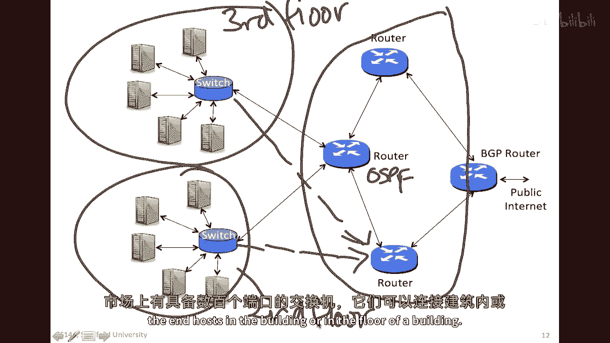

总的来说，介质访问控制协议有两种主要类型，随机访问和确定性随机访问协议证明非常受欢迎，因为它们很好且简单，它们为传输主机提供了一种，快速，低延迟的网络访问，当网络使用较少时，多年来。

CACD已经成为最常用的简单访问协议，用于第一代，10兆比特每秒的以太网，多年来，以太网标准出现了100兆比特每秒的版本，被称为快速以太网，然后千兆比特每秒的以太网。

以及更近的10千兆比特每秒和链路大小的限制，需求更多的容量意味着CACD逐渐被以太网交换机取代，在其中，终端主机通常通过全双工链接连接，因此，它可以同时发送和接收，以太网交换机基本上进行全路由。

就像路由器一样，但是在以太网地址上，它们学习以太网地址来填充他们的表，通过学习通过的网络包的源地址，这样它们就可以构建一个漂亮的简单转发表，然后它们使用生成树协议来构建环路。

自由拓扑连接网络中的所有交换机，因此，以太网交换机今天无处不在。

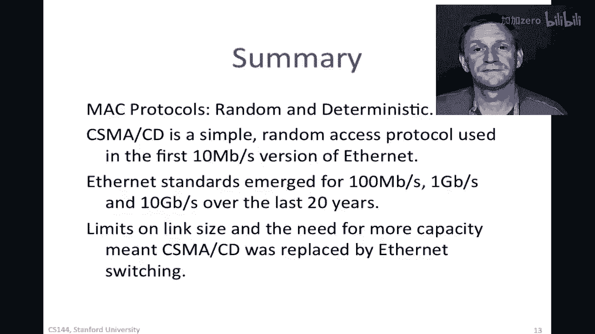