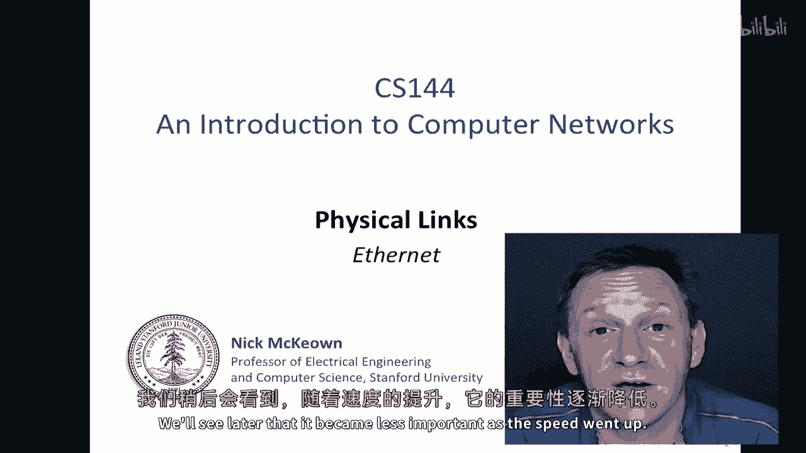
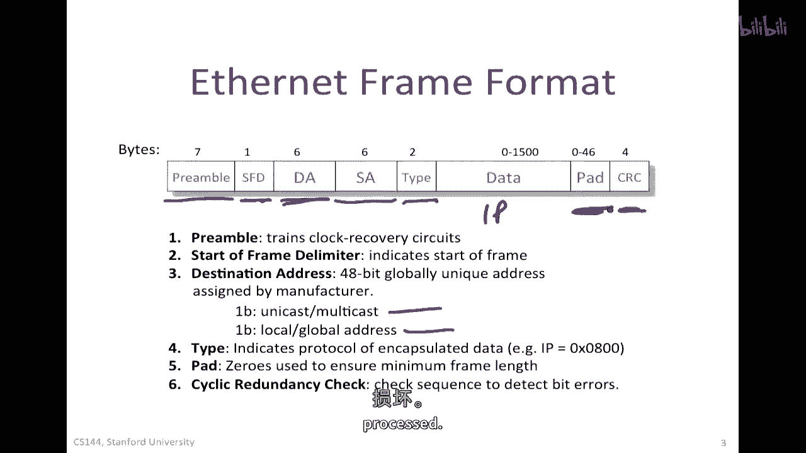
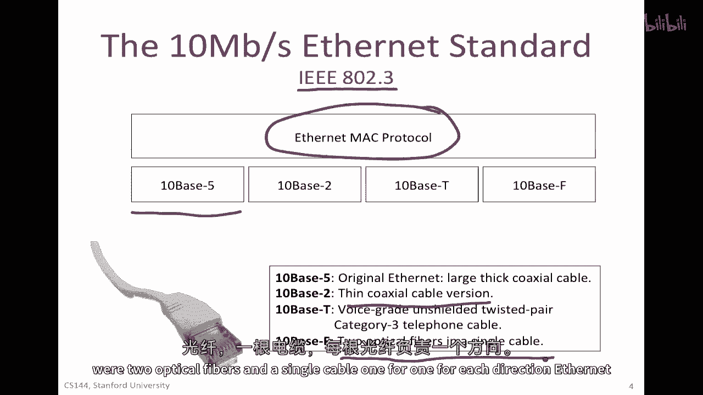
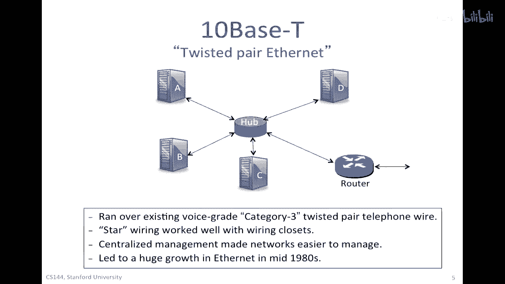
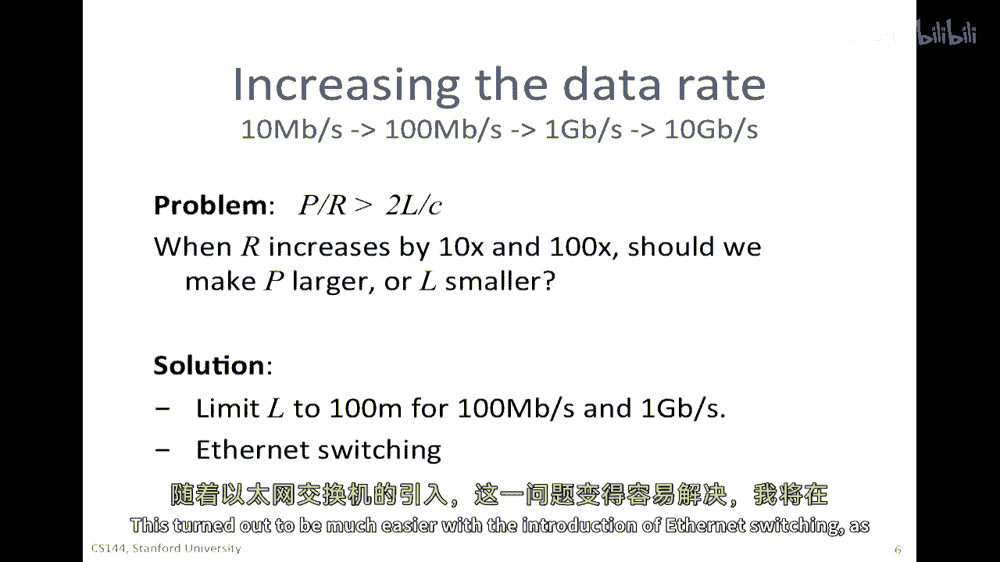
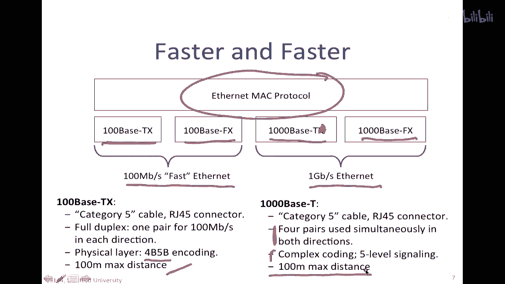
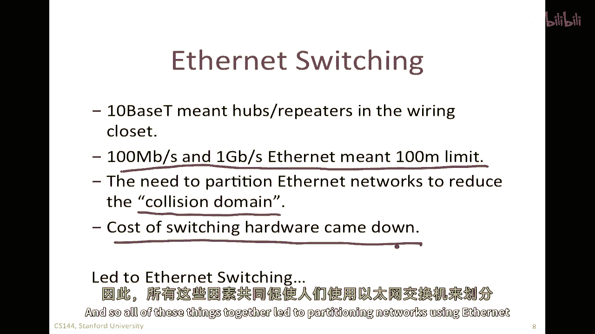
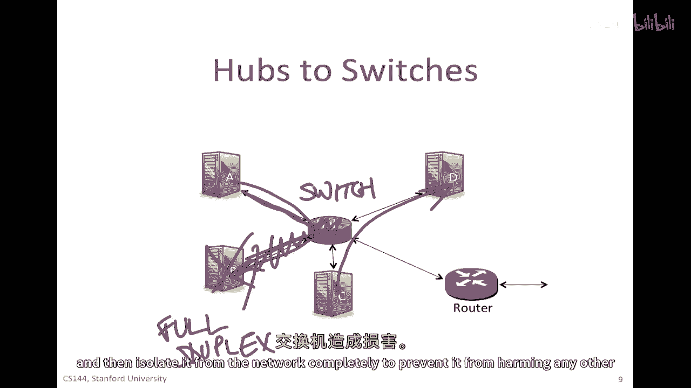
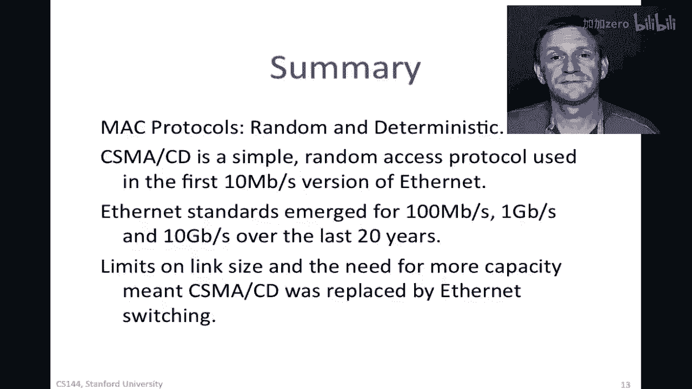

# 课程 P100：以太网技术详解与实践 🖧

在本节课中，我们将系统性地学习以太网技术。从它的历史起源、核心工作原理、帧结构，到其速度的演进、物理层标准的变迁，以及现代网络中至关重要的以太网交换机技术。我们将深入浅出地解析每一个概念，帮助你构建完整的以太网知识体系。

## 以太网的起源与核心概念 🔍

上一节我们了解了CCD，接下来我们来看看以太网。以太网始于1970年代早期，最初以每秒10兆比特的速度运行，但此后已进化得很远。首先，CCD是以太网如何工作的核心，并决定了有多少主机可以共享同一根电缆。我们将看到随着速度的提高，它变得越来越不重要。

原始的以太网看起来像这样。这些是鲍勃·梅特卡夫绘制的两幅图片，他是以太网在七十年代初期的共同发明人之一，当时他在Xerox Park工作。他后来创立了三家公司。在左边显示了他们最初设想的网络拓扑，包括有线和无线以太网。在右边显示了第一个以太网网络的具体细节。有一根大而厚的黄色电缆，它总是黄色，非常厚且刚性。这些电缆会在天花板、墙壁或地板下蜿蜒曲折。这些大的水龙头会被拧入电缆中，以建立接口的电气接触，然后连接一台电脑。随着时间的推移，它变得简单得多。

## 以太网帧格式 📦

了解了以太网的物理形态后，我们来看看数据是如何被封装和传输的。这是以太网帧格式，这是放在链接上的帧格式。

以下是帧格式的详细构成：

*   **前导码**：第一个位位于左侧，它以前缀开始。前缀是一串一和零，只是为了训练时钟恢复电路，帮助它们开始并恢复时钟。
*   **起始帧定界符**：在数据实际上开始到达之前，有一个起始帧分隔符。这是一个特殊的符号，它告诉我们数据包即将开始。
*   **目的地址**：然后我们进入目的地地址。这是一个四十八位的地址，是接口制造商分配的全球唯一地址。一比特告诉我们是否是单播或多播，并且一个位可以被用来定义一个本地地址，尽管这在实际上非常不寻常。有四个六位在那里来定义全局唯一的地址，因此，以太网的地址数量非常大。
*   **源地址**：使用源地址就是发送帧的本地主机的地址。
*   **类型字段**：在通常的意义上，类型字段指示我们将在数据中找到什么。例如，以太类型的十六进制值 `0x0800` 告诉我们这里有IP在里面，这当然很常见。
*   **数据与填充**：你记得任何CCD基本网络都有一个最小大小，一个最小包大小。所以我们填充包，如果数据很短，我们填充它以确保有足够的字节，以便在我们发送完数据包之前可靠地检测到碰撞。因此它们被填充到至少46个数据字节。如果数据的数量超过46，那么当然它就不会填充它，否则它会填充它只是为了确保有足够的。
*   **帧校验序列**：最后，有一种被称为循环冗余检查CRC的东西，或者帧检查序列。CRC正在检查序列，使用像我们在错误检测视频中看到的代码，那将告诉我们是否有位错误，例如，如果位在电线或传输主机处理之前被损坏。

## 物理层标准演进 📈

理解了数据帧的结构，我们来看看承载这些帧的物理介质是如何发展的。原始的十兆比特每秒以太网由IEEE标准化，它遵循IEEE 802.3的标准。你经常会听到以太网被称为802.3网络。这只是用于编写标准的组织名称，定义了以太网正确操作的规范。

它实际上有两个组成部分：它包含了我们刚刚看到的MAC协议和帧结构，然后在下面有不同的物理层选项可以被使用。

以下是主要的物理层标准：

*   **10BASE-5**：最初有一种被称为10BASE-5的，那就是之前描述的那根大厚黄色的电缆。这种电缆已经过时很长时间了。
*   **10BASE-2**：然后它被一种使用同轴电缆的薄型同轴电缆版本所取代，类似于我们为电视使用的RF电缆。
*   **10BASE-T**：但是，当它开始使用这种类型的电缆时，以太网真正发生了变化。这是我们都非常熟悉的RJ45电缆。那是因为它可以使用的电缆类型以及网络的拓扑结构。它开始运行在语音级别的无屏蔽双绞线上，这在许多建筑物的墙壁中都已经存在。它被称为三类电话电缆，是一种相对低质量的电缆，用于将电话连接到交换机。
*   **10BASE-F**：还有一种被称为10BASE-F的光纤版本，它最初主要由军事使用，因为他们更难被窃听。有两根光纤，一根用于每个方向。

## 10BASE-T与星型拓扑的崛起 ⭐

以太网真正起飞，当10BASE-T标准出现用于在双绞线中运行以太网时。每秒10兆比特被传输在已经存在于世界上几乎每个建筑物中的三类双绞线电话线上。

它们被排列成星形拓扑。那些双绞线电缆将连接到配线间。不仅双绞线电缆确实帮助以太网成功，而且这种拓扑结构，即通过双绞线将终端主机连接到集线器，起到了关键作用。

集线器是一个中继器。它将接收到的所有信号，然后重复在每条出口的电缆上，除了它进入的那个。所以它实际上没有理解数据包，它只会电学上重复它们。如果有碰撞，那么碰撞将发生在这里的任何地方，它将被检测到，并且交换机将确保电压水平足够以确保它可以被检测到。

此外，这种在中心化的管理方式中，在这个枢纽，由网络管理员进行管理。这一中央管理，与其在底层进行分布式爬虫管理，不如在配线间安装使它管理以太网更加方便得多。一旦这些枢纽被放置在这些中心位置，这就导致了以太网在二十世纪八十年代中期的巨大增长。

## 速度提升与设计挑战 ⚡

人们想要使以太网越来越快，所以从每秒十兆比特逐渐增加到每秒一百兆比特，然后到每秒吉比特，而且最近每秒十吉比特，比原始以太网规范快一千倍。

当我们增加以太网的速度时，我们必须解决的问题是：如果我们在使用CSMA/CD，那么我们需要确保我们保持这个要求：**`p / r >= 2 * l / c`**。换句话说，数据包的持续时间比往返时间长，以便我们可以确保我们还在传输数据包当碰撞被检测到。

所以当我们增加网络的速度 `r` 时，为了使这个不等式成立，我们需要要么使数据包大小 `p` 增大以抵消 `r` 的增加，要么找到其他方法来平衡，或者我们需要让电缆长度 `l` 变小。

这就是在以太网速度加快时做出的设计选择。解决方案是保持包大小不变。因为如果我们将包大小从64字节增加到640字节，许多我们想要发送的包都将小于那个，像TCP ACK和DNS查询那样的事情，因此这将非常低效。

所以决定保持 `p` 不变，但是将 `l` 减小。百兆比特每秒以太网、千兆比特每秒以太网都有这个要求，那就是 `l` 的限制只有一百米。以太网交换的引入使得这变得容易得多。

## 快速以太网与千兆以太网 🚀

随着我们越来越快，以太网MAC协议没有改变，那就是框架结构和我们决定何时发送数据包的方式，那段一直没有变化的线。

并称为快速以太网的一百兆比特每秒以太网现在似乎不再那么快。物理层的标准有两个：100BASE-TX，这是一种用于双绞线电缆的编码结构；以及100BASE-FX用于光纤传输。它再次使用五类电缆，和我们见过的同一种RJ45连接器。它实际上开始成为全双工，这意味着电缆中使用了两对而不是只一对线对，一对线对用于在每个方向上每秒传输一百兆比特。它开始使用4B5B编码，我们视为引入时钟恢复过渡的手段。它的距离限制在一百米。

后来出现了千兆以太网标准，有1000BASE-T和1000BASE-FX。1000BASE-T标准也运行在五类电缆上，使用RJ45连接器。当今出售的笔记本电脑和服务器中，它们的以太网速度为一千兆比特每秒。在一根五类电缆上传输一千兆比特每秒的信号非常困难，所以他们实际上在电缆内部使用四对线，并且可以同时在所有四对线上传输信号。这是一种非常复杂的编码，它使用了五级信号，因此，不再只是使用二进制开闭。与以前相同，距离限制为100米。

## 从集线器到交换机的演进 🔄

到二十世纪八十年代末，基于10BASE-T的以太网非常流行。对于100兆比特每秒以太网的工作已经在进行中，并且显而易见，网络将会越来越快。配电间的集线器中继器意味着网络可以非常庞大，并且正在大规模部署。

但是，也清楚地表明对于越来越快的网络，每个部分都打算变得极其短，仅仅一百米。所以，许多主机共享一个小型网络。网络倾向于被它们看到的碰撞数量所淹没，因为网络上有太多的主机都在试图在同一个网络上讲话。

因此，尝试分割这些以太网网络变得自然，以减少碰撞的数量，通常被称为减少碰撞域。同时，交换硬件的成本正在下降，它变得更容易构建ASIC或专门化的芯片来做交换。因此，所有这些事情一起导致了使用以太网交换机分割网络的趋势。

## 以太网交换机的工作原理 ⚙️

所以，如果有一个集线器或中继器，每当一个数据包被发送，所有这些链接的中间介质都将变得繁忙并被占用。在这个圈子里，整个容量大约是每秒十兆比特或一百兆比特，取决于速率。在大型网络中，假设有数百个终端主机都连接到一个集线器或一组集线器，这将对他们的总容量使用非常有限。

如果我们允许同时进行几通通信，例如，如果A想要跟B谈话，同时在C正在跟D谈话，因为他们正在与不同的主机集交谈，为什么我们不允许这样通过允许通信独立进行？所以，而不是像电信号一样，集线器只是重复信号，如果它能够实际解析数据包，只将数据包发送到正确的目的地，就像路由器一样，但是根据以太网地址而不是IP地址。这被称为以太网交换机，有时也被称为网桥。

以下是交换机的基本操作：

*   **并发通信**：如果A发送给B，数据包将流向交换机。交换机将查看以太网地址，决定将其发送到B。同时，也许C正在向D发送一个包，在这里也会发生同样的事情。现在碰撞仅仅局限于一根电缆中。
*   **全双工模式**：在同一时间，也引入了一种叫做全双工以太网的东西，这利用了通信可以在电缆的两方进行且不会同时在同一时间碰撞的事实。因此现在，交换机可以完全无需使用CSMA/CD操作。
*   **优势**：一旦引入了交换机，所有的链接都是全双工的。优势是多个并发通信，全双工链接可以同时发送和接收。还有管理上的好处，如果有死或故障的终端主机，他们可以被交换机隔离，你可以只是关闭链路，然后完全将其从网络中隔离出来，以防止它损害网络中的任何其他交换机。

## 交换机的转发与学习机制 🧠

以太网交换机已经成为今天将以太网部署的主要方式。它执行一些非常简单的操作：转发和学习。我们已经见过这种情况，它根据转发表转发数据包，然后根据看到的地址学习转发表的内容。

以下是其工作流程：

*   **检查与转发**：当帧到达时，首先检查每个到达帧的头部以检查目的地址。如果以太网目的地址在其转发表中，它将帧转发到正确的输出端口，或者如果是广播，则转发到端口集合。
*   **广播与学习**：如果以太网目的地址不在其表中，它将广播帧到交换机的所有端口，除了通过哪个端口帧到达的端口外。然后，表项由检查到达包的以太网源地址学习得到。所以它将取源地址，在表中查找，如果找不到，它将在表中填充那个说明的条目。这样，下次帧就不会广播，它会直接发送到正确的目的地。
*   **拓扑维护**：然后还有拓扑维护，它运行生成树协议，交换那些被称为桥协议数据单元的东西，并运行生成树协议与其他交换机通信，以创建无环拓扑，以便它可以决定哪些端口应启用或阻塞，以确保在所有网络交换机中创建无环生成树。

## 现代网络中的以太网部署 🏢

这里是一个可能在大学校园中看到这种情况的例子。这就是我们的学院网络在斯坦福内部每个建筑物中的样子。这可能是一个建筑物或一个楼层的大楼。那个楼层还有一个交换机，然后它们连接到建筑物路由器，它们通常会连接到另一个在另一个建筑物中的路由器，以防止建筑物路由器失败。然后，这个路由器可能正在运行OSPF用于在校园内路由数据包。所以这些路由器形成了校园骨干，遍布我们的学院校园。然后，它们最终连接到一个BGP路由器，该路由器连接到公共互联网，以交换到外部世界的前缀和路径。

因此，以太网交换机可以连接许多主机，有时数百个主机一起，有提供数百个端口的交换机，然后连接可能建筑物中的所有终端主机，或者一个楼层的终端主机。

## 总结 📝

在本节课中，我们一起系统地学习了以太网技术。

介质访问控制协议有两种主要类型：随机访问和确定性。随机访问协议证明非常受欢迎，因为它们很好且简单，它们为传输主机提供了一种快速、低延迟的网络访问，当网络使用较少时。多年来，CSMA/CD已经成为最常用的简单访问协议，用于第一代10兆比特每秒的以太网。

多年来，以太网标准出现了100兆比特每秒的版本（快速以太网），然后千兆比特每秒的以太网，以及更近的10千兆比特每秒。链路长度的限制和需求更多的容量意味着CSMA/CD逐渐被以太网交换机取代。在其中，终端主机通常通过全双工链接连接，因此可以同时发送和接收。

以太网交换机基本上进行全路由，就像路由器一样，但是在以太网地址上。它们学习以太网地址来填充他们的表，通过学习通过的网络包的源地址，这样它们就可以构建一个简单的转发表。然后它们使用生成树协议来构建无环拓扑连接网络中的所有交换机。因此，以太网交换机今天无处不在。