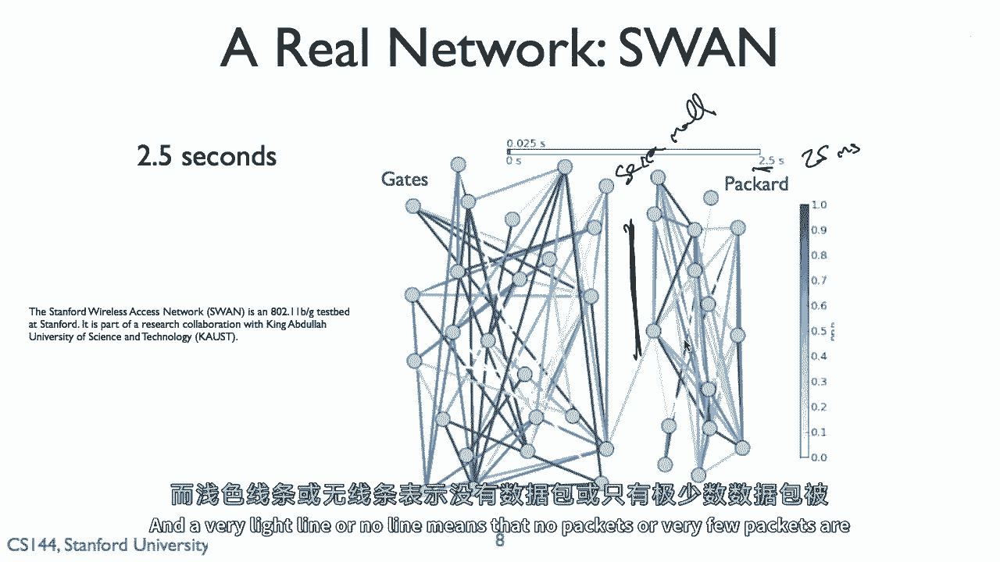
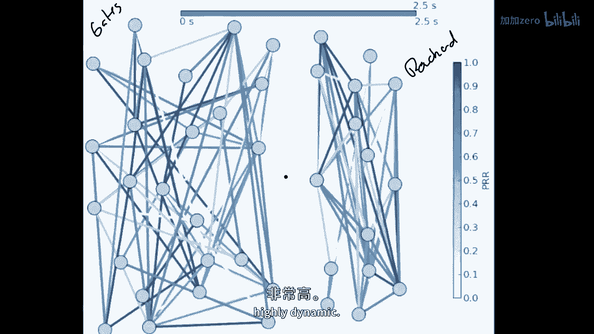
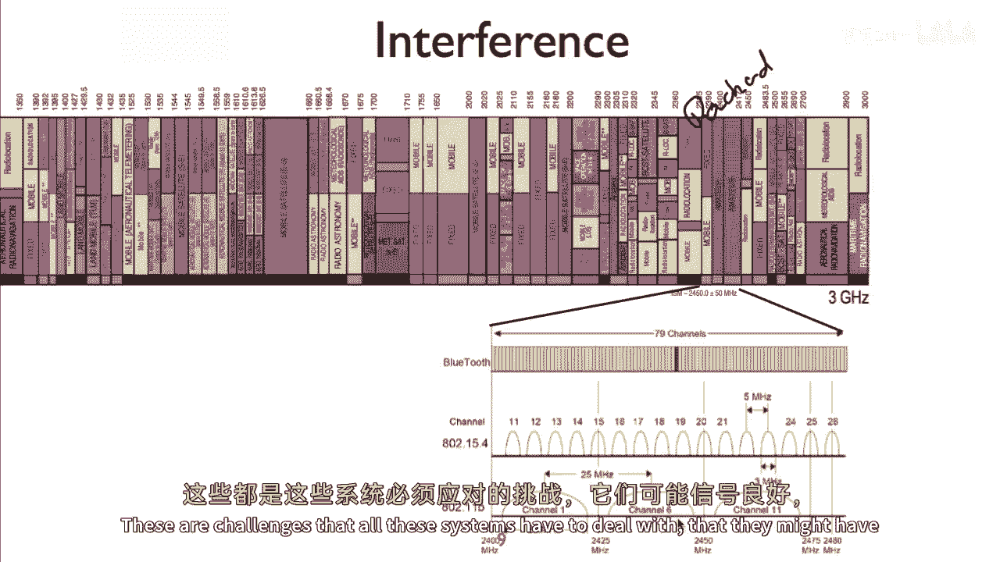
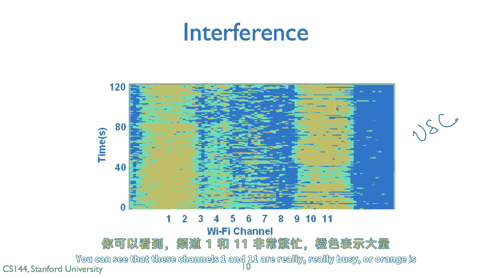
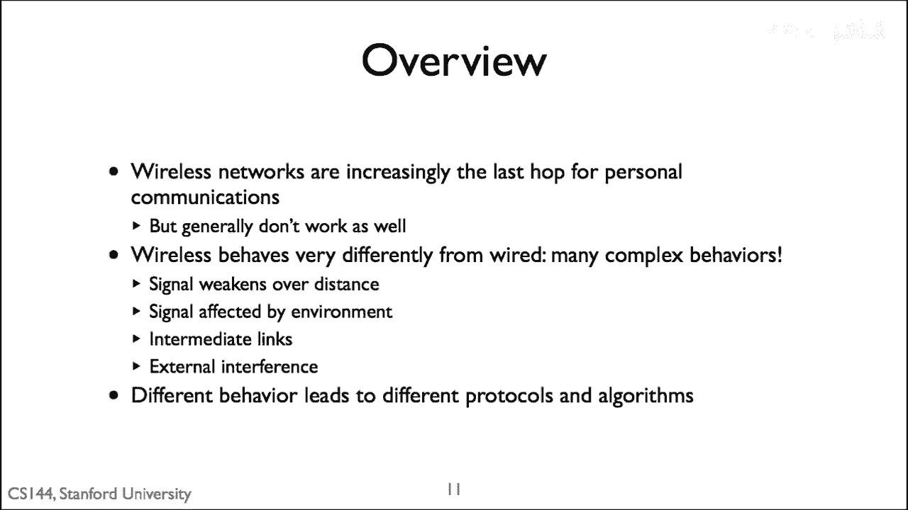

# 📡 课程 P101：无线网络有何不同

在本节课中，我们将探讨无线网络，并分析其在实践中与有线网络存在显著差异的原因。我们将从无线介质的共享性、信号衰减、干扰等核心特性入手，解释为何无线连接有时会显得不稳定且性能不佳。

---

## 🌐 无线与有线的根本区别

上一节我们介绍了课程概述，本节中我们来看看无线网络与有线网络的根本区别。历史上，网络设计基于有线系统的行为模式，但将两者连接起来往往很困难，这正是Wi-Fi性能有时较差的原因。

无线系统与有线系统的主要差异在于其使用的介质。在有线网络中，介质（电线）完全处于用户控制之下，没有人与你争夺线路容量。而在无线环境中，你利用的是周围的电磁频谱，这是一个共享的、不受控制的介质。

因此，无线网络在实际操作中受到严格监管。以下是美国无线电频谱分配的示意图，它展示了从低频到高频的频谱如何被分配给不同用途。

电磁频谱范围极广，从约3千赫兹（kHz）延伸至300吉赫兹（GHz）。对于数据通信，尤其是现代接入点网络（如Wi-Fi），我们主要使用其中几个狭窄的频段。

以下是关于频谱的几个关键点：
*   低频（如3 kHz）的波长可达数百万英尺。
*   高频（如300 GHz）的波长可能短至一英尺的三分之一。
*   我们今天使用的电话和笔记本电脑等设备的数据通信，主要集中在为Wi-Fi等应用设计的几个微小频段上。

---

## 📶 信号强度与衰减

理解了频谱的划分后，我们来看看无线信号的传播特性。与在线缆中传播的信号不同，无线信号是在空间中辐射的。

无线信号强度会随距离增加而衰减。最简单的模型是，如果使用一个完美的全向天线，信号强度至少按距离的平方（`1/r²`）衰减。这意味着，当你离发射器两倍远时，信号强度至少减弱为原来的四分之一（衰减75%）。

此外，无线环境不受控制，存在诸多变数：
*   **障碍物**：如果有人或物体（如金属板）位于你和接入点之间，信号会大幅减弱。
*   **多径效应**：信号可能通过不同路径（如墙壁反射）到达接收端，造成信号副本叠加，这可能导致在某些位置信号突然变差。
*   **动态变化**：环境不断变化，如人员走动、门开关、湿度变化，都会导致信号强度实时波动。

为了让你感受这种变化，下图展示了一次实测数据：在静止环境下，接收信号强度（RSSI）和包接收率（PRR）在短时间内发生了剧烈波动。

可以看到，在约十秒内，链路质量从接近完美骤降至完全无法通信，这要求网络协议（如TCP及其重传机制）必须能处理此类行为。

---

## 🔄 高度动态的网络环境

信号衰减问题之外，无线网络还面临高度动态的环境挑战。下图展示了斯坦福无线接入网络（SWAN）在2.5秒内的链路质量变化。每条线代表节点间的连接，其颜色深浅表示数据包接收率。

可以观察到，链路质量在毫秒级时间内快速振荡，在高质量与低质量之间来回切换。这清晰地表明，像Wi-Fi这样的无线网络具有高度动态和不稳定的特性。

---

## 📡 干扰问题

除了信号本身的问题，干扰是无线网络的另一大挑战。许多无线通信（如家用Wi-Fi）工作在无需许可的频段上，这虽然免费且方便，但也意味着多种技术共享同一频段。

例如，在2.4GHz频段（Wi-Fi的低频段），不仅存在Wi-Fi信号（使用信道1、6、11），还有Zigbee、蓝牙等其他无线系统。这意味着802.11（Wi-Fi）设备可能会受到802.15.4（如Zigbee）设备的干扰，反之亦然。

下图展示了在真实环境中，不同Wi-Fi信道随时间变化的活跃程度。可以看到，某些信道（如1和11）非常繁忙，充满了Wi-Fi活动，这必然导致同频段设备的相互干扰。

---

## 💎 课程总结

本节课中，我们一起学习了无线网络与有线网络的核心差异。总结如下：

无线网络正变得越来越重要，但我们通常更愿意无线连接互联网，而非插入网线。然而，无线网络通常不如有线网络可靠和稳定。

这主要源于其根本特性：无线网络处于一个**共享的、不受控制的介质**中。许多设备竞争使用，周围环境不断变化，并且存在大量干扰。

因此，在实践中，为了使无线网络达到可用的“足够好”的状态，其底层技术采用了与有线网络完全不同的算法和协议。这意味着**无线链路层**和**无线媒体访问控制（MAC）系统**的设计与有线版本截然不同。

在接下来的系列课程中，我们将深入探讨这些具体的技术差异。

